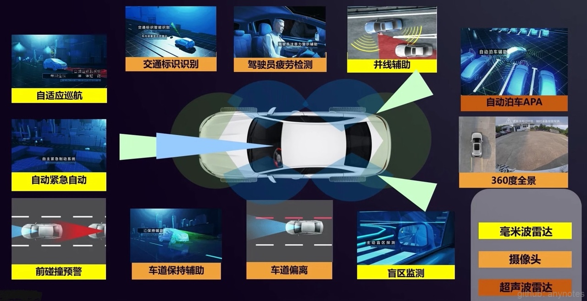
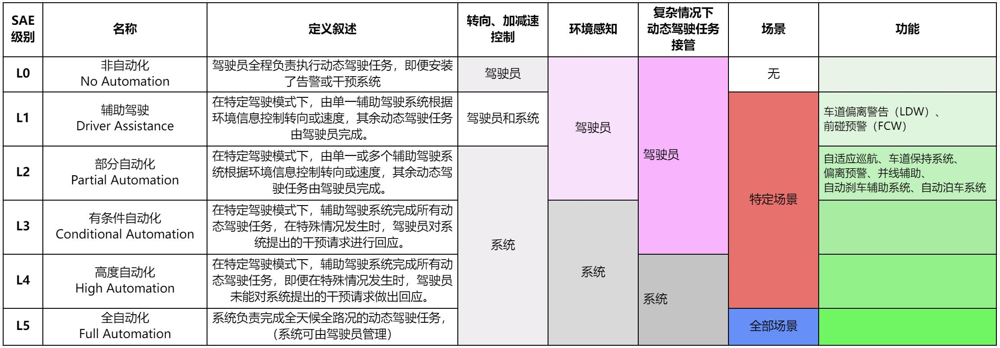
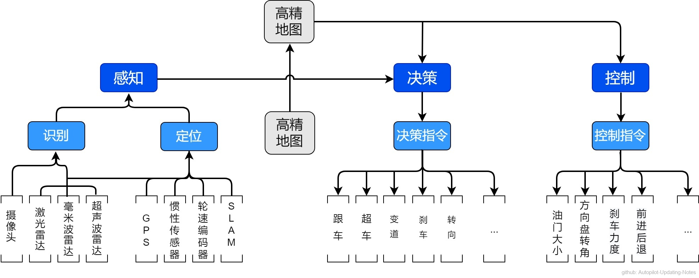

# 《自动驾驶笔记 Autopilot Notes》

### 重点
**由于作者水平有限，希望大家积极提交改进意见**, 您可按[**文章撰写规范**](./文章撰写规范.md)对相关内容进行修改或新增。**我们一起对内容进行整理、完善，确保文档的准确性**。

欢迎关注 --> [GPT-Notes](https://github.com/gotonote/GPT-Notes) <--

## 一、内容简介
随着各大科技公司积极布局，自动驾驶成为新的风口。本文旨在总结分享自动驾驶的技术方案，希望帮助大家对相关知识的学习了解。

## 二、自动驾驶分级（SAE 美国汽车工程协会）

## 三、架构

自动驾驶系统主要包含三部分：环境感知、决策规划以及运动控制。感知层对车辆周边环境进行感知识别，用于获取环境信息；决策层充当人类驾驶员的角色，主要解决三个核心问题：“我在哪？我要去哪？我该如何去？”；控制层保证各项硬件系统稳定的运行在计算好的最佳设定值上；保证各项子系统的运行维持在最优的区间范围；规避可能性风险，精准调控至最佳路径。

## 四、目录

**1. 基础** \
|---- 1.1 坐标系 \
|-------- [1.1.1 坐标系](./ch01_基础/1.1%20坐标系/1.1.1%20坐标系.md) \
|---- 1.2 参数 \
|-------- [1.2.1 相机模型—内参、外参](./ch01_基础/1.2%20参数/1.2.1%20相机模型—内参、外参.md) \
|---- 1.3 滤波 \
|-------- [1.3.1 卡尔曼滤波-KalmanFilter](./ch01_基础/1.3%20滤波/1.3.1%20卡尔曼滤波-KalmanFilter.md) \
|---- 1.4 图像变换 \
|-------- [1.4.1 图像变换介绍](./ch01_基础/1.4%20图像变换/1.4.1%20图像变换介绍.md) \
|-------- [1.4.2 逆透视变换IPM](./ch01_基础/1.4%20图像变换/1.4.2%20逆透视变换IPM.md) \
|---- 1.5 三维重建 \
|-------- [1.5.1 NeRF](./ch01_基础/1.5%20三维重建/1.5.1%20NeRF/readme.md) \
|---- 1.6 数据集 \
|-------- [1.6.1 Argoverse](./ch01_基础/1.6%20数据集/1.6.1%20Argoverse.md) \
|-------- [1.6.2 nuScenes](./ch01_基础/1.6%20数据集/1.6.2%20nuScenes.md) \
|---- [1.7 Transformer](./ch01_基础/1.7%20Transformer/readme.md) \
|---- [1.8 NLP自然语言处理](./ch01_基础/1.8%20NLP自然语言处理/readme.md) \
|---- [1.9 神经网络结构搜索(NAS)](./ch01_基础/1.9%20神经网络结构搜索(NAS)/readme.md) \
|---- [1.10 强化学习](./ch01_基础/1.10%20强化学习/readme.md) \
[**2. 硬件**](./ch02_%E7%A1%AC%E4%BB%B6/README.md) \
|---- [2.1 传感器](./ch02_%E7%A1%AC%E4%BB%B6/2.1%20%E4%BC%A0%E6%84%9F%E5%99%A8/README.md) \
|-------- [2.1.1 摄像头](./ch02_%E7%A1%AC%E4%BB%B6/2.1%20%E4%BC%A0%E6%84%9F%E5%99%A8/2.1.1%20%E6%91%84%E5%83%8F%E5%A4%B4.md) \
|-------- [2.1.2 激光雷达](./ch02_%E7%A1%AC%E4%BB%B6/2.1%20%E4%BC%A0%E6%84%9F%E5%99%A8/2.1.2%20%E6%BF%80%E5%85%89%E9%9B%B7%E8%BE%BE.md) \
|-------- [2.1.3 毫米波雷达](./ch02_%E7%A1%AC%E4%BB%B6/2.1%20%E4%BC%A0%E6%84%9F%E5%99%A8/2.1.3%20%E6%AF%AB%E7%B1%B3%E6%B3%A2%E9%9B%B7%E8%BE%BE.md) \
|-------- [2.1.4 超声波雷达](./ch02_%E7%A1%AC%E4%BB%B6/2.1%20%E4%BC%A0%E6%84%9F%E5%99%A8/2.1.4%20%E8%B6%85%E5%A3%B0%E6%B3%A2%E9%9B%B7%E8%BE%BE.md) \
|-------- [2.1.5 GPS定位导航](./ch02_%E7%A1%AC%E4%BB%B6/2.1%20%E4%BC%A0%E6%84%9F%E5%99%A8/2.1.5%20GPS%E5%AE%9A%E4%BD%8D%E5%AF%BC%E8%88%AA.md) \
|-------- [2.1.6 IMU惯性传感器](./ch02_%E7%A1%AC%E4%BB%B6/2.1%20%E4%BC%A0%E6%84%9F%E5%99%A8/2.1.6%20IMU%E6%83%AF%E6%80%A7%E4%BC%A0%E6%84%9F%E5%99%A8.md) \
|---- [2.2 计算设备](./ch02_%E7%A1%AC%E4%BB%B6/2.2%20%E8%AE%A1%E7%AE%97%E5%8D%95%E5%85%83/README.md) \
|---- 2.3 辅助单元 \
|-------- [2.3.1 V2X](./ch02_%E7%A1%AC%E4%BB%B6/2.3%20%E8%BE%85%E5%8A%A9%E5%8D%95%E5%85%83/2.3.1%20V2X.md) \
|-------- [2.3.2 黑匣子](./ch02_%E7%A1%AC%E4%BB%B6/2.3%20%E8%BE%85%E5%8A%A9%E5%8D%95%E5%85%83/2.3.2%20%E9%BB%91%E5%8C%A3%E5%AD%90.md) \
|---- [2.4 传感器标定](./ch02_硬件/2.4%20传感器标定/readme.md) \
|-------- 2.4.1 内参标定 \
|------------ [2.4.1.1 相机内参标定](./ch02_硬件/2.4%20传感器标定/2.4.1%20内参标定/2.4.1.1%20相机内参标定.md) \
|-------- [2.4.2 外参标定](./ch02_硬件/2.4%20传感器标定/2.4.2%20外参标定/readme.md) \
|------------ [2.4.2.1 离线标定](./ch02_硬件/2.4%20传感器标定/2.4.2%20外参标定/2.4.2.1%20离线标定.md) \
|------------ [2.4.2.2 在线标定](./ch02_硬件/2.4%20传感器标定/2.4.2%20外参标定/2.4.2.2%20在线标定.md) \
**3. 感知** \
|---- 3.1 2D目标检测 \
|-------- [3.1.1 车道线检测](./ch03_感知/3.1%202D目标检测/3.1.1%20车道线检测.md) \
|-------- [3.1.2 2D目标检测](./ch03_感知/3.1%202D目标检测/3.1.2%202D目标检测.md) \
|---- [3.2 3D目标检测](./ch03_感知/3.2%203D目标检测/readme.md) \
|-------- [3.2.1 基于LiDAR的3D目标检测](./ch03_感知/3.2%203D目标检测/3.2.1%20基于LiDAR的3D目标检测/readme.md) \
|-------- [3.2.2 基于摄像头的3D目标检测](./ch03_感知/3.2%203D目标检测/3.2.2%20基于摄像头的3D目标检测/readme.md) \
|---- [3.3 BEV鸟瞰图](./ch03_%E6%84%9F%E7%9F%A5/3.3%20BEV%E9%B8%9F%E7%9E%B0%E5%9B%BE/README.md) \
|-------- [3.3.1 LSS](./ch03_感知/3.3%20BEV/3.3.1%20LSS.md) \
|---- [3.4 Occupany Network](./ch03_感知/3.4%20Occupany%20Network/3.4.1%20Occupany%20Network.md) \
|-------- [3.4.1 SurroundOcc](./ch03_感知/3.4%20Occupany%20Network/3.4.1%20SurroundOcc.md) \
[**4. 定位**](./ch04_定位/readme.md) \
**5. 策略规划** \
|---- [5.1 预测](./ch05_策略规划/5.1%20预测/readme.md) \
|-------- [5.1.1 基于车道序列的预测](./ch05_策略规划/5.1%20预测/5.1.1%20基于车道序列的预测.md) \
|---- [5.2 路线规划](./ch05_策略规划/5.2%20路线规划/README.md) \
|---- [5.3 轨迹规划](./ch05_策略规划/5.3%20轨迹规划/readme.md) \
|-------- [5.3.1 笛卡尔坐标下的规划](./ch05_策略规划/5.3%20轨迹规划/5.3.1%20笛卡尔坐标下的规划.md) \
|-------- [5.3.2 Lattice规划](./ch05_策略规划/5.3%20轨迹规划/5.3.2%20Lattice规划.md) \
[**6. 控制**](./ch06_%E6%8E%A7%E5%88%B6/readme.md) \
|---- [6.1 PID控制](./ch06_控制/6.1%20PID控制.md) \
|---- [6.2 线性二次调节器（LQR）](./ch06_控制/6.2%20线性二次调节器(LQR).md) \
|---- [6.3 模型控制预测（MPC）](./ch06_控制/6.3%20模型控制预测(MPC).md) \
**7. 产品** \
|---- [7.1 ADAS](./ch07_产品/7.1%20ADAS/README.md) \
|---- [7.2 DMS](./ch07_%E4%BA%A7%E5%93%81/7.2%20DMS/README.md) \
**8. 工具** \
|---- 8.1 可视化 \
|-------- [8.1.1 AVS（Autonomous Visualization System）](./ch08_工具/8.1%20可视化/8.1.1%20AVS（Autonomous%20Visualization%20System）/readme.md) \
|---- 8.2 仿真 \
|-------- [8.2.1 Carla仿真](./ch08_工具/8.2%20仿真/8.2.1%20Carla仿真/readme.md) \
|---- [8.3 TensorRT 加速](./ch08_工具/8.3%20TensorRT加速/readme.md) \
|-------- [8.3.1 TensorRT安装配置](./ch08_工具/8.3%20TensorRT加速/8.3.1%20TensorRT安装配置.md) \
|-------- [8.3.2 TensorRT加速原理](./ch08_工具/8.3%20TensorRT加速/8.3.2%20TensorRT加速原理.md) \
|-------- [8.3.3 TensorRT源码分析](./ch08_工具/8.3%20TensorRT加速/8.3.3%20TensorRT源码分析.md) \
|---- [8.4 SNPE](./ch08_工具/8.4%20SNPE/readme.md) \
|-------- [8.4.1 Snapdragon NPE Runtime](./ch08_工具/8.4%20SNPE/8.4.1%20Snapdragon%20NPE%20Runtime.md) \
|-------- [8.4.2 AIP Runtime](./ch08_工具/8.4%20SNPE/8.4.2%20AIP%20Runtime.md) \
**9. 厂商方案** \
|---- [9.1 特斯拉 AI Day2022](./ch09_厂商方案/9.1%20特斯拉%20AI%20Day2022/README.md) \
|-------- [9.1.1 路径以及运动规划算法](./ch09_厂商方案/9.1%20特斯拉%20AI%20Day2022/9.1.1%20路径以及运动规划算法.md) \
|-------- [9.1.2 环境感知算法](./ch09_厂商方案/9.1%20特斯拉%20AI%20Day2022/9.1.2%20环境感知算法.md) \
|-------- [9.1.3 训练算法、设施、软件](./ch09_厂商方案/9.1%20特斯拉%20AI%20Day2022/9.1.3%20训练算法、设施、软件.md) \
|-------- [9.1.4 数据标注、采集、虚拟化](./ch09_厂商方案/9.1%20特斯拉%20AI%20Day2022/9.1.4%20数据标注、采集、虚拟化.md) \
|---- 9.2 百度阿波罗apollo \
|-------- [9.2.1 Apollo 8.0 技术新特性解读](./ch09_厂商方案/9.2%20百度阿波罗apollo/9.2.1%20Apollo%208.0%20技术新特性解读.md) \
|---- 9.3 Openpilot \

## 五、关注我

 

微信公众号

