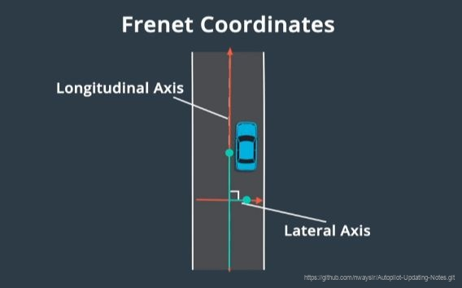

# 1.1 Frenet坐标系

我们通常使用笛卡尔坐标系描述物体的位置，但笛卡尔坐标系对车辆来说并不是最佳选择。即使给出了车辆位置(x,y)，如果我们不知道道路在哪，就很难知道车辆行驶了多远也很难知道车辆是否偏离了道路中心。

 

图1. 笛卡尔坐标系

笛卡尔坐标系的替代解决方案为Frenet坐标系。Frenet坐标系描述了汽车相对于道路的位置。在Frenet框架中，s代表沿道路的距离，也被称为纵坐标。d表示与纵向线的位移，也被称为横坐标。在道路的每个点上，横轴和纵轴都是垂直的。纵坐标表示道路中的行驶距离，横坐标表示汽车偏离中心线的距离。

 

图2. Frenet坐标系

