### 1.1.2 卡尔曼滤波-KalmanFilter

#### 1.1.2.1 简介
对于这个滤波器，我们几乎可以下这么一个定论：只要是存在不确定信息的动态系统，卡尔曼滤波就可以对系统下一步要做什么做出有根据的推测。即便有噪声信息干扰，卡尔曼滤波通常也能很好的弄清楚究竟发生了什么，找出现象间不易察觉的相关性。

因此卡尔曼滤波非常适合不断变化的系统，它的优点还有内存占用较小（只需保留前一个状态）、速度快，是实时问题和嵌入式系统的理想选择。

如果你曾经Google过卡尔曼滤波的教程（如今有一点点改善），你会发现相关的算法教程非常可怕，而且也没具体说清楚是什么。事实上，卡尔曼滤波很简单，如果我们以正确的方式看它，理解是很水到渠成的事。

本文会用大量清晰、美观的图片和颜色来解释这个概念，读者只需具备概率论和矩阵的一般基础知识。

#### 1.1.2.2 机器人实例分析
**一、场景**

一个可以在树林里四处溜达的小机器人，为了让它实现导航，机器人需要知道自己所处的位置。

图1. 机器人

也就是说，机器人有一个包含位置信息和速度信息的状态 ${\vec{x}_k}$ :

$$ {\vec{x}_k} = (\vec{p}, \vec{v}) $$

注意，在这个例子中，状态是位置和速度，放进其他问题里，它也可以是水箱里的液体体积、汽车引擎温度、触摸板上指尖的位置，或者其他任何数据。

我们的小机器人装有GPS传感器，定位精度10米。虽然一般来说这点精度够用了，但我们希望它的定位误差能再小点，毕竟树林里到处都是土坑和陡坡，如果机器人稍稍偏了那么几米，它就有可能滚落山坡。所以GPS提供的信息还不够充分。

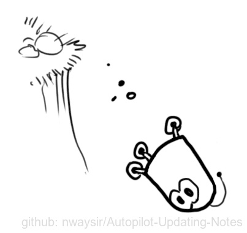

图2. 偏离位置

我们也可以预测机器人是怎么移动的：它会把指令发送给控制轮子的马达，如果这一刻它始终朝一个方向前进，没有遇到任何障碍物，那么下一刻它可能会继续坚持这个路线。但是机器人对自己的状态不是全知的：它可能会逆风行驶，轮子打滑，滚落颠簸地形……所以车轮转动次数并不能完全代表实际行驶距离，基于这个距离的预测也不完美。

这个问题下，GPS为我们提供了一些关于状态的信息，但那是间接的、不准确的；我们的预测提供了关于机器人轨迹的信息，但那也是间接的、不准确的。

但以上就是我们能够获得的全部信息，在它们的基础上，我们是否能给出一个完整预测，让它的准确度比机器人搜集的单次预测汇总更高？用了卡尔曼滤波，这个问题可以迎刃而解。

**二、相关性分析**

还是上面这个问题，我们有一个状态，它和速度、位置有关：

$$
{\vec{x}_k} = 
\left[
\begin{matrix}
p \\
v \\
\end{matrix}
\right]
$$

我们不知道它们的实际值是多少，但掌握着一些速度和位置的可能组合，其中某些组合的可能性更高：

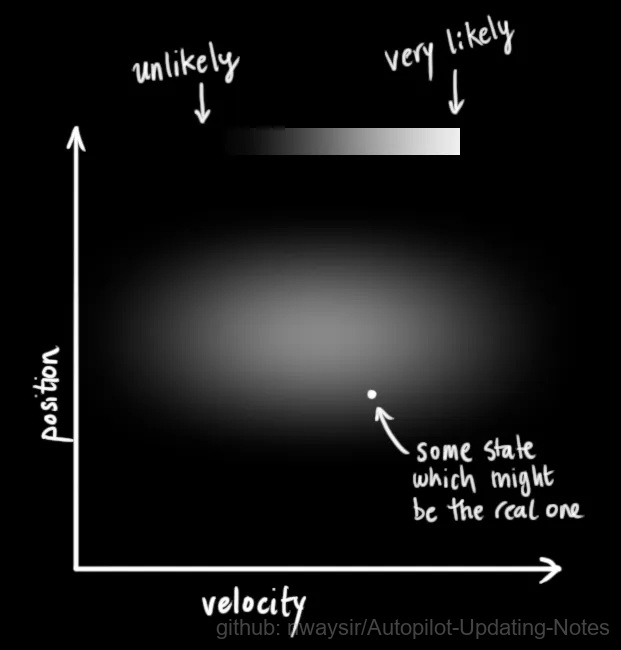

图3. 状态分布

卡尔曼滤波假设两个变量（在我们的例子里是位置和速度）都应该是随机的，而且符合高斯分布。每个变量都有一个均值 $\mu$ ，它是随机分布的中心；有一个方差 $\sigma^2$ ，它衡量组合的不确定性。

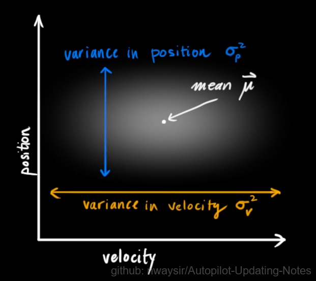

图4. 变量不相关分布

在上图中，位置和速度是不相关的，这意味着我们不能从一个变量推测另一个变量。那么如果位置和速度相关呢？如下图所示，机器人前往特定位置的可能性取决于它拥有的速度。

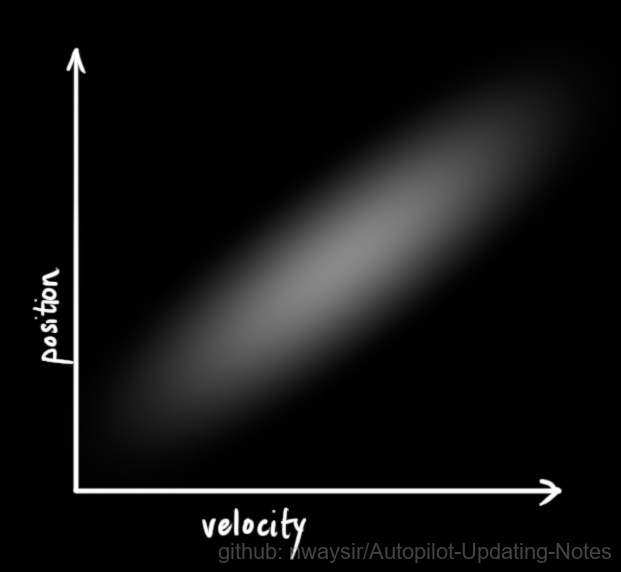

图5. 变量相关分布

这不难理解，如果基于旧位置估计新位置，我们会产生这两个结论：如果速度很快，机器人可能移动得更远，所以得到的位置会更远；如果速度很慢，机器人就走不了那么远。

这种关系对目标跟踪来说非常重要，因为它提供了更多信息：一个可以衡量可能性的标准。这就是卡尔曼滤波的目标：从不确定信息中挤出尽可能多的信息！

为了捕获这种相关性，我们用的是协方差矩阵。简而言之，矩阵的每个值是第 $i$ 个变量和第 $j$ 个变量之间的相关程度（由于矩阵是对称的， $i$ 和 $j$ 的位置可以随便交换）。我们用 $\Sigma$ 表示协方差矩阵，在这个例子中，就是 $\Sigma_{ij}$ 。

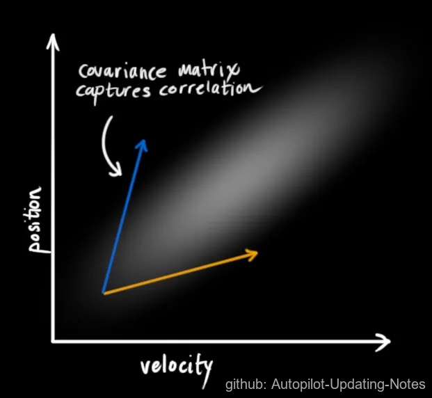

图6. 协方差矩阵表示

**三、矩阵描述**

为了把以上关于状态的信息建模为高斯分布（图中色块），我们还需要 $k$ 时的两个信息：最佳估计 ${\hat{x_k}}$ （均值，也就是 $\mu$ ），协方差矩阵 ${P_k}$ 。（虽然还是用了位置和速度两个变量，但只要和问题相关，卡尔曼滤波可以包含任意数量的变量）

$$
{\hat{x}_k} = 
\left[
\begin{matrix}
position \\
velocity \\
\end{matrix}
\right]
$$ 

$$
{P_k} = 
\left[
\begin{matrix}
\Sigma_{pp} & \Sigma_{pv} \\
\Sigma_{vp} & \Sigma_{vv} \\
\end{matrix}
\right]
$$

接下来，我们要通过查看当前状态（k-1 时）来预测下一个状态（k 时）。这里我们查看的状态不是真值，但预测函数无视真假，可以给出新分布：

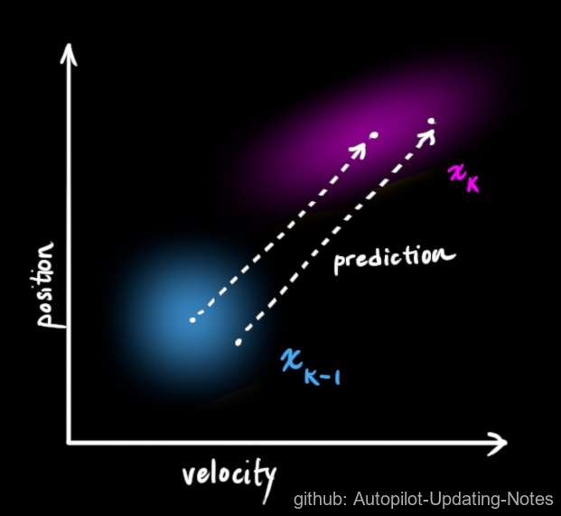

图7. 状态预测

我们可以用矩阵 ${F_k}$ 表示这个预测步骤：

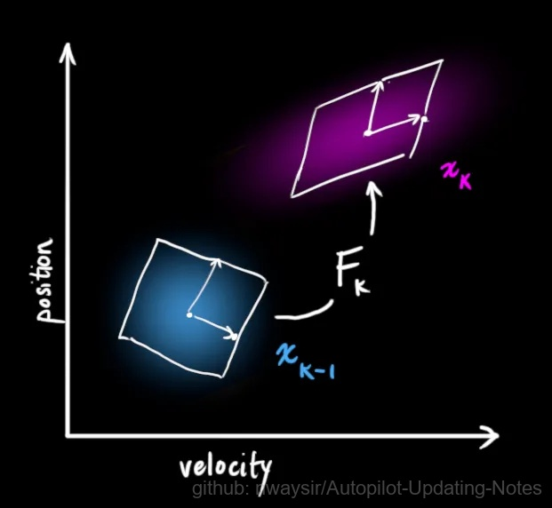

图8. 矩阵表示状态

它从原始预测中取每一点，并将其移动到新的预测位置。如果原始预测是正确的，系统就会移动到新位置。

这是怎么做到的？为什么我们可以用矩阵来预测机器人下一刻的位置和速度？下面是个简单公式：

$$
\color{Magenta}{P_k} = \color{Blue}P_{k-1} + \color{Black}\triangle t\color{Blue}v_{k-1}
$$

$$
\color{Magenta}v_{k} = \quad\quad\quad\quad \color{Blue}v_{k-1}
$$

转换成矩阵形式：

$$
\color{Magenta}{\hat{x_k}}
\color{Black}=
\left[
\begin{matrix}
1 & \triangle t \\
0 & 1 \\
\end{matrix}
\right]
\color{Blue}{\hat{x}_{k-1}}
$$

$$
=\quad{F_k}\color{Blue}{\hat{x}_{k-1}}
$$

这是一个预测矩阵，它能给出机器人的下一个状态，但目前我们还不知道协方差矩阵的更新方法。这也是我们要引出下面这个等式的原因：如果我们将分布中的每个点乘以矩阵A，那么它的协方差矩阵会发生什么变化

$$
Cov(x) = \Sigma
$$

$$
Cov(\color{Red}A\color{Black}x) = \color{Red}A \color{Black}{\Sigma} \color{Red}A^T
$$

把这个式子和上面的最佳估计 ${\hat{x}}$ 结合，可得：

$$
\color{Red}{\hat{x}} \color{Black} = {F_k} \color{Blue}{\hat{x}_{k-1}}
$$

$$
\color{Red}P_k \color{Black} = \color{Black}F_k \color{Blue}P_{k-1} \color{Black}F_k^T
$$

（1）外部影响

但是，除了速度和位置，外因也会对系统造成影响。比如模拟火车运动，除了列车自驾系统，列车操作员可能会手动调速。在我们的机器人示例中，导航软件也可以发出停止指令。对于这些信息，我们把它作为一个向量 $\vec{\mu}_k$ ，纳入预测系统作为修正。

假设油门设置和控制命令是已知的，我们知道火车的预期加速度  。根据运动学基本定理，我们可得：

$$
\color{Magenta}{P_k} = \color{Blue}{P_{k-1}} + \color{Black}{\triangle t}\color{Blue}{v_{k-1}} + \color{Black}{\frac{1}{2}}\color{Darkorange}a\color{Block}{\triangle{t^2}}
$$

$$
\color{Magenta}v_{k} = \quad\quad\quad\quad\quad \color{Blue}v_{k-1} \color{Block}+ \color{Darkorange}a \color{Block}\triangle{t} 
$$

把它转成矩阵形式：

$$
\color{Magenta}{\hat{x_k}}
\color{Black}= {F_k}
\color{Blue}{\hat{x}_{k-1}}
\color{Block}{
\left[
\begin{matrix}
\frac{\triangle{t^2}}{2} \\
\triangle{t} \\
\end{matrix}
\right]}
\color{Darkorange}a
$$

$$
= {F_k}\color{Blue}{\hat{x}_{k-1}} \color{Block} + {B_k} \color{Darkorange}{\vec{u}_k}
$$

${B_k}$ 是控制矩阵， ${\vec{u}_k}$ 是控制向量。如果外部环境异常简单，我们可以忽略这部分内容，但是如果添加了外部影响后，模型的准确率还是上不去，这又是为什么呢？

(2) 外部不确定性

当一个国家只按照自己的步子发展时，它会自生自灭。当一个国家开始依赖外部力量发展时，只要这些外部力量是已知的，我们也能预测它的存亡。

但是，如果存在我们不知道的力量呢？当我们监控无人机时，它可能会受到风的影响；当我们跟踪轮式机器人时，它的轮胎可能会打滑，或者粗糙地面会降低它的移速。这些因素是难以掌握的，如果出现其中的任意一种情况，预测结果就难以保障。

这要求我们在每个预测步骤后再加上一些新的不确定性，来模拟和“世界”相关的所有不确定性：

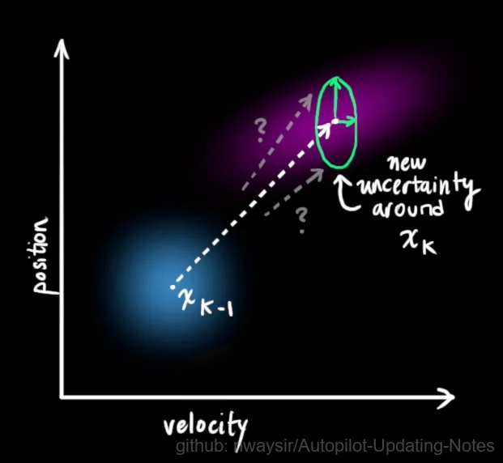

图9. 外部不确定因素的预测误差

如图9所示，加上外部不确定性后， ${\hat{x}_{k-1}}$ 的每个预测状态都可能会移动到另一点，也就是蓝色的高斯分布会移动到紫色高斯分布的位置，并且具有协方差 ${Q_k}$ 。换句话说，我们把这些不确定影响视为协方差 ${Q_k}$ 的噪声。

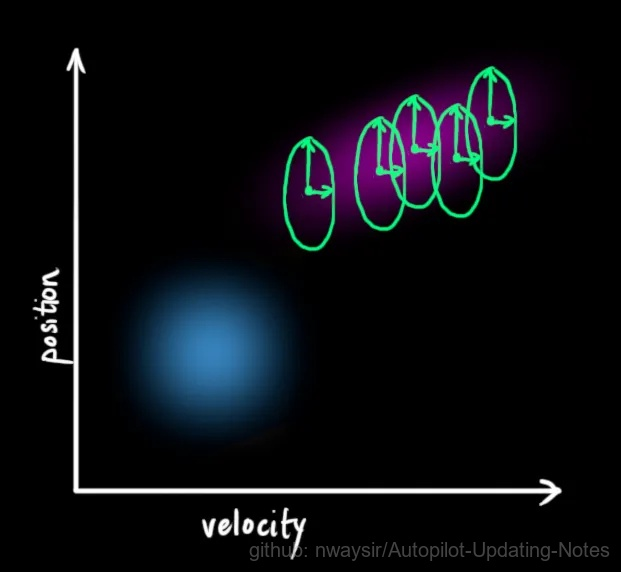

图10. 外部所有不确定因素的预测区间

这个紫色的高斯分布拥有和原分布相同的均值，但协方差不同，如下图11所示。

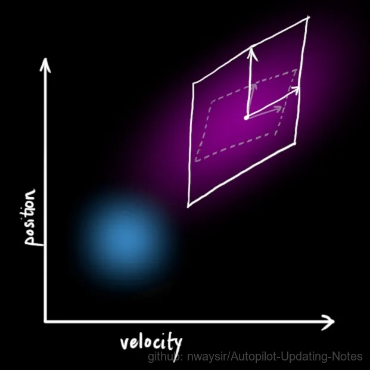

图11. 外部所有不确定因素带来预测的协方差不同

我们在原式上加入 ${Q_k}$ ：

$$
\color{Magenta}{\hat{x}_k} = F_k \hat{x}_{k-1} \color{Block} + B_k\vec{u}_k
$$

<!-- $$
\color{Magenta}{\hat{x}_k} \color{Black} = F_k \color{Blue}{\hat{x}_{k-1}} \color{Block} + B_k \color{Darkorange}{\vec{u}_k}
$$ -->

$$
\color{Magenta}P_k \color{Black}= \color{Black}F_k \color{Blue}P_{k-1} \color{Black}F_k^T + \color{SpringGreen}Q_k
$$

简而言之，这里：
$\color{Magenta}{新的最佳估计}$ 是基于 $\color{Blue}{原最佳估计}$ 和 $\color{Darkorange}{已知外部影响}$ 校正后得到的预测。

$\color{Magenta}{新的不确定性}$ 是基于 $\color{Blue}{原不确定性}$ 和 $\color{SpringGreen}{外部环境的不确定性}$ 得到的预测。

现在，有了这些概念介绍，我们可以把传感器数据输入其中。

**四、通过测量来细化估计值**

我们可能有好几个传感器，它们一起提供有关系统状态的信息。传感器的作用不是我们关心的重点，它可以读取位置，可以读取速度，重点是，它能告诉我们关于状态的间接信息——它是状态下产生的一组读数。

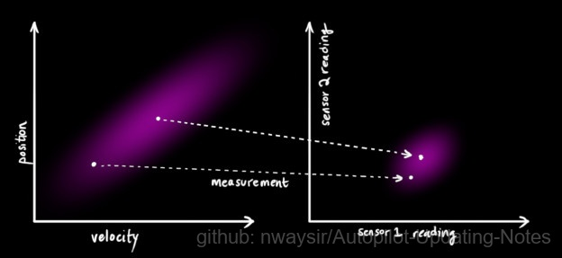

图12. 传感器数据读取

请注意，读数的规模和状态的规模不一定相同，所以我们把传感器读数矩阵设为 ${H_k}$ 。

图13. 数据对齐转换

把这些分布转换为一般形式：

$$
{\vec{\mu}_{expected}} = {H_k}\color{Magenta}{\hat{x}_k}
$$

$$
{\Sigma_{expected}} = {H_k}\color{Magenta}P_k\color{Block}H_k^T
$$

卡尔曼滤波的一大优点是擅长处理传感器噪声。换句话说，由于种种因素，传感器记录的信息其实是不准的，一个状态事实上可以产生多种读数。

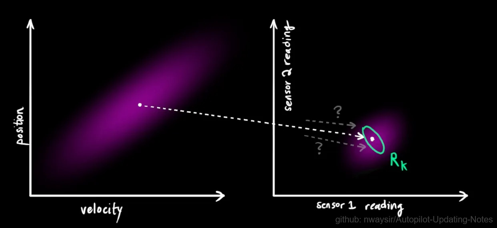

图14. 传感器读取噪声

我们将这种不确定性（即传感器噪声）的协方差设为 ${R_k}$ ，读数的分布均值设为 ${z_k}$ 。

现在我们得到了两块高斯分布，一块围绕预测的均值，另一块围绕传感器读数。

图15. 预测、传感器 误差的高斯分布

如果要生成靠谱预测，模型必须调和这两个信息。也就是说，对于任何可能的读数 $({z_1},{z_2})$ ，这两种方法预测的状态都有可能是准的，也都有可能是不准的。重点是我们怎么找到这两个准确率。

最简单的方法是两者相乘：

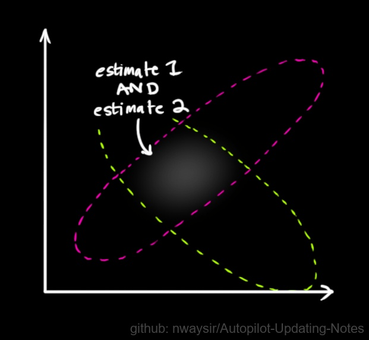

图16. 两者误差的高斯分布乘积

两块高斯分布相乘后，我们可以得到它们的重叠部分，这也是会出现最佳估计的区域。换个角度看，它看起来也符合高斯分布：

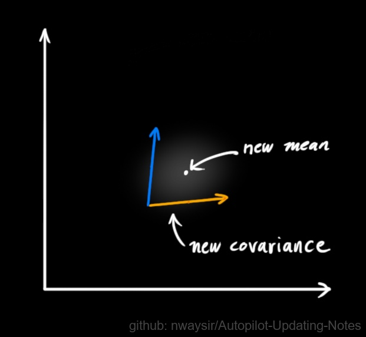

图17. 乘积得到新的均值和协方差矩阵

事实证明，当你把两个高斯分布和它们各自的均值和协方差矩阵相乘时，你会得到一个拥有独立均值和协方差矩阵的新高斯分布。最后剩下的问题就不难解决了：我们必须有一个公式来从旧的参数中获取这些新参数。

**五、结合高斯**

让我们从一维看起，设方差为 ${\sigma^2}$ ，均值为 $\mu$ ，一个标准一维高斯钟形曲线方程如下所示：

$$
\mathcal{N(x,\mu,\sigma)} = \frac{1}{\sigma\sqrt{2\pi}} {e^{-\frac{(x-\mu)^2}{2\sigma^2}}}
$$

那么两条高斯曲线相乘呢？

图18. 高斯曲线相乘

$$
\mathcal{N(x,\color{Magenta}\mu_0,\sigma_0 \color{Block})} \cdot \mathcal{N(x,\color{YellowGreen}\mu_1,\sigma_1 \color{Block})} \overset{?}{=} \mathcal{N(x,\color{Blue}\mu^\prime,\sigma^\prime} \color{Block})
$$

把这个式子按照一维方程进行扩展，可得：

$$
\color{Blue} \mu^\prime \color{Block} = \mu_0 + \frac{\sigma_0^2(\mu_1 - \mu_0)}{\sigma_0^2 + \sigma_1^2}
$$

$$
\color{Blue} {\sigma^\prime}^2 \color{Block} = {\sigma_0}^2 - \frac{\sigma_0^4}{\sigma_0^2 + \sigma_1^2}
$$

如果有些太复杂，我们用k简化一下：

$$
\color{DarkRed}k \color{Block} = \frac{\sigma_0^2}{\sigma_0^2 + \sigma_1^2}
$$

$$
\color{Blue} \mu^\prime \color{Block} = \mu_0 + \color{DarkRed} k \color{Block}(\mu_1 - \mu_0)
$$

$$
\color{Blue} {\sigma^\prime}^2 \color{Block} = {\sigma_0}^2 - \color{DarkRed} k \color{Block} {\sigma_0}^2
$$

以上是一维的内容，如果是多维空间，把这个式子转成矩阵格式：

$$
\color{DarkRed}K \color{Block} = \Sigma_0(\Sigma_0 + \Sigma_1)^{-1}
$$

$$
\color{Blue}\mu^\prime \color{Block}= \vec{\mu_0} + \color{DarkRed}K \color{Block}(\vec{\mu_1} - \vec{\mu_0})
$$

$$
\Sigma^\prime = \Sigma_0 - \color{DarkRed}K \color{Block}\Sigma_0
$$

这个矩阵 $K$ 就是我们说的**卡尔曼增益**。

**六、把它们结合在一起**

截至目前，我们有用矩阵 ${(\mu_0, \Sigma_0) = (H_k - {\hat{x}_k}, H_kP_kH_k^T)}$ 预测的分布，有用传感器读数 ${(\mu_1, \Sigma_1) = (\vec{z}_k, R_k)}$ 预测的分布。把它们代入上节的矩阵等式中：

$$
H_k\color{Blue}{\hat{x}_k^\prime} \color{Block}= H_k{\hat{x}_k} + \color{DarkRed}K (\color{YellowGreen}{\vec{z_k}} - \color{Magenta}H_k{\hat{x}_k}\color{Block})
$$

$$
H_k\color{Blue}P_k^\prime \color{Block}H_k^T = \color{Magenta}H_kP_k{H_k^T} - \color{DarkRed}K\color{Magenta}H_kP_k{H_k^T}
$$

相应的，卡尔曼增益就是：

$$
\color{DarkRed}K=\color{Magenta}H_kP_k{H_k^T}(H_kP_k{H_k^T} + \color{SpringGreen}R_k\color{Block})^{-1}
$$

考虑到 $K$ 里还包含着一个 $H_k$ ，我们再精简一下上式：

$$
\color{Blue}{\hat{x}_k^\prime} \color{Block}= \color{Magenta}{\hat{x}_k} \color{Block} + \color{DarkRed} K^\prime \color{Block}(\color{YellowGreen}{\vec{z_k}} \color{Block} - \color{Magenta}H_k{\hat{x}_k} \color{Block})
$$

$$
\color{Blue}P_k^\prime \color{Block}= \color{Magenta}P_k \color{Block}- \color{DarkRed}K^\prime\color{Magenta}{H_k}P_k
$$

$$
\color{DarkRed}K^\prime \color{Block}= \color{Magenta}P_k{H_k^T}\color{Block}(\color{Magenta}H_kP_k{H_k^T} \color{Block}+ \color{SpringGreen}R_k) ^ {-1}
$$

最后，${\hat{x}_k^\prime}$  是我们的最佳估计值，我们可以把它继续放进去做另一轮预测：

图19. 卡尔曼滤波迭代过程

