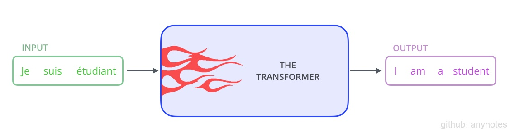
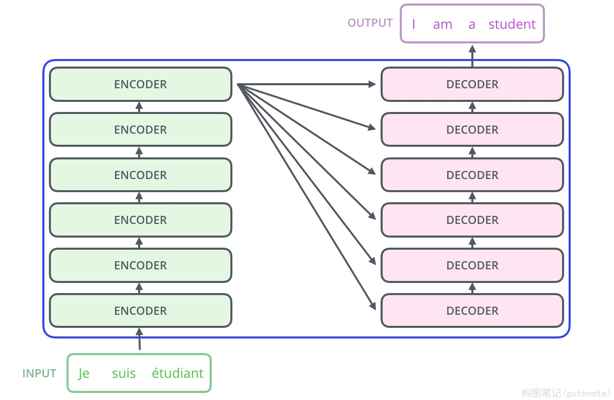
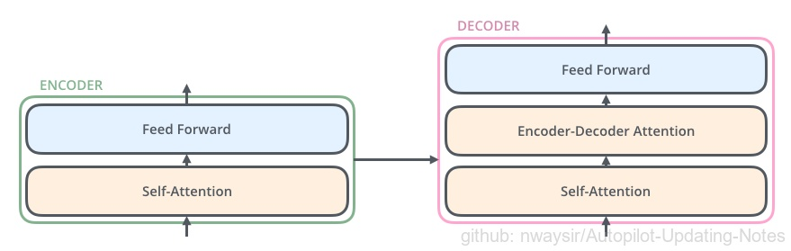
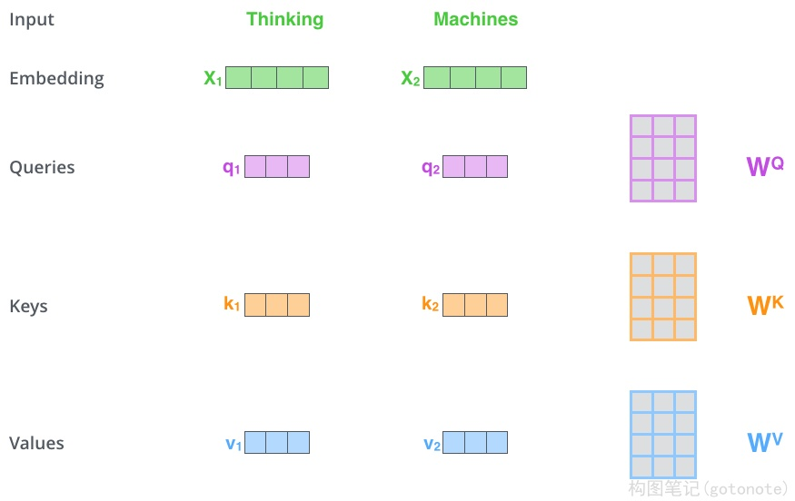
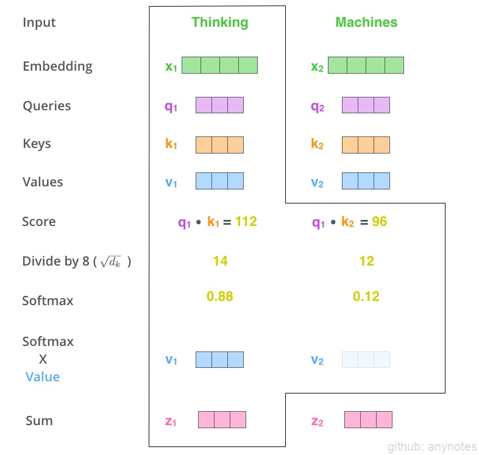
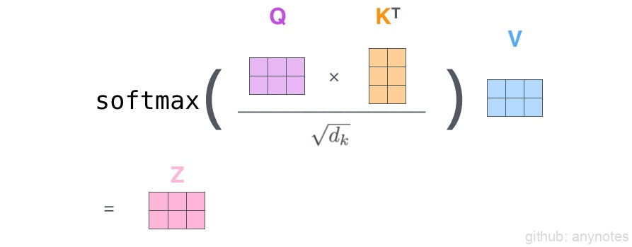

# 1.1.4 Transformer

在上一篇文章中，我们了解到注意力机制在深度学习模型中无处不在。注意力机制有助于提高机器翻译的准确性。在这篇文章中，我们将学习Transformer方法，一个利用注意力来提升模型训练速度的机制。Transformer在特定任务中优于谷歌机器翻译模型。然而，最大的好处得益于Transformer的并行能力。事实上，谷歌云建议使用Cloud TPU提供的Transformer作为参考模型。因此，接下来我们对模型以及其相应模块进行分析。

Transformer是在论文《 Attention is All You Need》中提出的。TensorFlow对应的实现可以使用Tensor2Tensor库提供的接口。在这篇文章中，我们将尝试简化理解，并逐一介绍概念，希望使没有相应基础的同学更容易理解。

## 1.1.4.1 基本流程

首先将模型视为单个黑盒。如下图1所示，在机器翻译应用程序中，输入一种语言的句子，然后输出另一种语言的翻译。

<div align=center>

</div>
<div align=center>图1. 翻译视作盲盒</div>

一个典型的Transformer模型如下图2所示，作为seq2seq模型，它也分为编码和译码两个阶段，两个阶段都由一系列Transformer模块堆叠而成，注意这些模块是不共享权重的，以原论文为例则分别为编码和译码各堆叠了6个Transformer模块。

<div align=center>

</div>
<div align=center>图2. 典型的Transformer模型</div>

Transformer的编码器和解码器结构如下图3所示，编码器由自注意模块（Self-Attention）和前馈网络（Feed Forward Neural Network, FFNN）组成；解码器则与编码器类似，但在自注意模块和前馈网络中间由插入了一层编解码器注意力模块（也叫Cross-Attention，该模块与前述RNN中的上下文注意力类似）。

<div align=center>

</div>
<div align=center>图3. Transformer的编码器和解码器结构</div>

具体执行过程：

（1）首先将输入文本转换为词向量，并且融合位置编码，输入给第一个编码器；

（2）第一个编码器，结合上下文，对每个词向量进行编码，分别得到相同数量的向量作为下一个编码器的输入（输出向量的长度是一个可设定的超参）；编码器依次连接，对编码阶段最终输出的向量按照注意力机制，分别转换成K向量和V向量，K和V分别表示每个每个单词编码后的键（Key）和值（Value），这两套向量将用于解码阶段的编解码注意力模块；

（3）解码器的工作与编码器类似，首先输入一个代表“起始”的token（记为&lt;s&gt;），然后经过层层解码最后转换为一个分类问题用全连接和softmax输出单词的概率分布；

（4）然后将&lt;s&gt;和第一个单词拼接，作为解码阶段的新输入（与编码阶段的输入类似，需要经过词向量的转换和位置编码的融合），进而输出第二个单词的概率分布……以此类推，直到最终输出代表“结束”的token（记为&lt;eos&gt;）。

## 1.1.4.2 自注意模块

首先，对每个词向量（或经过若干次编/解码后得到的特征向量）进行处理，分别产生查询向量（Query）、键向量（Key）和值向量（Value），这三个向量的长度是相同的，并且该长度是可设置的超参。为了产生这三个向量，我们需要模块提供三个可训练的权重，通过权重矩阵与词向量（或特征向量）的乘法得到。

不妨用Python的“字典（Dict）”来类比这三个向量的作用（一种模糊映射关系）

```
Dict[Key] = Value     # Key-Value是实际映射关系中的键值对,
Value_ = Dict[Query]  # 用Query去匹配Key以查询Value，
# 在Python的Dict中Query和Key是精确配对的；
# 但在自注意模块中，是用Query去模糊匹配Key并提取出模糊的Value_
```

<div align=center>

</div>
<div align=center>图4. QKV计算过程 </div>

当每个词向量（或特征向量）都有了对应的查询向量、键向量和值向量之后，就可以进行如下的自注意力机
制。比如计算第一个词向量（对应单词Thinking）的特征向量:

1. 用该单词的查询向量$q_1$与所有单词对应的键向量$q_1,q_2,q_3,...q_n$做点乘，分别得到每个单词的查询得分$s_1,s_2,s_3,...s_n$；
2. 用$\sqrt{d_k}$规范化得分（$d_k$代表查询向量的长度），并将规范化后的得分作为一个向量执行$softmax$作为权重；
3. 利用得到的权重加权求和，即为该词向量对应的输出向量。

对应示例如下图5所示：

<div align=center>

</div>
<div align=center>图5. 自注意力机制过程 </div>

将所有输入的词向量堆叠成矩阵，则可以简写成如下的矩阵形式：

<div align=center>

</div>
<div align=center>图6. 自注意力机制矩阵表示 </div>

## 1.1.4.3 多头设计（Multi-heads）

前述自注意模块中，对于每个输入向量，只产生一个对应的特征向量，而多头设计即是希望对每个输入向量能产生多个不同的特征向量（与CNN中特征图的“通道”类似）。实现上也不麻烦，只需要设置多套不共享的权重矩阵$W^q, W^k, W^v$即可。这样做有两点好处:

(1) 使模型能更好的将注意力放在多个不同的位置上；

(2) 使注意力模块能拥有更复杂的表示子空间（representation subspaces）;


