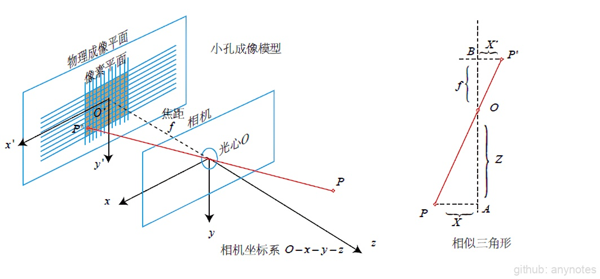
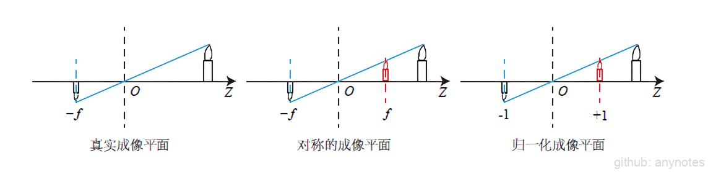
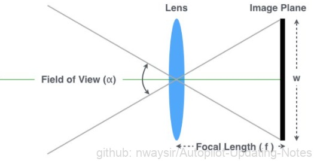
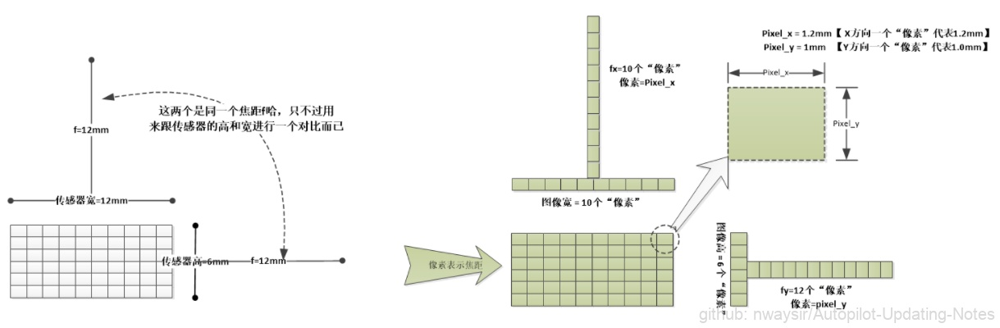

# 1.1.5 相机模型-内参、外参

针孔相机模型，包含四个坐标系：物理成像坐标系、像素坐标系、相机坐标系、世界坐标系。

相机参数包含：内参、外参、畸变参数

## 1.1.5.1 内参（Intrinsics）

图1. 坐标系关系

物理成像坐标系： $O'-x'-y'$

像素坐标系： $O-u-v$

相机坐标系： $O-x-y$

世界坐标系： $O-X-Y-Z$

在世界坐标系下的点 $P[X,Y,Z]^T$ ，通过相机坐标系下的光心 $O$ 投影到物理成像平面上的 $P'[X',Y',Z']^T$ ，对应到像素坐标系下的 $[u,v]^T$ 。

由相似三角形可以得到：

$$
\frac Z f = -\frac X {X'}=-\frac Y {Y'}
$$

带负号是因为小孔成像成的是倒像。为了简化模型，可以把物理成像平面看作为放到了相机的前方，这样可以直观的认为成立的正像（虚像），如下图2：

图2. 小孔成像

可以得到：

$$
\begin{align}
\frac Z f = \frac X {X'}=\frac Y {Y'}
\end{align}
$$

$$
\begin{align}
X'=f\frac X Z
\end{align}
$$

$$
\begin{align}
Y'=f\frac Y Z
\end{align}
$$

从物理成像坐标系到像素坐标系之前，相差了一个**缩放**和**平移**。缩放是因为两个坐标系之前的表示的单位长度不一致，平移是因为两个坐标系的原点不一致。

假设，像素坐标在 $u$ 方向上缩放了 $\alpha$ 倍，在 $v$ 方向上缩放了 $\beta$ 倍，同时，原点平移了 $[c_x,c_y]^T$ 。那么点 $P'[X',Y',Z']^T$ 与像素坐标系下 $[u,v]^T$ 的关系为：

$$
\begin{cases} 
u=\alpha X'+c_x \\
v=\beta Y'+c_y
\end{cases} 
$$

$$
f_x = \alpha f
$$

$$
f_y = \beta f
$$

$$
\begin{cases} 
u=f_x \frac XZ + c_x \\
v=f_y \frac YZ + c_y
\end{cases}
$$

其中，变量的**单位**是 $f \rightarrow mm ; \alpha, \beta \rightarrow 像素/mm; f_x,f_y \rightarrow 像素$。将坐标进行归一化，写成矩阵形式，并对左侧像素坐标进行齐次化，方便后面的运算：

$$
\begin{bmatrix} 
u \\ 
v \\ 
1 \\ 
\end{bmatrix} = 
\frac 1Z 
\begin{bmatrix} 
f_x &0 &c_x \\
0 &f_y &c_y\\
0 &0 &1 \\ 
\end{bmatrix} 
\overset{\triangle}{=} 
\frac1Z \boldsymbol{KP}
$$

$$
{Z}\begin{bmatrix} 
u \\ 
v \\ 
1 \\ 
\end{bmatrix} = 
\begin{bmatrix} 
f_x &0 &c_x \\
0 &f_y &c_y \\ 
0 &0 &1 \\ 
\end{bmatrix} 
\overset{\triangle}{=} 
\boldsymbol{KP}
$$

把中间的量组成的矩阵称为相机的**内参矩阵**（Camera Intrinsics） $\boldsymbol K$ 。

### 一、内参矩阵参数获取

图3. 简化相机

图像大小 $[w,h]$ ，单位 $pixel$ ；相机焦距 $f$ ，单位 $mm$ ；视场角 $FOV-\alpha$ ，单位弧度；像素单元长度 $\mathrm{d}x,\mathrm{d}y$ ，单位 $mm/pixel$ ；内参 $f_x,f_x $，单位 $pixel$ ：

$$
\boldsymbol{f_x=\frac f{\mathrm{d}x}}
$$

$$
\boldsymbol{f_y=\frac f{\mathrm{d}y}}
$$

$$
\boldsymbol{c_x=\frac w2} \ (假设相机主点在图像中央) $$

$$
\boldsymbol{c_y =\frac h2} \ (假设相机主点在图像中央)
$$

​   $\boldsymbol {f_x}$就相当于用$x$方向的像素数去量化物理焦距$f$；

​   $\boldsymbol {f_y}$就相当于用$y$方向的像素数去量化物理焦距$f$；

图4. 像素数去量化物理焦距

#### 1. 已知相机的硬件参数求内参

相机的内参出厂后就是固定不变的，如果知晓相机的出厂参数，可以计算相机的内参。

如成像传感器是 $m\times n(\mu m)$ ，图像尺寸是 $w\times h(pixel)$ ，那么图像像素单元就是

$$
\mathrm{d}x=\frac mw(\mu m/pixel)
$$

$$
\mathrm{d}y=\frac nh(\mu m/pixel)
$$

$$
c_x=\frac w2 \\ c_y =\frac h2
$$

如果 $\mathrm{d}x=\mathrm{d}y$ ，则图像像素单元是一个正方形，此时 $\boldsymbol {f_x=f_y}$ ；

如果 $\mathrm{d}x \neq \mathrm{d}y$ ，则图像像素单元是一个矩形，此时 $\boldsymbol {f_x \neq f_y}$ 。

如成像传感器是 $2000\times 1000(\mu m)$ ，图像尺寸是 $1000\times 500(pixel)$ ，那么图像像素单元就是 $\mathrm{d}x=\mathrm{d}y=2(\mu m/pixel)$ ， $c_x=500,c_y=250(pixel)$ 。

#### 2. 求视场角 FOV

> 这里只是求水平方向上的 FOV，垂直方向上的 FOV 求法和水平是一致的。

（参考图3）其中，成像传感器是 $m\times n(\mu m)$ ，图像尺寸是 $w\times h(pixel)$ ，像素单元$x$轴方向长度 $\mathrm{d}x=\frac mw(\mu m/pixel)$ ，可以看到：

$$
\begin{align}
\tan({\frac {\alpha}2} \cdot \frac {\pi}{180} ) = \frac {m/2}{f}
\end{align}
$$

$$
FOV=\alpha =2\arctan(\frac {m/2}{f}) \cdot \frac {180}{\pi} \tag{1.1}
$$

$$
m =w\cdot \mathrm{d}x
$$

$$
FOV=\alpha =2\arctan(\frac {w\cdot \mathrm dx/2}{f}) \cdot \frac {180}{\pi}
$$

$$
f_x = \frac f{\mathrm dx}
$$

$$
FOV=\alpha =2\arctan(\frac {w}{2f_x}) \cdot \frac {180}{\pi} \tag{1.2}
$$

如果已知相机传感器尺寸，通过公式 1.1 可以计算出相机的视场角 $FOV$ ；

如果已知相机内参，通过公式 1.2 可以计算出相机的视场角 $FOV$ 。

#### 3 通过 FOV 计算内参

由公式 1.2，可得：

$$
\frac{w}{2f_x} = \tan(\frac {FOV}{2} \cdot \frac {\pi}{180})
$$

$$
f_x = \frac w{2\tan(\frac {FOV}{2} \cdot \frac {\pi}{180})}
$$

$$
f_y = \frac h{2\tan(\frac {FOV}{2} \cdot \frac {\pi}{180})}
$$

如果 $\mathrm{d}x=\mathrm{d}y$ ，则图像像素单元是一个正方形，此时 $\boldsymbol {f_x=f_y}$ ； $\boldsymbol {c_x=\frac w2 }$ ； $\\ \boldsymbol {c_y =\frac h2}$ 。

## 1.1.5.2 外参 (Extrinsics)

相机内参描述的是在相机坐标系下的点到像素坐标系下的对应关系，上文内提到的 $\boldsymbol P$ 也是在相机坐标系下的点。相机在三维空间中运动，记点 $\boldsymbol P$ 在世界坐标系下的点为  $\boldsymbol P_w$ ，在相机坐标系下的坐标为 $\boldsymbol P_c$ 。

相机在世界坐标系下的位姿，由相机的旋转矩阵 $\boldsymbol R$ 和平移向量 $\boldsymbol t$ 来描述。此时有：

$$
{Z} \cdot \boldsymbol {P_{uv} |_{3\times1}} 
$$

$$
{= Z} \cdot 
\left[
\begin{matrix}
u \\ 
v \\ 
1 \\ 
\end{matrix}
\right]
$$

$$
{=} \boldsymbol{K} (\boldsymbol{RP_w+t})
$$

$$
{=} \boldsymbol{K |_{3 \times 3}} T |_{3}
$$

$$
{=} \boldsymbol{K|_{3\times3}} \cdot \boldsymbol{T|_{3\times4}} \cdot \boldsymbol{{P_w}|_{4\times1}} \tag{1.3}
$$

> `两侧都是齐次坐标，同时因为齐次坐标乘上非零常数后表达同样的含义，所以可以简单地把Z去掉`：
> 
> $$ \boldsymbol {P_{uv}= KTP_w} $$
> 
> `但这样等号意义就变了，成为在齐次坐标下相等的概念，相差了一个非零常数。为了避免麻烦，我们还是从传统意义下来定义书写等号。`（《SLAM 十四讲》）

式 1.3 表明，我们可以把一个世界坐标点先转换到相机坐标系，再除掉它最后一维的数值（该点距离相机成像平面的深度），这就相当于把最后一维进行了 **归一化处理** ，得到点$P$在相机 **归一化平面** 上的投影：

$$
(\boldsymbol {RP_w+t}) \ \ \ \ {=} \ \ \ 
[X,Y,Z]^T \ \ \   \to \ \ \ \ 
[X/Z,Y/Z,1]^T \\ 
\ \ \ \ ({相机坐标} \ \ \to \ \ {归一化坐标})
$$

**归一化坐标** 可以看成相机前方$z=1$处的平面上的一个点，这个$z=1$平面也称为 **归一化平面** 。归一化坐标左称内参 $\boldsymbol K$ 就得到了像素坐标，因此可以把像素坐标 $[u,v]^T$ 看成对归一化平面上的点进行量化测量的结果。

同时可以看到，如果对相机坐标同时乘上任意非零常数，归一化坐标都是一样的，也就是 **点的深度信息在投影的过程中丢失了** ，所以在单目视觉中没法得到像素点的深度值。

> 通过最终的转换关系来看，一个三维中的坐标点，的确可以在图像中找到一个对应的像素点，但是反过来，通过图像中的一个点找到它在三维中对应的点就很成了一个问题，因为我们并不知道等式左边的 $z_c$（深度值）的值。

