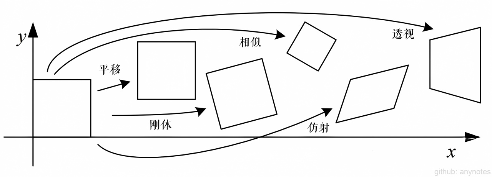
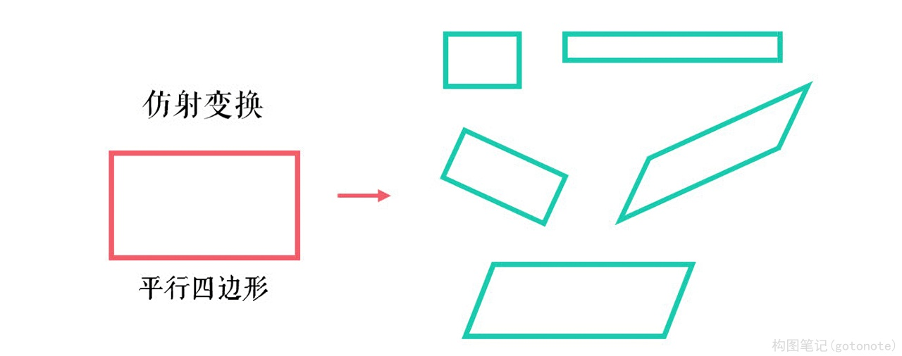
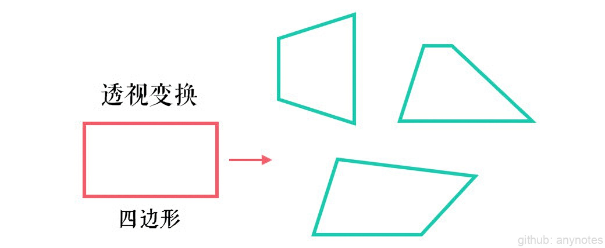

# 图像变换介绍

常规图像变换如：刚体变换、欧式变换、相似变换、仿射变换、透视变换等，但他们之间的关系和区别经常混淆。因此本文简单的介绍和辨析一下这几种变换的区别与联系：

| 变换 | 矩阵 | 自由度 | 保持性质 |
| ---- | ---- | ---- | ---- |
| 平移 | [I, t]（2×3） | 2 | 方向/长度/夹角/平行性/直线性 |
| 刚体 | [R, t]（2×3） | 3 | 长度/夹角/平行性/直线性 |
| 相似 | [sR, t]（2×3） | 4 | 夹角/平行性/直线性 |
| 仿射 | [T]（2×3）| 6 | 平行性/直线性 |
| 透视 | [T]（3×3）| 8 | 直线性 |

## 一、 刚体变换（Rigid Transformation）

$$
\begin{bmatrix} 
x′ \\ 
y′ \\ 
1 \\ 
\end{bmatrix} = 
\begin{bmatrix} 
R &t \\
0 &1 \\
\end{bmatrix} 
\begin{bmatrix} 
x \\
y \\
1 \\
\end{bmatrix} = 
\begin{bmatrix} 
cosθ &−sinθ &tx \\
sinθ &cosθ &ty \\
0 &0 &1 \\
\end{bmatrix}
\begin{bmatrix} 
x \\
y \\
1 \\
\end{bmatrix}
$$

刚体变换也叫刚性变换、欧式变换，是最基础的变换形式。其中 $R$ 表示旋转矩阵，是一个正交阵 $RR^T=I$ , $t$ 表示平移向量。

*   变换形式：旋转和平移
*   自由度：三个自由度（一个旋转角 $\theta$ ，两个平移向量 $t_x,t_y$ ​）
*   求解方式：需要两组点，四个方程求解
*   不变量：长度、角度、面积

## 二、等距变换（Isometric Transformation）

$$
\begin{bmatrix} 
x′ \\ 
y′ \\ 
1 \\ 
\end{bmatrix} = 
\begin{bmatrix} 
ϵcosθ &−sinθ &tx \\
ϵsinθ &θcosθ &ty \\
0 &0 &1 \\
\end{bmatrix}
\begin{bmatrix} 
x \\
y \\
1 \\
\end{bmatrix}
, ϵ = ± 1
$$

等距变换前后两点之间的距离不变。ϵ = 1 时，等距变换就等价于刚性变换、欧式变换，是保向的；ϵ = −1 时，是逆向的，表示关于 Y 轴对称的反射变换。

* 变换形式： ϵ = 1 时，旋转和平移； ϵ = − 1 时，旋转、平移和反射（对称）
* 自由度：三个自由度（一个旋转角 θ ，两个平移向量 $t_x,t_y$ ​）
* 求解方式：需要两组点，四个方程求解
* 不变量：长度、角度、面积

## 三、相似变换（Similar Transformation）

$$
\begin{bmatrix} 
x′ \\ 
y′ \\ 
1 \\ 
\end{bmatrix} = 
\begin{bmatrix} 
sR &t \\
0 &1 \\
\end{bmatrix} 
\begin{bmatrix} 
x \\
y \\
1 \\
\end{bmatrix} = 
\begin{bmatrix} 
s \cosθ &−s \sinθ &tx \\
s \sinθ &s \cosθ &ty \\
0 &0 &1 \\
\end{bmatrix}
\begin{bmatrix} 
x \\
y \\
1 \\
\end{bmatrix}
$$

相似变换是在刚性变换的基础上增加一个均匀放缩系数 $s$ 。

* 变换形式：旋转、平移、放缩
* 自由度：四个自由度（一个旋转角 θ，两个平移向量 $t_x,t_y$ ​，一个放缩系数 $s$ ）
* 求解方式：需要两组点，四个方程求解
* 不变量：角度、长度的比例和面积比例

## 四、线性变换（Linear Transformation）

$$
\begin{bmatrix} 
x′ \\ 
y′ \\ 
1 \\ 
\end{bmatrix} = 
\begin{bmatrix} 
A &0 \\ 
0 &1 \\
\end{bmatrix} 
\begin{bmatrix} 
x \\
y \\
1 \\
\end{bmatrix} = 
\begin{bmatrix} 
a_{11} & a_{12} & 0 \\
a_{21} & a_{22} & 0 \\
0 &0 &1 \\
\end{bmatrix}
\begin{bmatrix} 
x \\
y \\
1 \\
\end{bmatrix}
$$

线性变换要求变换前后的直线仍是直线，且直线之间的比例保持不变。

* 变换形式：旋转、放缩、反射（对称）、倾斜（错切）
* 自由度：四个自由度（四个线性变换元素 $a_{11}, a_{12},a_{21}, a_{22}$ ​）
* 求解方式：需要两组点，四个方程求解
* 不变量：长度的比例和面积比例

## 五、仿射变换（Affine Transformation）

图5. 仿射变换

$$
\begin{bmatrix} 
x′ \\ 
y′ \\ 
1 \\ 
\end{bmatrix} = 
\begin{bmatrix} 
 A &t \\ 
 0 &1 \\
\end{bmatrix} 
\begin{bmatrix} 
x \\
y \\
1 \\
\end{bmatrix} = 
\begin{bmatrix} 
a_{11} & a_{12} & t_x \\
a_{21} & a_{22} & t_y \\
0 &0 &1 \\
\end{bmatrix}
\begin{bmatrix} 
x \\
y \\
1 \\
\end{bmatrix}
$$

仿射变换是线性变换和平移变换的组合，能够保持二维图形的 “平直性” 和“平行性”，但是角度会改变。 $A$ 表示仿射矩阵。

> “平直性”：变换后直线还是直线、圆弧还是圆弧  
> “平行性”：平行线还是平行线，直线上点的位置顺序不变

* 变换形式：旋转、平移、放缩、反射（对称）、倾斜（错切）
* 自由度：六个自由度（四个仿射矩阵元素 $a_{11}, a_{12}, a_{21}, a_{22}$ ​，两个平移向量 $t_x,t_y$ ​）
* 求解方式：需要三组点，六个方程求解
* 不变量：平行线，平行线所分割线段长度的比例和面积的比例

## 六、透视变换（Perspective Transformation）

图6. 透视变换

$$
\begin{bmatrix} 
x′ \\ 
y′ \\ 
1 \\ 
\end{bmatrix} = 
\begin{bmatrix} 
 A &t \\ 
 v &1 \\
\end{bmatrix} 
\begin{bmatrix} 
x \\
y \\
z \\
\end{bmatrix} = 
\begin{bmatrix} 
a_{11} & a_{12} & t_x \\
a_{21} & a_{22} & t_y \\
v_{1} &v_{2} &1 \\
\end{bmatrix}
\begin{bmatrix} 
x \\
y \\
z \\
\end{bmatrix}
$$

透视变换也叫做射影变换（Projection Transformation），是将图像投影到一个新的视平面。其中 $v$ 用于产生图像透视变换。

* 变换形式：旋转、平移、放缩、反射（对称）、倾斜（错切）、透视
* 自由度：八个自由度（四个仿射矩阵元素 $a_{11},a_{12},a_{21},a_{22}$ ​，两个平移向量 $t_x,t_y$ ​、两个透视变换元素 $v_1,v_2$ ​）
* 求解方式：需要四组点，八个方程求解
* 不变量：长度的交比