# NeRF

## 一、简介

Neural Radiance Field(NeRf，神经辐射场)，最早被提出于《NeRF: Representing Scenes as Neural Radiance Fields for View Synthesis》[<sup>1</sup>](#refer-anchor)，是一篇获得ECCV2020最佳论文。

神经辐射场最重要的两个概念是**神经场**和**体渲染**。

### （一）神经场

场（field）是为所有（连续）空间和/或时间坐标定义的量（标量），如电磁场，重力场等。因此当讨论场时，我们在讨论一个连续的概念，而且它是将一个高维的向量映射到一个标量。神经场则表示用神经网络进行全部或者部分参数化的场。在视觉领域，我们可以认为神经场就是以空间坐标或者其他维度（时间、相机位姿等）作为输入，通过一个MLP网络模拟目标函数，生成一个目标标量（颜色、深度等）的过程。

### （二）体渲染

体渲染则是从体数据渲染得到2D图片的过程。现实生活中，有一些领域采集的3D数据是以体数据格式存储的，例如医疗中的CT和MRI、地质信息、气象信息等，这些数据需要渲染到2D图像才能够被人类理解。除此之外体数据建模相比于传统的Mesh、Point，更加适合模拟光照、烟雾、火焰等非刚体，因此也在图形学中有很多应用。体数据的渲染主要是指通过追踪光线进入场景并对光线长度进行某种积分来生成图像或视频。

## 二、NeRF原理

NeRF要解决的问题就是新视角合成，即给定一些拍摄的图，如何生成新的视角下的图。不同于传统的三维重建方法把场景表示为点云、网格、体素等显式的表达，它独辟蹊径，将场景建模成一个连续的5D（x,y,z,Ө,ϕ）辐射场隐式存储在神经网络中，只需输入稀疏的多角度带位姿的图像训练得到一个神经辐射场模型，根据这个模型可以渲染出任意视角下的清晰的照片。通俗来讲就是构造一个隐式的渲染流程，其输入是某个视角下发射的光线的位置 $o$ ，方向 $d$ 以及对应的坐标(x,y,z)(图1)，送入神经辐射场得到体密度和颜色，最后再通过体渲染得到最终的图像。NeRF最先是应用在新视点合成方向，由于其超强的隐式表达三维信息的能力后续在三维重建方向迅速发展起来。

下图表示了神经辐射场场景表示和可导的渲染流程概述。通过图(a)沿着相机光线采样出5D坐标即位置和视角方向(x, y, z, Ө, ϕ)；图(b)把位置(x, y, z)及视角(Ө, ϕ)喂给MLP，生成颜色(r, g, b)和体积密度σ；图(c)使用立体渲染技术，利用这些值得到一张图像，由于这个渲染函数是可导的，因此可以最小化合成图像和真实图像的误差，进行场景表示优化。

<div align=center>
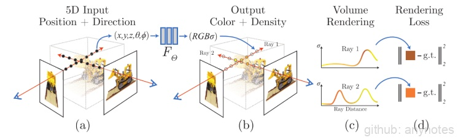
</div>
<div align=center>图1. NeRF 原理</div>

NeRF提出了一种从一组输入图像中优化连续5D神经辐射场的表示（任何连续位置的体密度和视角相关颜色）的方法。使用体渲染技术沿光线累积此场景表示的采样点信息，以便从任何视角渲染场景。在这里可视化了在半球区域上随机捕获的合成鼓场景的100个输入视图集，并展示了从优化后的NeRF表示中渲染的两个新视角下的图像。

<div align=center>
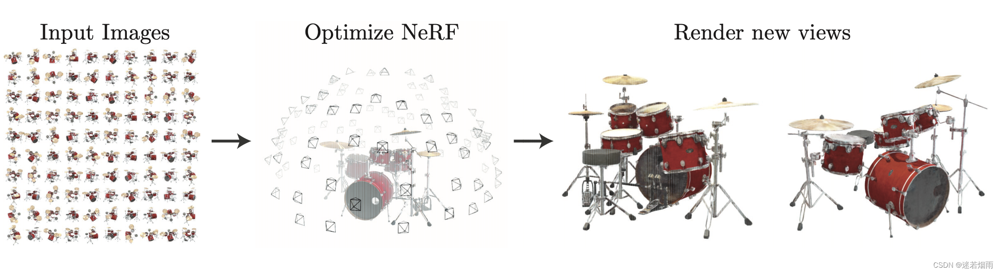
</div>
<div align=center>图2. 渲染可视化</div>

通过一个MLP里模拟这个方程：

$$
{F_Ө} : (x, d) \Rightarrow(c, σ)
$$

在具体的实现中，位置 $x$ 首先输入到MLP网络中，输出密度σ和中间特征，中间特征和视角 $d$ 再输入到额外的全连接层中预测颜色 $c$ 。因此，体素密度只和空间位置有关，而颜色则与空间位置以及观察的视角都有关系。体素密度可以被理解为一条射线 $r$ 在经过 $x$ 处的一个无穷小的粒子(体积像素)时被终止的概率，这个概率是可微的，类似于这个点的不透明度。由于一条射线上的点是连续的，自然的想法是这条射线的颜色可以由积分的方式得到:

渲染方程可表示为:

$$
C(x) = \int_{t_n}^{t_f} T(t) \cdot \sigma(r(t)) \cdot c(r(t),d)dt
$$

将一个射线标记为(射线方程)：

$$
r(t) = o + td
$$

这里 $o$ 是射线原点， $d$ 是前述的相机射线角度， $t$ 的近段和远端边界分别为 $t_n$ 以及 $t_f$ 。

累积透明度公式:

$$
T(t) = exp(-\int_{t_n}^{t}\sigma(r(s))ds)
$$

$T(t)$ 是射线从 $t_n$ 到 $t$ 这一段路径上的累积透明度，从指数分布的角度可以被理解为这条射线从 $t_n$ 到 $t$ 一路上没有击中任何粒子的概率。

实际应用中，不可能用NeRF去估计连续的3D点的信息，因此就需要数值近似的方法作为替代。首先将射线需要积分的区域分为 $N$ 份，然后在每一个小区域中进行均匀随机采样。这样的方式能够在只采样离散点的前提下，保证采样位置的连续性。

第 $i$ 个采样点可以表示为：

$$
t_i=U[t_n + \frac{i-1}{N}(t_f - t_n), t_n + \frac{i}{N}(t_f - t_n)]
$$

基于这些采样点，我们可以将上面的积分简化为求和的形式：

$$
\hat{C}(r) = \sum_{i=1}^N T_i \cdot(1-exp(-\sigma_i \cdot \delta_i))\cdot c_i
$$

其中，邻近两个采样点之间的距离:

$$
\delta_i = t_{i+1} - t_i
$$

离散求和形式的累积透明度:

$$
T_i = exp(-\sum_{j=1}^{i-1} \sigma_j \delta_j)
$$

同样，基于分段采样的渲染方式也是可微的。因此，基于这样的渲染方式，我们就可以用NeRF函数从任意角度中渲染出图片。

## 三、NeRF代码解读

[代码地址](https://github.com/yenchenlin/nerf-pytorch)

NeRF代码里用load_llff.py这个文件来读取真实的数据，LLFF是NeRF作者的上一篇做新视角合成的工作。为了和LLFF方法保持一致的数据格式，NeRF使用load_llff.py读取LLFF格式的真实数据，并使用LLFF提供的的imgs2poses.py文件获取所需相机参数。
imgs2poses.py这个文件其实很简单，就干了两件事。

第一件事是调用colmap软件估计相机的参数，在sparse/0/文件夹下生成一些二进制文件：cameras.bin, images.bin, points3D.bin, project.ini。

第二件事是读取上一步得到的二进制文件，保存成一个poses_bounds.npy文件。

这里有一个细节需要注意，就是在pose_utils.py文件里load_colmap_data() 函数的倒数第二行，有一个操作将colmap得到的c2w旋转矩阵中的第一列和第二列互换，第三列乘以负号：

```python
# LLFF/llff/poses/pose_utils.py

def load_colmap_data(realdir):
    ...   
    # must switch to [-u, r, -t] from [r, -u, t], NOT [r, u, -t]
    poses = np.concatenate([poses[:, 1:2, :], poses[:, 0:1, :], -poses[:, 2:3, :], poses[:, 3:4, :], poses[:, 4:5, :]], 1)
    return poses, pts3d, perm
```
还记得刚刚提到c2w旋转矩阵的三列向量分别代表XYZ轴的朝向，上述操作实际上就是把相机坐标系轴的朝向进行了变换：X和Y轴调换，Z轴取反，如下图所示：

<div align=center>
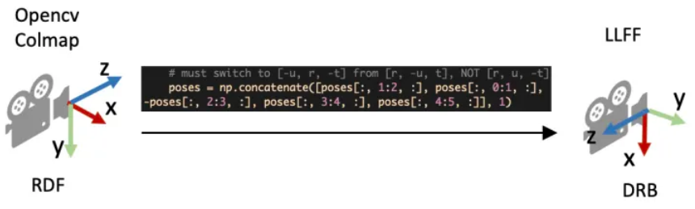
</div>
<div align=center>图3. 从Colmap的坐标系转到LLFF的坐标系</div>

load_llff.py会直接读取poses_bounds.npy文件获得相机参数。poses_bounds.npy是一个Nx17的矩阵，其中N是图像的数量，即每一张图像有17个参数。其中前面15个参数可以重排成3x5的矩阵形式：

$$
\left[
\begin{matrix}
r_{11} & r_{12} & r_{13} & t_1 & H \\
r_{21} & r_{22} & r_{23} & t_2 & W \\
r_{31} & r_{32} & r_{33} & t_3 & f\\
\end{matrix}
\right]
$$
<div align=center>式1. poses_bounds.npy的前15维参数</div>

最后两个参数用于表示场景的范围Bounds(bds)，是该相机视角下场景点离相机中心最近(near)和最远(far)的距离，所以near/far肯定是大于0的。这两个值是在 imgs2poses.py 中，计算colmap重建的3D稀疏点在各个相机视角下最近和最远的距离得到的。

之前提到体素渲染需要在一条射线上采样3D点，这就需要一个采样区间，而near和far就是定义了采样区间的最近点和最远点。贴近场景边界的near/far可以使采样点分布更加密集，从而有效地提升收敛速度和渲染质量。

<div align=center>
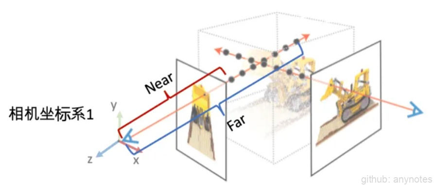
</div>
<div align=center>图4. poses_bounds.npy里最后两个参数（near/far）的作用示意图</div>

接着，介绍NeRF代码里load_llff.py代码里的一些细节。

view_matrix是一个构造相机矩阵的的函数，输入是相机的Z轴朝向、up轴的朝向(即相机平面朝上的方向Y)、以及相机中心。输出下图所示的camera-to-world (c2w)矩阵。因为Z轴朝向，Y轴朝向，和相机中心都已经给定，所以只需求X轴的方向即可。又由于X轴同时和Z轴和Y轴垂直，我们可以用Y轴与Z轴的叉乘得到X轴方向。
下面是load_llff.py里关于view_matrix()的定义，看起来复杂一些。其实就是比刚刚的描述比多了一步：在用Y轴与Z轴叉乘得到X轴后，再次用Z轴与X轴叉乘得到新的Y轴。这是因为传入的up(Y)轴是通过一些计算得到的，不一定和Z轴垂直，所以多这么一步。

```python
# load_llff.py

def viewmatrix(z, up, pos):
    vec2 = normalize(z)
    vec1_avg = up
    vec0 = normalize(np.cross(vec1_avg, vec2))
    vec1 = normalize(np.cross(vec2, vec0))
    m = np.stack([vec0, vec1, vec2, pos], 1)
    return m
```

poses_avg()这个函数就是多个相机的平均位姿（包括位置和朝向）。输入是多个相机的位姿。

第一步对多个相机的中心进行求均值得到center。
第二步对所有相机的Z轴求平均得到vec2向量（方向向量相加其实等效于平均方向向量）。
第三步对所有的相机的Y轴求平均得到up向量。
最后将vec2, up, 和center输入到刚刚介绍的viewmatrix()函数就可以得到平均的相机位姿了。

```python
def poses_avg(poses):
    hwf = poses[0, :3, -1:]
    center = poses[:, :3, 3].mean(0)
    vec2 = normalize(poses[:, :3, 2].sum(0))
    up = poses[:, :3, 1].sum(0)
    c2w = np.concatenate([viewmatrix(vec2, up, center), hwf], 1)
    return c2w
```

下图展示了一个poses_avg()函数的例子。左边是多个输入相机的位姿，右边是返回的平均相机姿态。可以看出平均相机位姿的位置和朝向是之前所有相机的均值。

<div align=center>
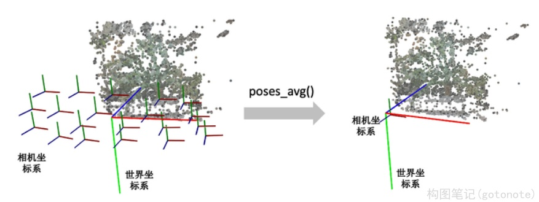
</div>
<div align=center>图5. poses_avg()函数图例</div>

recenter_poses()函数是中心化相机位姿（同样包括位置和朝向）的意思。输入N个相机位姿，会返回N个相机位姿。

第一步先用刚刚介绍的poses_avg(poses)得到多个输入相机的平均位姿c2w，接着用这个平均位姿c2w的逆左乘到输入的相机位姿上就完成了归一化。

```python
def recenter_poses(poses):
    poses_ = poses+0
    bottom = np.reshape([0,0,0,1.], [1,4])
    c2w = poses_avg(poses)
    c2w = np.concatenate([c2w[:3,:4], bottom], -2)
    bottom = np.tile(np.reshape(bottom, [1,1,4]), [poses.shape[0],1,1])
    poses = np.concatenate([poses[:,:3,:4], bottom], -2)

    poses = np.linalg.inv(c2w) @ poses
    poses_[:,:3,:4] = poses[:,:3,:4]
    poses = poses_
    return poses
```

首先我们要知道利用同一个旋转平移变换矩阵左乘所有的相机位姿是对所有的相机位姿做一个全局的旋转平移变换，那下一个问题就是这些相机会被变到什么样的一个位置？我们可以用平均相机位姿作为支点理解，如果把平均位姿的逆 $c2w^{-1}$ 左乘平均相机位姿c2w，返回的相机位姿中旋转矩阵为单位矩阵，平移量为零向量。也就是变换后的平均相机位姿的位置处在世界坐标系的原点，XYZ轴朝向和世界坐标系的向一致。

下图我们用一个例子帮助理解。左边和右边分别是输入和输出的相机位姿示意图。我们可以看到变换后的多个相机的平均位姿处在世界坐标系的原点，并且相机坐标系的XYZ轴与世界坐标系保持一致了。

<div align=center>
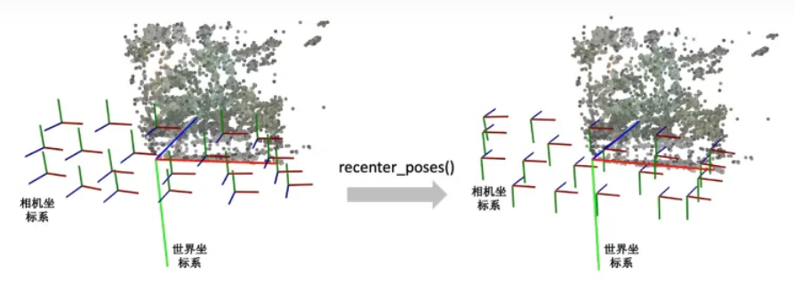
</div>
<div align=center>图6. recenter_poses()函数图例</div>

render_path_spiral()函数生成一段螺旋式的相机轨迹，相机绕着一个轴旋转，其中相机始终注视着一个焦点，相机的up轴保持不变。

```python
def render_path_spiral(c2w, up, rads, focal, zdelta, zrate, rots, N):
    render_poses = []
    rads = np.array(list(rads) + [1.])
    hwf = c2w[:,4:5]
    
    for theta in np.linspace(0., 2. * np.pi * rots, N+1)[:-1]:
        c = np.dot(c2w[:3,:4], np.array([np.cos(theta), -np.sin(theta), -np.sin(theta*zrate), 1.]) * rads) 
        z = normalize(c - np.dot(c2w[:3,:4], np.array([0,0,-focal, 1.])))
        render_poses.append(np.concatenate([viewmatrix(z, up, c), hwf], 1))
    return render_poses
```

简单说一下上面的代码：

首先是一个for循环，每一迭代生成一个新的相机位置。c是当前迭代的相机在世界坐标系的位置，np.dot(c2w[:3,:4], np.array([0,0,-focal, 1.])) 是焦点在世界坐标系的位置，z是相机z轴在世界坐标系的朝向。接着使用介绍的 viewmatrix(z, up, c) 构造当前相机的矩阵。

下面这个图可视化了 render_path_spiral()生成的轨迹。

<div align=center>
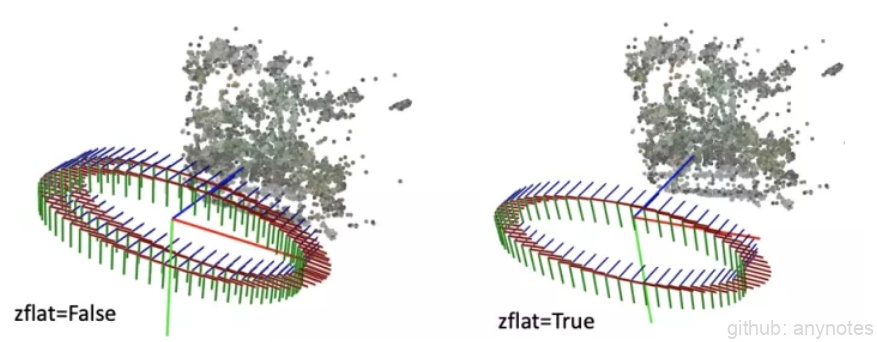
</div>
<div align=center>图7. render_path_spiral()函数图例</div>

spherify_poses()的函数用于对于相机围绕着一个物体拍摄的360度场景,"球面化"相机分布并返回一个环绕的相机轨迹用于新视角合成。
前半部分是在将输入的相机参数进行归一化，后半部分是生成一段相机轨迹用于合成新视角。对输入相机参数进行归一化时，思路是：

用 *pt_mindist = min_line_dist(rays_o, rays_d)* 找到离所有相机中心射线距离之和最短的点（可以先简单理解成场景的中心位置）

```python
    rays_d = poses[:,:3,2:3]
    rays_o = poses[:,:3,3:4]

    def min_line_dist(rays_o, rays_d):
        A_i = np.eye(3) - rays_d * np.transpose(rays_d, [0,2,1])
        b_i = -A_i @ rays_o
        pt_mindist = np.squeeze(-np.linalg.inv((np.transpose(A_i, [0,2,1]) @ A_i).mean(0)) @ (b_i).mean(0))
        return pt_mindist

    pt_mindist = min_line_dist(rays_o, rays_d)
```
    
将得到的场景中心位置移到世界坐标系的原点，同时将所有相机z轴的平均方向转到和世界坐标系的z轴相同

```python
    center = pt_mindist
    up = (poses[:,:3,3] - center).mean(0)

    vec0 = normalize(up)
    vec1 = normalize(np.cross([.1,.2,.3], vec0))
    vec2 = normalize(np.cross(vec0, vec1))
    pos = center
    c2w = np.stack([vec1, vec2, vec0, pos], 1)

    poses_reset = np.linalg.inv(p34_to_44(c2w[None])) @ p34_to_44(poses[:,:3,:4])
```
    
最后将相机的位置缩放到单位圆内

```python
    rad = np.sqrt(np.mean(np.sum(np.square(poses_reset[:,:3,3]), -1)))
    sc = 1./rad
    poses_reset[:,:3,3] *= sc
```

下面这个图可视化了spherify_poses()返回的结果。
<div align=center>
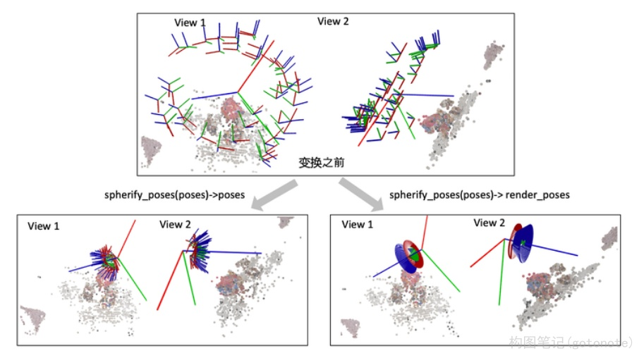
</div>
<div align=center>图8. spherify_poses()函数图例</div>

最后我们看一下这个射线是怎么构造的。给定一张图像的一个像素点，我们的目标是构造以相机中心为起始点，经过相机中心和像素点的射线。

首先，明确两件事：

一条射线包括一个起始点和一个方向，起点的话就是相机中心。对于射线方向，我们都知道两点确定一条直线，所以除了相机中心我们还需另一个点，而这个点就是成像平面的像素点。
NeRF代码是在相机坐标系下构建射线，然后再通过camera-to-world (c2w)矩阵将射线变换到世界坐标系。
通过上述的讨论，我们第一步是要先写出相机中心和像素点在相机坐标系的3D坐标。下面我们以OpenCV/Colmap的相机坐标系为例介绍。相机中心的坐标很明显就是[0,0,0]了。像素点的坐标可能复杂一点：首先3D像素点的x和y坐标是2D的图像坐标 (i, j)减去光心坐标 (cx,cy)，然后z坐标其实就是焦距f (因为图像平面距离相机中心的距离就是焦距f)。

所以我们就可以得到射线的方向向量是
$$
(i-c_x, j-c_y, f) - (0,0,0) = (i-c_x, j-c_y, f)
$$


因为是向量，我们可以把整个向量除以焦距f归一化z坐标，得到

$$
(\frac{i-c_x}{f}, \frac{j-c_y}{f},1)
$$

接着只需要用c2w矩阵把相机坐标系下的相机中心和射线方向变换到世界坐标系就搞定了。
<div align=center>
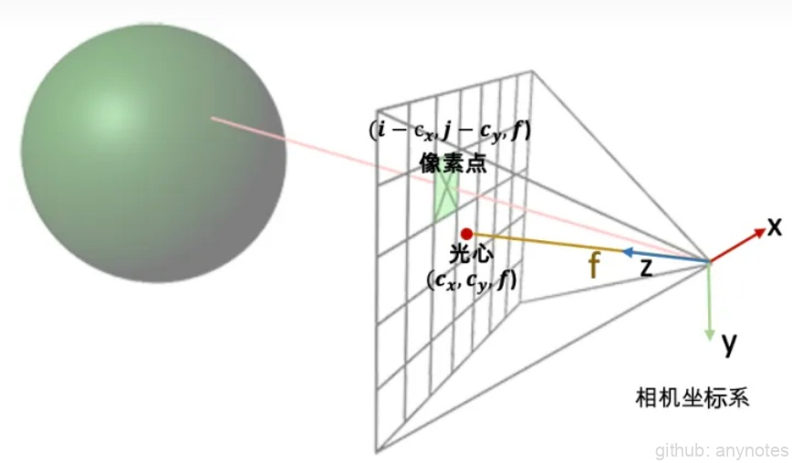
</div>
<div align=center>图9. OpenCV/Colmap相机坐标系下射线的构造示意图</div>

下面是NeRF的实现代码。

```python
def get_rays_np(H, W, K, c2w):
    i, j = np.meshgrid(np.arange(W, dtype=np.float32), np.arange(H, dtype=np.float32), indexing='xy')
    dirs = np.stack([(i-K[0][2])/K[0][0], -(j-K[1][2])/K[1][1], -np.ones_like(i)], -1) 
    # Rotate ray directions from camera frame to the world frame
    rays_d = np.sum(dirs[..., np.newaxis, :] * c2w[:3,:3], -1)  
    # dot product, equals to: [c2w.dot(dir) for dir in dirs]
    # Translate camera frame's origin to the world frame. It is the origin of all rays.
    rays_o = np.broadcast_to(c2w[:3,-1], np.shape(rays_d))
    return rays_o, rays_d
```

因为OpenCV/Colmap的相机坐标系里相机的Up/Y朝下, 相机光心朝向+Z轴，而NeRF/OpenGL相机坐标系里相机的Up/朝上，相机光心朝向-Z轴，所以这里代码在方向向量dir的第二和第三项乘了个负号。

<div align=center>
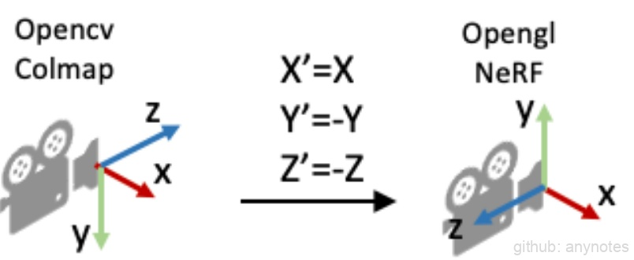
</div>
<div align=center>图10. 坐标转换</div>

NeRF方法生产生图像时，每个像素都需要近200次MLP深度模型的前向预测。尽管单次计算规模不大，但逐像素计算完成整幅图像渲染的计算量还是很可观的。其次，NeRF针对每个场景需要进行训练的时间也很慢。
针对推理时间慢的问题研究较多，例如AutoInt[<sup>2</sup>](#refer-anchor)、FastNeRF[<sup>3</sup>](#refer-anchor)等

<div align=center>
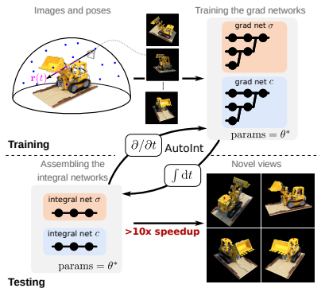
</div>
<div align=center>图11. AutoInt</div>

## 三、NeRF 存在的问题

### （一）速度慢

针对训练时间慢的问题，Depth-supervised NeRF[<sup>4</sup>](#refer-anchor)使用SFM的稀疏输出监督NeRF，能够实现更少的视角输入和更快的训练速度。

<div align=center>
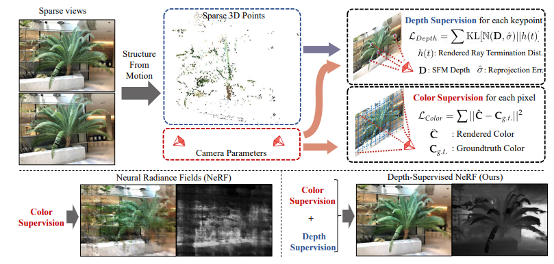
</div>
<div align=center>图12. Depth-supervised NeRF</div>

### （二）仅考虑静态场景

NeRF方法只考虑了静态场景，无法拓展到动态场景。这一问题主要和单目视频做结合，从单目视频中学习场景的隐式表示。Neural Scene Flow Fields[<sup>5</sup>](#refer-anchor)将动态场景建模为外观、几何体和三维场景运动的时变连续函数。该方法只需要一个已知摄像机姿势的单目视频作为输入。

<div align=center>
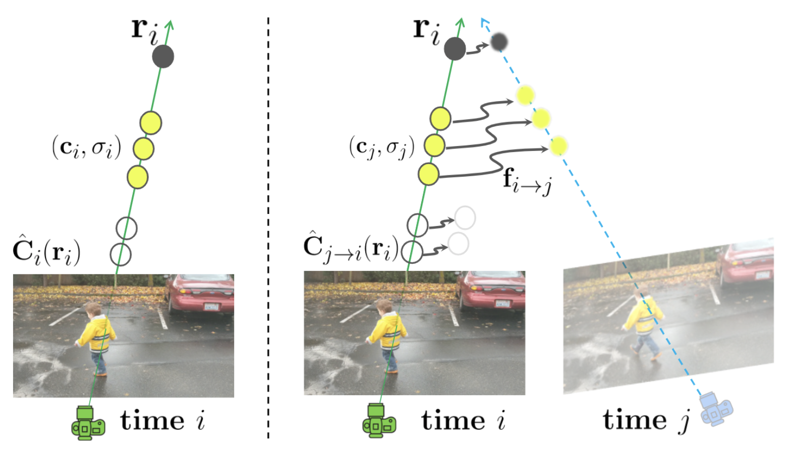
</div>
<div align=center>图13. Neural Scene Flow Fields</div>

### （三）泛化性不足

NeRF方法针对一个新的场景需要重新训练，无法直接扩展到没有见过的场景，这显然与人们追求泛化性的目标相违背。因此一些文章开始对NeRF进行泛化性的改进。GRF[<sup>6</sup>](#refer-anchor)学习2D图像中每个像素的局部特征，然后将这些特征投影到3D点，从而产生通用和丰富的点表示。与之类似的还有IBRnet、pixelNeRF[<sup>7</sup>](#refer-anchor)等，比较核心的想法都是卷积与NeRF相结合。

<div align=center>
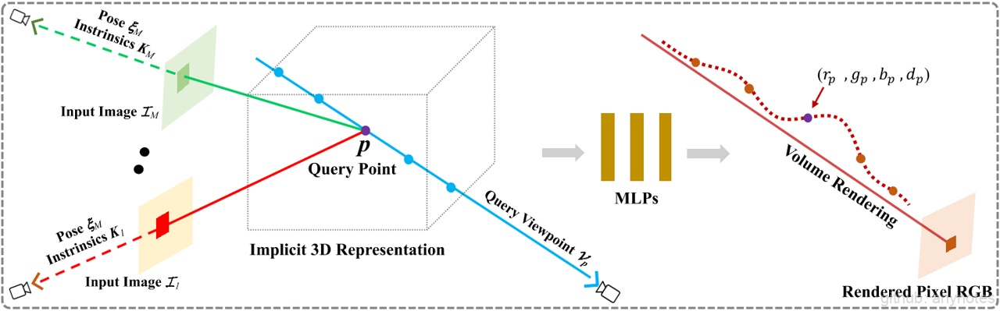
</div>
<div align=center>图14. GRF</div>

## （四）需要大量视角图

尽管NeRF方法能够实现出色的视角合成效果，但是它需要大量的（数百张）视角来进行训练，这限制了它在现实中的应用。pixelNeRF和GRF想法类似，使用一个CNN Encoder提出图像特征，从而使得3D点具有泛化性，并且支持少量输入。pixelNeRF能够支持一张图像输入。

<div align=center>
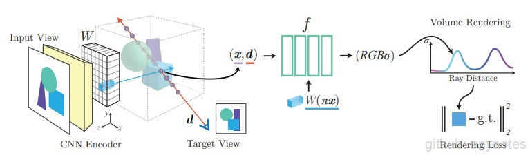
</div>
<div align=center>图15. pixelNeRF</div>

## （五）其他

还有一些工作对NeRF框架进行了改进，其中比较具有实质性突破的是Mip-NeRF。Mip-NeRF[<sup>8</sup>](#refer-anchor)提出了一种基于视锥的采样策略，实现基于NeRF的抗锯齿。Mip-NeRF减少了令人不快的混叠伪影，并显著提高了NeRF表示精细细节的能力，同时比NeRF快7%，大小为NeRF的一半。
<div align=center>

</div>
<div align=center>图16. Mip-NeRF</div>

## 四、NeRF 相关应用

### （一）逆渲染

从真实数据中估计不同模型参数（相机、几何体、材质、灯光参数）的过程称为反向渲染，其目的是生成新视图、编辑材质或照明，或创建新动画。这里简要介绍三种比较重要的逆渲染任务：

1. 几何与代理几何：NerfingMVS[<sup>9</sup>](#refer-anchor)用SfM估计的稀疏深度来监督单目深度估计网络，调整其尺度，然后再输入NeRF网络中实现视角一致性。

2. 照明：NeRV[<sup>10</sup>](#refer-anchor)以一组由无约束已知光照照亮的场景图像作为输入，并生成一个可以在任意光照条件下从新视点渲染的三维表示。

3. 相机（位姿估计）：Self-Calibrating[<sup>11</sup>](#refer-anchor)在没有任何校准对象的情况下，共同学习场景的几何结构和精确的相机参数，提出了一张适用于具有任意非线性畸变的普通摄像机的摄像机自标定算法。

### （二）可控编辑

虽然NeRF提供了对场景合理的表示，但是它并不允许人们对形状、外观进行编辑。对场景表示进行可控的编辑，是NeRF发展的一个重要方向。编辑的方向主要包括：形状、外观、场景组合。可控编辑一直是计算机视觉的重中之重，NeRF在这方面的发展可以单独作为一个分支来阐述，主要发展从EidtNeRF[<sup>12</sup>](#refer-anchor)，GRAF[<sup>13</sup>](#refer-anchor)到GIRAFFE (CVPR2021 Best Paper)。这些方法主要通过GAN和NeRF结合，实现了可控的编辑。

### （三）数字化人体

数字化人体是立体视觉中的一个重要领域。NeRF跟其他3D场景表征一样，也被应用于对人体进行建模。数字化人体主要包括：1、脸部建模；2、人体建模；3、手部建模等等。

1. 脸部建模：
   
   4D Facial Avatar[<sup>14</sup>](#refer-anchor)将3DMM和NeRF结合，实现了一个动态神经辐射场。输入一个单目视频，该方法能够实现人脸的位姿、表情编辑。
    <div align=center>
    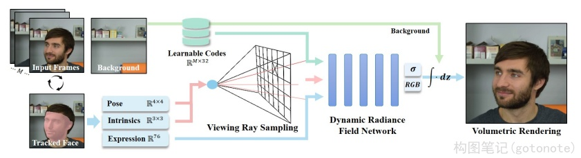
    </div>
    <div align=center>图17. 4D Facial Avatar</div>

2. 人体建模：

    Animatable[<sup>15</sup>](#refer-anchor)引入神经混合权重场来产生变形场，实现了人体建模。需要输入多视角视频。
    <div align=center>
    
    </div>
    <div align=center>图18. Animatable</div>

### （四）多模态

目前基于NeRF的扩展工作，大部分使用的是图像、单目视频作为输入。探索其他模态如文字、音频等与图像的结合，能够催生惊艳的应用效果。CLIP-NeRF[<sup>16</sup>](#refer-anchor)将CLIP和NeRF结合，实现了通过文字和图像编辑场景。

<div align=center>

</div>
<div align=center>图19. CLIP-NeRF</div>

### （五）图像处理

NeRF作为一种隐式表示，为传统的图像处理方法提供了一种新思路，即从隐式神经表示，或者神经场的角度来处理图像。这里的图像处理方法包括：压缩、去噪、超分、inpainting 等。目前已经有一些文章在视频压缩、去噪，图像超分等领域进行了尝试，但是对其他领域比如增强、恢复、去模糊等还没有比较完备的讨论，这一个领域可能是后面的一个方向。Neural Knitworks[<sup>17</sup>](#refer-anchor) 提出了一种用于自然图像神经隐式表示学习的体系结构，它通过以对抗的方式优化图像补丁的分布，并通过增强补丁预测之间的一致性来实现图像合成。

<div align=center>
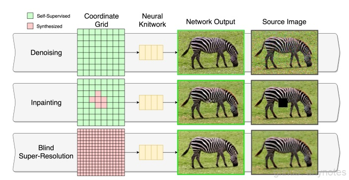
</div>
<div align=center>图20. Neural Knitworks</div>

### （六）视频处理

在之前的章节中，我们已经见过一些NeRF与视频的互动，但是他们主要关注Video for NeRF，即主要重点在于基于视频输入的NeRF。还有一些方法关注NeRF for Video，比如使用神经场的方法来进行视频压缩、视频编辑。这些方法证明了单目视频与NeRF或者神经场方法结合会是一个重要方向。Layered Neural Atlases[<sup>18</sup>](#refer-anchor) 提出了一种将输入视频分解并“展开”为一组分层2D地图集的方法，每个地图集都提供了视频上对象（或背景）外观的统一表示。该文章能够用一组参数来存储视频，能够实现令人惊艳的编辑效果。
<div align=center>
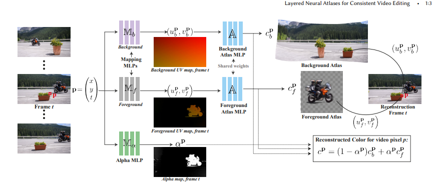
</div>
<div align=center>图21.Layered Neural Atlases</div>

### （七）特殊领域
除了之前列举的一些视觉和图形学领域的工作外，NeRF和神经场在一些特殊领域也有用武之地。这些特殊领域包括：1、机器人；2、医疗成像；3、偏微分方程求解。这里主要展示了医疗成像的一些应用。
在医疗成像中，如CT和MRI，传感器探测的数据是人不可读的，需要经过离散采样并重建成体数据(3D)或者切片(2D)供人类观看。如果能够减少采样率，则可以减少CT和MRI的时间。NeRP[<sup>19</sup>](#refer-anchor)提出一种在稀疏采样下进行神经场重建的框架，并证明可以推广到医疗图像中。
<div align=center>
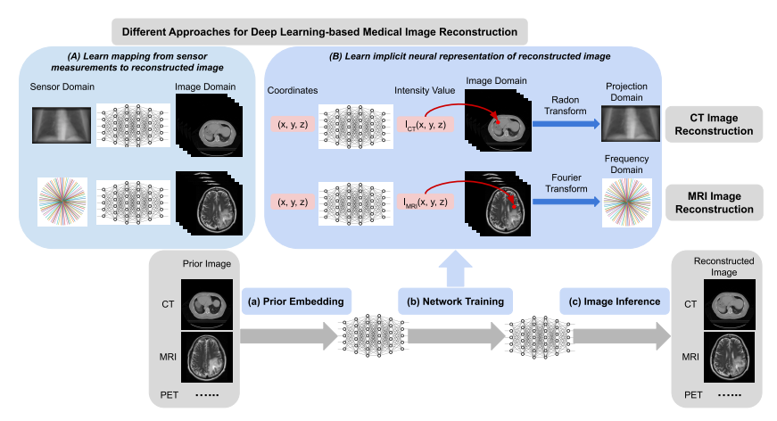
</div>
<div align=center>图22. NeRP</div>

### （八）自动驾驶

由于交通场景感知的复杂性，自动驾驶需要快速、输入数据少，以及需要在无边界场景中进行高精度深度估计的可泛化NeRF:
|    |    |    |
| :- | :- | :- |
|    |  自动驾驶场景特点  |  原始NeRF缺陷  |
|  快速  |  实时感知和决策  |  训练和渲染时间长  |
|  输入数据少  |  视角受限且稀疏  |  需要围绕重建目标的稠密视角的图像  |
|  无边界场景  |  数据沿行驶路径分布  |  基于NeRF的SLAM方法尚不成熟  |
|  深度估计  |  实时感知和决策  |  重建出模型后才能估计深度  |
|  可泛化  |  大部分是没见过的场景  |  一个模型只能储存一个场景  |
|    |    |    |
		

为了解决上述问题，目前的研究现状主要围绕着大尺度无边界场景重建和单目重建+新视角合成两个方向进行。CLONeR[<sup>20</sup>](#refer-anchor)将场景几何与颜色解耦，用两个MLP分开建模，分别用雷达和相机数据进行训练，并建立可微3D占用网格地图用于指导射线采样，相较于原版粗糙均匀采样效果更好；URF[<sup>21</sup>](#refer-anchor)对每张图像的曝光进行编码，用可学习的神经网络将编码转换为颜色仿射变换以避免不同曝光的干扰，并用圆拱形结构建模天空；S-NeRF[<sup>22</sup>](#refer-anchor)用3D目标检测获取车辆位姿，将相机位姿变换到以目标车辆为中心的坐标系下，对车辆重建粗糙网格以监督NeRF训练；Block-NeRF[<sup>23</sup>](#refer-anchor)将场景分解为单独的NeRF进行单独训练，让渲染能够拓展到任意大的场景，而且允许场景中的每个区块单独更新；Switch-NeRF[<sup>24</sup>](#refer-anchor)提出一个端到端的稀疏神经网络结构，能共同学习场景分解和NeRF重建；SceneRF[<sup>25</sup>](#refer-anchor)用概率射线采样策略进行更有效的采样，并显式使用重投影误差来优化估计深度。然而，NeRF在自动驾驶的应用目前仅停留在深度估计和环境重建上面，期待后续有更加创新的工作出现。

此外，世界上第一个开源的NeRF自动驾驶仿真器MARS[<sup>26</sup>](#refer-anchor)也于2023年8月出现，可以以实例感知的方式编辑场景，由一个背景节点和多个前景节点组成，实现了复杂动态场景的建模。在未来，NeRF将会和自动驾驶联系更加紧密，有可能真正进入到自动驾驶的核心系统当中。


<div id="refer-anchor"></div>

## 参考文献

[1] NeRF: Representing Scenes as Neural Radiance Fields for View Synthesis,2020 

[2] Lindell D B, Martel J N P, Wetzstein G. Autoint: Automatic integration for fast neural volume rendering[C]//Proceedings of the IEEE/CVF Conference on Computer Vision and Pattern Recognition. 2021: 14556-14565.

[3] Garbin S J, Kowalski M, Johnson M, et al. Fastnerf: High-fidelity neural rendering at 200fps[C]//Proceedings of the IEEE/CVF International Conference on Computer Vision. 2021: 14346-14355.

[4] Deng K, Liu A, Zhu J Y, et al. Depth-supervised nerf: Fewer views and faster training for free[J]. arXiv preprint arXiv:2107.02791, 2021.

[5]LI Z, NIKLAUS S, SNAVELY N, et al. Neural Scene Flow Fields for Space-Time View Synthesis of Dynamic Scenes[C/OL]//2021 IEEE/CVF Conference on Computer Vision and Pattern Recognition (CVPR), Nashville, TN, USA. 2021. 

[6] TREVITHICK A, YANG B. GRF: Learning a General Radiance Field for 3D Representation and Rendering[C/OL]//2021 IEEE/CVF International Conference on Computer Vision (ICCV), Montreal, QC, Canada. 2021.

[7] Yu A, Ye V, Tancik M, et al. pixelnerf: Neural radiance fields from one or few images[C]//Proceedings of the IEEE/CVF Conference on Computer Vision and Pattern Recognition. 2021: 4578-4587.

[8] DEY A, AHMINE Y, COMPORT AndrewI. Mip-NeRF RGB-D: Depth Assisted Fast Neural Radiance Fields[J]. 2022.

[9] Wei Y, Liu S, Rao Y, et al. Nerfingmvs: Guided optimization of neural radiance fields for indoor multi-view stereo[C]//Proceedings of the IEEE/CVF International Conference on Computer Vision. 2021: 5610-5619.

[10] Srinivasan P P, Deng B, Zhang X, et al. Nerv: Neural reflectance and visibility fields for relighting and view synthesis[C]//Proceedings of the IEEE/CVF Conference on Computer Vision and Pattern Recognition. 2021: 7495-7504.

[11] Jeong Y, Ahn S, Choy C, et al. Self-calibrating neural radiance fields[C]//Proceedings of the IEEE/CVF International Conference on Computer Vision. 2021: 5846-5854.

[12] Liu S, Zhang X, Zhang Z, et al. Editing conditional radiance fields[C]//Proceedings of the IEEE/CVF International Conference on Computer Vision. 2021: 5773-5783.

[13] Schwarz K, Liao Y, Niemeyer M, et al. Graf: Generative radiance fields for 3d-aware image synthesis[J]. Advances in Neural Information Processing Systems, 2020, 33: 20154-20166.

[14] Gafni G, Thies J, Zollhofer M, et al. Dynamic neural radiance fields for monocular 4d facial avatar reconstruction[C]//Proceedings of the IEEE/CVF Conference on Computer Vision and Pattern Recognition. 2021: 8649-8658.

[15] Peng S, Dong J, Wang Q, et al. Animatable neural radiance fields for modeling dynamic human bodies[C]//Proceedings of the IEEE/CVF International Conference on Computer Vision. 2021: 14314-14323.

[16] Wang C, Chai M, He M, et al. CLIP-NeRF: Text-and-Image Driven Manipulation of Neural Radiance Fields[J]. arXiv preprint arXiv:2112.05139, 2021.

[17] Czerkawski M, Cardona J, Atkinson R, et al. Neural Knitworks: Patched Neural Implicit Representation Networks[J]. arXiv preprint arXiv:2109.14406, 2021.

[18] Kasten Y, Ofri D, Wang O, et al. Layered neural atlases for consistent video editing[J]. ACM Transactions on Graphics (TOG), 2021, 40(6): 1-12.

[19] Shen L, Pauly J, Xing L. NeRP: Implicit Neural Representation Learning with Prior Embedding for Sparsely Sampled Image Reconstruction[J]. arXiv preprint arXiv:2108.10991, 2021.

[20] CLONeR: Camera-Lidar Fusion for Occupancy Grid-aided Neural Representations, 2022

[21] Urban Radiance Fields, CVPR 2022

[22] S-NeRF: Neural Radiance Fields for Street, ICLR 2023

[23] Block-NeRF: Scalable Large Scene Neural View Synthesis, CVPR 2022

[24] Switch-NeRF: Learning Scene Decomposition with Mixture of experts for Large-sacle Neural Radiance Fields, ICLR 2023

[25] SceneRF: Self-Supervised Monocular 3D Scene Reconstruction with Radiance Fields, 2023

[26] MARS: An Instance-aware, Modular and Realistic Simulator for Autonomous Driving,2023

