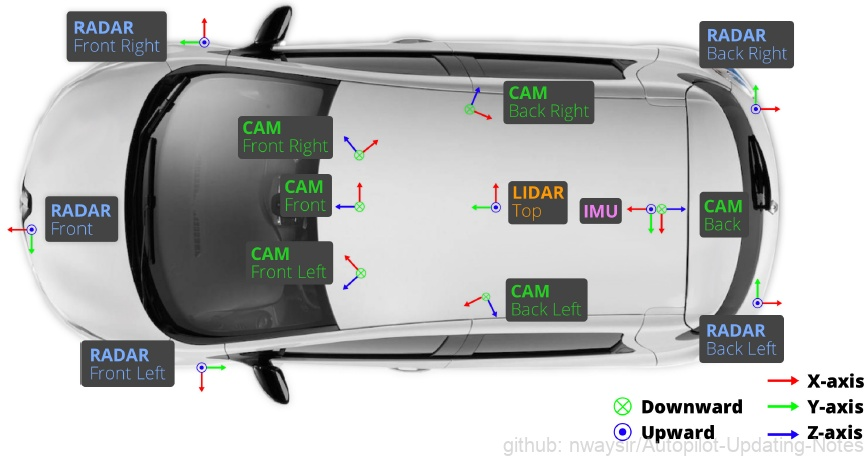
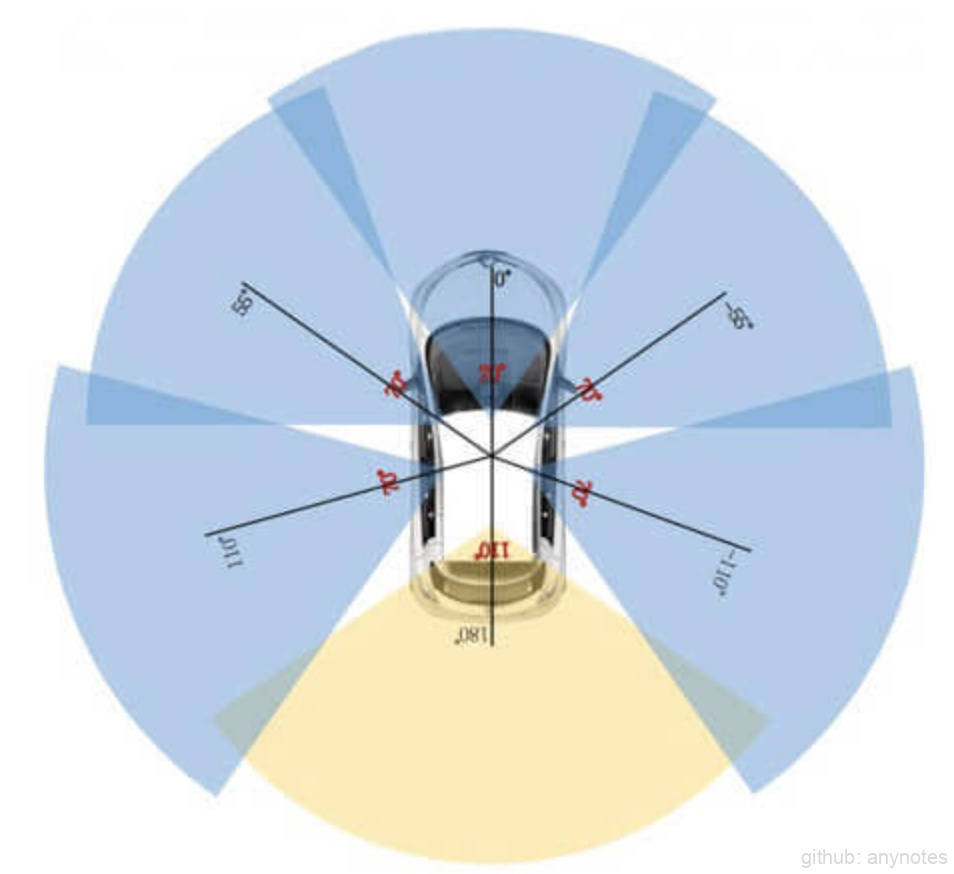
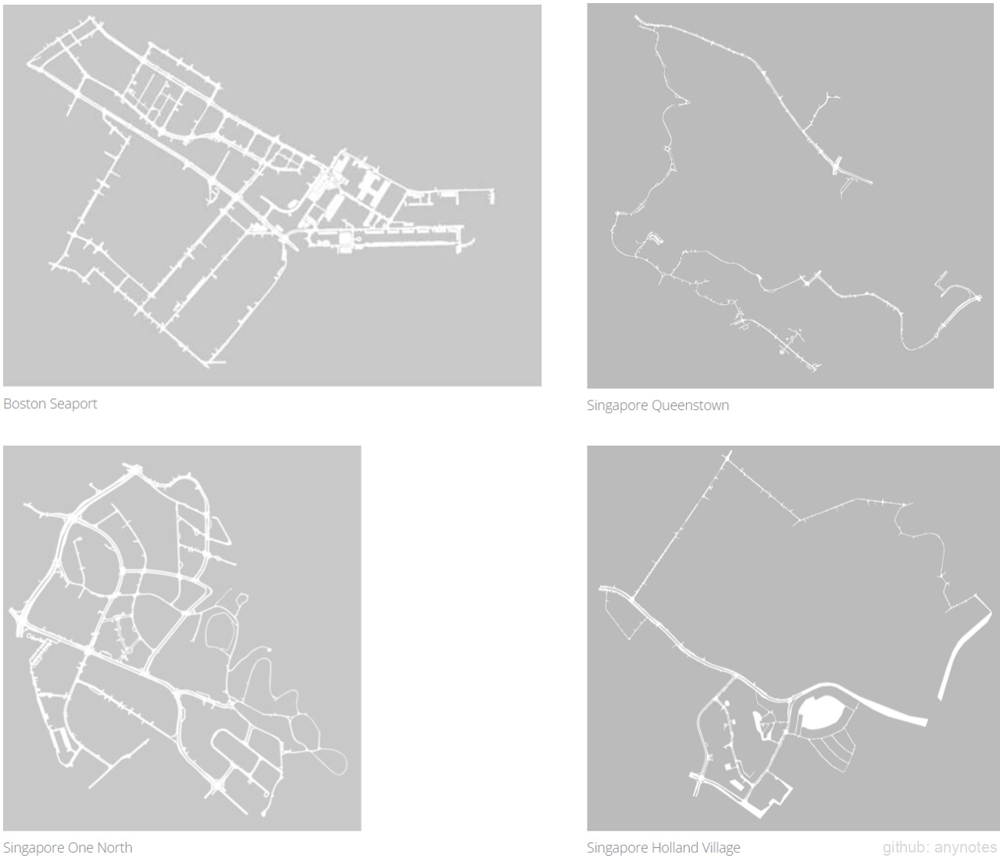
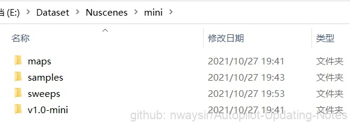
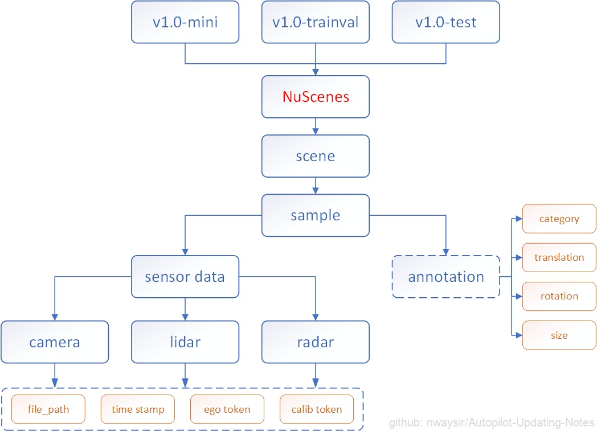
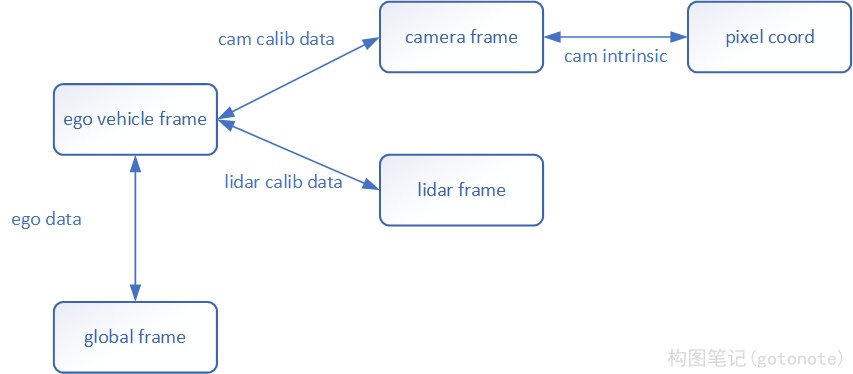
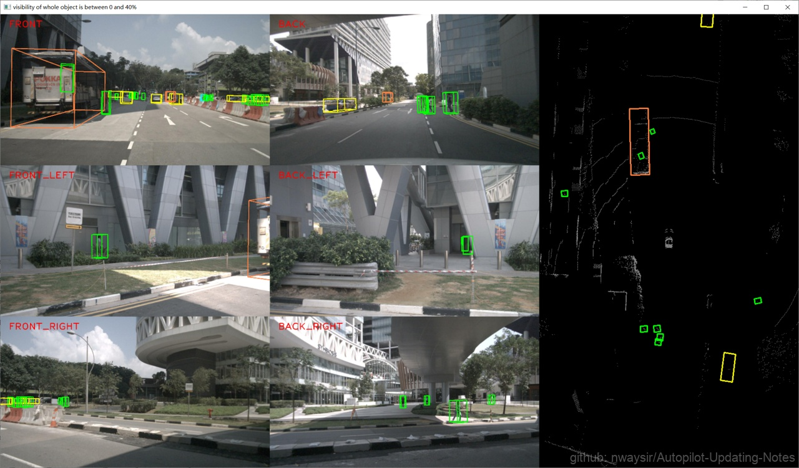
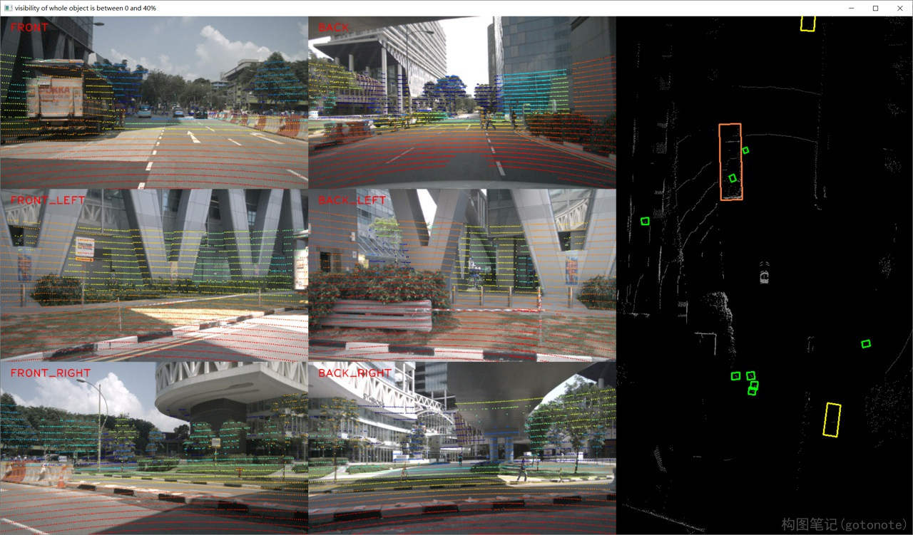

# nuScenes

本文主要介绍 nuScenes 数据集，以及其对应工具包nuscenes-devkit。本文根据官网说明、论文以及工具包源码整理归纳得到，对其他博客未提及的数据集结构、坐标系转换、传感器同步等问题进行了详细分析。

## 一、 简介

### （一）传感器配置

nuScenes的数据采集车辆为Renault Zoe迷你电动车，配备6个周视相机，5个毫米波雷达，具备360°的视野感知能力。具体传感器信息即分布见下面的图表。

| 传感器类型 | 详细信息  |
|  ----  | ----  |
| 相机  | 6台彩色相机，1600×900的分辨率，采用JPEG格式压缩，采样频率为12Hz |
| 激光雷达  | 1台32线旋转式激光雷达，20Hz采样频率，360°水平FOV，-30°-10°的垂直FOV，探测距离70m，探测精度2cm，每秒140万点云 |
| 毫米波雷达 | 5个77GHz的毫米波雷达，FMCW调频，13Hz采样频率，探测距离250m，速度精度±0.1km/h |
| GPS和IMU | 20mm的RTK定位精度，1000Hz采样频率 |

<div align=center>
 
 
</div>
<div align=center>图1. 传感器配置 </div>

### （二） 数据采集

nuScenes数据集使用了两辆传感器配置相同的雷诺电动车进行采集，采集地点为波士顿和新加坡，这两个城市以交通密集和驾驶场景复杂闻名。整个数据集包含了由人工挑选的84段log，时长约15小时，距离约242km，平均车速16km/h。数据场景覆盖了城市、住宅区、郊区、工业区各个场景，也涵盖了白天、黑夜、晴天、雨天、多云等不同时段不同天气状况。最终数据集分为1000个片段，每个片段约20s。

<div align=center>
 
</div>
<div align=center>图3. 数据采集俯视图 </div>

### （三） 传感器同步和数据标注

nuScenes和KITTI一样，也是采用激光来控制相机的曝光时刻，不过nuScenes有6个覆盖360°视野的相机。

在nuScenes中，图像的时间戳表示相机开始曝光的时刻，激光的时间戳表示激光扫描一圈结束的时刻。当车顶激光的线束扫描到相机FOV中心区域时，便会给对应相机一个曝光信号，激光扫描一圈会触发6次相机曝光。

训练集覆盖850个场景共34149帧数据。统计结果及含义如下所示：

``` shell
Total Scene  Num: 850
Total Sample Num: 34149
[ expo_time_bet_adj_cams] Avg:    8.52ms  2STD:    8.53ms
[max_delta_time_bet_cams] Avg:   42.61ms  2STD:   42.67ms
[       cam_refresh_time] Avg:  498.93ms  2STD:  503.95ms
[     lidar_refresh_time] Avg:  498.93ms  2STD:  503.97ms
[   delta_lidar_cam_time] Avg:    0.99ms  2STD:    2.37ms
```

--------
| 统计结果 | 含义  |
|  ----  | ----  |
| expo_time_bet_adj_cams  | 相邻两个相机曝光时间差，平均8.5ms，6个相机正好50ms，符合激光的扫描频率，侧面证明了每一圈激光会触发6次相机曝光 |
| max_delta_time_bet_cams  | 6个周视相机依次曝光时刻的最大时间间隔，平均42ms，这意味着在相对40km/h相对速度下，第一个开始曝光的左前方相机和最后一个曝光的左后方相机，对同一个物体的观测距离会相差接近半米 |
| cam_refresh_time | 相机采样间隔，平均500ms，对应2Hz的关键帧采样频率 |
| lidar_refresh_time | 激光采样间隔，平均500ms，对应2Hz的关键帧采样频率 |
| delta_lidar_cam_time | 激光时间戳和左后方相机曝光时刻的差值，均值仅1ms，说明激光扫描是从左后方相机附近位置开始的 |
--------

### （四） 建图定位

nuScenes的定位数据的生成分为两个阶段，首先采用离线的方式使用激光点云生成高清地图，然后在线采集数据阶段，结合里程计和激光数据，使用蒙特卡洛定位算法进行车辆定位，最终定位误差可以达到10cm以内。

## 二、 下载

### （一）相应链接

1. [[官网] nuScenes](https://www.nuscenes.org/nuscenes?tutorial=nuscenes)
2. [[arXiv] nuScenes: A multimodal dataset for autonomous driving](https://arxiv.org/abs/1903.11027v5)
3. [[GitHub] nuScenes devkit](https://github.com/nutonomy/nuscenes-devkit)

### （二）数据集下载

1. 在[nuScenes](https://www.nuscenes.org/download)官网注册一个账号下载数据集，完整数据集包含3个部分：

    Mini：从训练/验证集抽取10个场景组成，包含完整的原始数据和标注信息，主要用于数据集的熟悉

    TrainVal：训练/验证集，包含850个场景，其中700个训练场景，150个验证场景

    Test：测试集，包含150个场景，不包含标注数据。

2. 下载好的数据集包含4个文件夹：
   
    <div align=center>
     
    </div>
    <div align=center>图4. nuScenes数据集组成 </div>
    <br/>

    maps：地图数据，四张地图对应着4个数据采集地点

    samples：带有标注信息的关键帧数据，训练主要用这部分数据

    sweeps：完整时序数据，不带有标注信息，一般用于跟踪任务

    v1.0-version: 存有数据依赖关系、标注信息、标定参数的各种json文件

### （三）数据集解析

nuScenes官方提供了一个数据集开发工具nuscenes-devkit，封装了数据读取、索引、可视化等常用操作，可以直接使用pip安装：

    pip install nuscenes-devkit

这个工具包用起来还比较方便，具体怎么使用这里就不做过多介绍了，官网有详细的教程。有一点要注意的是，nuScenes解析库要求v1.0-version等4个文件夹在同一级目录，否则会无法解析。

**1. 数据集结构**

在介绍如何使用工具包遍历数据集之前，先对nuScenes数据集结构做一个简单介绍。nuScenes数据集采用关系数据库来管理数据，数据库一共包含13张表，以json文件格式存储在./v1.0-version目录下。

    self.table_names = ['category', 'attribute', 'visibility', 'instance', 'sensor', 'calibrated_sensor','ego_pose', 'log', 'scene', 'sample', 'sample_data', 'sample_annotation', 'map']

在使用工具包获得数据集的句柄nusc后，可以通过nusc.get(table_name, token)函数来快速获取任意表中的任意数据，十分方便快捷。表和表之间的依赖关系图可以去nuScenes官网的Data format标签页中查看，这里我对官网的关系图进行了归纳和精简。

<div align=center>
 
</div>
<div align=center>图5. nuScenes数据关系图 </div>
<br/>

总的来说，nuScenes数据集分为mini、trainval、test三个部分，每个部分的数据结构完全相同，可以分成scene、sample、sample_data三个层级，数据访问通过token（可以理解为指针）来实现：

* scene：是一段约20s的视频片段，由于关键帧采样频率为2Hz，所以每个scene大约包含40个关键帧，可以通过scene中的pre和next来访问上下相邻的sample

* sample：对应着一个关键帧数据，存储了相机、激光雷达、毫米波雷达的token信息，mini和trainval数据集中的sample还存储了标注信息的token

* sample_data：sample中存储的token指向的数据，即我们最终真正关心的信息，比如图片路径、位姿数据、传感器标定结果、标注目标的3d信息等。获取到这些信息就可以开始训练模型了。

**2. 数据集遍历**

nuScenes以关系数据库的方式管理数据，scene、sample、sample_data之间可以通过token非常方便的互相访问。这里分别从scene、sample和annotation为起点对整个数据集进行访问，统计数据集的场景、关键帧、标注目标的数目。

```python

from nuscenes.nuscenes import NuScenes

def get_dataset_info1(nusc):
    scene_num = len(nusc.scene)
    sample_num = 0
    ann_num = 0

    for scene in nusc.scene:
        sample = None
        while True:
            if sample is None:
                sample = nusc.get('sample', scene['first_sample_token'])

            sample_num += 1
            ann_num += len(sample['anns'])

            if sample['next'] != '':
                sample = nusc.get('sample', sample['next'])
            else:
                break

    print('====== Start from scene')
    print('Scene Num: %d\nSample Num: %d\nAnnotation Num: %d' % (scene_num, sample_num, ann_num))


def get_dataset_info2(nusc):
    sample_num = len(nusc.sample)
    ann_num = 0

    scene_tokens = set()
    for sample in nusc.sample:
        ann_num += len(sample['anns'])

        scene = nusc.get('scene', sample['scene_token'])
        scene_tokens.add(scene['token'])
    scene_num = len(scene_tokens)

    print('====== Start from sample')
    print('Scene Num: %d\nSample Num: %d\nAnnotation Num: %d' % (scene_num, sample_num, ann_num))


def get_dataset_info3(nusc):
    ann_num = len(nusc.sample_annotation)

    scene_tokens = set()
    sample_tokens = set()
    for ann in nusc.sample_annotation:
        sample = nusc.get('sample', ann['sample_token'])
        sample_tokens.add(sample['token'])

        scene = nusc.get('scene', sample['scene_token'])
        scene_tokens.add(scene['token'])
    scene_num = len(scene_tokens)
    sample_num = len(sample_tokens)

    print('====== Start from annotation')
    print('Scene Num: %d\nSample Num: %d\nAnnotation Num: %d' % (scene_num, sample_num, ann_num))


if __name__ == '__main__':
	nusc = NuScenes(version='v1.0-mini',
                    dataroot=data_root,
                    verbose=True)
	get_dataset_info1(nusc)
	get_dataset_info2(nusc)
	get_dataset_info3(nusc)
```

运行结果如下，可以看到3种遍历方式的结果完全一致。

```shell
====== Start from scene
Scene Num: 10
Sample Num: 404
Annotation Num: 18538
====== Start from sample
Scene Num: 10
Sample Num: 404
Annotation Num: 18538
====== Start from annotation
Scene Num: 10
Sample Num: 404
Annotation Num: 18538
```

**3. 标注格式及坐标系转换**

目标的标注信息包含如下几个字段：

| 字段名称 | 含义  |
|  ----  | ----  |
| visibility | 目标可见程度，分为0~40%, 40%~60%, 60%~80%, 80%~100%四类，用1-4表示 |
| category_name	| 类别名称，包含10个检测类别 |
| translation | 3D框的中心位置(x,y,z)，单位m，是全局坐标系下的坐标 |
| rotation | 3D框的旋转量，用四元数(w,x,y,z)表示 |
| size | 3D框的尺寸(w,l,h)，单位米 |

表示rotation的四元数可以利用Python包pyquaternion转换成(pitch，yaw，roll)的形式，而且可以计算对应的旋转矩阵和逆矩阵，非常好用。

这里主要说一下nuScenes中的坐标系转换。nuScenes存在四个坐标系：全局坐标系、车身坐标系、相机坐标系和激光坐标系。后面三个比较好理解，都是相对坐标系，目标的位置随本车的运动而变化；而全局坐标系是绝对坐标系，是目标在地图中的绝对坐标，不随本车的运动而变化。标注真值的坐标是全局坐标系下的坐标。各坐标系的转换关系如下图所示，所有转换都必须先转到车身坐标系(ego vehicle frame)，然后再转换到目标坐标系。需要注意的是，由于每张图像的时间戳、激光的时间戳都两两不相同，它们有各自的位姿补偿（ego data），进行坐标系转换的时候需要注意一下。

<div align=center>
 
</div>
<div align=center>图6. 坐标系转换 </div>
<br/>

标注真值(global frame)转换到激光坐标系(lidar frame)：使用位姿补偿转换到车身坐标系，然后再根据激光雷达外参转换到激光坐标系。

```python
# 标注真值到激光坐标系
ann = nusc.get('sample_annotation', token)
calib_data = nusc.get('calibrated_sensor', lidar_data['calibrated_sensor_token'])
ego_data = nusc.get('ego_pose', lidar_data['ego_pose_token'])
# global frame
center = np.array(ann['translation'])
orientation = np.array(ann['rotation'])
# 从global frame转换到ego vehicle frame
quaternion = Quaternion(ego_data['rotation']).inverse
center -= np.array(ego_data['translation'])
center = np.dot(quaternion.rotation_matrix, center)
orientation = quaternion * orientation
# 从ego vehicle frame转换到sensor frame
quaternion = Quaternion(calib_data['rotation']).inverse
center -= np.array(calib_data['translation'])
center = np.dot(quaternion.rotation_matrix, center)
orientation = quaternion * orientation
```
标注真值(global frame)投影到图像(pixel coord)：使用位姿补偿转换到车身坐标系，然后再根据相机外参转换到相机坐标系，最后使用相机内参得到像素坐标系下的坐标。标注真值到车身坐标系的过程和上面类似，不过calib_data和ego_data需要从camera_data中获取，得到标注3D框在相机坐标系下的角点坐标points后，然后再使用相机内参投影至图像。

```python
# 相机坐标系到像素坐标系
calib_data = nusc.get('calibrated_sensor', camera_data['calibrated_sensor_token'])
intrinsic = calib_data['camera_intrinsic']
trans_mat = np.eye(4)
trans_mat[:3, :3] = np.array(intrinsic)
points = obj['box']
points = np.concatenate((points, np.ones((1, points.shape[1]))), axis=0)
points = np.dot(trans_mat, points)[:3, :]
points /= points[2, :]
```
激光真值(lidar frame)投影至图像(pixel coord)就相对麻烦一点，因为图像和激光时间戳不一致，需要多进行一步时间戳的变换。

```python
# step1: lidar frame -> ego frame
calib_data = nusc.get('calibrated_sensor', lidar_file['calibrated_sensor_token'])
rot_matrix = Quaternion(calib_data['rotation']).rotation_matrix
points[:3, :] = np.dot(rot_matrix, points[:3, :])
for i in range(3):
    points[i, :] += calib_data['translation'][i]

# step2: ego frame -> global frame
ego_data = nusc.get('ego_pose', lidar_file['ego_pose_token'])
rot_matrix = Quaternion(ego_data['rotation']).rotation_matrix
points[:3, :] = np.dot(rot_matrix, points[:3, :])
for i in range(3):
    points[i, :] += ego_data['translation'][i]

# step3: global frame -> ego frame
ego_data = nusc.get('ego_pose', camera_data['ego_pose_token'])
for i in range(3):
    points[i, :] -= ego_data['translation'][i]
rot_matrix = Quaternion(ego_data['rotation']).rotation_matrix.T
points[:3, :] = np.dot(rot_matrix, points[:3, :])

# step4: ego frame -> cam frame
calib_data = nusc.get('calibrated_sensor', camera_data['calibrated_sensor_token'])
for i in range(3):
    points[i, :] -= calib_data['translation'][i]
rot_matrix = Quaternion(calib_data['rotation']).rotation_matrix.T
points[:3, :] = np.dot(rot_matrix, points[:3, :])

# step5: cam frame -> uv pixel
visible = points[2, :] > 0.1
colors = get_rgb_by_distance(points[2, :], min_val=0, max_val=50)
intrinsic = calib_data['camera_intrinsic']
trans_mat = np.eye(4)
trans_mat[:3, :3] = np.array(intrinsic)
points = np.concatenate((points[:3, :], np.ones((1, points.shape[1]))), axis=0)
points = np.dot(trans_mat, points)[:3, :]
points /= points[2, :]
points = points[:2, :]
```

**4. 可视化效果**

<div align=center>
 
 
</div>
<div align=center>图7. 可视化效果 </div>
<br/>


