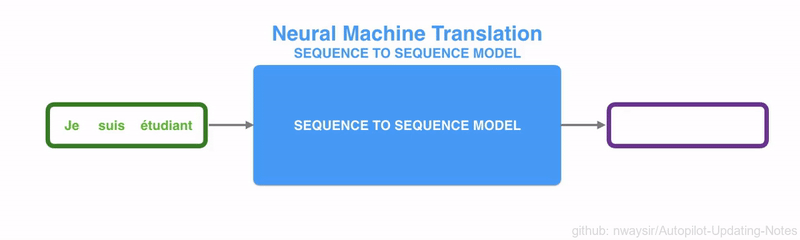

# 1.3 NLP自然语言处理

seq2seq(Sequence to Sequence)是一种输入不定长序列，产生不定长序列的模型，典型的处理任务是机器翻
译，输入一段不定长的源语言文字（如中文），而产生一段不定长的目标语言文字（如英文）。

seq2seq模型通常会选用编码器解码器（Encoder-Decoder）架构，编码器接受不定长输入并产生一定大小的
上下文（Context），再将上下文投喂给解码器，产生不定长的输出。
