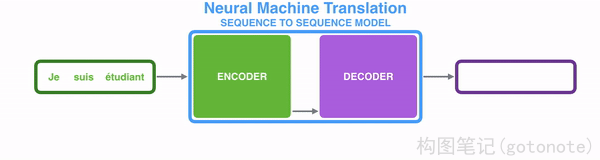
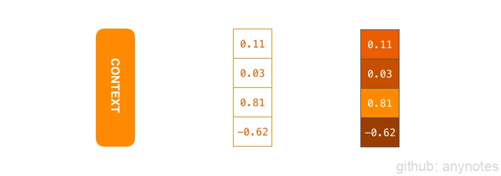
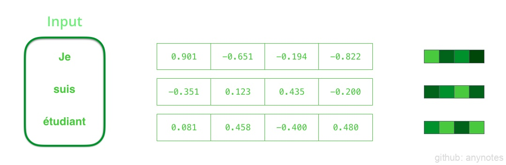
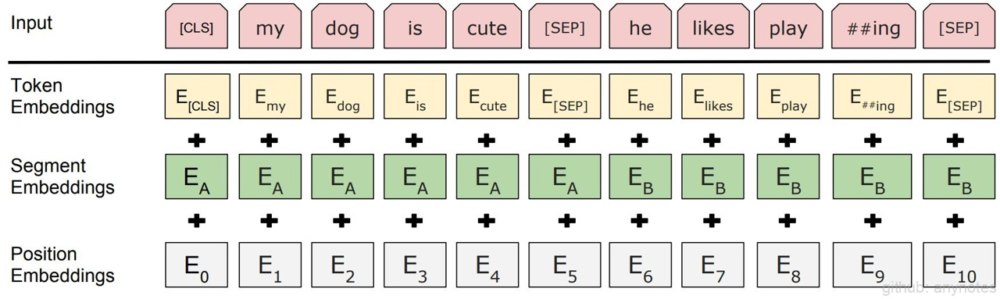
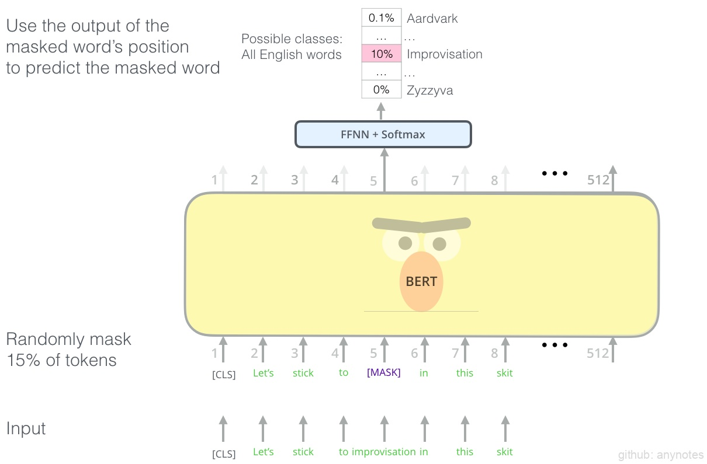
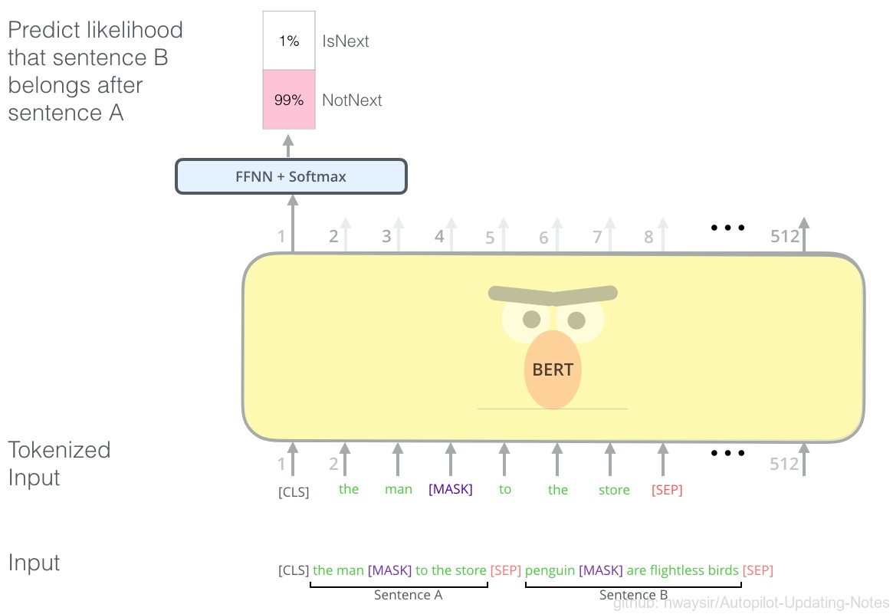
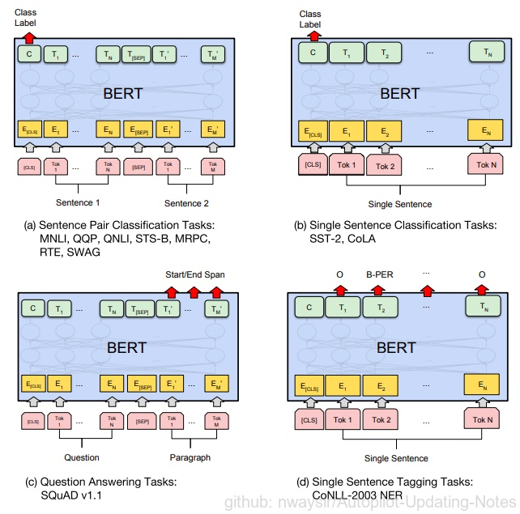

# NLP自然语言处理

## 一、简介

seq2seq(Sequence to Sequence)是一种输入不定长序列，产生不定长序列的模型，典型的处理任务是机器翻译，输入一段不定长的源语言文字（如中文），而产生一段不定长的目标语言文字（如英文）。

seq2seq模型通常会选用编码器解码器（Encoder-Decoder）架构，编码器接受不定长输入并产生一定大小的上下文（Context），再将上下文投喂给解码器，产生不定长的输出。

在机器翻译的情况下，上下文是一个向量（通常是一个数字数组）。编码器和解码器往往都是递归神经网络RNN。如下图，上下文是浮点数的向量，将具有较高值的单元格分配更亮的颜色来可视化颜色的矢量。可以在设置模型时设置上下文向量的大小。通常为编码器RNN中隐藏单元的数量，此处可视化显示大小为 4 的向量，但在实际应用中，上下文向量的大小可能为 256、512 或 1024。

根据设计，RNN 在每个时间步长接受两个输入：一个输入（在编码器的情况下，输入句子中的一个单词）和一个隐藏状态。词向量通常是在一个大型语料库上学习得到的，这样的技术称为词嵌入（Word Embedding）。这些将单词转换为向量空间，以捕获单词的许多含义/语义信息（例如 国王 - 男人 + 女人 = 女王）。

我们需要在处理输入词之前将其转换为向量。该转换是使用词嵌入算法完成的。我们可以使用预先训练的嵌入，也可以在数据集上训练我们自己的嵌入。嵌入大小为 200 或 300 的向量是典型的，为了简单起见，我们展示了大小为 4 的向量。

## 二、BERT

BERT是Bidirectional Encoder Representations from Transformers的简称，该模型用Transformer模块堆叠而成，提出一种用大量未标注数据对模型进行预训练（词预测任务MLM和连续语句判断任务NSP），然后用预训练模型在目标训练集上进行微调。

### （一）输入/输出表示形式

BERT采用WordPiece[1]的表示形式

图5. WordPiece 

WP = TE + SE + PE

- 两个特殊标记
  - [CLS]：起始标记，同时对应的输出向量表示分类结果（Classification）
  - [SEP]：分隔标记（Separate），分隔两个不同的句子

- TE：词编码（词嵌入）
- SE：段编码，指示该单词从属与那个分段（句子）
- PE：位置编码

### （二）预训练任务

用大量未标注的数据集（如维基百科等语料）来构造一系列简单的预训练任务。

### （三）词预测MLM

Masked Language Model(LML)，训练模型token-level的能力，使其能够关注token之间的联系。随机在语料
中挑选15%的单词进行处理，
- 以80%的概率将这些单词替换为[MASK]特殊标记
- 以10%的概率用词表中的随机单词替换这些单词
- 以10%的概率保持不变

图6. 词预测MLM 

### （四）连续语句判断NSP

Next Sentence Prediction(NSP)，训练模型sentence-level的能力，使其能够关注两个语句之间的联系。随机在语料中抽选连续的两个语句，并以50%的概率用随机语句来替代第二个语句，让模型学习判断两个语句是不是
连续的（通常在该任务中能达到97%-98%的准确率）。

图7. 连续语句判断NSP 

### （五）迁移学习

BERT复用预训练模型权重之后，在目标数据集和任务上对所有权重进行微调。常见NLP任务的输入输出形式如
下图所示：

图8. 迁移学习 

**参考文献**

[1] Google’s Neural Machine Translation System: Bridging the Gap between Human and Machine Translation

