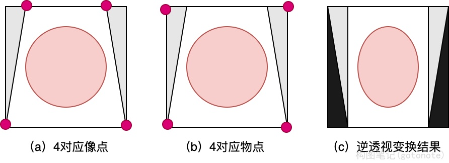
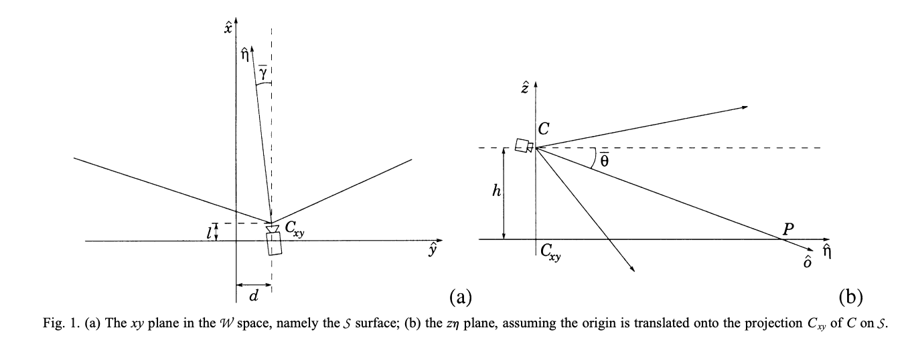
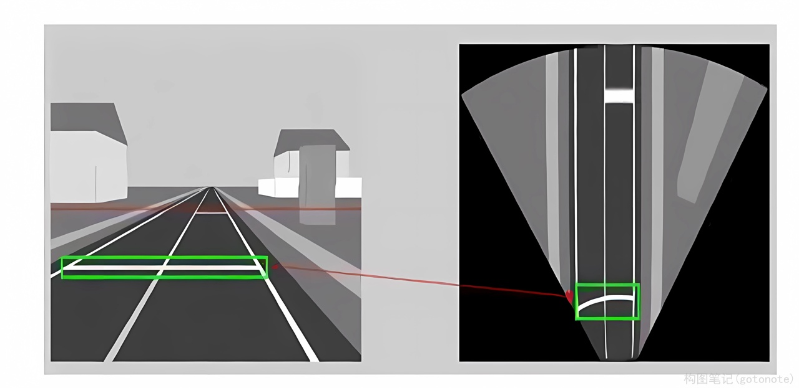
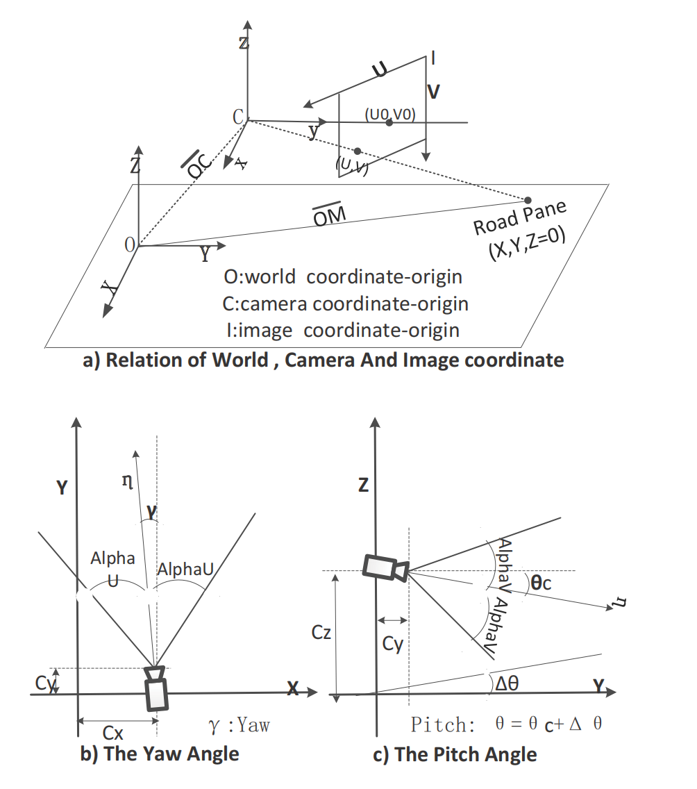
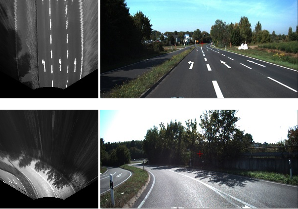
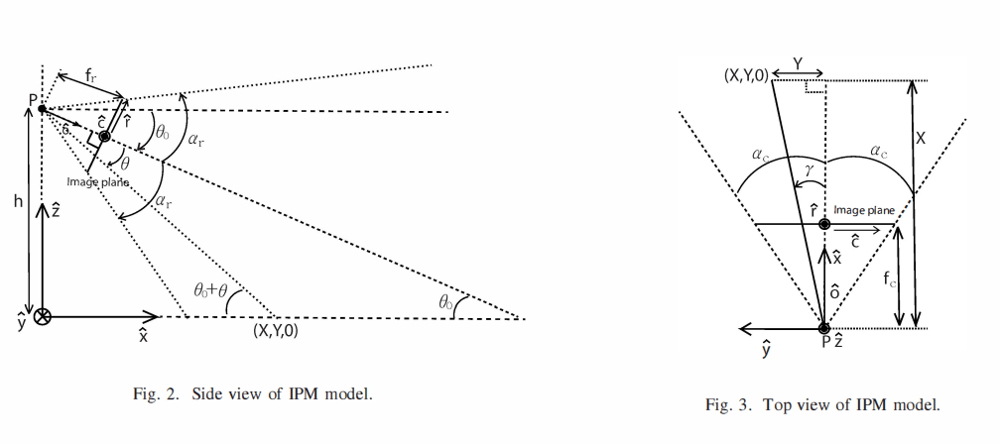
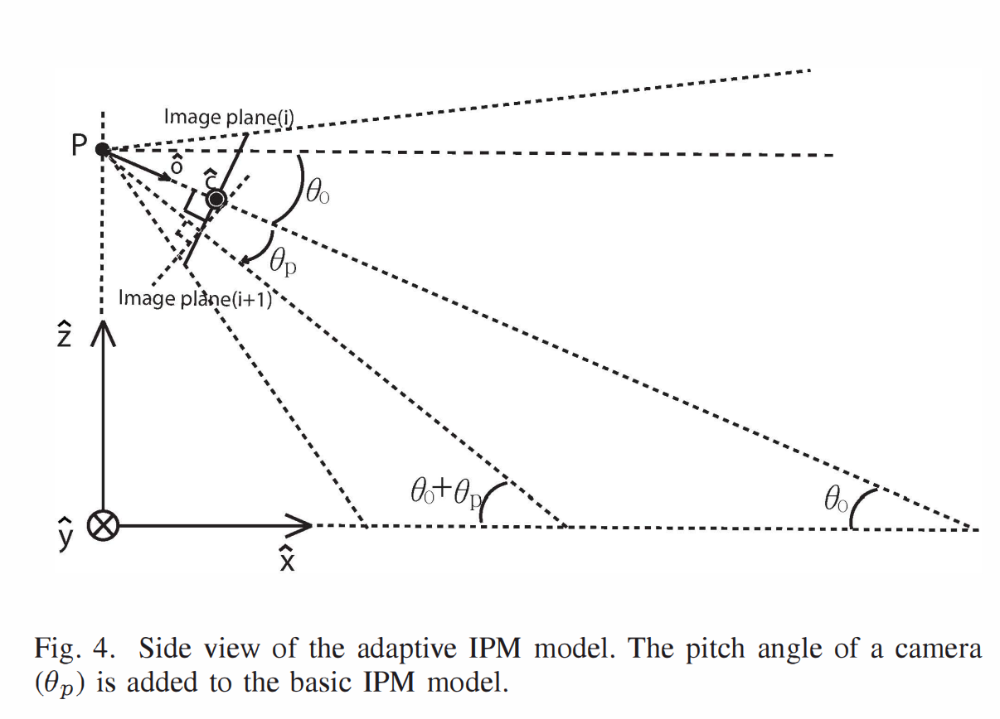
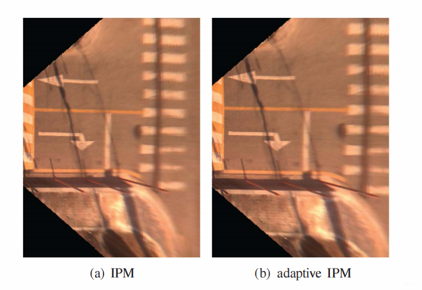
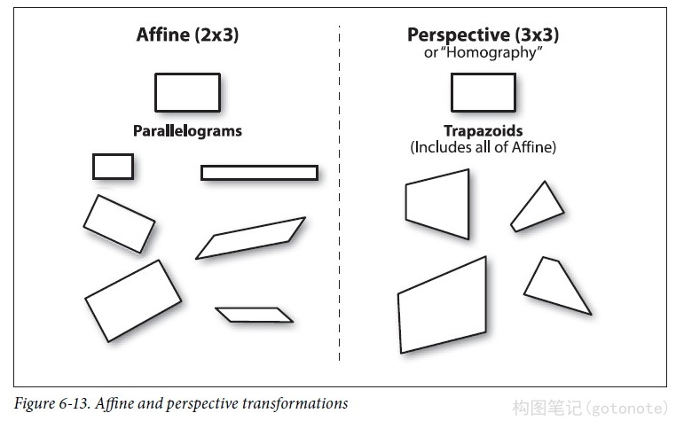

# 逆透视变换IPM

在自动/辅助驾驶中，车道线的检测非常重要。在前视摄像头拍摄的图像中，由于透视效应的存在，本来平行的事物，在图像中确实相交的。而IPM变换就是消除这种透视效应，所以也叫逆透视。

## 一、IPM变换方法

### （一）对应点对单应变换方法

*   输入：至少四个对应点对，不能有三点及以上共线，不需要知道摄相机参数或者平面位置的任何信息。
*   数学原理：利用点对，求解透视变换矩阵，其中map_matrix是一个3×3矩阵，所以可以构建一个线性方程组进行求解。如果大于4个点，可采用 $ransac$ 的方法进行求解，一边具有更好的稳定性。
*   选点方法：一般采取手动选取，或者利用消影点（图像上平行线的交点，也叫消失点，vanish point）选取。
  
$$
\begin{bmatrix} 
t_i x_i' \\ 
t_i y_i' \\ 
t_i \\ 
\end{bmatrix} = 
map\_matrix \cdot
\begin{bmatrix} 
x_i \\
y_i \\ 
1 \\ 
\end{bmatrix}
$$

$$
dst(i) = (x_i', y_i') \\
src(i) = (x_i, y_i) \\
i = 0, 1, 2, 3
$$

<div align=center>

</div>
<div align=center>图1.对应点对单应变换方法 </div>

* 代码实现：代码实现比较简单，可以很容易实现IPM变换
    *   计算变换矩阵： H = getPerspectiveTransform()
    *   获取IPM图像： warpPerspective();   

```CPP
void warpPerspective(Mat src, Mat &dst, Mat T){

    //此处注意计算模型的坐标系与Mat的不同
    //图像以左上点为（0,0），向左为x轴，向下为y轴，所以前期搜索到的特征点 存的格式是（图像x，图像y）---（rows，cols）
    //而Mat矩阵的是向下为x轴，向左为y轴，所以存的方向为（图像y，图像x）----（cols，rows）----（width，height）
    //创建原图的四个顶点的3*4矩阵（此处我的顺序为左上，右上，左下，右下）

    Mat tmp(3, 4, CV_64FC1, 1);
    tmp.at<double>(0, 0) = 0;
    tmp.at<double>(1, 0) = 0;
    tmp.at<double>(0, 1) = src.cols;
    tmp.at<double>(1, 1) = 0;
    tmp.at<double>(0, 2) = 0;
    tmp.at<double>(1, 2) = src.rows;
    tmp.at<double>(0, 3) = src.cols;
    tmp.at<double>(1, 3) = src.rows;

    //获得原图四个顶点变换后的坐标，计算变换后的图像尺寸
    Mat corner = T * tmp;  //corner=(x,y)=(cols,rows)
    int width = 0, height = 0;
    double maxw = corner.at<double>(0, 0) / corner.at<double>(2,0);
    double minw = corner.at<double>(0, 0) / corner.at<double>(2,0);
    double maxh = corner.at<double>(1, 0) / corner.at<double>(2,0);
    double minh = corner.at<double>(1, 0) / corner.at<double>(2,0);

    for (int i = 1; i < 4; i++) {
        maxw = max(maxw, corner.at<double>(0, i) / corner.at<double>(2, i));
        minw = min(minw, corner.at<double>(0, i) / corner.at<double>(2, i));
        maxh = max(maxh, corner.at<double>(1, i) / corner.at<double>(2, i));
        minh = min(minh, corner.at<double>(1, i) / corner.at<double>(2, i));
    }

    //创建向前映射矩阵 map_x, map_y
    //size(height,width)
    dst.create(int(maxh - minh), int(maxw - minw), src.type());
    Mat map_x(dst.size(), CV_32FC1);
    Mat map_y(dst.size(), CV_32FC1);
    Mat proj(3,1, CV_32FC1,1);
    Mat point(3,1, CV_32FC1,1);

    T.convertTo(T, CV_32FC1);  
    //本句是为了令T与point同类型【同类型才可以相乘，否则报错，也可以使用 T.convertTo(T, point.type());】

    Mat Tinv=T.inv();
    for (int i = 0; i < dst.rows; i++) {        
        for (int j = 0; j < dst.cols; j++) {
            point.at<float>(0) = j + minw;
            point.at<float>(1) = i + minh;
            proj = Tinv * point;
            map_x.at<float>(i, j) = proj.at<float>(0) / proj.at<float>(2);
            map_y.at<float>(i, j) = proj.at<float>(1) / proj.at<float>(2);
        }
    }
    remap(src, dst, map_x, map_y, CV_INTER_LINEAR);
}
```

### （二）简化相机模型的逆透视变换

利用相机成像过程当中各种坐标系之间的转换关系，对其基本原理进行抽象和简化，从而得到世界坐标系和图像坐标系之间坐标的对应关系，并对逆透视变换的坐标关系进行公式化描述。这种逆透视变换形式简单，计算速度快，并且适用于复杂道路场景。

**1. Paper：Stereo inverse perspective mapping: theory and applications** [文章地址](http://www.ce.unipr.it/people//bertozzi/pap/cr/pbt.pdf)

<div align=center>

</div>
<div align=center>图2.对应关系 </div>


$$
\left\{
\begin{aligned} 
u(x,y,0)&=\frac{\arctan{\Bigg\lbrace\frac{h\sin\big[\arctan\big(\frac{y-d}{x-l}\big)\big]}{y-d}\Bigg\rbrace}-(\tilde{\theta}-\alpha)}{\frac{2\alpha}{m-1}}\\ 
v(x,y,0)&=\frac{\arctan\big[\frac{y-d}{x-l}\big]-(\tilde{\gamma}-\alpha)}{\frac{2\alpha}{n-1}}\\
\end{aligned}
\right. 
\tag{World to Image} 
$$

$$
\left\{
\begin{aligned} 
x(u,v)&=h\times\cot \left[(\tilde{\theta}-\alpha)+u\frac{2\alpha}{m-1}\right]\\ 
&\times\cos\left[(\tilde{\gamma}-\alpha)+v\frac{2\alpha}{n-1} \right]+l\\
y(u,v)&=h\times\cot\left[(\tilde{\theta}-\alpha)+u\frac{2\alpha}{m-1}\right]\\ 
&\times\sin\left[(\tilde{\gamma}-\alpha)+v\frac{2\alpha}{n-1} \right]+d\\ 
z(u,v)&=0
\end{aligned}
\right. 
\tag{Image to World} 
$$

其中：

$$
\begin{aligned} 
& \alpha:相机一半视场角 \\
& (l,d,h): 相机在世界坐标系下的位置 \\
& \tilde{\gamma} 、\tilde{\theta}：航向角和俯仰角 \\
& m、n: 图像高、宽 \\
\end{aligned}
$$

此方法同时考虑到了上下俯仰角和水平偏航角度的矫正，但是存在水平线弯曲误差，导致图像的水平横线如行道线等，恢复到世界坐标系的道路平面后，会有一定的弯曲。

<div align=center>

</div>
<div align=center>图3.处理过程 </div>

<div align=center>

</div>
<div align=center>图4.处理效果 </div>

**2. Paper：Robust Inverse Perspective Mapping Based on Vanishing Point** [论文地址](https://sci-hub.yt/10.1109/spac.2014.6982733)

*(1) 基于消失点的俯仰角和偏航角计算*

根据射影几何学原理，现实空间中的平行直线组在存在透视形变的情况下将会相交于无穷远点处，而该交点在成像平面上的投影即被称为消失点。当现实世界的平行直线组与成像平面平行时，消失点将位于成像平面的无穷远处；但是当平行直线组与成像平面部存在不平行关系时，消失点将位于成像平面的有限远处，甚至可能出现在图像区域以内。

*(2) 消失点具有一些重要的性质：*

*   真实道路场景中相互平行的车道线以及与其他和车道线平行的直线都指向相同的消失点；
*   某条直线对应的消失点一定位于这条直线在图像平面的投影射线方向上；
*   消失点的位置和滚转角无关，仅仅和俯仰角、偏航角有关；
*   当偏转角为90度时，车道线所对应的消失点位于道路图像水平方向外部；
*   当俯仰角为90度时，车道线所对应的消失点位于道路图像垂直方向外部；
*   当相机坐标系和世界坐标系原点完全重合时，消失点位于道路图像中心；

<div align=center>

</div>
<div align=center>图5.对应关系 </div>

其中：

$$
\begin{aligned} 
& (X_{pos}, Y_{pos}): 消失点坐标 \\
& (X,Y,Z=0): 世界坐标系下的地平面 \\
& (U,V): 图像坐标系\\
& (M, N): 图像宽高 \\
& X_{0}(r,c), Y_{0}(r,c): 图像坐标系到世界坐标系映射\\
& C=(C_{x},C_{y},C_{z}): 世界坐标系下的相机位置\\
& C_{x}=C_{y}=0, C_{z}: 相机高度\\
& (AlphaV, AlphaU): 垂直、水平视场角的一半 \\
& AlphaU=\arctan(\frac{W}{2\times F})\\ 
& AlphaV=\arctan(\frac{\hat{H}}{2\times F})\\
& X(r,c),Y(r,c): 含\gamma角度补偿的图像坐标系到世界坐标系映射 \\
\end{aligned}
$$

由此可计算偏转和俯仰角:

$$
\left\{
\begin{aligned} 
\theta&=\arctan(\tan(AlphaV)\times(1-\frac{2Y_{pos}}{N}))\\ 
\gamma&=\arctan(\tan(AlphaU)\times(\frac{2X_{pos}}{M}-1))\\
\end{aligned}
\right. 
$$

$$
\left\{
\begin{aligned} 
rFactor&=(1-\frac{2U}{M_{\top}1})\times\tan(AlphaV)\\
cFactor&=(1-\frac{2V}{N-1})\times\tan(AlphaU)\\
\end{aligned}
\right. 
$$

$$
\left\{
\begin{aligned} 
X_{0}(r,c)&=C_{z}\times\frac{1+rFactor\times\tan(\theta)}{\tan( \theta)-rFactor}+C_{x}\\ 
Y_{0}(r,c)&=C_{z}\times\frac{cFactor\times\cos(\theta)}{\tan(\theta)-rFactor}+C_{y}\\
\end{aligned}
\right. 
$$

引入偏航角:

$$
\left\{
\begin{aligned} 
X(r,c)&=X_{0}(r,c)\times\cos(\gamma)+Y_{0}(r,c)\times \sin(\gamma)\\ 
Y(r,c)&=X_{0}(r,c)\times(-\sin(\gamma))+Y_{0}(r,c)\times\cos(\gamma)\\
\end{aligned}
\right. 
$$

* 代码实现：

```CPP
void build_ipm_table(
    const int srcw,
    const int srch,
    const int dstw,
    const int dsth,
    const int vptx,
    const int vpty,
    int* maptable,
    ){
    const float alpha_h = 0.5f * FOV_H * DEG2RAD;
    const float alpha_v = 0.5f * FOV_V * DEG2RAD;
    const float gamma = -(float)(vptx - (srcw >> 1)) * alpha_h / (srcw >> 1); // camera pan angle
    const float theta = -(float)(vpty - (srch >> 1)) * alpha_v / (srch >> 1); // camera tilt angle

    const int front_map_start_position = dsth >> 1;
    const int front_map_end_position = front_map_start_position + dsth;
    const int side_map_mid_position = dstw >> 1;
    //scale to get better mapped image
    const int front_map_scale_factor = 4;
    const int side_map_scale_factor = 2;

    for (int y = 0; y < dstw; ++y){
        for (int x = front_map_start_position; x < front_map_end_position; ++x){
            int idx = y * dsth + (x - front_map_start_position);
            int deltax = front_map_scale_factor * (front_map_end_position - x - CAMERA_POS_X);
            int deltay = side_map_scale_factor * (y - side_map_mid_position - CAMERA_POS_Y);

            if (deltay == 0){
                maptable[idx] = maptable[idx - dsth];
            }
            else{
                int u = (int)((atan(CAMERA_POS_Z * sin(atan((float)deltay / deltax)) / deltay) - (theta - alpha_v)) / (2 * alpha_v / srch));
                int v = (int)((atan((float)deltay / deltax) - (gamma - alpha_h)) / (2 * alpha_h / srcw));

                if (u >= 0 && u < srch && v >= 0 && v < srcw){
                    maptable[idx] = srcw * u + v;
                }
                else{
                    maptable[idx] = -1;
                }
            }
        }
    }
}
```

从对比结果看，此方法不会让水平线弯曲，同事使用偏航角进行修正，具有较好效果。

<div align=center>

</div>
<div align=center>图6.处理效果 </div>

**3. Paper：Adaptive Inverse Perspective Mapping for Lane Map Generation with SLAM** [论文地址](https://sci-hub.yt/10.1109/urai.2016.7734016)

这种方法利用相机位姿，在相邻帧中加入了俯仰角的修正，因此可以得到比较好的逆变换效果，下面就是相关原理示意图：

*(1)单帧的情形：*

<div align=center>

</div>
<div align=center>图7.对应关系 </div>

$$
\left\{
\begin{aligned} 
{\bf X}({\bf v}) 
&= {\bf h}\cot(\theta_{0}+\theta(v))\\
&={\bf h}\frac{\tan(\theta_{0})\tan(\theta({\bf v}))-{\bf 1}}{\tan( \theta_{0})+\tan(\theta({\bf v}))}\\
&={\bf h}\frac{\tan(\theta_{0})\Big({\bf 1}-2\frac{{\bf v}-{\bf 1 }}{{\bf m}-{\bf 1}}\Big)\tan(\alpha_{r})-{\bf 1}}{\tan(\theta_{0})+\Big({\bf 1}-2 \frac{{\bf v}-{\bf 1}}{{\bf m}-{\bf 1}}\Big)\tan(\alpha_{r})}\\
{\bf Y}({\bf u},{\bf v}) 
&= -\frac{1}{\bf K}\Big({\bf u}-\frac{{\bf n}+{\bf 1}}{{\bf 2}} \Big)\frac{2{\bf K}\tan(\alpha_{c})}{{\bf n}-{\bf 1}}{\bf X}({\bf v}) \\
&= \Big({\bf 1}-2\frac{{\bf u}-{\bf 1}}{{\bf n}-{\bf 1}}\Big)\tan( \alpha_{c}){\bf X}({\bf v})
\end{aligned}
\right. 
$$

*(2) 考虑帧间自适应变换：*

<div align=center>

</div>
<div align=center>图8.对应关系 </div>

$$
\left\{
\begin{aligned} 
\mathbf{X}(\mathbf{v},\theta_{\mathbf{p}}) 
&= \mathbf{h}\frac{\tan(\theta_{0}+\theta_{p})\Big(\mathbf{1}-2 \frac{\mathbf{v}-1}{\mathbf{m}-1}\Big)\tan(\alpha_{r})-\mathbf{1}}{\tan( \theta_{0}+\theta_{p})+\Big(\mathbf{1}-2\frac{\mathbf{v}-1}{\mathbf{m}-1} \Big)\tan(\alpha_{r})}\\
\mathbf{Y}(\mathbf{u},\mathbf{v},\theta_{\mathbf{p}}) &= \Big(\mathbf{1}-2\frac{\mathbf{u}-\mathbf{1}}{\mathbf{n}- \mathbf{1}}\Big)\tan(\alpha_{c})\mathbf{X}(\mathbf{v},\theta_{\mathbf{p}}) \\
\end{aligned}
\right. 
$$

* 代码实现：

```CPP
void AdaptiveIPM::ipm_based_on_vp(){
    //根据灭点来进行反投影变换
    Point2d ptVP = m_ptVP;
    Mat imgSrc = m_SrcImg;

    int v = imgSrc.rows;
    int u = imgSrc.cols;

    ptVP.y = MAX(0, ptVP.y);

    m_ipmInfo.vpPortion = m_ipmInfo.vpInitPortion;

    FLOAT_MAT_ELEM_TYPE eps = m_ipmInfo.vpPortion * v;
    //cout<<eps<<endl;
    m_ipmInfo.ipmLeft = MAX(0, m_ipmInfo.ipmLeft);
    m_ipmInfo.ipmRight = MIN(u - 1, m_ipmInfo.ipmRight);
    m_ipmInfo.ipmTop = ptVP.y + eps;// MAX(ptVanish.y+eps, m_ipmInfo.ipmTop);//动态转化大小
    m_ipmInfo.ipmBottom = MIN(v - 1, m_ipmInfo.ipmBottom);

    FLOAT_MAT_ELEM_TYPE uvLimitsp[] = { 
        ptVP.x,                m_ipmInfo.ipmRight,        m_ipmInfo.ipmLeft,        ptVP.x,
        m_ipmInfo.ipmTop,    m_ipmInfo.ipmTop,        m_ipmInfo.ipmTop,        m_ipmInfo.ipmBottom };

    CvMat uvLimits = cvMat(2, 4, FLOAT_MAT_TYPE, uvLimitsp);

    //get these points on the ground plane
    CvMat *xyLimitsp = cvCreateMat(2, 4, FLOAT_MAT_TYPE);
    CvMat xyLimits = *xyLimitsp;

    transformImage2Ground(&uvLimits, &xyLimits, m_cam);

    //get extent on the ground plane
    CvMat row1, row2;
    cvGetRow(&xyLimits, &row1, 0);
    cvGetRow(&xyLimits, &row2, 1);
    double xfMax, xfMin, yfMax, yfMin;
    cvMinMaxLoc(&row1, (double*)&xfMin, (double*)&xfMax, 0, 0, 0);
    cvMinMaxLoc(&row2, (double*)&yfMin, (double*)&yfMax, 0, 0, 0);

    int outRow = m_IpmImg.rows; //设定512*512
    int outCol = m_IpmImg.cols;

    //cout<<"x:"<<xfMax<<" "<<xfMin<<endl<<"y:"<<yfMax<<" "<<yfMin<<endl;
    FLOAT_MAT_ELEM_TYPE stepRow = (yfMax - yfMin) / outRow;
    FLOAT_MAT_ELEM_TYPE stepCol = (xfMax - xfMin) / outCol;

    CvMat *xyGrid = cvCreateMat(2, outRow*outCol, FLOAT_MAT_TYPE);
    INT i, j;
    FLOAT_MAT_ELEM_TYPE x, y;


    //fill it with x-y values on the ground plane in world frame
    for (i = 0, y = yfMax - .5*stepRow; i < outRow; i++, y -= stepRow){
        for (j = 0, x = xfMin + .5*stepCol; j < outCol; j++, x += stepCol){
            //cout<<"x:"<<x<<"y:"<<y<<endl;
            CV_MAT_ELEM(*xyGrid, FLOAT_MAT_ELEM_TYPE, 0, i*outCol + j) = x;
            CV_MAT_ELEM(*xyGrid, FLOAT_MAT_ELEM_TYPE, 1, i*outCol + j) = y;
        }
    }


    //get their pixel values in image frame //获取每个像素的真实像素值，创建输出2行，outRow*outCol大小的矩阵
    CvMat *uvGrid = cvCreateMat(2, outRow*outCol, FLOAT_MAT_TYPE);
    transformGround2Image(xyGrid, uvGrid, m_cam);
    //now loop and find the nearest pixel value for each position
    //that's inside the image, otherwise put it zero
    FLOAT_MAT_ELEM_TYPE ui, vi;

    //get mean of the input image
    //cout<<m_srcImg.type()<<endl;

    CvMat *inImage = cvCreateMat(imgSrc.rows, imgSrc.cols, imgSrc.type());
    CvMat tempImg = imgSrc;
    cvCopy(&tempImg, inImage);
    CvScalar means = cvAvg(inImage);
    double mean = means.val[0];

    for (i = 0; i < outRow; i++){
        for (j = 0; j < outCol; j++){
            /*get pixel coordiantes*/
            ui = CV_MAT_ELEM(*uvGrid, FLOAT_MAT_ELEM_TYPE, 0, i*outCol + j);
            vi = CV_MAT_ELEM(*uvGrid, FLOAT_MAT_ELEM_TYPE, 1, i*outCol + j);

            if (ui<m_ipmInfo.ipmLeft || ui>m_ipmInfo.ipmRight || vi<m_ipmInfo.ipmTop || vi>m_ipmInfo.ipmBottom){
                m_IpmImg.at<uchar>(i, j) = 0;
            }
            /*not out of bounds, then get nearest neighbor*/
            else{
                /*Bilinear interpolation 双线性插值*/
                if (m_ipmInfo.ipmInterpolation == 0){
                    int x1 = int(ui);
                    int x2 = int(ui + 0.5);
                    int y1 = int(vi);
                    int y2 = int(vi + 0.5);
                    float x = ui - x1;
                    float y = vi - y1;
                    float val = CV_MAT_ELEM(*inImage, uchar, y1, x1) * (1 - x) * (1 - y) + CV_MAT_ELEM(*inImage, uchar, y1, x2) * x * (1 - y) + CV_MAT_ELEM(*inImage, uchar, y2, x1) * (1 - x) * y + CV_MAT_ELEM(*inImage, uchar, y2, x2) * x * y;
                    m_IpmImg.at<uchar>(i, j) = (float)val;
                }
                /*nearest-neighbor interpolation最近邻插值*/
                else{
                    m_IpmImg.at<uchar>(i, j) = CV_MAT_ELEM(*inImage, uchar, int(vi + .5), int(ui + .5));
                }
            }
        }
    }

    m_ipmInfo.xLimits[0] = CV_MAT_ELEM(*xyGrid, FLOAT_MAT_ELEM_TYPE, 0, 0);
    m_ipmInfo.xLimits[1] = CV_MAT_ELEM(*xyGrid, FLOAT_MAT_ELEM_TYPE, 0, (outRow - 1)*outCol + outCol - 1);
    m_ipmInfo.yLimits[1] = CV_MAT_ELEM(*xyGrid, FLOAT_MAT_ELEM_TYPE, 1, 0);
    m_ipmInfo.yLimits[0] = CV_MAT_ELEM(*xyGrid, FLOAT_MAT_ELEM_TYPE, 1, (outRow - 1)*outCol + outCol - 1);
    m_ipmInfo.xScale = 1 / stepCol;
    m_ipmInfo.yScale = 1 / stepRow;
    m_ipmInfo._width = outCol;
    m_ipmInfo._height = outRow;

    cout << stepCol << endl;
    cout << stepRow << endl;

    //clean
    cvReleaseMat(&xyLimitsp);
    cvReleaseMat(&xyGrid);
    cvReleaseMat(&uvGrid);
    cvReleaseMat(&inImage);

}
```

<div align=center>

</div>
<div align=center>图9.处理效果 </div>

### （三）其他IPM变换方法：

以下两点是实际工作上所使用过的一些方法，相比较于以上几种方法来说，更多的是应用了多视图几何的知识来得到IPM变换。

**1. 在相机坐标系下已求得路平面方程求IPM**

在slam应用中，如果已知相机pose，同时在用地面点已求得路平面方程的情况下，可利用多视图几何关系求得IPM变换

输入：

*   相机坐标系下路平面方程 $ax + by + cz + d = 0$ 
*   相机内参

步骤：

(1) 利用相机成像原理，由图像坐标求得一个射线 $λ(X,Y.Z)^T = K^{-1}*(u,v,1)^T$ 

(2) 射线与平面相交即可求得此图像像素点的3维坐标；
利用插值算法，均可在路面的任意点得到像素值，那么就可得到IPM图像；

**2. 已知相机位姿，利用求单应矩阵得到IPM**

同样，在已知相机pose情况下，可将相机向路面方向旋转90度(俯仰角)，那么得到一个新的相机pose，此时的相机是垂直与路面向下，那么得到的图像自然也就是IPM图像。

对于多视图几何中，单应矩阵的计算公式：

$$
H=K(R+Td^{-1}N^T)K{^-1} \\
$$

 $N,d$ 表示路平面参数

如果是纯旋转矩阵，那么单应可以表示为：

$$
H=KRK{-1} \\
$$

当单应矩阵求出来了，那么很容易就可以得到IPM变换图像。

$$
dst(x,y) = src((H_{11}x+H_{12}y+H_{13})/(H_{31}x+H_{32}y+H_{33}), \quad(H_{21}x+H_{22}y+H_{23})/(H_{31}x+H_{32}y+H_{33}))\\
$$

<div align=center>

</div>
<div align=center>图10. 仿射和透视变换 </div>

* 代码实现：

```CPP
void basicPanoramaStitching(const string &img1Path, const string &img2Path){

    Mat img1 = imread("Blender_Suzanne1.jpg");
    Mat img2 = imread("Blender_Suzanne2.jpg");

    //! [camera-pose-from-Blender-at-location-1]
    Mat c1Mo = (
            Mat_<double>(4, 4) << 
                0.9659258723258972, 0.2588190734386444, 0.0, 1.5529145002365112,
                0.08852133899927139, -0.3303661346435547, -0.9396926164627075, -0.10281121730804443,
                -0.24321036040782928, 0.9076734185218811, -0.342020183801651, 6.130080699920654,
                0, 0, 0, 1
            );

    //! [camera-pose-from-Blender-at-location-1]
    //! [camera-pose-from-Blender-at-location-2]

    Mat c2Mo = (
            Mat_<double>(4, 4) << 
                0.9659258723258972, -0.2588190734386444, 0.0, -1.5529145002365112,
                -0.08852133899927139, -0.3303661346435547, -0.9396926164627075, -0.10281121730804443,
                0.24321036040782928, 0.9076734185218811, -0.342020183801651, 6.130080699920654,
                0, 0, 0, 1
            );

    //! [camera-pose-from-Blender-at-location-2]

    Mat cameraMatrix = (
        Mat_<double>(3, 3) << 
            700.0, 0.0, 320.0,
            0.0, 700.0, 240.0,
            0, 0, 1
        );

    Mat R1 = c1Mo(Range(0, 3), Range(0, 3));
    Mat R2 = c2Mo(Range(0, 3), Range(0, 3));

    //c1Mo * oMc2
    Mat R_2to1 = R1*R2.t();
    //! [compute-homography]
    Mat H = cameraMatrix * R_2to1 * cameraMatrix.inv();
    H /= H.at<double>(2, 2);
    cout << "H:\n" << H << endl;

    //! [compute-homography]
    //! [stitch]
    Mat img_stitch;
    warpPerspective(img2, img_stitch, H, Size(img2.cols * 2, img2.rows));
    Mat half = img_stitch(Rect(0, 0, img1.cols, img1.rows));
    img1.copyTo(half);

    //! [stitch]
    Mat img_compare;
    Mat img_space = Mat::zeros(Size(50, img1.rows), CV_8UC3);
    hconcat(img1, img_space, img_compare);
    hconcat(img_compare, img2, img_compare);

    imshow("Compare images", img_compare);
    imshow("Panorama stitching", img_stitch);

    waitKey();

}
```

