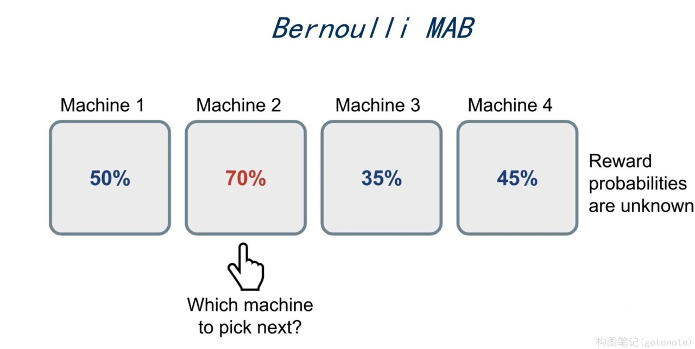
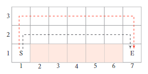
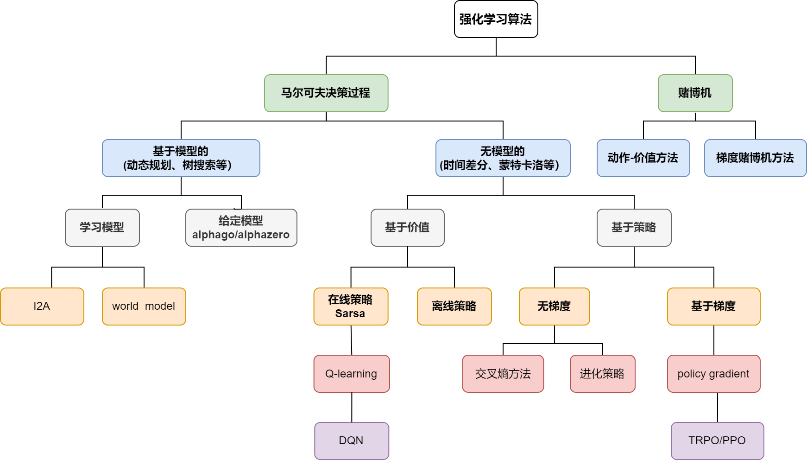
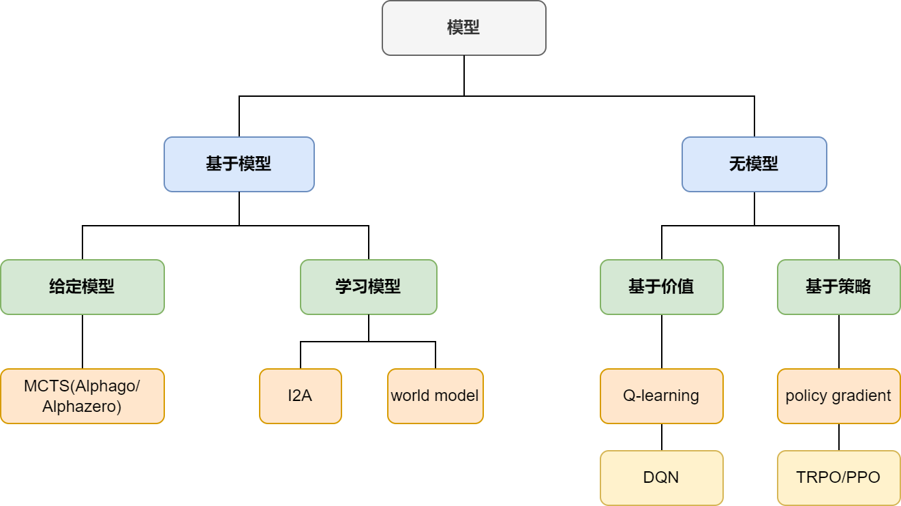
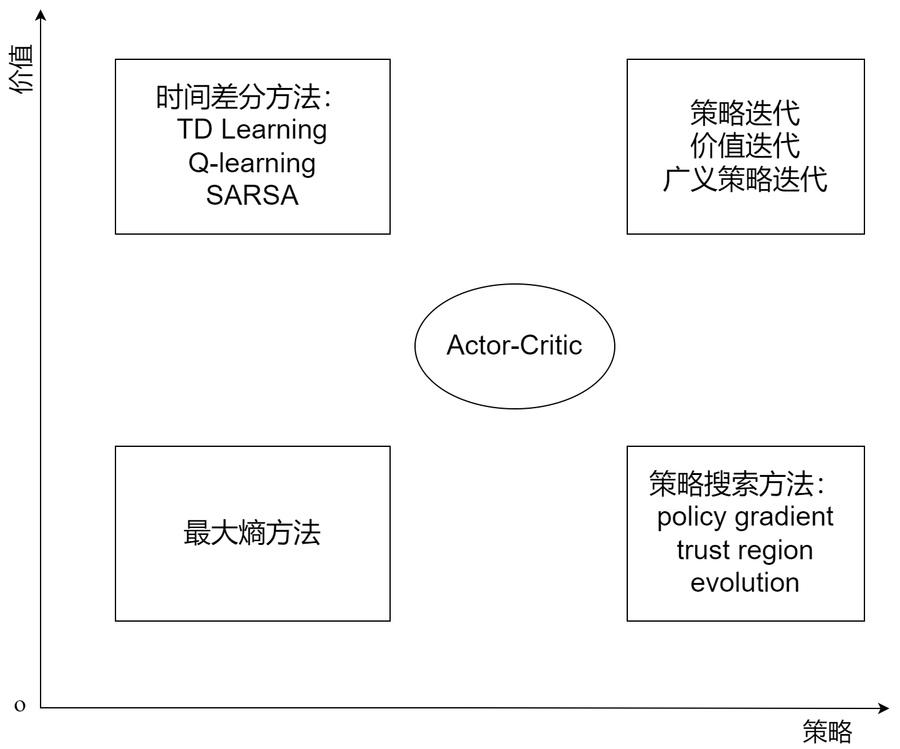
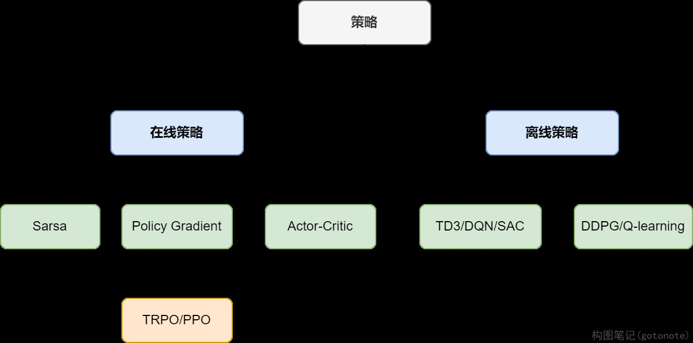
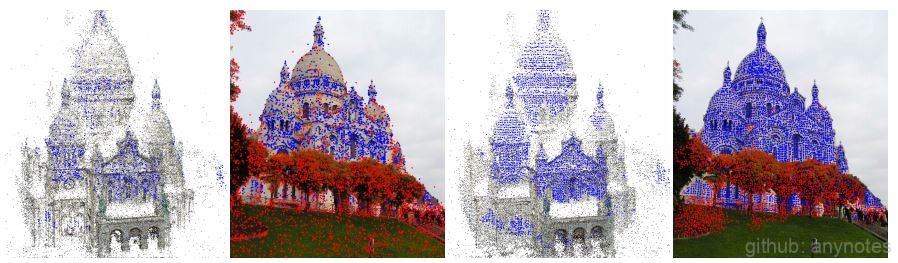

# 1.4 强化学习

## 1.4.1 简介

强化学习又称增强学习，是指一类从与环境交互中不断学习的问题以及解决这类问题的方法。强化学习问题可以描述为一个智能体从与环境的交互中不断学习以完成特定目标。与深度学习类似，强化学习的关键问题也是贡献度分配问题，每一个动作不能直接得到监督信息，需要通过整个模型的最终监督信息（奖励）得到，并且有一定延时性。强化学习是机器学习的一个分支，和监督学习的区别在于，强化学习问题不需要给出正确策略作为监督信息，只需要给出策略的延迟回报，并通过调整策略取得最大化的期望回报。

## 1.4.2 典型例子
### 1.4.2.1 多臂赌博机问题
给定 $K$ 个赌博机，拉动每个赌博机的拉杆，赌博机会按照一个事先设定的概率掉出一块钱或不掉钱。每个赌博机掉钱的概率不一样。多臂赌博机问题是指给定有限的机会次数 $T$ ，如何玩这些赌博机才能使得期望累积收益最大化。多臂赌博机问题在广告推荐、投资组合领域有着重要应用。
<div align=center>

</div>
<div align=center>图1. 多臂老虎机</div>

### 1.4.2.2 悬崖行走问题

在一个网格世界中，每个格子表示一个状态。如下图所示的一个网格世界，每个状态为(i,j)，$1<=i<=7$,$1<=j<=3$，其中格子(2,1)到(6,1)是悬崖。有一个醉汉，从左下角的开始位置 $S$ ，走到右下角的目标位置 $E$ 。如果走到悬崖，醉汉会跌落悬崖并死去。醉汉可以选择行走的路线，即在每个状态时，选择行走的方向：上下左右。但每走一步，都有一定概率滑落到周围其他格子。醉汉的目标是如何安全地到达目标位置。


<div align=center>

</div>
<div align=center>图2. 悬崖行走问题</div>


## 1.4.3 强化学习定义

在强化学习中，有两个可以进行交互的对象：智能体和环境。

(1) 智能体可以感知外界环境的状态和反馈的奖励，并进行学习和决策。智能体的决策功能是根据外界环境的状态来做出不同的动作，而学习功能是指根据外界环境的奖励来调整策略。

(2) 环境是智能体外部的所有事物，并受智能体动作的影响而改变其状态，并反馈给智能体相应的奖励。
  
强化学习的基本要素包括：

(1) 状态 $s$ 是对环境的描述，可以是离散的或连续的，其状态空间为 $S$ 。

(2) 动作 $a$ 是对智能体行为的描述，可以是离散的或连续的，其动作空间为 $A$ 。

(3) 策略 $\pi(a|s)$ 是智能体根据环境状态 $s$ 来决定下一个动作 $a$ 的函数。

(4) 状态转移概率 $p(s'|s,a)$ 是在智能体根据当前状态 $s$ 做出一个动作 $a$ 之后，环境在下一个时刻转变为状态 $s'$ 的概率。

(5) 即时奖励 $r(s,a,s')$ 是一个标量函数，即智能体根据当前状态 $s$ 做出动作 $a$ 之后，环境会反馈给智能体一个奖励，这个奖励也经常和下一个时刻的状态 $s'$ 有关。

## 1.4.4 强化学习算法

强化学习算法可以从多个不同的角度进行分类，例如基于模型和无模型的学习方法，基于价值和基于策略的学习方法（或两者相结合的演员-评论员算法），在线策略和离线策略学习方法。下图展示了更详细的分类，方框加粗字体代表不同分类，未加粗字体代表具体算法：

<div align=center>

</div>
<div align=center>图3. 强化学习算法分类图</div>

### 1.4.4.1 基于模型的方法和无模型的方法

这里首先讨论基于模型的方法和无模型的方法。在深度学习中，模型是指具有初始参数（预训练模型）或已习得参数（训练完毕的模型）的特定函数，例如全连接网络、卷积网络等。而在强化学习算法中，“模型”特指环境，即环境的动力学模型。在强化学习的五个基本要素中，加上奖励的折扣因子 $λ$ （用来给不同时刻的奖励赋予权重），即构成了强化学习的环境。如果所有这些环境相关的元素都是已知的，那么模型就是已知的。此时可以在环境模型上进行计算，而不用再与真实环境进行交互，例如值迭代和策略迭代等规划方法。通常，智能体并不知道环境的即时奖励函数 $r$ 和状态转移概率 $p$ ，所以需要通过和环境交互，不断试错，观察环境相关信息并利用反馈的奖励信号不断学习。这个不断学习的过程既对基于模型的方法适用，也对无模型的方法适用。下图对现在流行的基于模型和无模型的方法作了分类：

<div align=center>

</div>
<div align=center>图4. 基于模型的方法和无模型的方法分类图</div>

在这个不断试错和学习的过程中，可能有某些环境元素是未知的，如奖励函数 $r$ 和状态转移函数 $p$ 。此时，如果智能体尝试通过在环境中不断执行动作获取样本 $(s,a,s',r)$ 来构建对 $r$ 和 $p$ 的估计，则 $p(s'|s,a)$ 和 $r$ 的值可以通过监督学习进行拟合。习得奖励函数 $r$ 和状态转移函数 $p$ 之后，所有的环境元素都已知，则之前所述的规划方法可以直接用来求解该问题。这种方式即称为基于模型的方法。无模型的方法则不尝试对环境建模，而是寻找最优策略。例如，Q-learning算法对状态-动作对 $(s,a)$ 的Q值进行估计，通常选择最大Q值对应的动作执行，并利用环境反馈更新Q值函数，随着Q值收敛，策略随之逐渐收敛达到最优；策略梯度算法不对值函数进行估计，而是将策略参数化，直接在策略空间中搜索最优策略，最大化累积奖励。这种不需要对环境建模的方法称为无模型的方法。可见基于模型和无模型的区别在于，智能体是否利用环境模型，例如状态转移概率和奖励函数。


### 1.4.4.2 基于价值的方法和基于策略的方法

强化学习与深度学习相结合即产生了深度强化学习，用强化学习定义问题和优化目标，用深度学习解决策略和值函数(对策略 $Π$ 的评估)的建模问题并通过反向传播来优化目标函数。深度强化学习中的策略优化主要有两类：基于价值的方法和基于策略的方法。两者结合产生了演员-评论员类算法等其他算法，它们利用价值函数的估计来帮助更新策略。基于价值的方法即对价值函数的优化，优点在于采样效率相对较高，值函数估计方差小，不易陷入局部最优；缺点是通常不能处理连续动作空间问题，且最终的策略通常为确定性策略而不是概率分布的形式。基于策略的方法直接对策略进行优化，通过对策略迭代更新，实现累积奖励最大化。与基于价值的方法具有策略参数化简单、收敛速度快的优点，适用于连续高维的动作空间。演员-评论员算法则是结合了二者优点，利用基于价值的方法学习值函数V来提高采样效率，并利用基于策略的方法学习策略函数，可以看作是基于价值的方法在连续动作空间中的扩展。下图对常见的基于价值和基于策略的方法进行了分类。

<div align=center>

</div>
<div align=center>图5. 基于价值的方法和基于策略的方法分类图</div>

### 1.4.4.3 在线策略方法和离线策略方法

在线策略方法和离线策略方法依据策略学习的方式对强化学习算法进行划分。在线策略方法评估并提升和环境交互生成数据的策略，要求智能体和环境交互的策略和要提升的策略相同，而离线策略方法可以利用其他智能体与环境交互的数据来提升自己的策略。例如常见的在线策略方法是Sarsa，它根据当前策略选择一个动作并执行，然后使用环境反馈的数据更新当前策略。Q-learning则是一种典型的离线策略方法。下图对常见的在线策略和离线策略的方法进行了分类。

<div align=center>

</div>
<div align=center>图6. 在线策略方法和离线策略方法分类图</div>

## 1.4.5 强化学习算法的一般过程

在强化学习中，每个时刻 $t$∈ { $0,1,2$ } ，算法和环境通过执行动作 $a_t$ 进行交互，可以得到观测 $s_t$ 和奖励 $r_t$ 。一般情况下，假设环境是存在马尔可夫性质的，环境的变化可以完全通过状态转移概率 $p_{ass'} =Pr({s_{t+1}~=s'|s_t=s,a_t=a} )$刻画出来。也就是说，环境下一时刻的观测值与给定当前时刻的观测值和动作，以及与之前所有时刻的观测值和行为都没有关系。而环境在 $t+1$ 时刻返回的奖励，在当前状态和动作确定下的期望值可以表示为 $r_{as}=E({r_{t+1}|s_t=s,a_t=a})$。强化学习算法在每一个时刻执行行为的策略可以通过概率 $\pi(s,a,θ) = Pr({a_t=a|s_t=s;θ})$ 表示，其中 $θ$ 是需要学习的策略的参数。我们需要学习到最优的强化学习策略，也就是学习到能够取得最高奖励的策略：
$ρ(\pi)=E({Σ^{oo}_{t=1}λ^{t-1}r_t|s_0,\pi})$

同样的奖励，越早获得，强化学习的系统感受到的奖励越高。

强化学习的 $Q$ 函数 $Q_Π$(s,a) 表示的是在状态为 $s$，执行动作为  $a$ 之后的时刻都使用策略 $\pi$ 选择动作能够获得的奖励。如果能够学习到准确的 $Q$ 函数，那么使 $Q$ 函数最高的行为就是最优行为。强化学习的目的就是在给定的任意环境下，通过对环境进行探索，学习到最大化 $p(\pi)$ 的策略函数 $\pi$ 。

## 1.4.6 多臂老虎机代码解释

下面以多臂老虎机为例进行代码实战，这里多臂老虎机的拉杆次数为 10 。其中拉动每根拉杆的奖励服从二项分布，即每次拉下拉杆有 $p$ 的概率获得的奖励为 $1$ , ${1-p}$ 的概率获得奖励为 0。奖励为 1 代表获奖，奖励为 0 代表没有获奖。


```python
import numpy as np
import matplotlib.pyplot as plt
class BernoulliBandit:
   """多臂老虎机，输入K表示拉杆个数"""
   def __init__(self,K):
      self.probs=np.random.uniform(size=K)#随机生成K个0-1的数作为拉动每根拉杆的获奖概率
      self.best_idx=np.argmax(self.probs)#获奖概率最大的拉杆
      self.best_prob=self.probs[self.best_idx]#最大的获奖概率
      self.K=K
   def step(self,K):
      #当玩家选择了K号拉杆后，根据拉动该老虎机的K号拉杆获得的奖励的概率返回1或0
      if np.random.rand()<self.probs[k]:
         return 1
      else:
         return 0

np.random.seed(1)
K=10
bandit_10_arm=BernoulliBandit(K)
print("随机生成了一个%d臂老虎机" % K)
print("获奖概率最大的拉杆为%d号，其获奖概率为%.4f"%(bandit_10_arm.best_idx,bandit_10_arm.best_prob))
```

接下来用一个solve基础类来实现上述多臂老虎机的求解。

```python
class Solver:
   """多臂老虎机算法基本框架"""
   def __init__(self,bandit):
      self.bandit=bandit
      self.counts=np.zeros(self.bandit.K)#每根拉杆的尝试次数
      self.regret=0.#当前步的累积懊悔(懊悔为拉动当前杠杆的期望奖励离最优拉杆的期望奖励差)
      self.action=[]#记录每一步的动作
      self.regrets=[]#记录每一步的累积懊悔
   def update_regret(self,K):
      #计算累积懊悔并保存，K为本次动作选择的拉杆编号
      self.regret+=self.bandit.best_prob-self.bandit,probs[k]
      self.regrets.append(self.regret)
   def run_one_step(self):
      #返回当前动作选择哪一根拉杆，由每个具体的策略实现
      raise NotImplementedError
   def run(self,num_steps):
      #运行一定次数，num_steps为总运行次数
      for _ in range(num_steps):
         k=self.run_one_step()
         self.counts[k]+=1
         self.actions.append(k)
         self.update_regret(k)
```
## 1.4.7 利用策略梯度算法进行局部特征选择和匹配

作为强化学习的进阶应用介绍，这里将根据eccv2020论文《DISK：Learning local features with policy gradient》简单介绍策略梯度算法在特征选择和匹配的应用。

策略梯度算法是一类直接针对期望回报通过梯度下降进行策略优化的强化学习方法。这一类方法避免了其他传统强化学习方法所面临的一些困难，例如没有一个准确的价值函数，或者由于连续的状态和动作空间，以及状态信息的不确定性而导致的难解性。

局部特征是一项关键的计算机视觉技术，虽然可以很容易地在预定义的关键点上学习局部特征描述子，但由于其计算复杂度，局部特征检测和匹配更难以可微分的方式进行。由于每个图像像素可能成为一个特征，这个问题就变得棘手。此外，一个特征也可能取决于其他特征，因为一个与其他特征非常相似的特性不那么独特，因此也不那么有用。这在训练中是很难解释的。传统提取局部特征的过程通常包括三个步骤：寻找一个关键点、估计其方向和计算一个描述向量。

原文通过弥合训练和推理之间的差距来解决这个问题，以充分利用cnn的表达能力。主干是一个网络，它以图像作为输入，输出是关键点“热图”和密集的描述符。从热图中采样离散的关键点，并且在这些位置上的描述符用于构建跨图像的特征匹配的分布。然后使用图像真实的几何特征为每个匹配分配正或负奖励，并执行梯度下降来最大化期望奖励 $E[Σ_{(i,j)∈M_{A↔B}}r(i↔j)]$ ，其中 $M_{A↔B}$ 是匹配的集合，$r$ 是每个匹配的奖励。实际上，这就是一种策略梯度法。下图展示了该算法和传统的特征匹配算法SIFT的效果对比，显然策略梯度的结果更胜一筹。


<div align=center>

</div>
<div align=center>图7. SIFT算法与DISK算法特征匹配效果对比</div>

