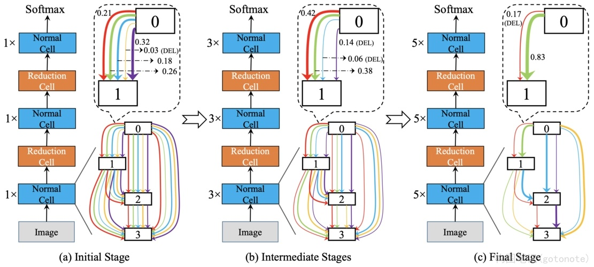

# 神经网络结构搜索(NAS)

图1. 翻译视作盲盒

## 一、引言

神经网络架构搜索（NAS）是一种自动搜索最优神经网络架构的方法。通过使用NAS，研究人员可以避免手动设计网络架构的繁琐过程，从而节省时间和精力。本教程将介绍NAS的基本概念、方法和实现步骤。

## 二、基本概念

* 网络架构：神经网络的结构，包括层数、每层的神经元数量、激活函数等。

* 搜索空间：所有可能的网络架构组成的集合。
  
* 搜索算法：用于在搜索空间中寻找最优网络架构的算法。
  
## 三、NAS方法

* 基于梯度的方法：使用梯度信息搜索最优网络架构。例如，遗传算法、进化策略等。

* 基于强化学习的方法：使用强化学习算法搜索最优网络架构。例如，Proximal Policy Optimization (PPO)、Soft Actor-Critic (SAC)等。
  
* 基于元学习方法：使用元学习算法学习如何搜索最优网络架构。例如，MAML (Model-Agnostic Meta-Learning)、FOMAML (First-Order MAML)等。
  
## 四、NAS实现步骤

1. 定义搜索空间：确定网络架构的组成部分，例如层数、每层的神经元数量、激活函数等。

2. 设计搜索算法：选择一种NAS方法，并实现相应的搜索算法。

3. 训练搜索算法：使用训练数据集训练搜索算法，使其能够搜索最优网络架构。

4. 搜索最优网络架构：使用搜索算法在搜索空间中搜索最优网络架构。

5. 评估最优网络架构：使用验证数据集评估搜索到的最优网络架构的性能。

6. 应用最优网络架构：将最优网络架构应用到实际任务中。