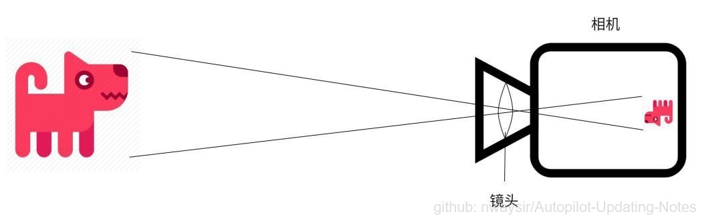
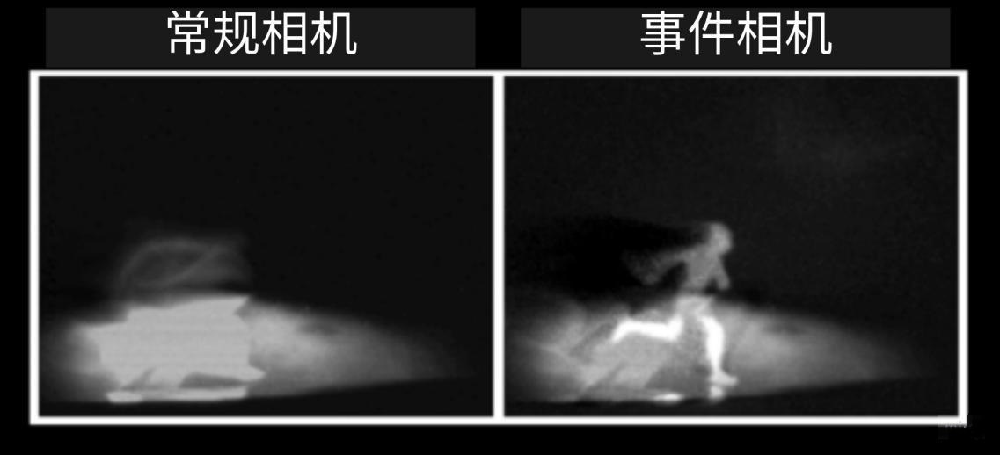
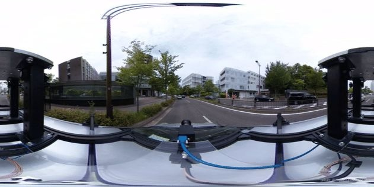
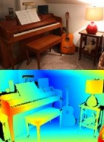
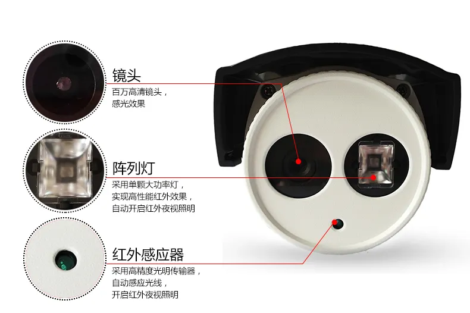
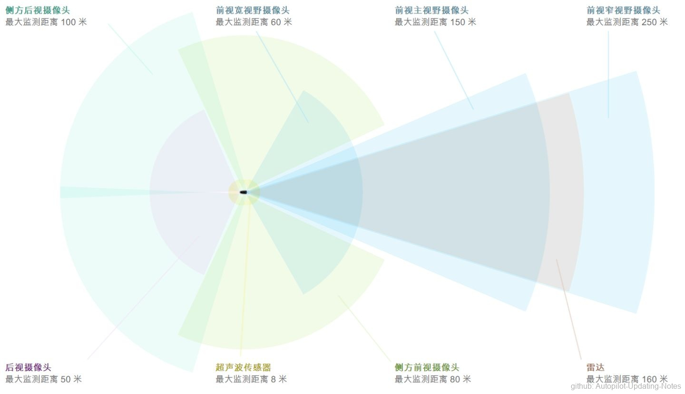

### 2.1.1 摄像头

摄像头是目前自动驾驶车中应用和研究最广泛的传感器，其采集图像的过程最接近人类视觉系统。基于图像的物体检测和识别技术已经相当成熟，随着近几年深度学习的发展，基于深度学习的视觉感知算法已大量应用于实际生活和生产中，在某些任务上甚至已经超越人类水平。在自动驾驶车上，一般会安装多个摄像头，兼顾不同的视角和任务。

一、原理
  

   
  

  
图1. 摄像头 

  摄像头模组利用透镜成像的原理，光线透过相机镜头后，被感光元器件捕获，通过感光芯片及相关电路来记录和传输图像信号的，如图1所示。

二、分类

（1） 按摄像头的个数，分为单目摄像头、双目摄像头和多目摄像头。

- 单目摄像头。

  由单个相机组成，结构简单，成本低、便于标定和识别，但无法测量准确的距离。

- 双目摄像头。

  双目摄像头由两个摄像头组成，由于两个摄像头之间的基线距离已知，可以估算出空间距离，但配置与标定复杂，计算量相对单目相机大，通常需要GPU/FPGA加速。

- 多目摄像头。
  
  三个或以上摄像头，不同焦距摄像头的集合（解决频繁变焦，不同距离识别清晰度）。

（2） 按照摄像头的焦距，分为长焦摄像头和短焦摄像头。

- 长焦摄像头。

  长焦摄像头看的距离远，在拍摄远处的景象的时候更加清晰。在自动驾驶车中，长焦摄像头用于感知远处的交通状况、红绿灯等。

- 短焦摄像头。

  短焦摄像头主要用于感知近处的物体，视野范围比长焦宽。障碍物识别、车道线检测和场景分割等多个任务都需要用到短焦摄像头，往往车上会集成多个短焦摄像头，覆盖整个车的视野范围。

（3）按照类型划分，除了最常见的摄像头之外，还有事件摄像头、全景摄像头、深度摄像头和红外摄像头等新型相机。

- 事件摄像头（Event Camera）

   
图2. 事件摄像头 

  事件摄像头中的每个像素独立响应亮度的变化，通过捕捉亮度变化成像，因此对运动物体捕捉效果非常好，并且不受曝光时间限制，成像速度非常快。普通摄像头在高速运动状态下会出现运动模糊，而事件相机则很好的解决了这个问题。目前事件摄像头的主要限制是像素大小和图像分辨率，例如DAVIS240型号的事件摄像头像素大小只有18.5x18.5µm，分辨率为240x180。如图2所示，分别是普通摄像头和事件摄像头拍摄到晚上有行人在汽车前奔跑的画面，可以看到普通摄像头出现了明显的曝光不足和运动模糊，而事件摄像头则很清晰。

- 全景摄像头（Omnidirectional Camera）

   
图3. 全景摄像头 

  全景相机有360°的采集视野，解决了单个相机视野范围不足的问题。全景相机通过2枚或者4枚鱼眼镜头进行拍摄，然后把拍摄好的照片拼接起来，组成全景照片。全景照片技术已经非常成熟，已经应用在VR看房等场景，对导航，定位和地图制图都很有帮助。如图3所示全景照片的边缘畸变非常严重，需要算法处理之后才能正常显示。

- 深度摄像头(Range Camera)

  

   
  

  
图4. 深度摄像头 

  深度摄像头能够获取环境的深度和颜色信息，目前有3种深度测距方法：结构光测距、飞行时间法和双目视觉测距。深度相机能够探测的距离非常有限，因此主要还是应用在室内场景的三维重建，如图4所示。

- 红外摄像头（Infrared Camera）
  

   
  

  
图5. 红外摄像头 

  如图5所示，红外摄像头通过热成像原理对行人进行检测，目前在自动驾驶中还没有大规模应用。

三、参数指标

  摄像头主要有以下5个参数指标。
  - 像素：摄像头像素越高，分辨率也越高，图像也就越清晰。
  - 焦距：焦距足够大，在拍摄比较远的物体时才足够清晰。
  - 视场角：视场角决定了摄像头能够看到的视野范围，广角的镜头所拍摄的视野范围更大。
  - 帧率：帧率越高，表示单位时间内拍摄的照片越多，拍摄速度越快。
  - 信噪比：信噪比越高表明产生的杂波信号越少，图像信号质量越好，单位为DB。

四、应用
  

   
  

  
图6. 特斯拉自动驾驶方案 

  摄像头的成本低、成像像素高、刷新频率快，因此被大量应用于智能车。摄像头可以获取颜色信息，可以用于红绿灯检测、交通标志识别、场景分割等。相比于激光雷达或毫米波雷达，摄像头可以获取更远距离的信息，更早的感知环境状况，因此摄像头常应用于智能驾驶的环境感知任务中。为了获取足够的视野自动驾驶车一般会配备多个摄像头，为保证多个摄像头的拍摄时间一致，摄像头有一个触发器（Trigger），用于控制信号同时触发多个摄像头，如图7为特斯拉自动驾驶方案。

  摄像头作为被动型感光设备，对光照的变化十分敏感。在强光、黑夜、雨雪、大雾等能见度低或在快速移动的情况下，获取的画质质量大幅降低。

