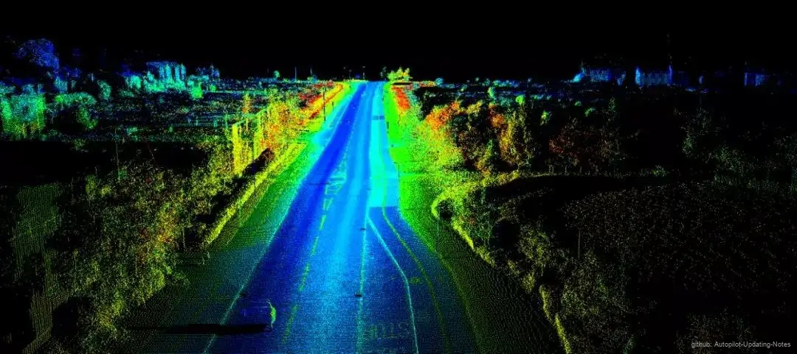
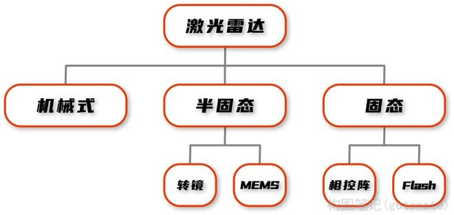
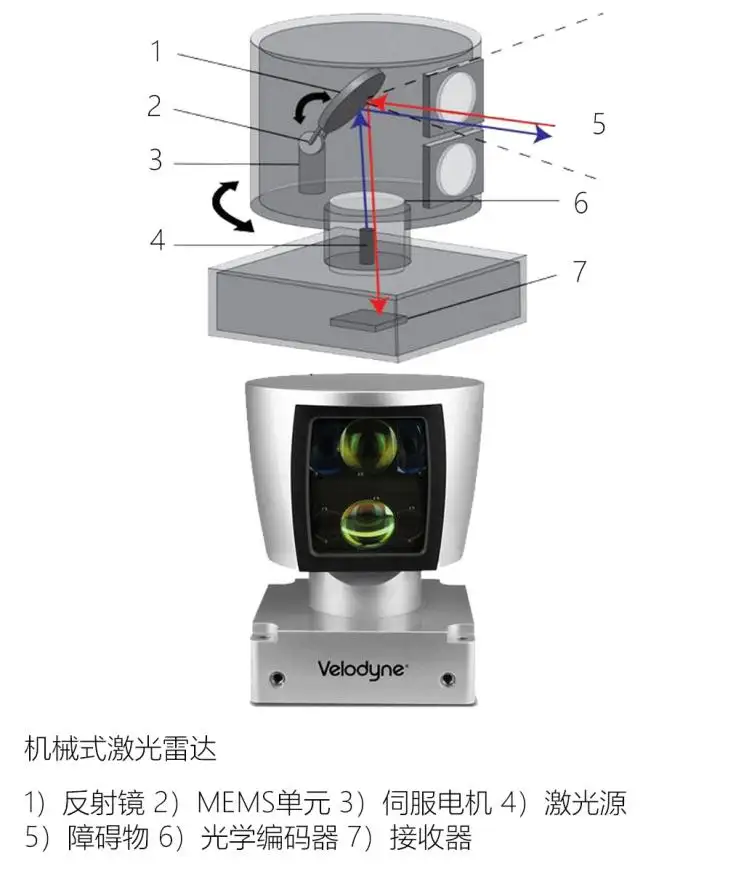
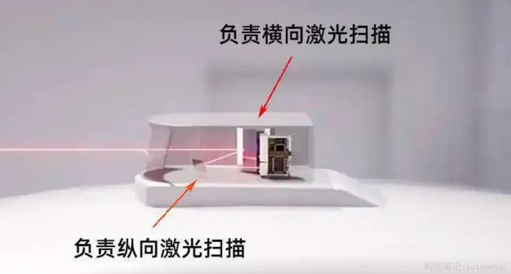
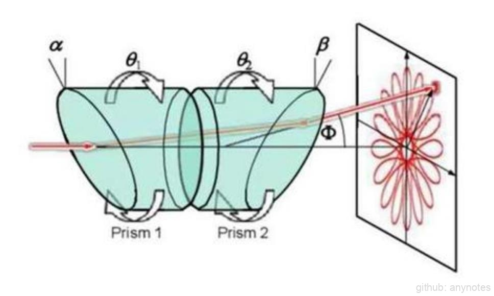
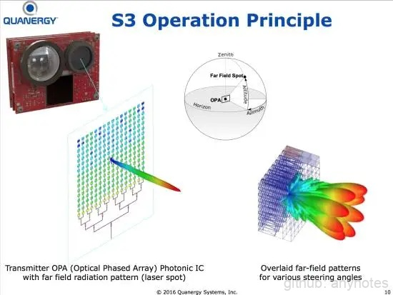
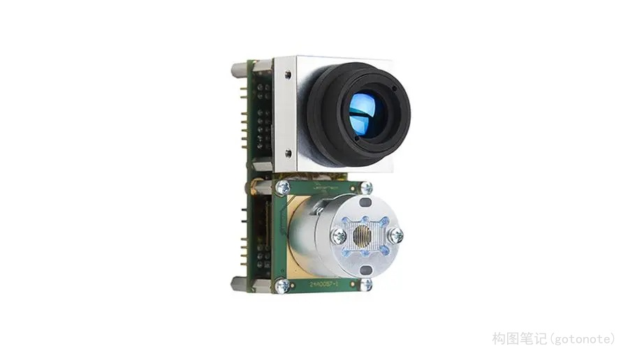
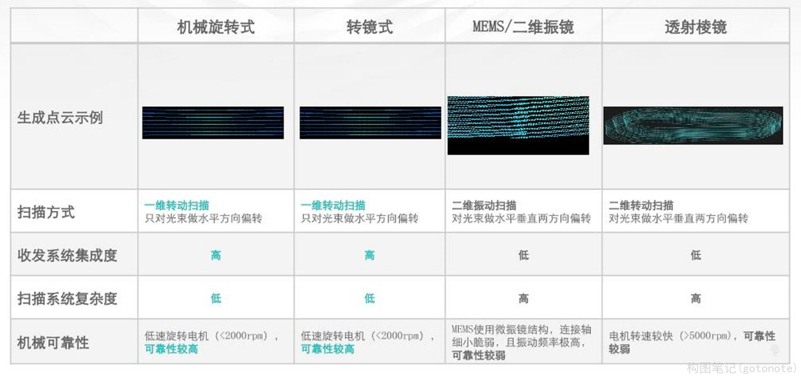
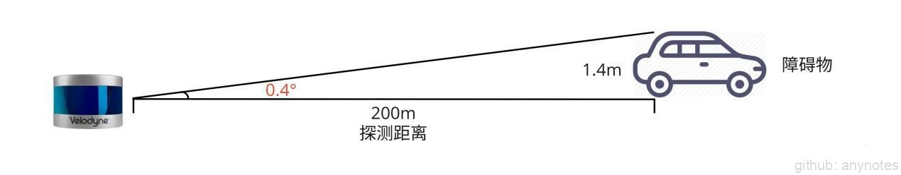
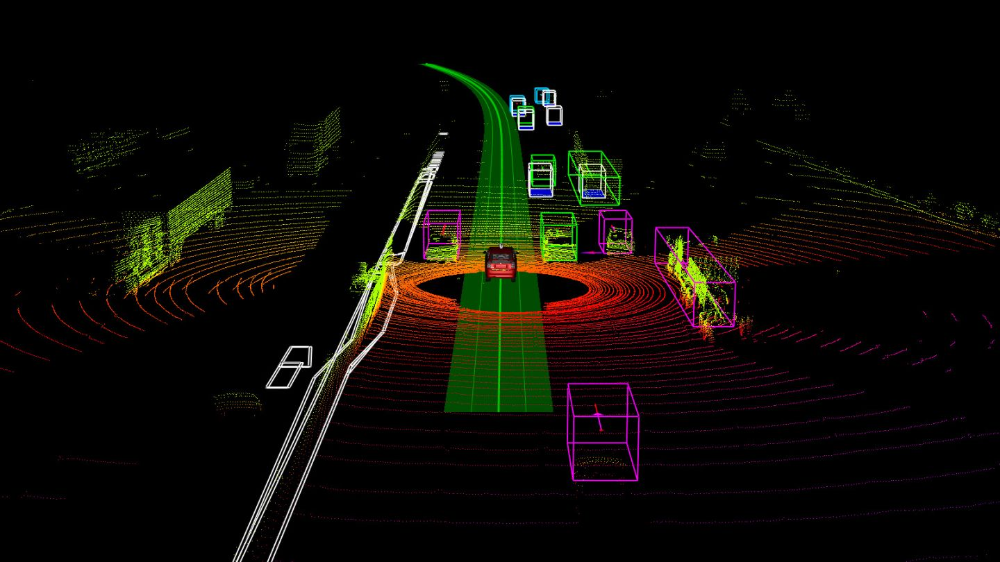

### 2.1.2 激光雷达

 

图1. 激光雷达 

激光雷达是自动驾驶领域非常依赖的传感器，越来越多的自动驾驶公司看好激光雷达的应用前景。激光雷达是实现更高级别自动驾驶（L3级别以上），以及更高安全性的良好途径，相比于毫米波雷达，激光雷达的分辨率更高、稳定性更好、三维数据也更可靠。

**一、原理**  
    激光雷达（ Light Detection and Ranging，LIDAR）是激光检测和测距系统的简称，通过对外发射激光脉冲来进行物体检测和测距。激光雷达采用飞行时间（Time of Flight，TOF）测距，发射器先发送一束激光，遇到障碍物后反射回来，由接收器接收，然后通过计算激光发送和接收的时间差，得到目标和自己的相对距离。如果采用多束激光并且360度旋转扫描，就可以得到整个环境的三维信息。激光雷达扫描出来的是一系列的点，因此激光雷达扫描出来的结果也叫“激光点云”，如图1所示。

    根据发生器的不同可以产生紫外线（10-400nm）到可见光（390-780nm）到红外线（760-1000000nm）波段内的不同激光，相应的用途也各不相同。激光是一种单一颜色、单一波长的光，激光雷达选用的激光波长一般不低于850nm，以避免可见光对人眼的伤害，而目前主流的激光雷达主要有905nm和1550nm两种波长。905nm探测距离受限，采用硅材质，成本较低；1550nm探测距离更远，采用昂贵的铟镓砷（InGaAs）材质，激光可被人眼吸收，故可做更远的探测光束。
    
    激光雷达（Lidar）光束范围很窄，所以需要更多的纵向光束，以覆盖大的面积，所以线束决定着画面大小，扫描再通过返回的时间测量距离，并精准、快速构建模型，相比目前的其他雷达强太多，所以更适合自动驾驶系统，但也同样易受天气影像，成本较高。

**二、分类**

 

图2. 激光雷达分类 

激光雷达按结构不同大致可以分为：机械旋转激光雷达、混合半固态激光雷达和全固态激光雷达（Flash快闪和OPA相控阵，统称为非扫描式）。

(1) 机械旋转激光雷达

 

图3. 机械旋转激光雷达 

    
机械式激光雷达体积大、成本较高、装配难。它通过旋转实现横向360度的覆盖面，通过内部镜片实现垂直角度的覆盖面，同比有着更耐用稳定的特点，所以我们看到的自动驾驶路试车大多采用这种类型，雷达在车顶不停的在旋转完成横向扫描，靠增加激光束，实现纵向宽泛的扫描，如图3所示。
        
(2) 混合半固态激光雷达。按照扫描方式分为：转镜、硅基MEMS、振镜+转镜、旋转透射棱镜。

- 转镜：
    

     
    

    
图4. 转镜激光雷达 

   
    转镜分为一维转镜和二维转镜。一维转镜通过旋转的多面体反射镜，将激光反射到不同的方向；二维转镜顾名思义内部集成了两个转镜，一个多边棱镜负责横向旋转，一个负责纵向翻转，实现一束激光包揽横纵双向扫描。转镜激光雷达体积小、成本低，与机械式激光雷达效果一致，但机械频率也很高，在寿命上不够理想，如图4所示。

- MEMS：
    

     
    

    
图5. MEMS激光雷达 

    MEMS激光雷达通过“振动”调整激光反射角度，实现扫描，激光发射器固定不动，但很考验接收器的能力，而且寿命同样是行业内的重大挑战。支撑振镜的悬臂梁角度有限，覆盖面很小，所以需要多个雷达进行共同拼接才能实现大视角覆盖，这就会在每个激光雷达扫描的边缘出现不均匀的畸变与重叠，不利于算法处理。另外，悬臂梁很细，机械寿命也有待进一步提升。

- 振镜+转镜：
    在转镜的基础上加入振镜，转镜负责横向，振镜负责纵向，满足更宽泛的扫射角度，频率更高价格相比前两者更贵，但同样面临寿命问题。
    
- 旋转透射棱镜：
    

     
    

    
图6. 旋转透射棱镜激光雷达 
    
    
    棱镜激光雷达也称为双楔形棱镜激光雷达，内部包括两个楔形棱镜，激光在通过第一个楔形棱镜后发生一次偏转，通过第二个楔形棱镜后再一次发生偏转。控制两面棱镜的相对转速便可以控制激光束的扫描形态。 
    棱镜激光雷达累积的扫描图案形状像花瓣，中心点扫描次数密集，圆的边缘则相对稀疏，扫描时间持久才能丰富图像，所以需要加入多个激光雷达共工作，以便达到更高的效果。棱镜可以通过增加激光线束和功率实现高精与长距离探测，但结构复杂、体积更难控制，轴承与衬套磨损风险较大。
        
(3) 全固态激光雷达。

顾名思义此激光雷达没有任何机械摆动结构，自然也没有旋转。将机械化的激光雷达芯片化，体型更小、性能更好、寿命更可靠，但逃脱不了摩尔定律的轨道，目前有两种方式。

- 光学相控阵式（OPA）固态激光雷达
    

     
    

    
图7. OPA固态激光雷达 
 
    
    OPA固态激光雷达完全没有摆动固件，利用多个光源组成阵列，合成特定方向的光束，实现对不同方向的扫描。具有扫描速度快、精度高、可控性好、体积小（Quanergy激光雷达只有90x60x60mm）等优点，缺点是易形成旁瓣，影响光束作用距离和角分辨率，同时生产难度高。
    
- Flash固态激光雷达
    

     
    

    
图8. Flash固态激光雷达 
 
    
    Flash固态激光雷达，也可以说是非扫描式，它可以在短时间直接发射出一大片覆盖探测区域的激光，利用光阵构建图像，就像是照相机，快速记录整个场景，减少了没有了转动与镜片磨损，相对更为稳定，不过缺陷也很明显，比如探测距离较近，对处理器要求较高，相对应成本也高。

**激光雷达对比, 下图9所示：**
    

     
    

    
图9. 激光雷达对比 
 
    
**三、参数指标**

（1）视场角
    视场角决定了激光雷达能够看到的视野范围，分为水平视场角和垂直视场角，视场角越大，代表视野范围越大，反之则代表视野范围越小。以图3中的激光雷达为例，旋转式激光雷达的水平视场角为360°，垂直视场角为26.9°，固态激光雷达的水平视场角为60°，垂直视场角为20°。  

（2）线数
    线数越高，代表单位时间内采样的点就越多，分辨率也就越高，目前无人驾驶车一般采用32线或64线的激光雷达。

（3）分辨率
    分辨率和激光光束之间的夹角有关，夹角越小，分辨率越高。固态激光雷达的垂直分辨率和水平分辨率大概相当，约为0.1°，旋转式激光雷达的水平角分辨率为0.08°，垂直角分辨率约为0.4°。

（4）探测距离
    激光雷达标称的最远探测距离一般为150-200m，实际上距离过远的时候，采样的点数会显著变少，测量距离和激光雷达的分辨率有着很大的关系。以激光雷达的垂直分辨率为0.4°最远探测距离为200m举例，在经过200m后激光光束2个点之间的距离为，也就是说只能检测到高于1.4m的障碍物。如下图7所示。
    

     
    

    
图10. 激光雷达探测距离 
 
    如果要分辨具体的障碍物类型，那么需要采样点的数量更多，因此激光雷达有效的探测距离可能只有60-70m。增加激光雷达的探测距离有2种方法，一是增加物体的反射率，二是增加激光的功率。物体的反射率是固定的，无法改变，那么就只能增加激光的功率了。但是增加激光的功率会损伤人眼，只能想办法增加激光的波长，以避开人眼可见光的范围，这样可以适当增大激光的功率。探测距离是制约激光雷达的另一个障碍，汽车在高速行驶的过程中越早发现障碍物，就越能预留越多的反应时间，从而避免交通事故。

（5）反射率
    反射率是指物体反射的辐射能量占总辐射能量的百分比，比如说某物体的反射率是20%，表示物体接收的激光辐射中有20%被反射出去了。不同物体的反射率不同，这主要取决于物体本身的性质(表面状况），如果反射率太低，那么激光雷达收不到反射回来的激光，导致检测不到障碍物。激光雷达一般要求物体表面的反射率在10%以上，用激光雷达采集高精度地图的时候，如果车道线的反射率太低，生成的高精度地图的车道线会不太清晰。

    
**四、应用** 

激光雷达能够准确输出障碍物的大小和距离，通过算法对点云数据的处理可以输出障碍物的3D框，如：3D行人检测、3D车辆检测等；亦可进行车道线检测、场景分割等任务。

 

图11. 激光雷达应用 
 
除了障碍物感知，激光雷达还可以用来制作高精度地图。地图采集过程中，激光雷达每隔一小段时间输出一帧点云数据，这些点云数据包含环境的准确三维信息，通过把这些点云数据做拼接，就可以得到该区域的高精度地图。

在定位方面，智能车在行驶过程中利用当前激光雷达采集的点云数据帧和高精度地图做匹配，可以获取智能车的位置。

激光雷达具有较高的分辨率，可以记录周围环境的三维信息，激光雷达是主动发射型设备，对光照的变化不敏感，在有光照变化和夜晚等场景基本不会受到影响。此外激光雷达能够提供水平360度的视野范围，保证整个自动驾驶车基本上没有视野盲区。

但是激光雷达惧怕雾霾天气，因为雾霾颗粒的大小非常接近激光的波长，激光照射到雾霾颗粒上会产生干扰，导致效果下降。随着技术的进步，以及成本的下降，激光雷达会普及到更多领域。