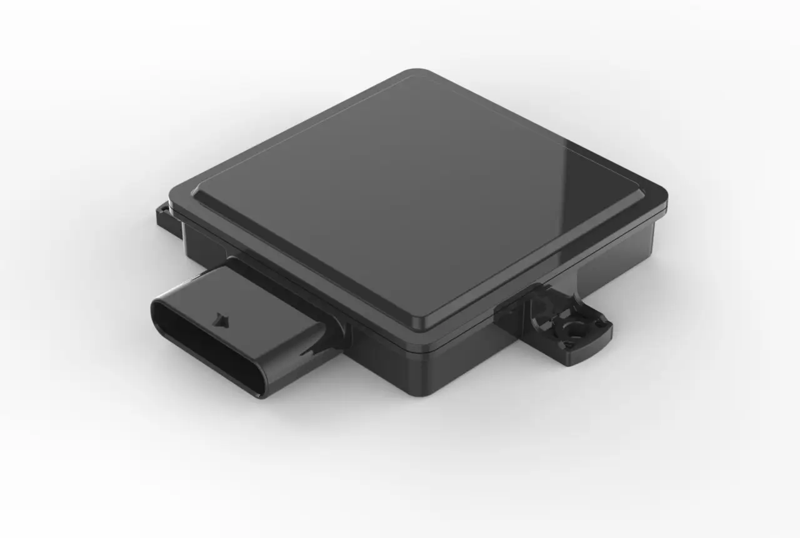
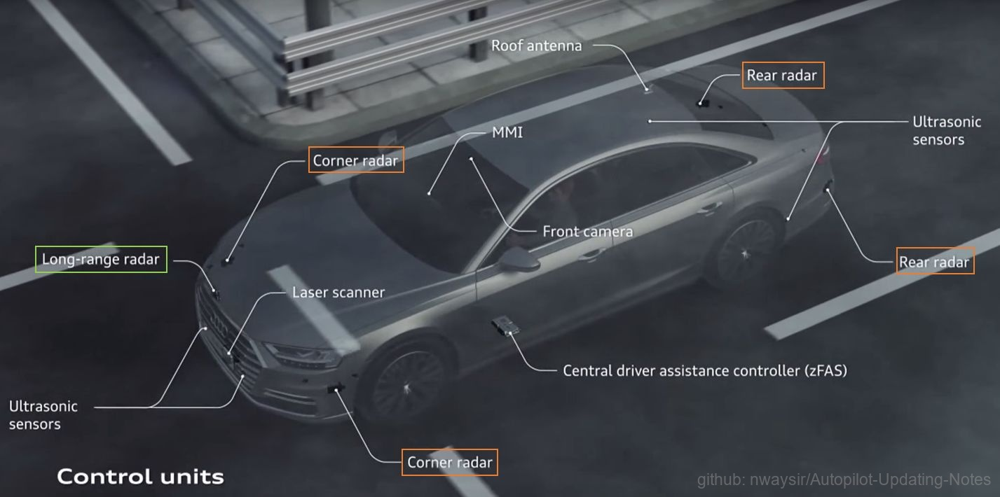
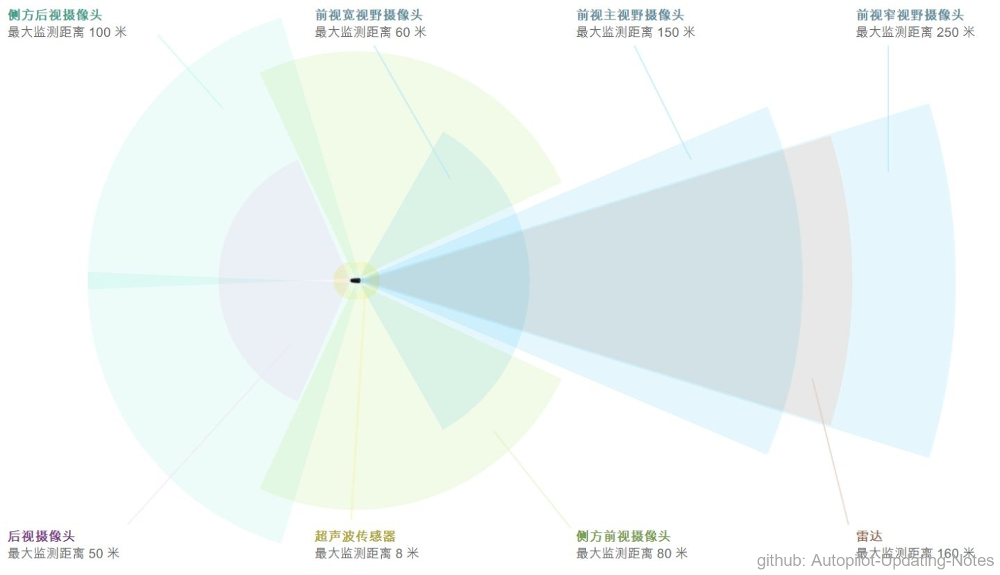

### 2.1.3 毫米波雷达

 

图1. 毫米波雷达 

毫米波雷达（RADAR），和激光雷达的原理类似，是工作在毫米波波段（millimeter wave ）探测的雷达。通常毫米波是指30～300GHz频域(波长为1～10mm)的。毫米波的波长介于微波和厘米波之间，因此毫米波雷达兼有微波雷达和光电雷达的一些优点。

同厘米波导引头相比，毫米波导引头具有体积小、质量轻和空间分辨率高的特点。与红外、激光、电视等光学导引头相比，毫米波导引头穿透雾、烟、灰尘的能力强，具有全天候(大雨天除外)全天时的特点。另外，毫米波导引头的抗干扰、反隐身能力也优于其他微波导引头 。毫米波雷达能分辨识别很小的目标，而且能同时识别多个目标；具有成像能力，体积小、机动性和隐蔽性好。目前已经上市的高级驾驶辅助系统（Advanced Driver Assistance Systems，ADAS）大部分都带有毫米波雷达。

 

#### 2.1.3.1 原理

毫米波雷达的原理是通过发射电磁波，然后接收反射回来的信号，通过电磁波返回的时间差计算目标的相对距离，通过多普勒效应产生的频率偏移来计算目标的相对速度。

 

#### 2.1.3.2 分类

 

图2. 毫米波雷达分类 

   
雷达按照测量的距离划分为短距离雷达和长距离雷达。

一、短距离雷达：探测的范围比较大，但是探测的距离比较短。

（1）24GHz频段

如上图所示被标注了橙色框的Corner radar和Rear radar，就是频段在24GHz左右的雷达。 
处在该频段上的雷达的检测距离有限，因此常用于检测近处的障碍物（车辆）。图中的这4个角雷达，能够实现的ADAS功能有盲点检测、变道辅助等；在自动驾驶系统中常用于感知车辆近处的障碍物，为换道决策提供感知信息。

二、长距离雷达：探测的范围比较窄，但是探测的距离比较长。

 

图3. 特斯拉长距离雷达 

（1）77GHz频段

如上图所示，被标注为绿色框的Long-range radar，即为频段在77GHz左右的雷达。性能良好的77GHz雷达的最大检测距离可以达到160米以上，因此常被安装在前保险杠上，正对汽车的行驶方向。如下图右下角的棕色区域，为特斯拉AutoPilot2.0中所配备的长距离毫米波雷达，及其感知范围。

长距离雷达能够用于实现紧急制动、高速公路跟车等ADAS功能；同时也能满足自动驾驶领域，对障碍物距离、速度和角度的测量需求。

 

（2）79GHz频段

该频段的传感器能够实现的功能和77GHz一样，也是用于长距离的测量。

 

#### 2.1.3.3 参数指标

毫米波雷达主要有以下4个参数指标。

（1）最大探测距离：能够探测到障碍物的最大相对距离，一般为250m。 \
（2）最大探测速度：能够探测到障碍物的最大相对速度，一般为240km/h。 \
（3）探测视角：能够探测到的视野范围，水平范围一般为±60°，垂直视角一般为±5°。 \
（4）最大探测目标数：最大能够探测的目标数量，一般为24-32个。

 

#### 2.1.3.4 应用

由公式，光速 = 波长 \* 频率，可知频率更高的毫米波雷达，其波长越短。波长越短，意味着分辨率越高；而分辨率越高，意味着在距离、速度、角度上的测量精度更高。

毫米波雷达的体积小，相比于激光有更强的穿透性，能够轻松地穿透保险杠上的塑料，因此常被安装在汽车的保险杠内，安装之后对汽车外观的影响不大；毫米波雷达能够同时检测多个物体的距离、角度和相对速度，特别是高速移动的物体；毫米波雷达测量距离也比较大，最大探测距离可达250m，并且能够穿透雾和粉尘，还能够适应各种不同的天气。

毫米波雷达也有局限性，雨、雾和湿雪等高潮湿环境的衰减，以及大功率器件和插损的影响降低了毫米波雷达的探测距离，特别是垂直角度；树丛穿透能力差，相比微波，对密树丛穿透力低；采样的点比较稀疏，分辨率比较低，很难识别体积比较小的物体；元器件成本高，加工精度相对要求高，单片收发集成电路的开发相对迟缓。