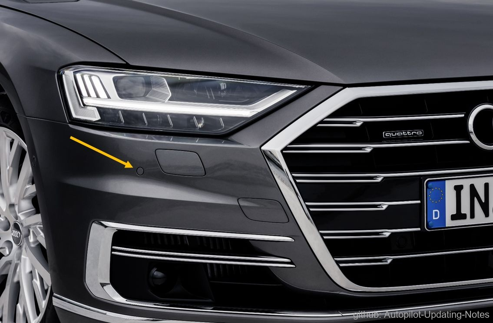
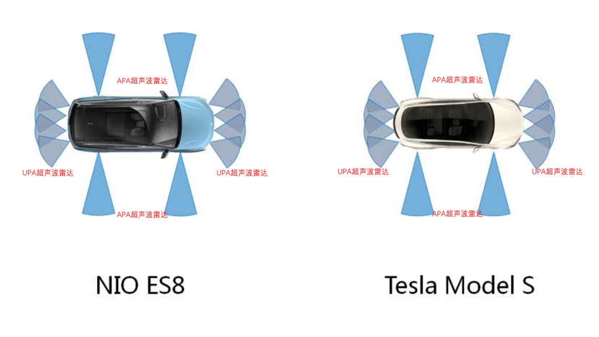
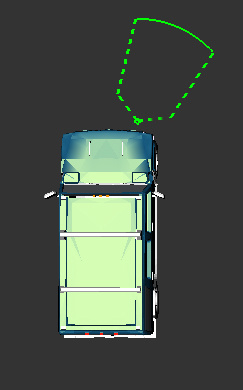
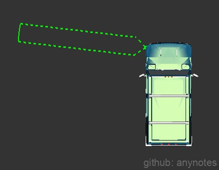
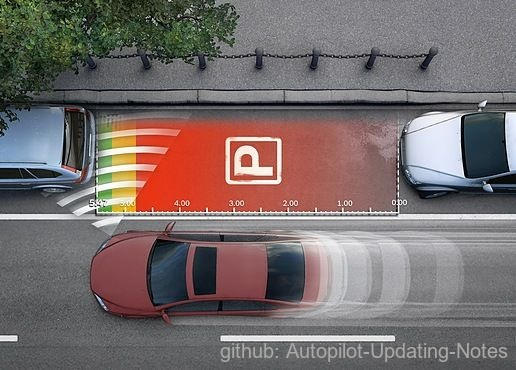
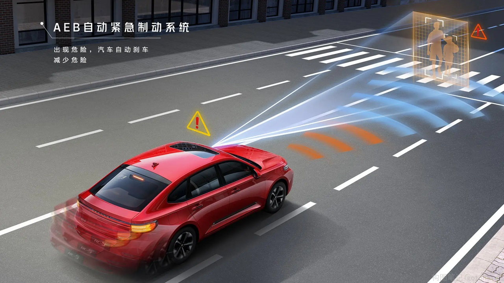
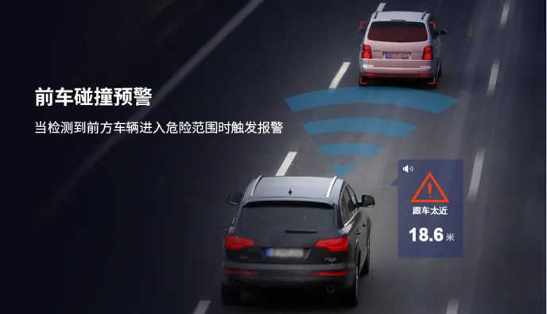
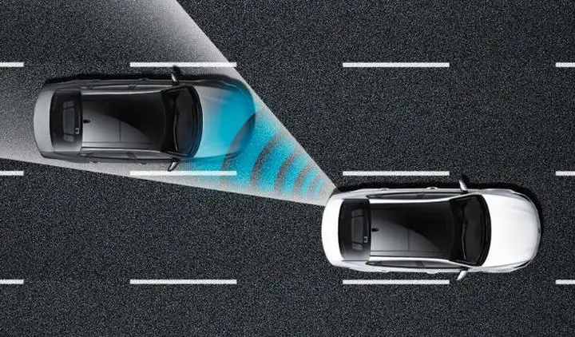
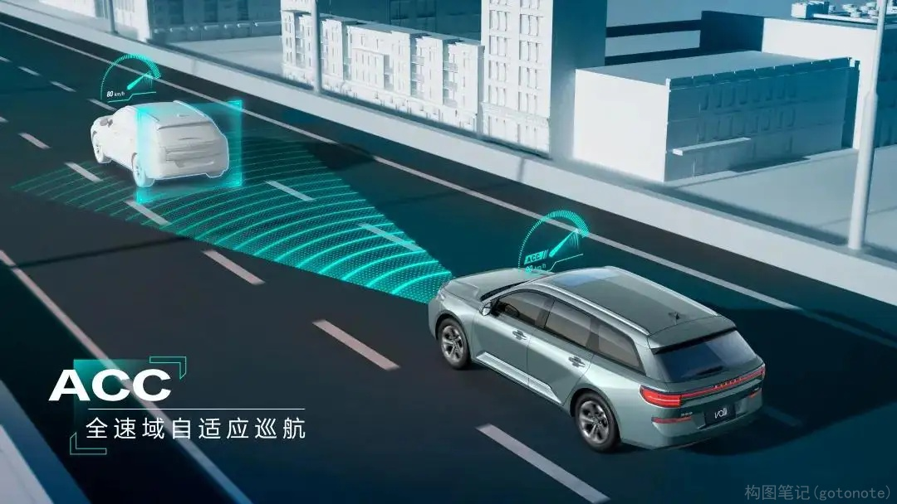

### 2.1.4 超声波雷达

 

图1. 超声波雷达 

超声波雷达，是一种利用超声波测算距离的雷达传感器装置。在车载传感器中，超声波雷达是目前最常见的品种之一，短距离测量中，超声波测距传感器具有非常大的优势，多用在倒车雷达上。在倒车入库，慢慢挪动车子的过程中，在驾驶室内能听到“滴滴滴”的声音，这些声音就是根据超声波雷达的检测距离给司机的反馈信息。

**一、原理**
超声波雷达的工作原理是通过超声波发射装置向外发出超声波，到通过接收器接收到发送过来超声波时的时间差来测算距离。常用探头的工作频率有 40kHz, 48kHz和58kHz三种。一般来说，频率越高，灵敏度越高，但水平与垂直方向的探测角度就越小，故一般采用40kHz的探头。超声波雷达防水、防尘，即使有少量的泥沙遮挡也不影响。探测范围在0.1-3米之间，而且精度较高，因此非常适合应用于泊车。

**二、分类**

 

图2. 超声波雷达分类 

常见的超声波雷达有两种。第一种是安装在汽车前后保险杠上的，也就是用于测量汽车前后障碍物的倒车雷达，这种雷达业内称为UPA；第二种是安装在汽车侧面的，用于测量侧方障碍物距离的超声波雷达，业内称为APA。

（1）UPA超声波雷达

 

图3. UPA超声波雷达 

UPA超声波雷达的探测距离一般在15~250cm之间，主要用于测量汽车前后方的障碍物。
    
（2）APA超声波雷达

 

图4. APA超声波雷达 

APA超声波雷达的探测距离一般在30~500cm之间。APA的探测范围更远，因此相比于UPA成本更高，功率也更大。APA的探测距离优势让它不仅能够检测左右侧的障碍物，而且还能根据超声波雷达返回的数据判断停车库位是否存在。

**三、参数指标**

（1）距离精度：用于描述雷达对单个目标距离参数估计的准确度，它是由回波信号的信噪比 SNR 决定的。FMCW 雷达的有效噪声带宽与其调频时间成反比，调频时间越长，有效噪声带宽越低，分辨率越高。 \
（2）最大探测距离：能够探测到障碍物的最大相对距离，一般为250m。最大可测速度与相邻 chirp 信号之间的空间间隔成反比。 \
（3）距离分辨率：即多个目标被雷达区分出来的最小距离，主要由信号的带宽决定的，chirp 信号带宽的增加，距离分辨率随之提高。 \
（4）最大探测速度：能够探测到障碍物的最大相对速度，一般为 240km/h。 \
（5）速度分辨率：速度分辨率随着帧持续时间的增加而提高。 \
（6）探测视角：能够探测到的视野范围，水平范围一般为±60°，垂直视角一般为±15°。 \
（7）角精度：用于描述雷达对单个目标方位角估计的准确度。 \
（8）最大探测目标数：最大能够探测的目标数量，一般为 24-32 个。 \
（9）角分辨率：取决于雷达的工作波长和天线口径尺寸和 TX/RX 天线的数量。

**四、应用**
（1）自动泊车辅助系统

 

图5. 自动泊车辅助系统 

为了更好地达成辅助停车的功能，部分车型的自动泊车辅助系统甚至包含了8个PDC雷达（用于探测周围障碍物）和4个PLA雷达（用于测量停车位的长度）。这些超声波雷达系统可以实时监测车辆与障碍物之间的距离，并把信息反馈给车辆，以帮助车辆及时调整车身姿态和速度，顺利完成自动泊车。

（2）自动紧急制动系统

 

图6. 自动紧急制动系统 

配备了自动紧急制动系统的车辆，会周期性地获取车辆当前的行驶速度，并根据当前速度、系统中预设的速度阈值以及超声波雷达的信息反馈，来判断车辆与障碍物之间的距离。一旦发现车辆距离前方行人或障碍物距离较近的时候，系统会主动提醒驾驶者，如果驾驶者还会做出反应，系统则会主动启动制动系统，确保安全距离。

（3）前方防碰撞预警系统

 

图7. 前方防碰撞预警系统 

前方防碰撞预警系统的工作原理与自动紧急制动功能比较相似，通常会采用超声波雷达来实现车距的实时监测和识别，通过不断获取目标障碍物的距离信息，进行分析处理，传输给执行机构。一旦发现存在潜在碰撞危险，便会对驾驶者进行警告，但需要注意的是，预警系统本身不会采取任何制动措施去避免碰撞或控制车辆。

（4）变道辅助系统

 

图8. 变道辅助系统 

变道辅助系统可以依靠布置在车身两侧的超声波雷达组件，探测障碍物或是运动车辆，再结合驾驶者的变道动作，来判断是否存在碰撞风险；再结合车辆本身的辅助驾驶功能，来完成车辆的变动操作。

（5）全速自适应续航系统

 

图9. 全速自适应续航系统 

全速自适应续航系统一般集成了车辆摄像头、超声波雷达系统，通过ACC控制单元与ABS系统、发动机控制系统协调动作，适当加速或制动，使得车辆与前方车辆始终保持安全距离。

    
 
    
    