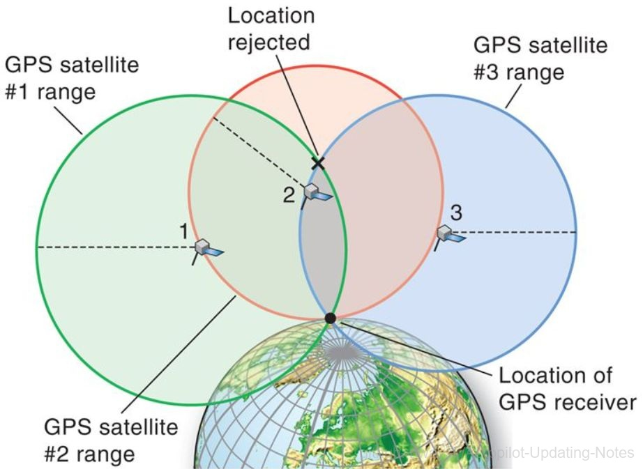
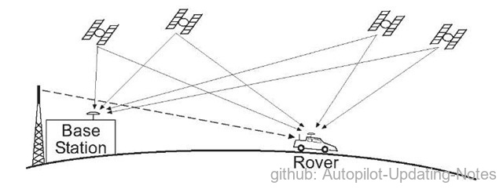
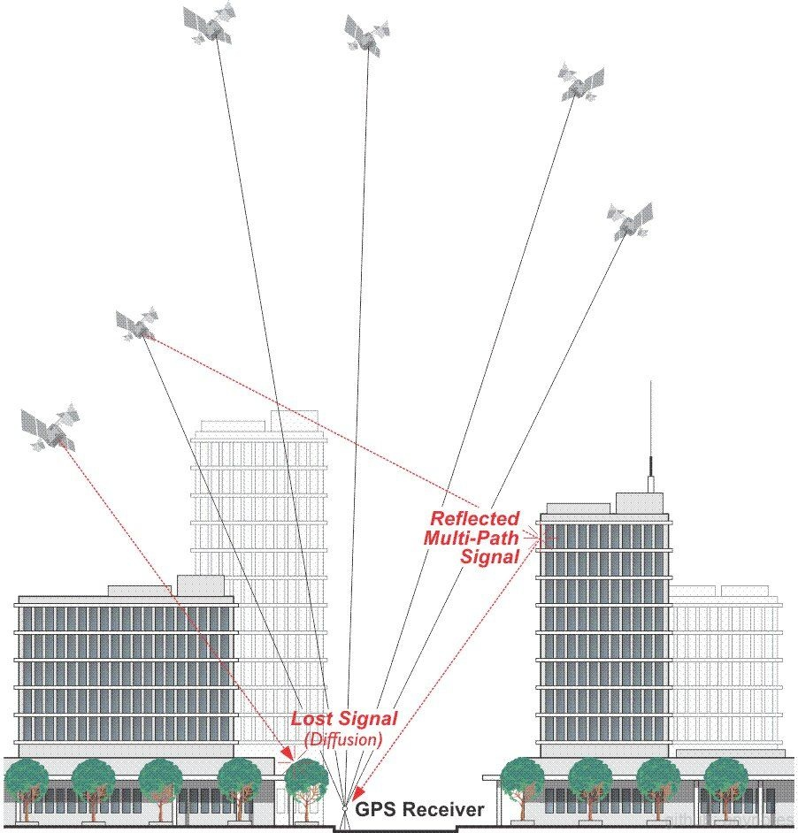

### 2.1.5 GPS定位导航

 

图1. 全球导航定位 

GPS是Global Positioning System（全球定位系统）的简称，一般指美国GPS系统。国际上投入运行且具备全球定位能力的系统还有俄罗斯的格罗纳斯（GLONASS）和中国的北斗卫星导航定位系统，正在建设中的有欧盟伽利略（GALILEO）定位系统，这些全球卫星定位系统在系统组成和定位原理方面基本一致，可以统称为卫星导航系统（Global Navigation Satellite System，GNSS)。

GPS导航系统具备全天候服务能力，不受天气影响，全球覆盖，定位速度快，精度高，应用广泛，已形成了庞大的空间导航定位产业链。

#### 2.1.5.1 发展历史

20世纪60年代末，美国开始着手研制卫星导航系统，主要目的是为陆海空三大领域提供实时、全天候和全球性的导航服务，美国海军提出了Timation计划。该计划采用12-18颗卫星组成全球定位网，经过20余年的研究实验，到1994年，建成了全球覆盖率高达98%的24颗GPS卫星定位网络，这就是导航卫星授时与测距全球定位系统（Navigation Satellite Timing and Ranging Global Position System, NAVSTART GPS），简称全球定位系统（GPS)。

该工程是阿波罗登月工程和航天飞机计划之后的第三大空间计划，从最初的军事目的，到现代人类生活的方方面面，人类都已离不开基于GPS系统的定位与导航服务。俄罗斯、欧盟、中国、日本及印度也先后着手建立了自主的全球或区域型卫星导航系统。

#### 2.1.5.2 定位原理与系统构成

 

图2. 定位原理 

一、定位原理

如上图2，从三个已知点对同一目标进行观察并测量距离，分别以已知点为圆心，以所测距离为半径做三个圆，可得三个圆在平面上的唯一交点，这种定位方法称为三角测量法。GPS就是在已知卫星某一时刻的位置和速度的基础上，以卫星为空间基准点，通过接收设备，测定所测点至卫星的距离来确定所测点某一时刻的空间位置的定位技术。

二、系统构成

以GPS系统为例，一个典型的卫星定位系统分为空间部分、地面监控部分、用户接受部分。

（1）空间部分

由24颗GPS工作卫星组成，其中3颗为备用卫星，分布在6个倾角为55°，约为20200公里高的轨道上绕地球运行，每颗卫星都会发射用于导航定位的信号。这种布局的目的是保证在全球任何地点、任何时刻至少可以观测到4颗卫星。

（2）地面监控部分

分为主控站、监控站和注入站，主要功能是计算卫星星历和卫星钟的改正参数，监控卫星状态，进行卫星调度与参数注入工作等。

（3）用户接受部分

指一切具备GPS信号接收能力的终端机，可以依据所观测信号计算得到自己某时刻所处的空间三维位置，且无须经过授意也无须就接受GPS信号付费。

三、定位精度以及频率

（1）卫星导航系统的定位精度主要由两方面因素决定：

*   位置精度衰减因子（PDOP）

    主要取决于星座的覆盖特性，一般来说，用户可观测到的卫星数越多，与用户的几何构型越好，PDOP值就更优。目前，世界四大全球卫星导航系统，PDOP全球均值一般为2左右。

*   用户等效测距误差（UERE）

    该误差是由空间段卫星轨道钟差、传输环境段的电离层和对流层误差、用户段接收机噪声和多径误差等三部分误差项共同组成。目前，四大系统UERE一般为2.0米（95%）左右，PDOP与UERE两者的乘积即为系统定位精度。

（2）实时动态载波相位差分技术。 *RTK*（Real - time kinematic，实时动态）

 

图3. 基站 

如上图3，在地面上建基站（Base Station），基站可以得到精确位置信息（经纬度），并且具有接收卫星信号的功能。当基站的GPS接收机与车载GPS接收机相距较近时（<30km），可以认为两者的GPS信号通过的是同一片大气区域，即两者的信号误差基本一致。根据基站的精确位置和信号传播的时间，反推此时天气原因导致的信号传播误差，之后利用该误差修正车载的GPS信号，即可降低云层、天气等对信号传输的影响。使用差分GPS技术，可以使无人车的定位精度从10米级别提升至米级。

（3）遮挡、反射等问题依然难以解决

 

图4. 遮挡 

*   信号丢失 \
    GPS接收机在高楼周围，很容易失去某一方向、所有的卫星信号，仅依靠另外三面的卫星信号求得的定位结果，在精度上很难满足无人驾驶的需求。

*   多路径问题

    在高楼周围也可能导致原本收不到的卫星信号，经过大楼楼体的镜面反射被接收到，这种信号被称为多路径信号（Multi-Path Signal）。从图中可以看出，根据多路径信号计算得到的距离会明显大于实际距离。而无人车是很难判断，当前接收到的信号是单路径还是多路径的。

（4）GPS定位频率不高 

GPS定位的频率只有10Hz，以速度为72km/h（20m/s）为例，GPS定位的周期为100ms，则一个周期后，汽车相对于前一次定位的结果移动了20m/s \* 0.1s = 2m，即两次的定位结果相距2米。为了解决GPS频率太低所带来的问题，工程师引入了其他传感器信号（IMU、激光、视觉）用以提高无人车的定位频率。

#### 2.1.5.3 应用

全球定位系统由于其使用方便，定位效率高，应用广泛，从功能类别角度来看，导航应用的典型应用如，军事、物流、交通、户外探险；测量定位的典型应用如，基础设施建设、防灾减灾、地球科学研究；授时服务的典型应用如，为电信基站、电视发射站、工业设备等提供精确同步时钟源等。

全球定位系统体现了近十年跨领域关键技术的发展趋势，已成为当代重大跨领域技术发展的基本要素。作为一个具有成本效益和全球可用的位置和时间信息源，全球定位系统对于技术和应用多元化的快速发展起了很大作用，这反过来又产生了大量的应用实例，值得关注的跨领域技术包括物联网、大数据、移动医疗、增强现实、智慧城市、多式联运物流。
