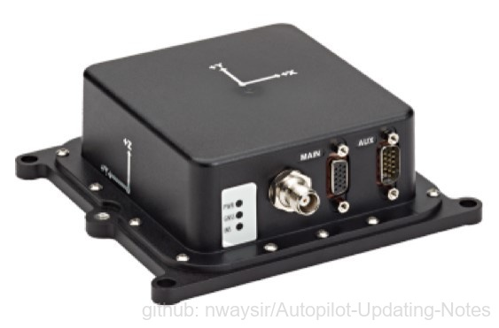
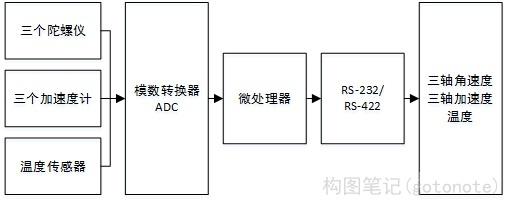
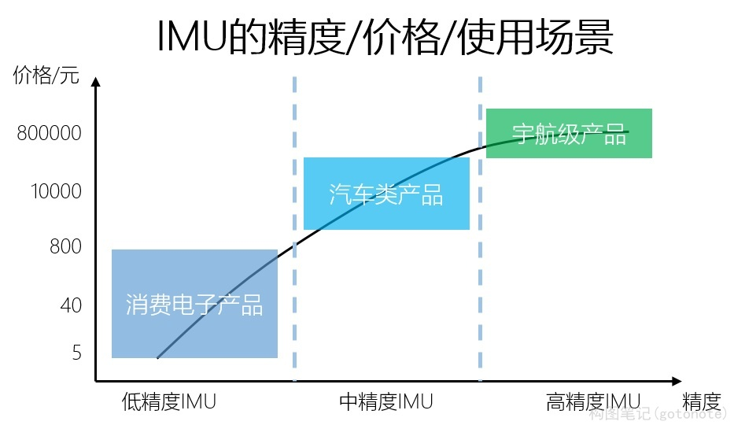
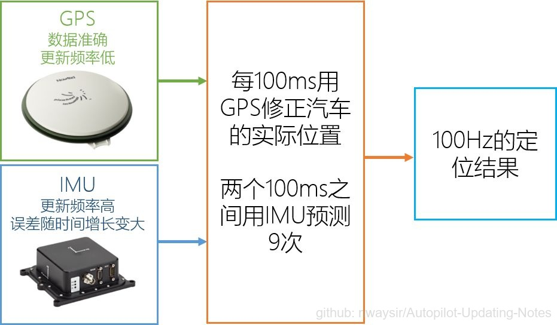
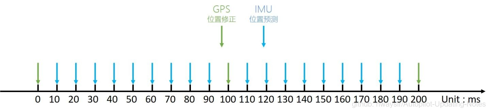

### 2.1.6 IMU惯性传感器

 

图1. 惯性传感器 

#### 2.1.6.1 原理

惯性测量单元IMU（Inertial Measurement Unit）。是一种用来测量物体三轴姿态角（或角速率）以及加速度的装置。一般IMU包括三轴陀螺仪及三轴加速度计，某些9轴IMU还包括三轴磁力计。

其中加速度计检测物体在载体坐标系统独立三轴的加速度信号，而陀螺仪检测载体相对于导航坐标系的角速度信号，测量物体在三维空间中的角速度和加速度，并以此解算出物体的姿态。IMU在导航中的核心价值无可替代，为了提高其可靠性，还可以为每个单轴配备更多种类的传感器。为保证测量准确性，一般IMU要安装在被测物体的重心上。

在自动驾驶使用中，GPS得到的经纬度信息作为输入信号传入IMU，IMU再通过串口线与控制器相连接，以此获取更高频率的定位结果。

 

图2. IMU原理 

#### 2.1.6.2 特性

IMU使用的场景很多。手机、智能手表、VR等普通的消费级电子产品，其所使用到的IMU一般精度较低且价格便宜；自动驾驶所使用到的IMU，价格从几百块到几万块不等，取决于自动驾驶汽车对定位精度的要求；像导弹、航空领域使用的IMU，通常精度要求更高，宇航级的IMU可以达到极高精度的推算，误差甚至可以小于一米。根据不同的使用场景，对IMU的精度有不同的要求。精度高，也意味着成本高。

IMU的精度、价格和使用场景，如下图3所示。

 

图3. IMU的精度&&价格 

#### 2.1.6.3 GPS + IMU 融合

除了精度和成本的特性外，IMU还有两个十分关键的特性。其一是更新频率高，工作频率可以达到100Hz以上; 其二是短时间内的推算精度高，不会有太大的误差。

GPS的定位频率只有10Hz，而IMU的两个特性刚好可以弥补GPS的劣势，和GPS组成定位的黄金搭档。

两个传感器共同工作时，可以给出频率100Hz的定位输出。下图是两传感器数据融合的原理图。

 

图4. GPS+IMU融合原理图 

运行在控制器上的软件对信息的处理流程在时间维度上类似下图。在0\~100ms的周期中，使用IMU进行9次位置的估计，待新的GPS定位数据进来时，则进行修正，以此实现高频率的定位结果输出。

 

图5. GPS+IMU信号处理时序图 

就这样，GPS与IMU便相辅相成地实现了无人车的稳定定位。
