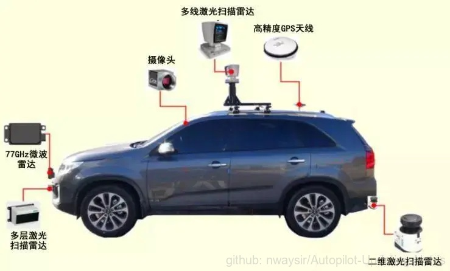

## 2.1 传感器

 

图1. 传感器 

自动驾驶借助各种传感器来感知周围环境，传感器从功能上主要划分为环境感知、状态感知。环境感知：获取车当前所处的环境信息，包括：周围的车辆、行人、交通标志、红绿灯、所处的场景（路口交汇处、停车场、高速公路）等。状态感知：获取车自身的状态，包括当前车辆的位置、航向角、速度、俯仰角等信息。

自动驾驶车所用到的传感器如图1所示，包括激光雷达、毫米波雷达、超声波雷达、相机、GPS、IMU等。