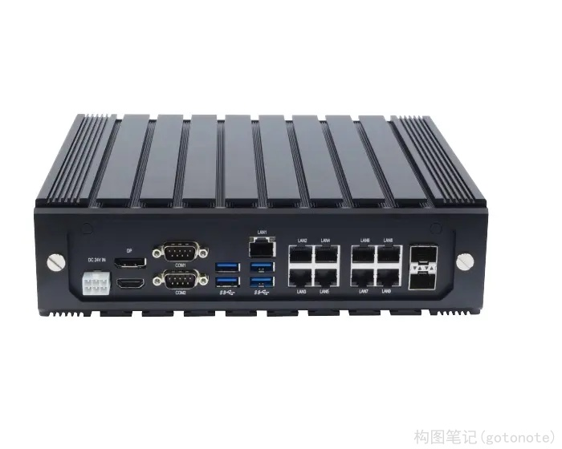
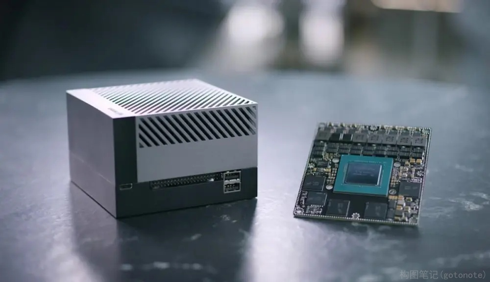
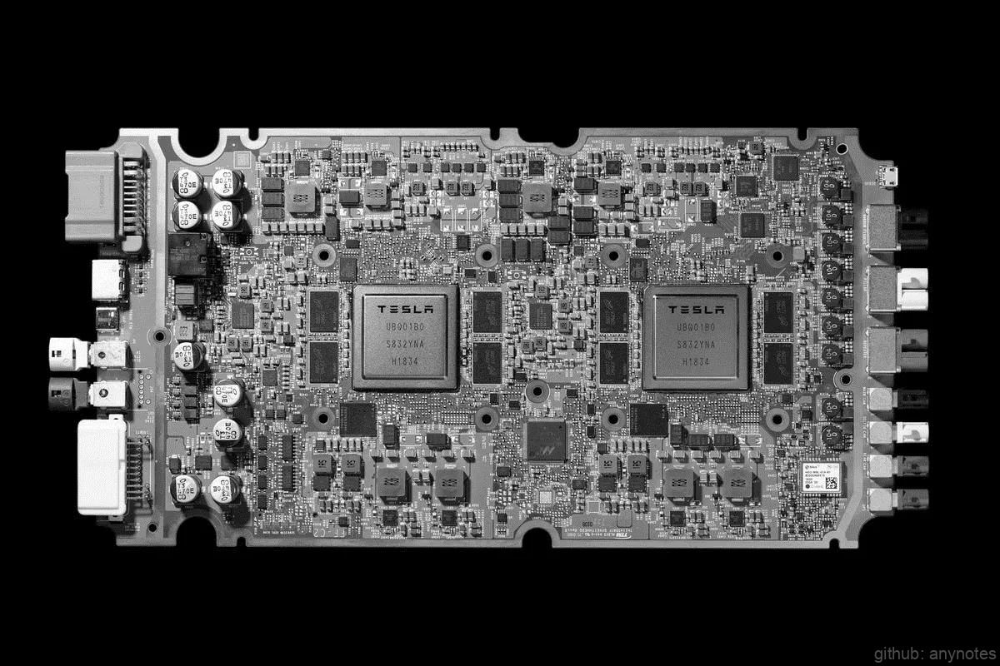

## 2.2 计算单元

如果说传感器是无人驾驶车的眼睛，那么计算单元则是无人驾驶车的大脑，传感器采集到的数据经过计算单元的运算，最后才能转化为控制信号，控制汽车的行驶。因此一个性能强劲的大脑显得尤为关键。

### 2.2.1 简介

无人驾驶车运行过程中需要处理各种不同类型的任务，所以目前大部分的无人驾驶计算平台都采用了异构平台的设计。无人驾驶车在CPU上运行操作系统和处理通用计算任务，在GPU上运行深度模型感知任务。

无人驾驶操作系统运行在CPU上，实现系统调度、进程管理、网络通信等基本功能。还有一部分通用任务也跑在CPU上，例如定位的NDT算法、卡尔曼滤波和控制相关的算法等。无人驾驶的环境感知算法运行在GPU上，目前主流的深度学习框架都支持通过GPU来加速运算，特别是一些图像算法。GPU的性能和无人驾驶车感知周围环境的能力息息相关，目前也有采用专门用于深度学习的芯片来处理此类任务，例如google的TPU等。

### 2.2.2 参考指标

**一、性能**

性能包括4个方面：CPU、GPU、内存和总线。

（1）CPU

CPU主要运行自动驾驶操作系统和进行通用计算，目前主流的通用CPU是Intel公司X86架构和ARM公司的ARM架构。Intel公司的志强系列处理器已经广泛应用于数据中心服务器和工控机上，ARM公司则是设计芯片然后把方案卖给各家公司让他们自己生产。目前各大公司发布的无人驾驶计算平台大部分都采用了ARM架构的处理器，主要原因是在汽车行业，芯片需要满足车规要求，而ARM处理器更方便集成。可以预见未来发布的无人驾驶计算平台会大量采用ARM架构的处理器做通用计算。

（2）GPU

目前主流的深度学习框架都是通过GPU进行训练和计算，因此无人驾驶计算平台大部分都采用GPU来进行深度学习计算。也有专门针对深度学习计算的芯片如TPU等，但目前这类芯片应用的生态和成熟度还不是很高。此外还有计算平台通过FPGA来做深度学习加速，成本会比GPU高。未来在无人驾驶大规模商业之后可能会出现专门针对深度学习计算的芯片。

（3）内存

内存包括CPU内存和显存，内存容量太小和刷新频率太低都会影响到系统性能。同时应当尽量避免内存条的设计，采用贴片内存，防止内存震动失效。

（4）总线

无人驾驶车的传感器和GPU等硬件设备都需要总线和计算平台相连接，总线带宽是系统性能的保障。同时计算平台的CPU需要采用冗余设计，2颗CPU之间通过总线连接，保证一颗CPU失效后，另一颗也能够继续工作。

**二、功耗**

一般系统的性能越强，则功耗越大。这时候需要考虑以下2个方面：电源和散热。

（1）电源

计算平台采用的是车载电源，考虑到人的安全，车载电源的电压限制在36v以下。一般车载电源能够提供的功率不超过1KW，也就是说在不进行任何改造的情况下，计算平台的功率限制在1KW以下。如果需要增加功率，要么采用多个电源，要么增大电源的电流。而1KW的电源电流约为42A，功率如果要增大到2KW，那么电流要增大到84A，我们知道电流越大，系统的发热会越大，所以也不是可以无限增加电源功率。

（2）散热

在功率非常大的时候，计算平台甚至需要水冷散热，采用风扇散热在汽车密闭的后备箱中没有排风口，无法有效的把热量排放出去。水冷散热的效果好，而且不需要排风口的设计，在功耗比较大的时候采用水冷散热是很好的选择。

**三、存储**

无人驾驶车需要存储高精度地图、日志、传感器数据等多种数据。这些信息的数据量很大，特别是传感器数据，在录制数据的时候，为了让数据能够及时保存，一般会选择固态硬盘。固态硬盘的写入速度快，并且相对机械硬盘也不容易失效，因此无人驾驶中都建议采用固态硬盘。

**四、接口**

计算平台除了需要注意性能、功耗和存储，还需要注意各种总线接口是否完备。目前传感器的接口丰富多样，摄像头采用的是USB接口，激光雷达采用的是以太网，毫米波雷达采用的是CAN总线，同时还需要预留足够的接口给其它外设，例如GPU、FPGA加速卡、V2X设备等。计算平台只有具备丰富的接口类型才能满足无人驾驶的要求。

### 2.2.3 计算平台

目前无人驾驶计算平台有3种选择。

**一、工控机**

 

图1. 工控机 

工控机采用CPU和GPU的组合，非常通用，同时又能够满足恶劣坏境的要求。但工控机的性能不太强劲，接口也不太丰富，适合初期的无人驾驶验证。

**二、芯片厂家计算平台**

 

图2. NVIDIA DRIVE Orin 

此类平台都是采用开发板设计，不太适合直接应用在无人驾驶中，好处是厂家提供了SDK，可以做到开箱即用。比如英伟达的DRIVE、德州仪器基于DSP的TDA2X Soc、恩智浦的BlueBox。

**三、车企自研计算平台**

 

图3. 特斯拉FSD芯片 

特斯拉的FSD就是自研的计算平台，集成度非常高，采用冗余设计，集成有专门的安全模块，性能和接口也能够满足特定场景的要求。自研芯片的解决方案非常适合无人驾驶，但是研发成本太高。

### 2.2.4 边缘计算
边缘计算是无人驾驶未来的发展趋势之一，传感器中会逐步集成融合和滤波算法，而不需要把所有的计算全都放在计算平台中完成。典型的应用场景是为了处理摄像头拍摄的大量图像，可以先用FPGA处理，然后输出处理好的结果给计算平台使用，这样不仅可以减轻系统带宽压力，同时还可以加快图片处理速度。

