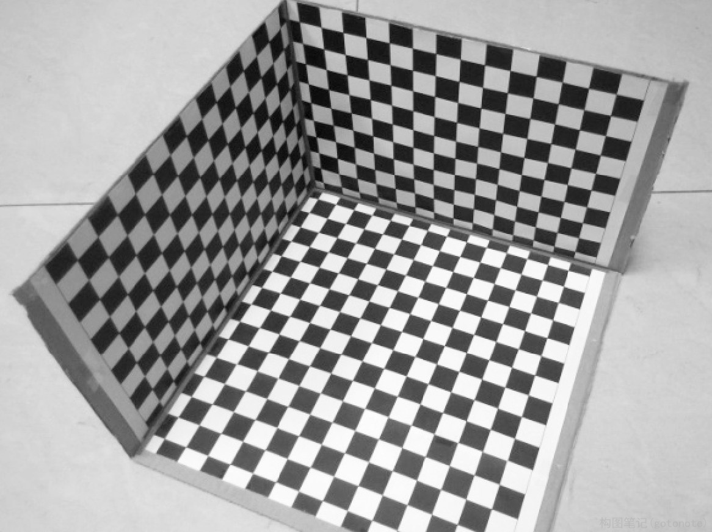
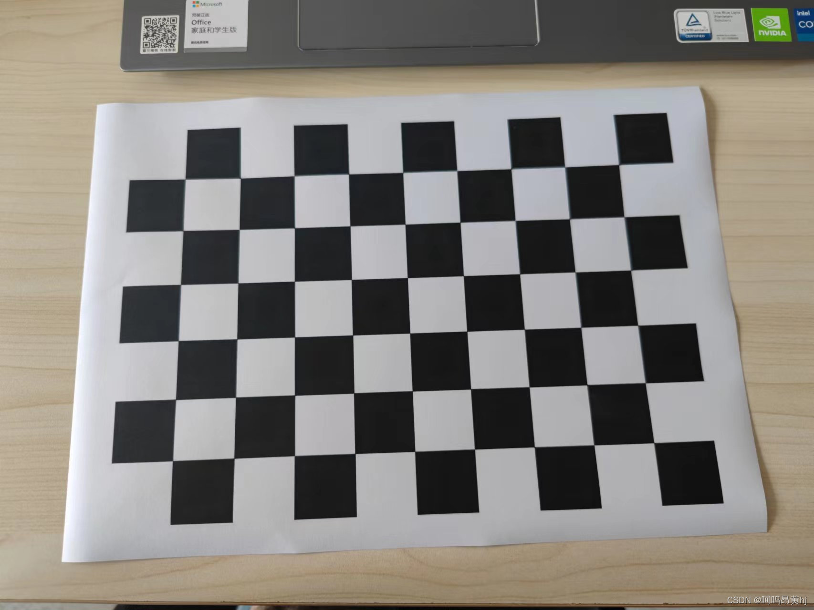
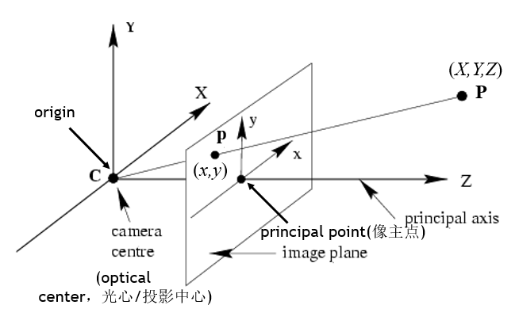
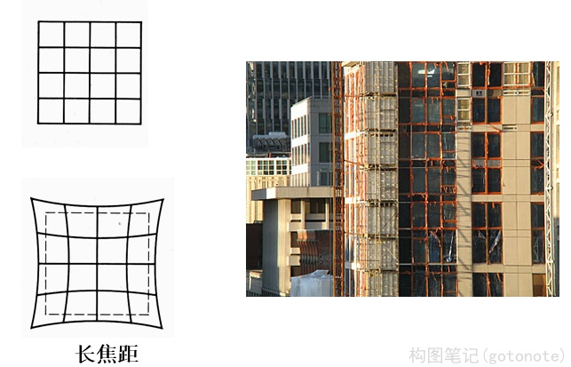
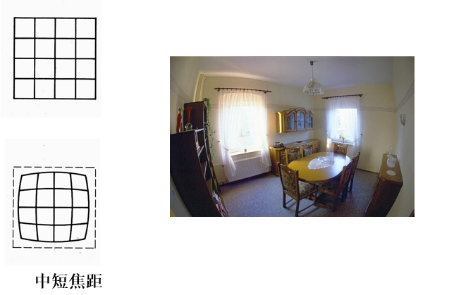
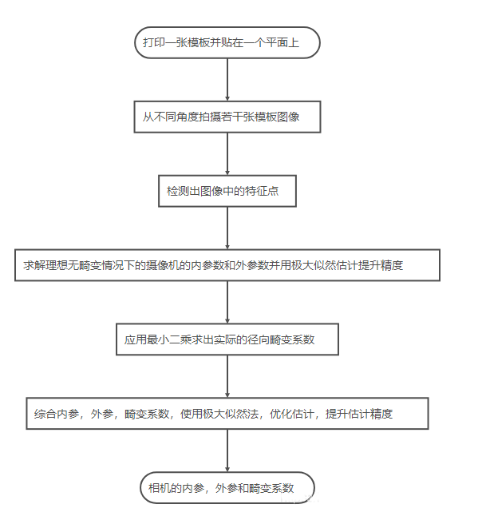

# 张正友相机标定法

张正友相机标定法是张正友教授 1998 年提出的单平面棋盘格的相机标定方法。传统标定法的标定板是需要三维的，需要非常精确，这很难制作，而张正友教授提出的方法介于传统标定法和自标定法之间，但克服了传统标定法需要的高精度标定物的缺点，而仅需使用一个打印出来的棋盘格就可以。同时也相对于自标定而言，提高了精度，便于操作。因此张氏标定法被广泛应用于计算机视觉方面。

<div align=center>
 
 
</div>
<div align=center>图1. 传统标定板 VS 张正友标定板 </div>

## 一、相机标定介绍

相机标定指建立相机图像像素位置与场景点位置之间的关系，根据相机成像模型，由特征点在图像中坐标与世界坐标的对应关系，求解相机模型的参数。相机需要标定的模型参数包括内部参数和外部参数。

针孔相机成像原理其实就是利用投影将真实的三维世界坐标转换到二维的相机坐标上去，其模型示意图如下图所示：

<div align=center>

</div>
<div align=center>图2. 针孔相机成像原理 </div>

从图中我们可以看出，在世界坐标中的一条直线上的点在相机上只呈现出了一个点，其中发生了非常大的变化，同时也损失和很多重要的信息，这正是我们 3D 重建、目标检测与识别领域的重点和难点。实际中，镜头并非理想的透视成像，带有不同程度的畸变。理论上镜头的畸变包括径向畸变和切向畸变，切向畸变影响较小，通常只考虑径向畸变。

径向畸变：径向畸变主要由镜头径向曲率产生（光线在远离透镜中心的地方比靠近中心的地方更加弯曲）。导致真实成像点向内或向外偏离理想成像点。其中畸变像点相对于理想像点沿径向向外偏移，远离中心的，称为枕形畸变；径向畸点相对于理想点沿径向向中心靠拢，称为桶状畸变。

<div align=center>


</div>
<div align=center>图3.  枕形畸变 、桶状畸变 </div>

数学公式来表示：

$$
x \sim K[R|t]X
$$

即

$$
\begin{bmatrix} 
x \\ 
y \\ 
1 \\ 
\end{bmatrix} 
\sim
\begin{bmatrix} 
f_a &s &x_0 \\
0 &f &y_0\\
0 &0 &1 \\ 
\end{bmatrix}
[R|t]
\begin{bmatrix}
X \\
Y \\
Z \\
1 \\
\end{bmatrix} =
\begin{bmatrix} 
a &b &c &d \\
e &f &g &h \\
i &j &k &l \\ 
\end{bmatrix}
\begin{bmatrix}
X \\
Y \\
Z \\
1 \\
\end{bmatrix}
$$

其中， $x$ 为相机中的坐标； $X$ 为真实世界坐标； $K$ 为内参矩阵； $[R|t]$ 为外参矩阵;

 $K$ 为内参矩阵，是相机内部参数组成的一个3*3的矩阵，其中， $f$ 代表焦距； $s$ 为畸变参数, $(x_0,y_0), x_0=\alpha y_0$ 为中心点坐标， $\alpha$ 为纵横比例参数，我们可以默认设为1，所以 $x_0=y_0$ 。

 $[R|t]$ 为外参矩阵， $R$ 是描述照相机方向的旋转矩阵， $t$ 是描述照相机中心位置的三维平移向量。

## 二、算法原理

### (一) 整体流程

<div align=center>

</div>
<div align=center>图4. 整体流程 </div>

### (二) 模型假设

2D 图像点： $m = [u, v]^T$ 

3D 空间点： $M = [X, Y, Z]^T$

齐次坐标： $\tilde{m} = [u, v, 1]^T$ , $\tilde{M} = [X, Y, Z, 1]^T$ 

空间坐标到图像坐标的映射：

$$
s\tilde{m} = A[R t]\tilde{M}, 
A = 
\begin{bmatrix} 
\alpha &\gamma &u_0 \\
0 &\beta &v_0 \\
0 &0 &1 \\ 
\end{bmatrix}
$$

其中，

$$
\begin{aligned}
s: 世界坐标系到图像坐标系的尺度因子 \\
A: 相机内参矩阵 \\
(u_0, v_0): 像的中心坐标 \\
\alpha, \beta : 焦距与像素横纵比的融合 \\
\gamma : 径向畸变参数 \\
\end{aligned}
$$

不妨设棋盘格 Z=0,

定义旋转矩阵的第 $i$ 列为 $r_i$ ,则有:

$$
s
\begin{bmatrix} 
u \\ 
v \\ 
1 \\ 
\end{bmatrix} =
A
\begin{bmatrix} 
r_1, r_2, r_3, t \\
\end{bmatrix}
\begin{bmatrix}
X \\
Y \\
0 \\
1 \\
\end{bmatrix} =
A
\begin{bmatrix} 
r_1, r_2, t \\
\end{bmatrix}
\begin{bmatrix}
X \\
Y \\
1 \\
\end{bmatrix}
$$

于是空间到图像的映射，简写为：

$$
s \tilde{m} = H \tilde{M}, \\
H = A 
\begin{bmatrix} 
r_1, r_2, t \\
\end{bmatrix}
$$

### (三) 模型求解

**1. 内外参数求解**

令 $H=[h_1, h_2, h_3]$ , 则 $[h1, h2, h3] = \lambda A[r_1, r_2, t]$ , 其中 $H$ 为一个 3*3 的矩阵，并且有一个元素作为齐次坐标。因此， $H$ 有 8 个自由度。

现在有 8 个自由度需要求解，所以需要四个对应点。也就是 **4个点** 就可以求出图像平面到世界平面的单应性矩阵 $H$ 。

通过 4 个点，我们就可以获得单应性矩阵 $H$ 。但 $H$ 是内参阵和外参阵的合体。我们想要最终分别获得内参和外参。所以需要想个办法，先把内参求出来, 然后外参也就随之解出了。

观察一下这个式子：

$[h1, h2, h3] = \lambda A[r_1, r_2, t]$

我们可以知道以下约束条件:

*  $r_1,r_2$  正交，也就是说  $r_1r_2=0$。其实这个不难理解，因为 $r_1,r_2$ 是分别绕x轴和y轴得到的，而x轴和y轴均垂直z轴。

* 旋转向量的模为1，也就是说 $|r_1|=|r_2|=1$ ,这是因为旋转不改变尺度。
  
根据这两个约束条件，经过数学变换，我们可以得到：

$$
{h_1}^{-T} A^{-T} A^{-1} h_2 = 0 \\
{h_1}^{-T} A^{-T} A^{-1} h_1 =  {h_2}^{-T} A^{-T} A^{-1} h_2
$$

观察上面的两个式子，我们可以看出，由于 $h_1$ 和 $h_2$ 是通过单应性求解出来的，所以我们要求解的参数就变成 $A$ 矩阵中未知的5个参数。我们可以通过三个单应性矩阵来求解这5个参数，利用3个单应性矩阵在2个约束下可以生成6个方程。其中，3个单应性矩阵可以通过3张对同一标定板不同角度和高度的照片获得。

用数学公式来表达如下：

$$
\begin{aligned} 
B &= A^{-T} A^{-1} \\
&= \begin{bmatrix} 
B_{11}, B_{21}, B_{31} \\
B_{12}, B_{22}, B_{32} \\
B_{13}, B_{23}, B_{33} \\
\end{bmatrix} \\
&= \begin{bmatrix} 
\frac{1}{\alpha^2} &-\frac{\gamma}{\alpha^2\beta} &\frac{v_0 \gamma - u_0 \beta}{\alpha^2\beta} \\
-\frac{\gamma}{\alpha^2\beta} &\frac{\gamma}{\alpha^2\beta} + \frac{1}{\beta ^ 2} &-\frac{\gamma (v_0 \gamma - u_0 \beta)}{\alpha^2\beta^2} - \frac{{v_0}^2}{\beta ^ 2} \\
\frac{v_0 \gamma - u_0 \beta}{\alpha^2\beta} &-\frac{\gamma (v_0 \gamma - u_0 \beta)}{\alpha^2\beta^2} - \frac{{v_0}^2}{\beta ^ 2} &\frac{(v_0 \gamma - u_0 \beta)^2}{\alpha^2\beta^2} + \frac{{v_0}^2}{\beta ^ 2} + 1 \\
\end{bmatrix} \\
\end{aligned}
$$

发现 $B$ 是一个对称阵，所以 $B$ 的有效元素就剩下6个，即

$$
b = \begin{bmatrix}
B_{11},B_{12},B_{22},B_{13},B_{23},B_{33}
\end{bmatrix}
$$

进一步化简：

$$
h_{i}^T B h_j = v_{ij}^{T}b
$$

通过计算，我们可以得到

$$
v_{ij} = 
\begin{bmatrix}
h_{i1}h_{j1}, h_{i1}h_{j2}+h_{i2}h_{j1}, h_{i2}h_{j2}, h_{i3}h_{j1}+h_{i1}h_{j3}, h_{i3}h_{j2}+h_{i2}h_{j3}, h_{i3}h_{j3}
\end{bmatrix} ^ T
$$

利用上面提到的两个约束条件，我们可以得到下面的方程组：

$$
\begin{bmatrix}
v_{12}^T \\
(v_11 - v_22) ^ T
\end{bmatrix}
b = 0
$$

这个方程组的本质和前面那两个用 $h$ 和 $A$ 组成的约束条件方程组是一样的。

通过至少含一个棋盘格的3幅图像，应用上述公式我们就可以估算出 $B$ 了。得到 $B$ 后，我们通过 $cholesky$ 分解 ，就可以得到摄相机机的内参阵 $A$ 的6个自由度，即：

$$
\begin{aligned}
v_0 &= (B_{12}B_{13} -  B_{11}B_{23}) / (B_{11}B_{22} -  B_{12}^2) \\
\lambda &= B_{33} - [B_{13}^2 + v_0(B_{12}B_{13} -  B_{11}B_{23})] / B_{11} \\
\alpha &= \sqrt{\lambda / B_{11}} \\
\beta &= \sqrt{\lambda / (B_{11}B_{22} -  B_{12}^2)} \\
\gamma &= -B_{12} \alpha ^ 2 \beta / \lambda \\
u_0 &= \gamma v_0 / \alpha - B_{13} \alpha ^ 2 / \lambda
\end{aligned} 
$$

再根据 $[h1, h2, h3] = \lambda A[r_1, r_2, t]$ 化简可得外部参数，即：

$$
\begin{aligned}
r_1 &= \lambda A^{-1} h_1 \\
r_2 &= \lambda A^{-1} h_2 \\
r_3 &= r_1 \times r_2 \\
t &= \lambda A^{-1} h_3 \\
\lambda &= 1 / \parallel A^{-1} h_1 \parallel \\
&= 1/ \parallel A^{-1} h_2 \parallel \\
\end{aligned}
$$

**2. 畸变系数求解**

在文章的开始，我们就讲到真实的镜头并非理想的透视成像，而是带有不同程度的畸变。理论上镜头的畸变包括径向畸变和切向畸变，切向畸变影响较小，通常只考虑径向畸变，而且在径向畸变的求解中，仅考虑了起主导的二元泰勒级数展开的前两个系数。

**3. 精度优化**

在张正友标定法中，使用了两次极大似然估计策略，第一次是在不考虑畸变的情况下求解内参和外参，第二次是求解实际的畸变系数。

## 三、算法实现

**1. main.py**

```python
#!usr/bin/env/ python
# _*_ coding:utf-8 _*_
 
import cv2 as cv
import numpy as np
import os
from step.homography import get_homography
from step.intrinsics import get_intrinsics_param
from step.extrinsics import get_extrinsics_param
from step.distortion import get_distortion
from step.refine_all import refinall_all_param
 
 
def calibrate():
    #求单应矩阵
    H = get_homography(pic_points, real_points_x_y)
 
    #求内参
    intrinsics_param = get_intrinsics_param(H)
 
    #求对应每幅图外参
    extrinsics_param = get_extrinsics_param(H, intrinsics_param)
 
    #畸变矫正
    k = get_distortion(intrinsics_param, extrinsics_param, pic_points, real_points_x_y)
 
    #微调所有参数
    [new_intrinsics_param, new_k, new_extrinsics_param]  = refinall_all_param(intrinsics_param,
                                                            k, extrinsics_param, real_points, pic_points)
 
    print("intrinsics_parm:\t", new_intrinsics_param)
    print("distortionk:\t", new_k)
    print("extrinsics_parm:\t", new_extrinsics_param)
 
 
if __name__ == "__main__":
    file_dir = r'..\pic'
    # 标定所用图像
    pic_name = os.listdir(file_dir)
 
    # 由于棋盘为二维平面，设定世界坐标系在棋盘上，一个单位代表一个棋盘宽度，产生世界坐标系三维坐标
    cross_corners = [9, 6] #棋盘方块交界点排列
    real_coor = np.zeros((cross_corners[0] * cross_corners[1], 3), np.float32)
    real_coor[:, :2] = np.mgrid[0:9, 0:6].T.reshape(-1, 2)
 
    real_points = []
    real_points_x_y = []
    pic_points = []
 
    for pic in pic_name:
        pic_path = os.path.join(file_dir, pic)
        pic_data = cv.imread(pic_path)
 
        # 寻找到棋盘角点
        succ, pic_coor = cv.findChessboardCorners(pic_data, (cross_corners[0], cross_corners[1]), None)
 
        if succ:
            # 添加每幅图的对应3D-2D坐标
            pic_coor = pic_coor.reshape(-1, 2)
            pic_points.append(pic_coor)
 
            real_points.append(real_coor)
            real_points_x_y.append(real_coor[:, :2])
    calibrate()

```

**2. homography.py**

这是用于求解单应性矩阵的文件

```python
#!usr/bin/env/ python
# _*_ coding:utf-8 _*_
 
import numpy as np
from scipy import optimize as opt
 
 
#求输入数据的归一化矩阵
def normalizing_input_data(coor_data):
    x_avg = np.mean(coor_data[:, 0])
    y_avg = np.mean(coor_data[:, 1])
    sx = np.sqrt(2) / np.std(coor_data[:, 0])
    sy = np.sqrt(2) / np.std(coor_data[:, 1])
 
    norm_matrix = np.matrix([[sx, 0, -sx * x_avg],
                             [0, sy, -sy * y_avg],
                             [0, 0, 1]])
    return norm_matrix
 
 
#求取初始估计的单应矩阵
def get_initial_H(pic_coor, real_coor):
    # 获得归一化矩阵
    pic_norm_mat = normalizing_input_data(pic_coor)
    real_norm_mat = normalizing_input_data(real_coor)
 
    M = []
    for i in range(len(pic_coor)):
        #转换为齐次坐标
        single_pic_coor = np.array([pic_coor[i][0], pic_coor[i][1], 1])
        single_real_coor = np.array([real_coor[i][0], real_coor[i][1], 1])
 
        #坐标归一化
        pic_norm = np.dot(pic_norm_mat, single_pic_coor)
        real_norm = np.dot(real_norm_mat, single_real_coor)
 
        #构造M矩阵
        M.append(np.array([-real_norm.item(0), -real_norm.item(1), -1,
                      0, 0, 0,
                      pic_norm.item(0) * real_norm.item(0), pic_norm.item(0) * real_norm.item(1), pic_norm.item(0)]))
 
        M.append(np.array([0, 0, 0,
                      -real_norm.item(0), -real_norm.item(1), -1,
                      pic_norm.item(1) * real_norm.item(0), pic_norm.item(1) * real_norm.item(1), pic_norm.item(1)]))
 
    #利用SVD求解M * h = 0中h的解
    U, S, VT = np.linalg.svd((np.array(M, dtype='float')).reshape((-1, 9)))
    # 最小的奇异值对应的奇异向量,S求出来按大小排列的，最后的最小
    H = VT[-1].reshape((3, 3))
    H = np.dot(np.dot(np.linalg.inv(pic_norm_mat), H), real_norm_mat)
    H /= H[-1, -1]
 
    return H
 
 
#返回估计坐标与真实坐标偏差
def value(H, pic_coor, real_coor):
    Y = np.array([])
    for i in range(len(real_coor)):
        single_real_coor = np.array([real_coor[i, 0], real_coor[i, 1], 1])
        U = np.dot(H.reshape(3, 3), single_real_coor)
        U /= U[-1]
        Y = np.append(Y, U[:2])
 
    Y_NEW = (pic_coor.reshape(-1) - Y)
 
    return Y_NEW
 
 
#返回对应jacobian矩阵
def jacobian(H, pic_coor, real_coor):
    J = []
    for i in range(len(real_coor)):
        sx = H[0]*real_coor[i][0] + H[1]*real_coor[i][1] +H[2]
        sy = H[3]*real_coor[i][0] + H[4]*real_coor[i][1] +H[5]
        w = H[6]*real_coor[i][0] + H[7]*real_coor[i][1] +H[8]
        w2 = w * w
 
        J.append(np.array([real_coor[i][0]/w, real_coor[i][1]/w, 1/w,
                           0, 0, 0,
                           -sx*real_coor[i][0]/w2, -sx*real_coor[i][1]/w2, -sx/w2]))
 
        J.append(np.array([0, 0, 0,
                           real_coor[i][0]/w, real_coor[i][1]/w, 1/w,
                           -sy*real_coor[i][0]/w2, -sy*real_coor[i][1]/w2, -sy/w2]))
 
    return np.array(J)
 
 
#利用Levenberg Marquart算法微调H
def refine_H(pic_coor, real_coor, initial_H):
    initial_H = np.array(initial_H)
    final_H = opt.leastsq(value,
                          initial_H,
                          Dfun=jacobian,
                          args=(pic_coor, real_coor))[0]
 
    final_H /= np.array(final_H[-1])
    return final_H
 
 
#返回微调后的H
def get_homography(pic_coor, real_coor):
    refined_homographies =[]
 
    error = []
    for i in range(len(pic_coor)):
        initial_H = get_initial_H(pic_coor[i], real_coor[i])
        final_H = refine_H(pic_coor[i], real_coor[i], initial_H)
        refined_homographies.append(final_H)
 
    return np.array(refined_homographies)

```

**3. intrinsics.py**

这是用于求解内参矩阵的文件

```python
#!usr/bin/env/ python
# _*_ coding:utf-8 _*_
 
import numpy as np
 
 
#返回pq位置对应的v向量
def create_v(p, q, H):
    H = H.reshape(3, 3)
    return np.array([
        H[0, p] * H[0, q],
        H[0, p] * H[1, q] + H[1, p] * H[0, q],
        H[1, p] * H[1, q],
        H[2, p] * H[0, q] + H[0, p] * H[2, q],
        H[2, p] * H[1, q] + H[1, p] * H[2, q],
        H[2, p] * H[2, q]
    ])
 
 
#返回相机内参矩阵A
def get_intrinsics_param(H):
    #构建V矩阵
    V = np.array([])
    for i in range(len(H)):
        V = np.append(V, np.array([create_v(0, 1, H[i]), create_v(0, 0 , H[i])- create_v(1, 1 , H[i])]))
 
    #求解V*b = 0中的b
    U, S, VT = np.linalg.svd((np.array(V, dtype='float')).reshape((-1, 6)))
    #最小的奇异值对应的奇异向量,S求出来按大小排列的，最后的最小
    b = VT[-1]
 
    #求取相机内参
    w = b[0] * b[2] * b[5] - b[1] * b[1] * b[5] - b[0] * b[4] * b[4] + 2 * b[1] * b[3] * b[4] - b[2] * b[3] * b[3]
    d = b[0] * b[2] - b[1] * b[1]
 
    alpha = np.sqrt(w / (d * b[0]))
    beta = np.sqrt(w / d**2 * b[0])
    gamma = np.sqrt(w / (d**2 * b[0])) * b[1]
    uc = (b[1] * b[4] - b[2] * b[3]) / d
    vc = (b[1] * b[3] - b[0] * b[4]) / d
 
    return np.array([
        [alpha, gamma, uc],
        [0,     beta,  vc],
        [0,     0,      1]
    ])

```

**4. extrinsics.py**

这是用于求解外参矩阵的文件

```python 
#!usr/bin/env/ python
# _*_ coding:utf-8 _*_
 
import numpy as np
 
#返回每一幅图的外参矩阵[R|t]
def get_extrinsics_param(H, intrinsics_param):
    extrinsics_param = []
 
    inv_intrinsics_param = np.linalg.inv(intrinsics_param)
    for i in range(len(H)):
        h0 = (H[i].reshape(3, 3))[:, 0]
        h1 = (H[i].reshape(3, 3))[:, 1]
        h2 = (H[i].reshape(3, 3))[:, 2]
 
        scale_factor = 1 / np.linalg.norm(np.dot(inv_intrinsics_param, h0))
 
        r0 = scale_factor * np.dot(inv_intrinsics_param, h0)
        r1 = scale_factor * np.dot(inv_intrinsics_param, h1)
        t = scale_factor * np.dot(inv_intrinsics_param, h2)
        r2 = np.cross(r0, r1)
 
        R = np.array([r0, r1, r2, t]).transpose()
        extrinsics_param.append(R)
 
    return extrinsics_param

```

**5. distortion.py**

这是用于求解畸变矫正系数的文件

```python
#!usr/bin/env/ python
# _*_ coding:utf-8 _*_
 
import numpy as np
 
#返回畸变矫正系数k0,k1
def get_distortion(intrinsic_param, extrinsic_param, pic_coor, real_coor):
    D = []
    d = []
    for i in range(len(pic_coor)):
        for j in range(len(pic_coor[i])):
            #转换为齐次坐标
            single_coor = np.array([(real_coor[i])[j, 0], (real_coor[i])[j, 1], 0, 1])
 
            #利用现有内参及外参求出估计图像坐标
            u = np.dot(np.dot(intrinsic_param, extrinsic_param[i]), single_coor)
            [u_estim, v_estim] = [u[0]/u[2], u[1]/u[2]]
 
            coor_norm = np.dot(extrinsic_param[i], single_coor)
            coor_norm /= coor_norm[-1]
 
            #r = np.linalg.norm((real_coor[i])[j])
            r = np.linalg.norm(coor_norm)
 
 
            D.append(np.array([(u_estim - intrinsic_param[0, 2]) * r ** 2, (u_estim - intrinsic_param[0, 2]) * r ** 4]))
            D.append(np.array([(v_estim - intrinsic_param[1, 2]) * r ** 2, (v_estim - intrinsic_param[1, 2]) * r ** 4]))
 
            #求出估计坐标与真实坐标的残差
            d.append(pic_coor[i][j, 0] - u_estim)
            d.append(pic_coor[i][j, 1] - v_estim)
            '''
            
            D.append(np.array([(pic_coor[i][j, 0] - intrinsic_param[0, 2]) * r ** 2, (pic_coor[i][j, 0] - intrinsic_param[0, 2]) * r ** 4]))
            D.append(np.array([(pic_coor[i][j, 1] - intrinsic_param[1, 2]) * r ** 2, (pic_coor[i][j, 1] - intrinsic_param[1, 2]) * r ** 4]))
            #求出估计坐标与真实坐标的残差
            d.append(u_estim - pic_coor[i][j, 0])
            d.append(v_estim - pic_coor[i][j, 1])
            '''
 
    D = np.array(D)
    temp = np.dot(np.linalg.inv(np.dot(D.T, D)), D.T)
    k = np.dot(temp, d)
    '''
    #也可利用SVD求解D * k = d中的k
    U, S, Vh=np.linalg.svd(D, full_matrices=False)
    temp_S = np.array([[S[0], 0],
                       [0, S[1]]])
    temp_res = np.dot(Vh.transpose(), np.linalg.inv(temp_S))
    temp_res_res = np.dot(temp_res, U.transpose())
    k = np.dot(temp_res_res, d)
    '''
    return k

```

**6. refine_all.py**

这是用于微调参数的文件

```python
#!usr/bin/env/ python
# _*_ coding:utf-8 _*_
 
import numpy as np
import math
from scipy import optimize as opt
 
#微调所有参数
def refinall_all_param(A, k, W, real_coor, pic_coor):
    #整合参数
    P_init = compose_paramter_vector(A, k, W)
 
    #复制一份真实坐标
    X_double = np.zeros((2 * len(real_coor) * len(real_coor[0]), 3))
    Y = np.zeros((2 * len(real_coor) * len(real_coor[0])))
 
    M = len(real_coor)
    N = len(real_coor[0])
    for i in range(M):
        for j in range(N):
            X_double[(i * N + j) * 2] = (real_coor[i])[j]
            X_double[(i * N + j) * 2 + 1] = (real_coor[i])[j]
            Y[(i * N + j) * 2] = (pic_coor[i])[j, 0]
            Y[(i * N + j) * 2 + 1] = (pic_coor[i])[j, 1]
 
    #微调所有参数
    P = opt.leastsq(value,
                    P_init,
                    args=(W, real_coor, pic_coor),
                    Dfun=jacobian)[0]
 
    #raial_error表示利用标定后的参数计算得到的图像坐标与真实图像坐标点的平均像素距离
    error = value(P, W, real_coor, pic_coor)
    raial_error = [np.sqrt(error[2 * i]**2 + error[2 * i + 1]**2) for i in range(len(error) // 2)]
 
    print("total max error:\t", np.max(raial_error))
 
    #返回拆解后参数，分别为内参矩阵，畸变矫正系数，每幅图对应外参矩阵
    return decompose_paramter_vector(P)
 
 
#把所有参数整合到一个数组内
def compose_paramter_vector(A, k, W):
    alpha = np.array([A[0, 0], A[1, 1], A[0, 1], A[0, 2], A[1, 2], k[0], k[1]])
    P = alpha
    for i in range(len(W)):
        R, t = (W[i])[:, :3], (W[i])[:, 3]
 
        #旋转矩阵转换为一维向量形式
        zrou = to_rodrigues_vector(R)
 
        w = np.append(zrou, t)
        P = np.append(P, w)
    return P
 
 
#分解参数集合，得到对应的内参，外参，畸变矫正系数
def decompose_paramter_vector(P):
    [alpha, beta, gamma, uc, vc, k0, k1] = P[0:7]
    A = np.array([[alpha, gamma, uc],
                  [0, beta, vc],
                  [0, 0, 1]])
    k = np.array([k0, k1])
    W = []
    M = (len(P) - 7) // 6
 
    for i in range(M):
        m = 7 + 6 * i
        zrou = P[m:m+3]
        t = (P[m+3:m+6]).reshape(3, -1)
 
        #将旋转矩阵一维向量形式还原为矩阵形式
        R = to_rotation_matrix(zrou)
 
        #依次拼接每幅图的外参
        w = np.concatenate((R, t), axis=1)
        W.append(w)
 
    W = np.array(W)
    return A, k, W
 
 
#返回从真实世界坐标映射的图像坐标
def get_single_project_coor(A, W, k, coor):
    single_coor = np.array([coor[0], coor[1], coor[2], 1])
 
    #'''
    coor_norm = np.dot(W, single_coor)
    coor_norm /= coor_norm[-1]
 
    #r = np.linalg.norm(coor)
    r = np.linalg.norm(coor_norm)
 
    uv = np.dot(np.dot(A, W), single_coor)
    uv /= uv[-1]
 
    #畸变
    u0 = uv[0]
    v0 = uv[1]
 
    uc = A[0, 2]
    vc = A[1, 2]
 
    #u = (uc * r**2 * k[0] + uc * r**4 * k[1] - u0) / (r**2 * k[0] + r**4 * k[1] - 1)
    #v = (vc * r**2 * k[0] + vc * r**4 * k[1] - v0) / (r**2 * k[0] + r**4 * k[1] - 1)
    u = u0 + (u0 - uc) * r**2 * k[0] + (u0 - uc) * r**4 * k[1]
    v = v0 + (v0 - vc) * r**2 * k[0] + (v0 - vc) * r**4 * k[1]
    '''
    uv = np.dot(W, single_coor)
    uv /= uv[-1]
    # 透镜矫正
    x0 = uv[0]
    y0 = uv[1]
    r = np.linalg.norm(np.array([x0, y0]))
    k0 = 0
    k1 = 0
    x = x0 * (1 + r ** 2 * k0 + r ** 4 * k1)
    y = y0 * (1 + r ** 2 * k0 + r ** 4 * k1)
    #u = A[0, 0] * x + A[0, 2]
    #v = A[1, 1] * y + A[1, 2]
    [u, v, _] = np.dot(A, np.array([x, y, 1]))
    '''
 
    return np.array([u, v])
 
 
#返回所有点的真实世界坐标映射到的图像坐标与真实图像坐标的残差
def value(P, org_W, X, Y_real):
    M = (len(P) - 7) // 6
    N = len(X[0])
    A = np.array([
        [P[0], P[2], P[3]],
        [0, P[1], P[4]],
        [0, 0, 1]
    ])
    Y = np.array([])
 
    for i in range(M):
        m = 7 + 6 * i
 
        #取出当前图像对应的外参
        w = P[m:m + 6]
 
        # 不用旋转矩阵的变换是因为会有精度损失
        '''
        R = to_rotation_matrix(w[:3])
        t = w[3:].reshape(3, 1)
        W = np.concatenate((R, t), axis=1)
        '''
        W = org_W[i]
        #计算每幅图的坐标残差
        for j in range(N):
            Y = np.append(Y, get_single_project_coor(A, W, np.array([P[5], P[6]]), (X[i])[j]))
 
    error_Y  =  np.array(Y_real).reshape(-1) - Y
 
    return error_Y
 
 
#计算对应jacobian矩阵
def jacobian(P, WW, X, Y_real):
    M = (len(P) - 7) // 6
    N = len(X[0])
    K = len(P)
    A = np.array([
        [P[0], P[2], P[3]],
        [0, P[1], P[4]],
        [0, 0, 1]
    ])
 
    res = np.array([])
 
    for i in range(M):
        m = 7 + 6 * i
 
        w = P[m:m + 6]
        R = to_rotation_matrix(w[:3])
        t = w[3:].reshape(3, 1)
        W = np.concatenate((R, t), axis=1)
 
        for j in range(N):
            res = np.append(res, get_single_project_coor(A, W, np.array([P[5], P[6]]), (X[i])[j]))
 
    #求得x, y方向对P[k]的偏导
    J = np.zeros((K, 2 * M * N))
    for k in range(K):
        J[k] = np.gradient(res, P[k])
 
    return J.T
 
 
#将旋转矩阵分解为一个向量并返回，Rodrigues旋转向量与矩阵的变换,最后计算坐标时并未用到，因为会有精度损失
def to_rodrigues_vector(R):
    p = 0.5 * np.array([[R[2, 1] - R[1, 2]],
                        [R[0, 2] - R[2, 0]],
                        [R[1, 0] - R[0, 1]]])
    c = 0.5 * (np.trace(R) - 1)
 
    if np.linalg.norm(p) == 0:
        if c == 1:
            zrou = np.array([0, 0, 0])
        elif c == -1:
            R_plus = R + np.eye(3, dtype='float')
 
            norm_array = np.array([np.linalg.norm(R_plus[:, 0]),
                                   np.linalg.norm(R_plus[:, 1]),
                                   np.linalg.norm(R_plus[:, 2])])
            v = R_plus[:, np.where(norm_array == max(norm_array))]
            u = v / np.linalg.norm(v)
            if u[0] < 0 or (u[0] == 0 and u[1] < 0) or (u[0] == u[1] and u[0] == 0 and u[2] < 0):
                u = -u
            zrou = math.pi * u
        else:
            zrou = []
    else:
        u = p / np.linalg.norm(p)
        theata = math.atan2(np.linalg.norm(p), c)
        zrou = theata * u
 
    return zrou
 
 
#把旋转矩阵的一维向量形式还原为旋转矩阵并返回
def to_rotation_matrix(zrou):
    theta = np.linalg.norm(zrou)
    zrou_prime = zrou / theta
 
    W = np.array([[0, -zrou_prime[2], zrou_prime[1]],
                  [zrou_prime[2], 0, -zrou_prime[0]],
                  [-zrou_prime[1], zrou_prime[0], 0]])
    R = np.eye(3, dtype='float') + W * math.sin(theta) + np.dot(W, W) * (1 - math.cos(theta))
 
    return R

```