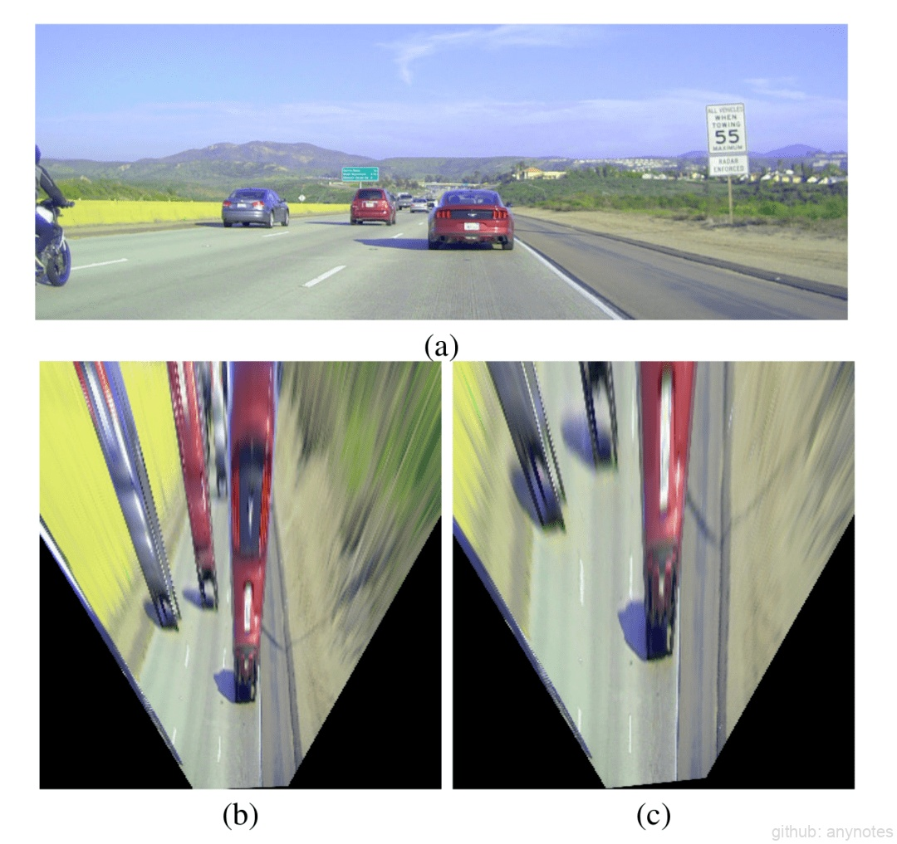
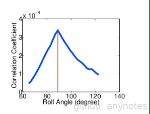
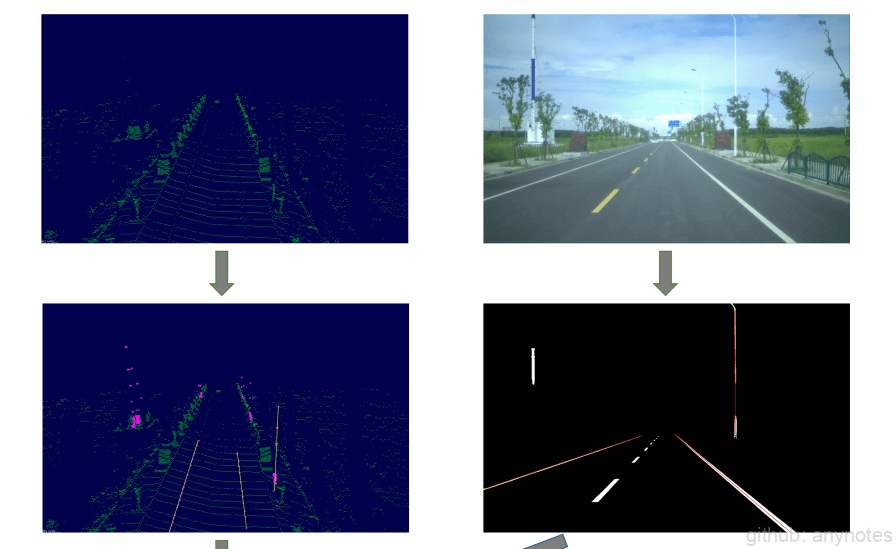

# 在线标定

区别于外参离线标定方法（需要固定的场地、固定的靶标、以及精确的车辆定位、固定的运动轨迹等信息）。在线标定可在自然场景中, 根据离线标定的结果、工装、车辆运动等先验信息，实现对离线标定结果的全部参数或部分参数的修正。由于方案的灵活性，传感器外参的在线标定是近年业内的研究重点。下面我们分别介绍一下传感器与车身、多传感器之间的在线标定。

## 一、传感器与车身的在线标定

### （一）相机与车身的在线标定

车辆行驶过程中，相机可根据行驶道路信息获取场景中的一些平行或者正交的信息（如车道线、灯杆等）。空间平行线在相机图像平面上的交点被称为消失点。通过这些空间平行线得到的消失点，我们可以实时估计相机与车体的外参。该方案灵活性强，但鲁棒性会有所下降，因此如何兼顾算法的鲁棒性与灵活性是该类方案研究的重点。外参标定前后的效果如下图的（b 纠正前，俯视图内八）和（c 纠正后，俯视图平行）所示，感兴趣的同学可以参考[1]。

 

图1. 相机外参标定  

### （二）激光雷达与车身的在线标定

与相机不同，激光雷达可以直接测量观测点的 3D 距离。因此，激光雷达与车身的在线标定也相对成熟。基于车辆的运动先验与场景先验，在车辆行驶过程中，激光雷达可根据车辆的行驶方向、地平面点云等信息，实时纠正自身与车体的外参。

## 二、多传感器的在线标定

多传感器在线标定，尤其是激光雷达与相机的在线标定，是业界公认的难点，在近年已有广泛研究。目前业内主要方法是通过最大化点云与图像的配准信息来估计标定参数。根据信息提取方式的不同，多传感器在线标定的研究方向可分为边缘配准[2]、互信息[3]、分割[4][5]三种方法。

### （一）边缘配准

边缘配准方法首先提取图像和激光雷达的边缘信息，然后将激光雷达边缘信息通过初值投影到图像上，并采用优化算法，最大化两种边缘信息乘积的值，以此完成激光雷达和相机的外参标定。

此方法原理简单，可操作性强，但由于只能获取激光雷达的垂直边缘信息，对于偏航角的估计效果要明显优于横滚角与俯仰角。

### （二）互信息

互信息方法对激光雷达的强度信息与图像的灰度信息进行互信息操作，使得互信息结果最大，从而完成标定。如下图所示，正确的激光雷达外参角度值（89degree）对应的互相关系数最大。

 

图2. 基于互信息的外参标定  

此类方法对于激光雷达的强度值有较强依赖，若激光雷达线束较少，点云稀疏，匹配效果可能无法达到需求。

### （三）分割

分割方法需要对图像/点云进行分割操作，分割后的信息会用于特征匹配。如下图所示，此类方法可以只对图像进行分割（图3上），也可以对图像和点云都进行分割（图4下）。

 

图3. 基于分割的外参标定  

此类方法将激光雷达原始点云或分割后的点云通过初值回投到分割后的图像上，采用局部优化的方式，使得点云与图像作用关系最大化，完成激光雷达与相机的外参标定。

相较于提取边缘的方法，此类方法可获得图像和点云的更多有效信息，且图像分割相较于图像边缘提取，抗干扰能力强。

综上所述，在线标定优势在于可利用自然场景，完成传感器矫正，缺点是需要在满足条件的自然场景下进行，且若场景特性无法达到预期，会导致在线标定结果偏差较大或标定失败。

传感器标定是自动驾驶系统的基础环节，也是自动驾驶系统运行的关键条件。传感器标定结果的准确性与精确性，直接影响自动驾驶各功能模块的运行效果。因此，一个准确的、高精度的标定结果，是传感器标定的目标，也是整个自动驾驶系统的需求与期望。目前传感器标定仍存在诸多挑战，如何实现高精度的标定、如何利用有限的环境完成标定、如何完成不同类型传感器之间的标定，如何感知车辆运动过程中传感器位置的偏差，如何对传感器位置偏差实时纠正等，这些都是我们会不断优化和探索的方向。

### 参考文献

[1] J. Lee, Y. Baik, H. Cho, and S. Yoo，“Online Extrinsic Camera Calibration for Temporally Consistent IPM Using Lane Boundary Observations with a Lane Width Prior”

[2] J. Levinson and S. Thrun, “Automatic Online Calibration of Cameras and Lasers”

[3] G. Pandey and J. R. McBride and S. Savarese and R. M. Eustice, ”Automatic Targetless Extrinsic Calibration of a 3D Lidar and Camera by Maximizing Mutual Information”

[4] Y. Zhu, C. Li, Y. Zhang, “Online Camera-LiDAR Calibration with Sensor Semantic Information”

[5] T. Ma , Z. Liu , G. Yan, and Y. Li，”CRLF: Automatic Calibration and Refinement based on Line Feature for LiDAR and Camera in Road Scenes”