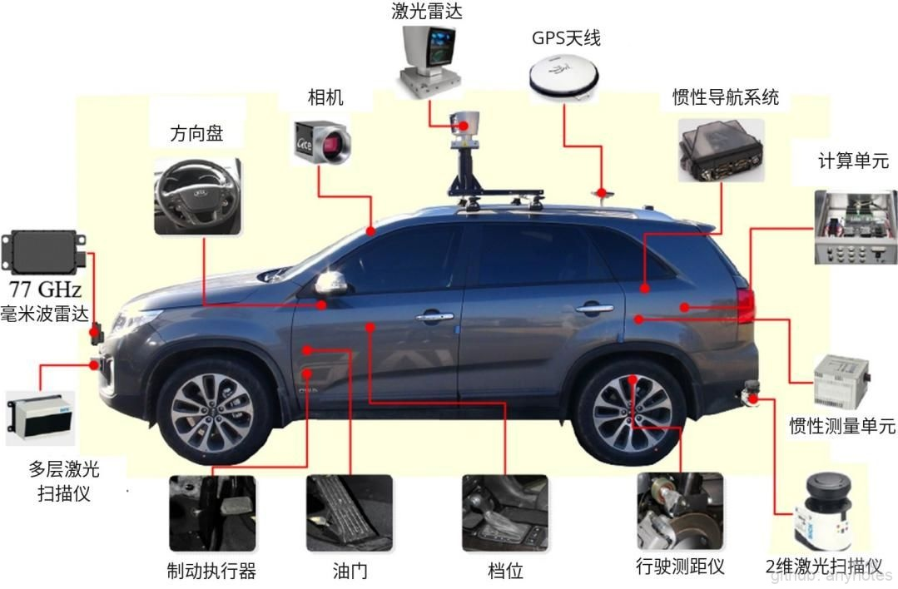

自动驾驶硬件配置主要包含车、线控系统、传感器、计算单元等主要部分。车作为自动驾驶的载体，是自动驾驶车最基础的组成部分；而线控系统的性能好坏直接影响整车的可靠性、安全性、舒适性等，有别于传统汽车通过机械传动的方式控制汽车，线控系统通过电信号来控制汽车，这种方式显然更适合电脑控制。

要实现自动驾驶，还需要众多的传感器的加持，常见传感器包括激光雷达、摄像机、毫米波雷达、超声波雷达、GPS、IMU等。传感器是自动驾驶车的眼睛，负责感知外部环境。计算单元则是自动驾驶车的大脑，传感器获取的信息经过计算单元的计算之后，输出一条可以供汽车安全行驶的轨迹，控制汽车行驶。

硬件配置大致决定了一辆车的性能和品质，而自动驾驶车辆优先考虑的就是安全，由于各种传感器的加持，自然提高了整车制造成本，如何平衡成本和自动驾驶安全问题，是各大厂商需要面对的问题，这也是阻碍自动驾驶普及的重要原因之一。

本章我们将对常见的硬件逐个讲解，并分析其所使用场景，让大家对整车硬件有所了解。