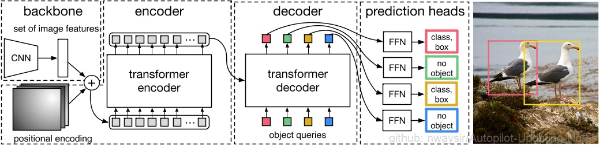
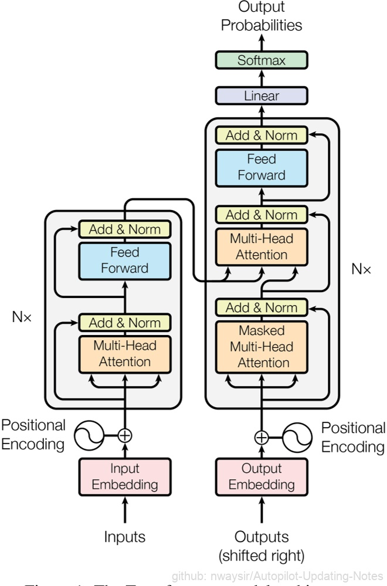
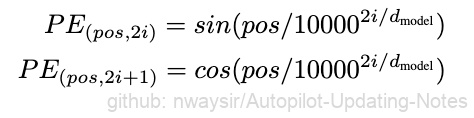

# 3.1.2 2D目标检测

## 3.1.2.1 DETR

DETR的思路和传统的目标检测的本质思路有相似之处，但表现方式很不一样。传统的方法比如Anchor-based方法本质上是对预定义的密集anchors进行类别的分类和边框系数的回归。DETR则是将目标检测视为一个集合预测问题（集合和anchors的作用类似）。由于Transformer本质上是一个序列转换的作用，因此，可以将DETR视为一个从图像序列到一个集合序列的转换过程。该集合实际上就是一个可学习的位置编码（文章中也称为object queries或者output positional encoding，代码中叫作query_embed）。

<div align=center>

</div>
<div align=center> 图1. DETR算法流程 </div>

DETR使用的Transformer结构和原始版本稍有不同：

<div align=center>


</div>
<div align=center> 图2. Transformer && DETR </div>

spatial positional encoding是作者自己提出的二维空间位置编码方法，该位置编码分别被加入到了encoder的self attention和decoder的cross attention，同时object queries也被加入到了decoder的两个attention中。而原版的Transformer将位置编码加到了input和output embedding中。值得一提的是，作者在消融实验中指出即使不给encoder添加任何位置编码，最终的AP也只比完整的DETR下降了1.3个点。

代码基于PyTorch重写了TransformerEncoderLayer, TransformerDecoderLayer类，用到的PyTorch接口只有nn.MultiheadAttention类。源码需要PyTorch 1.5.0以上版本。

代码核心位于models/transformer.py和models/detr.py。

**transformer.py**

```python
class Transformer(nn.Module):
    def __init__(self, d_model=512, nhead=8, num_encoder_layers=6,
                 num_decoder_layers=6, dim_feedforward=2048, dropout=0.1,
                 activation="relu", normalize_before=False,
                 return_intermediate_dec=False):
        super().__init__()
        encoder_layer = TransformerEncoderLayer(d_model, nhead, dim_feedforward,
                                                dropout, activation, normalize_before)
        encoder_norm = nn.LayerNorm(d_model) if normalize_before else None
        self.encoder = TransformerEncoder(encoder_layer, num_encoder_layers, encoder_norm)
        decoder_layer = TransformerDecoderLayer(d_model, nhead, dim_feedforward,
                                                dropout, activation, normalize_before)
        decoder_norm = nn.LayerNorm(d_model)
        self.decoder = TransformerDecoder(decoder_layer, num_decoder_layers, decoder_norm,
                                          return_intermediate=return_intermediate_dec)

    def forward(self, src, mask, query_embed, pos_embed):
        # flatten NxCxHxW to HWxNxC
        bs, c, h, w = src.shape
        src = src.flatten(2).permute(2, 0, 1)
        pos_embed = pos_embed.flatten(2).permute(2, 0, 1)
        query_embed = query_embed.unsqueeze(1).repeat(1, bs, 1)
        mask = mask.flatten(1)

        tgt = torch.zeros_like(query_embed)
        memory = self.encoder(src, src_key_padding_mask=mask, pos=pos_embed)
        hs = self.decoder(tgt, memory, memory_key_padding_mask=mask,
                          pos=pos_embed, query_pos=query_embed)
        return hs.transpose(1, 2), memory.permute(1, 2, 0).view(bs, c, h, w)
```

