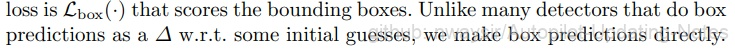

# 3.1.2 2D目标检测

## 3.1.2.1 DETR

### 一、简介

DETR的思路和传统的目标检测的本质思路有相似之处，但表现方式很不一样。传统的方法比如Anchor-based方法本质上是对预定义的密集anchors进行类别的分类和边框系数的回归。DETR则是将目标检测视为一个集合预测问题（集合和anchors的作用类似）。由于Transformer本质上是一个序列转换的作用，因此，可以将DETR视为一个从图像序列到一个集合序列的转换过程。该集合实际上就是一个可学习的位置编码（文章中也称为object queries或者output positional encoding，代码中叫作query_embed）。

<div align=center>

</div>
<div align=center> 图1. DETR算法流程 </div>

DETR使用的Transformer结构和原始版本稍有不同：

<div align=center>

</div>
<div align=center> 图2. Transformer && DETR </div>

### 二、代码

代码基于PyTorch重写了TransformerEncoderLayer, TransformerDecoderLayer类，用到的PyTorch接口只有nn.MultiheadAttention类。源码需要PyTorch 1.5.0以上版本。本文主要讲解**网络结构**和**损失函数**两部分

#### （一）网络结构

代码核心位于models/detr.py内，下面以外到内层层解析：

```python
class DETR(nn.Module):
    """ This is the DETR module that performs object detection """
    def __init__(self, backbone, transformer, num_classes,  num_queries, aux_loss=False):
        super().__init__()
        self.num_queries = num_queries
        self.transformer = transformer
        hidden_dim = transformer.d_model
        self.class_embed = nn.Linear(hidden_dim, num_classes + 1)
        self.bbox_embed = MLP(hidden_dim, hidden_dim, 4, 3)
        self.query_embed = nn.Embedding(num_queries, hidden_dim)
        self.input_proj = nn.Conv2d(backbone.num_channels, hidden_dim, kernel_size=1)
        self.backbone = backbone
        self.aux_loss = aux_loss

    def forward(self, samples: NestedTensor):
        if isinstance(samples, (list, torch.Tensor)):
            samples = nested_tensor_from_tensor_list(samples)
        features, pos = self.backbone(samples)

        src, mask = features[-1].decompose()
        assert mask is not None
        hs = self.transformer(self.input_proj(src), mask, self.query_embed.weight, pos[-1])[0]

        outputs_class = self.class_embed(hs)
        outputs_coord = self.bbox_embed(hs).sigmoid()
        out = {'pred_logits': outputs_class[-1], 'pred_boxes': outputs_coord[-1]}
        if self.aux_loss:
            out['aux_outputs'] = self._set_aux_loss(outputs_class, outputs_coord)
        return out
```

detr主要分为 backbone、transformer 两大模块。

*(1) backbone*

backbone有两个功能：**提特征**和**位置编码**

* 特征提取

默认使用 resnet18 或 resnet34， 当然也可以自行使用其他网络结构

* 位置编码

spatial positional encoding是作者自己提出的二维空间位置编码方法，该位置编码分别被加入到了encoder的self.attention和decoder的cross attention，同时object queries也被加入到了decoder的两个attention中。而原版的Transformer将位置编码加到了input和output embedding中。值得一提的是，作者在消融实验中指出即使不给encoder添加任何位置编码，最终的AP也只比完整的DETR下降了1.3个点，具体代码实现在接下来transformer部分展开。

*（2）transformer*

Transformer类包含了一个Encoder和一个Decoder对象，对应 TransformerEncoderLayer、TransformerDecoderLayer，如下代码所示：

```python
## transformer.py
class Transformer(nn.Module):
    def __init__(self, d_model=512, nhead=8, num_encoder_layers=6,
                 num_decoder_layers=6, dim_feedforward=2048, dropout=0.1,
                 activation="relu", normalize_before=False,
                 return_intermediate_dec=False):
        super().__init__()
        encoder_layer = TransformerEncoderLayer(d_model, nhead, dim_feedforward,
                                                dropout, activation, normalize_before)
        encoder_norm = nn.LayerNorm(d_model) if normalize_before else None
        self.encoder = TransformerEncoder(encoder_layer, num_encoder_layers, encoder_norm)
        decoder_layer = TransformerDecoderLayer(d_model, nhead, dim_feedforward,
                                                dropout, activation, normalize_before)
        decoder_norm = nn.LayerNorm(d_model)
        self.decoder = TransformerDecoder(decoder_layer, num_decoder_layers, decoder_norm,
                                          return_intermediate=return_intermediate_dec)

    def forward(self, src, mask, query_embed, pos_embed):
        # flatten NxCxHxW to HWxNxC
        bs, c, h, w = src.shape
        src = src.flatten(2).permute(2, 0, 1)
        pos_embed = pos_embed.flatten(2).permute(2, 0, 1)
        query_embed = query_embed.unsqueeze(1).repeat(1, bs, 1)
        mask = mask.flatten(1)

        tgt = torch.zeros_like(query_embed)
        memory = self.encoder(src, src_key_padding_mask=mask, pos=pos_embed)
        hs = self.decoder(tgt, memory, memory_key_padding_mask=mask,
                          pos=pos_embed, query_pos=query_embed)
        return hs.transpose(1, 2), memory.permute(1, 2, 0).view(bs, c, h, w)
```

forward函数对输入tensor的变换操作：**flatten NxCxHxW to HWxNxC**。

结合PyTorch中对src和tgt的形状定义可以发现，**DETR的思路是将backbone输出特征图的像素展开成一维后当成了序列长度，而batch和channel的定义不变**。故而DETR可以计算特征图的每一个像素相对于其他所有像素的相关性，这一点在CNN中是依靠感受野来实现的，可以看出Transformer能够捕获到比CNN更大的感受范围。

DETR在计算attention的时候**没有使用masked attention**，因为将特征图展开成一维以后，所有像素都可能是互相关联的，因此没必要规定mask。而src_key_padding_mask是用来将zero_pad的部分给去掉。

forward函数中有两个关键变量pos_embed和query_embed。其中pos_embed是位置编码，位于models/position_encoding.py。

**position_encoding.py**

针对二维特征图的特点，DETR实现了自己的二维位置编码方式。代码如下

```python
class PositionEmbeddingSine(nn.Module):
    def __init__(self, num_pos_feats=64, temperature=10000, normalize=False, scale=None):
        super().__init__()
        self.num_pos_feats = num_pos_feats
        self.temperature = temperature
        self.normalize = normalize
        if scale is not None and normalize is False:
            raise ValueError("normalize should be True if scale is passed")
        if scale is None:
            scale = 2 * math.pi
        self.scale = scale

    def forward(self, tensor_list: NestedTensor):
        x = tensor_list.tensors
        mask = tensor_list.mask
        assert mask is not None
        not_mask = ~mask
        y_embed = not_mask.cumsum(1, dtype=torch.float32)
        x_embed = not_mask.cumsum(2, dtype=torch.float32)
        if self.normalize:
            eps = 1e-6
            y_embed = y_embed / (y_embed[:, -1:, :] + eps) * self.scale
            x_embed = x_embed / (x_embed[:, :, -1:] + eps) * self.scale

        dim_t = torch.arange(self.num_pos_feats, dtype=torch.float32, device=x.device)
        dim_t = self.temperature ** (2 * (dim_t // 2) / self.num_pos_feats)

        pos_x = x_embed[:, :, :, None] / dim_t
        pos_y = y_embed[:, :, :, None] / dim_t
        pos_x = torch.stack((pos_x[:, :, :, 0::2].sin(), pos_x[:, :, :, 1::2].cos()), dim=4).flatten(3)
        pos_y = torch.stack((pos_y[:, :, :, 0::2].sin(), pos_y[:, :, :, 1::2].cos()), dim=4).flatten(3)
        pos = torch.cat((pos_y, pos_x), dim=3).permute(0, 3, 1, 2)
        return pos
```
mask是一个位置掩码数组，对于一个没有经过zero_pad的图像，它的mask是一个全为0的数组。

Transformer原文中采用的位置编码方式为正弦编码，计算公式为:

<div align=center>

</div>
<div align=center> 图3. 位置编码方式为正弦编码 </div>

pos是词向量在序列中的位置，而 $i$ 是channel的index。对照代码，可以看出DETR是为二维特征图的 $x$ 和 $y$ 方向各自计算了一个位置编码，每个维度的位置编码长度为num_pos_feats（该数值实际上为hidden_dim的一半），对 $x$ 或 $y$ ，计算奇数位置的正弦，计算偶数位置的余弦，然后将pos_x和pos_y拼接起来得到一个NHWD的数组，再经过permute(0,3,1,2)，形状变为NDHW，其中D等于hidden_dim。这个hidden_dim是Transformer输入向量的维度，在实现上，**要等于CNN backbone输出的特征图的维度**。所以pos code和CNN输出特征的形状是完全一样的。

```python
src = src.flatten(2).permute(2, 0, 1)         
pos_embed = pos_embed.flatten(2).permute(2, 0, 1)
```
将CNN输出的features和pos code均进行flatten和permute操作，将形状变为SNE，符合PyTorch的输入形状定义。在TransformerEncoder中，会将src和pos_embed相加。

* TransformerEncoderLayer

```python
class TransformerEncoderLayer(nn.Module):

    def __init__(self, d_model, nhead, dim_feedforward=2048, dropout=0.1,
                 activation="relu", normalize_before=False):
        super().__init__()
        self.self_attn = nn.MultiheadAttention(d_model, nhead, dropout=dropout)
        # Implementation of Feedforward model
        self.linear1 = nn.Linear(d_model, dim_feedforward)
        self.dropout = nn.Dropout(dropout)
        self.linear2 = nn.Linear(dim_feedforward, d_model)

        self.norm1 = nn.LayerNorm(d_model)
        self.norm2 = nn.LayerNorm(d_model)
        self.dropout1 = nn.Dropout(dropout)
        self.dropout2 = nn.Dropout(dropout)

        self.activation = _get_activation_fn(activation)
        self.normalize_before = normalize_before

    def with_pos_embed(self, tensor, pos: Optional[Tensor]):
        return tensor if pos is None else tensor + pos

    def forward_post(self,
                     src,
                     src_mask: Optional[Tensor] = None,
                     src_key_padding_mask: Optional[Tensor] = None,
                     pos: Optional[Tensor] = None):
        q = k = self.with_pos_embed(src, pos)
        src2 = self.self_attn(q, k, value=src, attn_mask=src_mask,
                              key_padding_mask=src_key_padding_mask)[0]
        src = src + self.dropout1(src2)
        src = self.norm1(src)
        src2 = self.linear2(self.dropout(self.activation(self.linear1(src))))
        src = src + self.dropout2(src2)
        src = self.norm2(src)
        return src
```
* TransformerDecoderLayer

```python
class TransformerDecoderLayer(nn.Module):
    def forward_post(self, tgt, memory,
                     tgt_mask: Optional[Tensor] = None,
                     memory_mask: Optional[Tensor] = None,
                     tgt_key_padding_mask: Optional[Tensor] = None,
                     memory_key_padding_mask: Optional[Tensor] = None,
                     pos: Optional[Tensor] = None,
                     query_pos: Optional[Tensor] = None):
        q = k = self.with_pos_embed(tgt, query_pos)
        tgt2 = self.self_attn(q, k, value=tgt, attn_mask=tgt_mask,
                              key_padding_mask=tgt_key_padding_mask)[0]
        tgt = tgt + self.dropout1(tgt2)
        tgt = self.norm1(tgt)
        tgt2 = self.multihead_attn(query=self.with_pos_embed(tgt, query_pos),
                                   key=self.with_pos_embed(memory, pos),
                                   value=memory, attn_mask=memory_mask,
                                   key_padding_mask=memory_key_padding_mask)[0]
        tgt = tgt + self.dropout2(tgt2)
        tgt = self.norm2(tgt)
        tgt2 = self.linear2(self.dropout(self.activation(self.linear1(tgt))))
        tgt = tgt + self.dropout3(tgt2)
        tgt = self.norm3(tgt)
        return tgt
```

DETR 中反复提到的object queries到底是什么? **答案就是query_embed**, 即 TransformerDecoderLayer类中的 query_pos。代码中，query_embed实际上就是一个embedding数组：

```python
self.query_embed = nn.Embedding(num_queries, hidden_dim)
```

其中，num_queries是预定义的目标查询的个数，代码中默认为100。它的意义是：根据Encoder编码的特征，Decoder将100个查询转化成100个目标。通常100个查询已经足够了，很少有图像能包含超过100个目标（除非超密集的任务），相比之下，基于CNN的方法要预测的anchors数目动辄上万，计算代价实在是很大。

Transformer的forward函数中定义了一个和query_embed形状相同的全为0的数组target，然后在TransformerDecoderLayer的forward中把query_embed和target相加（这里query_embed的作用表现的和位置编码类似），在self attention中作为query和key；在multi-head attention中作为query。

object queries在经过decoder的计算以后，会输出一个形状为TNE的数组，其中T是object queries的序列长度，即100，N是batch size，E是特征channel。

最后通过一个Linear层输出class预测，通过一个多层感知机结构输出box预测：

```python
self.class_embed = nn.Linear(hidden_dim, num_classes + 1)
self.bbox_embed = MLP(hidden_dim, hidden_dim, 4, 3)

#forward
hs = self.transformer(self.input_proj(src), mask, self.query_embed.weight, pos[-1])[0]
outputs_class = self.class_embed(hs)
outputs_coord = self.bbox_embed(hs).sigmoid()
out = {'pred_logits': outputs_class[-1], 'pred_boxes': outputs_coord[-1]}
```
分类输出的通道为num_classes+1，类别从0开始，背景类别为num_classes。

#### （二）损失函数

基于CNN的方法会计算每个anchor的预测结果，然后利用预测结果和ground truth box之间计算iou，挑选iou大于一定阈值的那些anchors作为正样本，来回归它们的class和box deltas。类似的，DETR也会计算每个object query的prediction，但DETR会直接计算box的四个角的归一化值，而不再基于box deltas：
<div align=center>

</div>
然后将这些object predictions和ground truth box之间进行二分匹配。DETR使用匈牙利算法来完成这一匹配过程。

<div align=center>

</div>
<div align=center> 图5. DETR 目标匹配 </div>

假如有N个目标，那么100个object predictions中就会有N个能够匹配到这N个ground truth，其他的都会和“no object”匹配成功，这些predictions的类别label就会被分配为num_classes，即表示该prediction是背景。

这样的设计是很不错的，理论上每个object query都有唯一匹配的目标，不会存在重叠，所以DETR不需要nms进行后处理。

根据匹配结果计算loss的公式为：

<div align=center>

</div>

```python
class SetCriterion(nn.Module):
    def forward(self, outputs, targets):
        outputs_without_aux = {k: v for k, v in outputs.items() if k != 'aux_outputs'}

        # Retrieve the matching between the outputs of the last layer and the targets
        indices = self.matcher(outputs_without_aux, targets)

        # Compute the average number of target boxes accross all nodes, for normalization purposes
        num_boxes = sum(len(t["labels"]) for t in targets)
        num_boxes = torch.as_tensor([num_boxes], dtype=torch.float, device=next(iter(outputs.values())).device)
        if is_dist_avail_and_initialized():
            torch.distributed.all_reduce(num_boxes)
        num_boxes = torch.clamp(num_boxes / get_world_size(), min=1).item()

        # Compute all the requested losses
        losses = {}
        for loss in self.losses:
            losses.update(self.get_loss(loss, outputs, targets, indices, num_boxes))
```

通过self.matcher将outputs_without_aux和targets进行匹配。匈牙利算法会返回一个indices tuple，该tuple包含了src和target的index。具体匹配过程请参考models/matcher.py。

**1. 分类loss**
分类loss采用的是交叉熵损失，针对所有predictions
```python
def loss_labels(self, outputs, targets, indices, num_boxes, log=True):
    src_logits = outputs['pred_logits']

    idx = self._get_src_permutation_idx(indices)
    target_classes_o = torch.cat([t["labels"][J] for t, (_, J) in zip(targets, indices)])
    target_classes = torch.full(src_logits.shape[:2], self.num_classes,
                                    dtype=torch.int64, device=src_logits.device)
    target_classes[idx] = target_classes_o

    loss_ce = F.cross_entropy(src_logits.transpose(1, 2), target_classes, self.empty_weight)
    losses = {'loss_ce': loss_ce}

    return losses
```
target_classes_o是按target index获取的所有匹配成功的真值类别，并按src index将其放入target_classes的对应位置。匹配失败的predictions在target_classes中用self.num_classes来填充。函数_get_src_permutation_idx的作用是从indices tuple中取得src的batch index和对应的match index。

**2. box loss**
box loss采用了l1 loss和giou loss，针对匹配成功的predictions
```python
def loss_boxes(self, outputs, targets, indices, num_boxes):
    """Compute the losses related to the bounding boxes, the L1 regression loss and the GIoU loss
       targets dicts must contain the key "boxes" containing a tensor of dim [nb_target_boxes, 4]
       The target boxes are expected in format (center_x, center_y, w, h), normalized by the image size.
    """
    assert 'pred_boxes' in outputs
    idx = self._get_src_permutation_idx(indices)
    src_boxes = outputs['pred_boxes'][idx]
    target_boxes = torch.cat([t['boxes'][i] for t, (_, i) in zip(targets, indices)], dim=0)

    loss_bbox = F.l1_loss(src_boxes, target_boxes, reduction='none')

    losses = {}
    losses['loss_bbox'] = loss_bbox.sum() / num_boxes

    loss_giou = 1 - torch.diag(box_ops.generalized_box_iou(
        box_ops.box_cxcywh_to_xyxy(src_boxes),
        box_ops.box_cxcywh_to_xyxy(target_boxes)))
    losses['loss_giou'] = loss_giou.sum() / num_boxes
    return losses
```
target_boxes 是按target index获取的所有匹配成功的真值box，src_boxes是按src index获取的匹配成功的predictions，计算它们之间的l1_loss和giou loss

**3. mask loss**

文章还扩展了全景分割的实验，使用mask loss，用来回归segmentation map。


