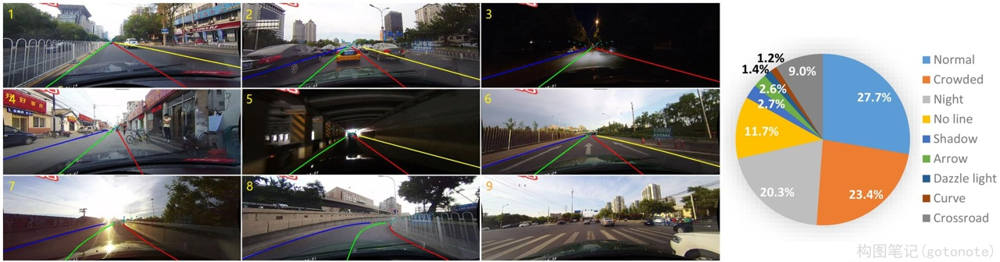
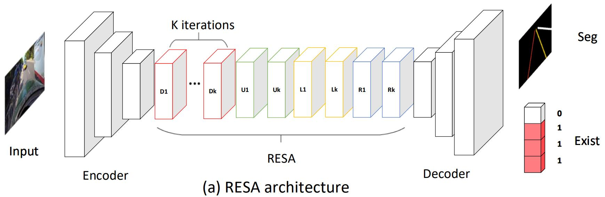
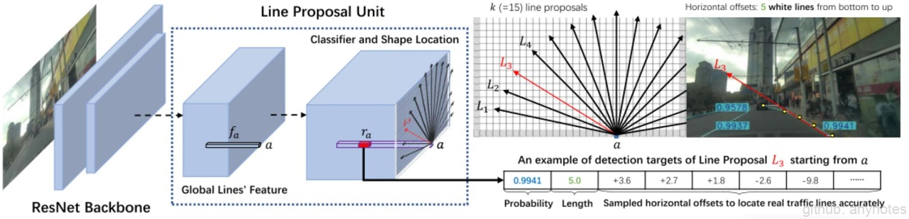
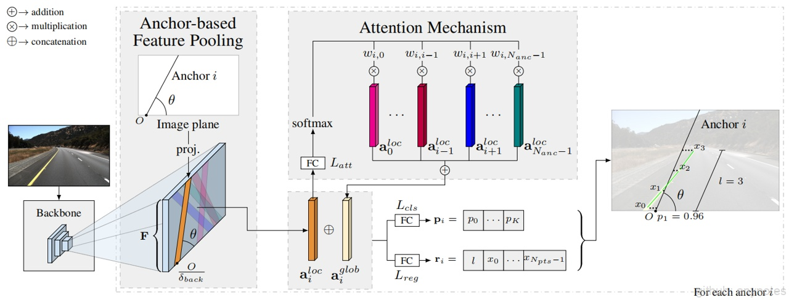
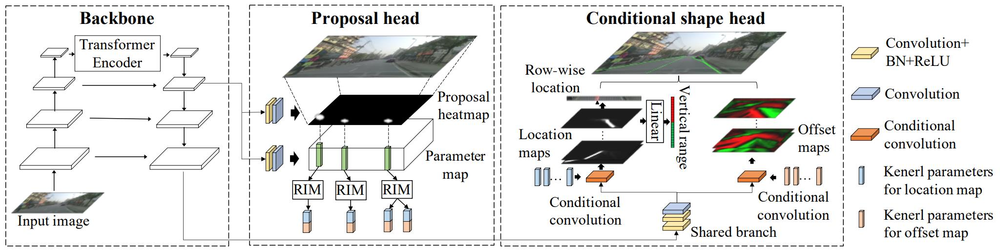
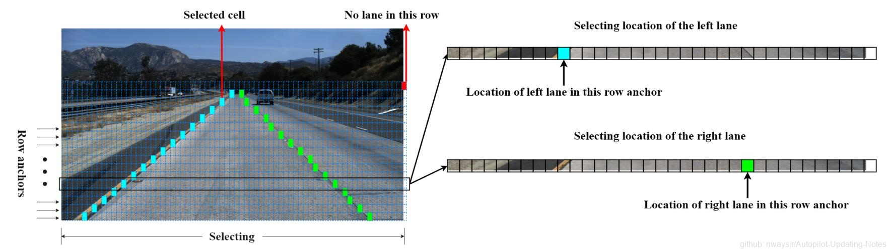
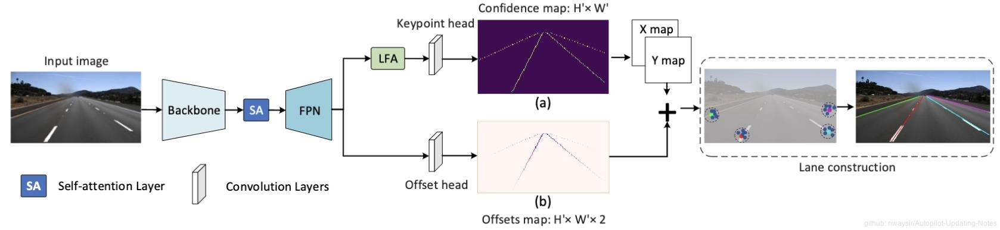
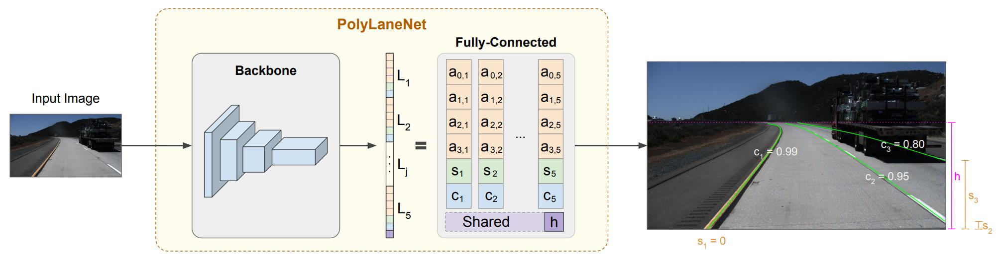

# 车道线检测

 图1. CULane 

车道线检测是一种环境感知应用，其目的是通过车载相机或激光雷达来检测车道线。近年来，随着计算机视觉的应用发展和落地，车道线检测任务也获得了广泛关注，出现一系列的车道线检测方法。车道检测在自动驾驶系统中扮演着重要的角色，特别是在高级辅助驾驶系统(ADAS)中。

## 一、公开数据集

车道线检测数据集的构建需要各场景类别的数据平衡，比如高速公路，辅路，盘山路，夜晚，雨天等数据，以模拟真实行车环境。
    
### （一）开源车道线数据集：

| 数据集 | 数量（张） | 尺寸 | 场景 | 特点 | 
| --- | --- | --- | --- | --- |
| TuSimple | 72k | 1280x720  | 高速路，天气晴朗，车道线清晰 | 车道线以点来标注 | 
| CULane [图1] | 98k | 1640x590 |拥挤，黑夜，无线，暗影等八种难以检测的情况; 场景复杂，很多位于北京城区，难度较高 |最多标记4条车道线 |
| Caltech | 1.2k | 640x480 | 场景比较简单，且视角较好 |  |
| VPGNet | 20k |   |白天（非雨天、雨天、大雨天）、夜晚  | 包含了各种车道线类型，以及其他不同类型的车道标识（左转箭头、直行箭头、斑马线等等） |
|BDD100k|120M|1280x720|包含美国4个区的白天、黑夜各种天气状况|二维8类别车道线|
|ApolloScape|140k|3384x2710||车道线以掩码的形式标注，包含2维或3维28个类别|
|CurveLanes|135k|2650x144|包括很多较为复杂的场景,如S路、Y车道,还有夜间和多车道的场景|采用三次样条曲线手动标注所有车道线,分为训练集10万张，验证集2万张，测试集3万张|

## 二、方法

### （一）传统图像方法

传统图像方法通过边缘检测、滤波等方式分割出车道线区域，然后结合霍夫变换（Hough）、RANSAC等算法进行车道线检测。这类算法需要人工手动去调滤波算子，根据算法所针对的街道场景特点手动调节参数曲线，工作量大且鲁棒性较差，当行车环境出现明显变化时，车道线的检测效果不佳。主流方式如下：

- 基于霍夫变换（Hough）的车道线检测
- 基于LSD直线的车道线检测
- 基于俯视图变换的车道线检测
- 基于拟合的车道线检测
- 基于平行透视灭点的车道线检测

缺点：霍夫直线检测方法比较准确，但不能做弯道检测；拟合方法可以检测弯道，但稳定性较差；仿射变换可以做多车道检测，但在遮挡等干扰情况下，效果较差；透视变换操作上，对相机有一些具体的要求，在变换前需要调正图像，而且摄像机的安装和道路本身的倾斜都会影响变换效果。
    
### （二）深度学习方法

深度学习方法具体较强的鲁棒性，且相对传统方法准确性更高，另外可以直接融合到目标检测、场景识别等多任务模型中，进一步节省了计算资源。大致分为四类：基于分割的方法、基于检测的方法、基于参数曲线的方法、基于关键点的方法。

**1. 基于分割的方法**

基于分割的方法将车道线检测建模为逐像素分类问题，每个像素分为车道线区域或背景。这类模型通常是在语义分割模型的基础上，增加一个车道线实例判别头，来对车道线是否存在进行监督学习。经典方法有：SCNN[1]、RESA[2]、LaneNet[3]等。

*（1）SCNN：*

 图2. SCNN多类分割任务 

    
为了区分不同的车道线，SCNN将不同的车道线作为不同的类别，从而将车道检测转化为多类分割任务。提出一个切片CNN结构，以使消息跨行和列传递。对SCNN切片CNN结构进行改进，加入切片间的不同步幅大小的信息传递，同时解耦相邻层之间的时序上的依赖，增加并行处理能力。
    
*（2）RESA：*

 图3. RESA结构示意图 

    
RESA（Recurrent Feature-Shift Aggregator）是文章提出用于信息传递方法的一个特征增强模块，能够捕获行和列之间像素的空间关系，RESA具有很高的计算效率，同时可以有效地聚合空间信息，适合检测具有突出的几何先验的目标。

*（3）LaneNet:*
  

 图4. LaneNet结构示意图 

LaneNet车道线检测思路是将车道线检测任务分成两个分支，车道检测分支与车道嵌入分支。车道分割分支就是将图片分为车道与背景。车道嵌入分支就是将分割出的车道进一步分解成不同的实例instance。

总结：分割模型大，处理速度慢。在严重遮挡情况下表现差，没有充分利用车道线的先验知识。

**2. 基于检测的方法**

基于检测的方法通常采用自顶向下的方法来预测车道线，这类方法利用车道线在驾驶视角自近处向远处延伸的先验知识，构建车道线实例。

*（1）基于Anchor的方法设计线型Anchor，并对采样点与预定义Anchor的偏移量进行回归。应用非极大值抑制（NMS）选择置信度最高的车道线。经典方法有：LineCNN[4]、LaneATT[5]等。*

* LineCNN:

 图5. LineCNN结构示意图 

LineCNN是一个端到端的车道线检测模型, 该模型的使用ResNet提取特征, 使用RPN思想实现车道线检测, 其核心是提出LPU结构, LPU解决了车道线误差计算的问题, 使得该检测模型达到不错效果.

* LaneATT:

 图6. LaneATT结构示意图 

提出了一种在大型复杂数据集上，比现有最先进的方法更精确的实时车道检测方法；基于线性型Anchor的池化方法结合注意力机制的单级模型，类似YOLOv3或SSD，比其他大多数模型更快；

*（2）基于实例检测的方法，将图像水平条带等距切分，检测水平条带中每条车道线的位置。经典方法有：CondLaneNet[6]、UFAST[7]等。*
    
* CondLaneNet：

 图7. CondLaneNet结构示意图 

CondLaneNet是一种自上而下的车道线检测框架，它首先检测车道实例，然后动态预测每个实例的线形。
        
* UFAST：

 图8. UFAST结构示意图 

UFAST将车道检测过程看作一个基于全局特征的行选择问题，能够有效的降低计算量，提高计算速度。

总结：自顶向下的设计能够更好的利用车道线的先验知识，提高检测实时性，同时在处理严重遮挡等情况下能够获得连续的车道线检测实例。但预设Anchor形状会影响检测的灵活性。
    
**3. 基于关键点的方法**

基于关键点的方法直接对车道线的实例进行检测，使用后处理对实例进行划分。经典方法有：GANet[8]等。
    
*（1）GANet：*

 图9. GANet结构示意图 

    
将每个关键点直接回归到车道线的起点进行实例的划分，而不是逐点延伸。
    
总结：此类方法兼具灵活性和实时性，在处理遮挡问题时如何构建全局信息是需要考虑的问题。

**4. 基于参数曲线的方法**

基于参数曲线的方法使用预先设定的参数曲线，对车道线形状进行检测，相关工作有：PolyLaneNet[9]等。

*（1）PolyLaneNet：*

 图10. PolyLaneNet结构示意图 

PolyLaneNet通过多项式曲线回归，输出表示图像中每个车道线的多项式。
    
总结：基于曲线的方法可以自然地学习整体车道表示，具有较高的推理速度，但在准确度上不高。

## 三、结论
自动驾驶系统的部署终端对车道线检测算法提出了准确性和实时性的基本要求，基于深度学习的车道线检测算法的发展，使得车道线检测算法的应用落地获得了切实可行了解决方案。从基于传统实例分割的基于分割的方法，到结合先验知识进行自顶向下建模的基于检测的方法，使得车道线检测算法的精度和速度不断提高。如何更好的利用车道线形状的先验知识是值得继续探索的方向。

**参考文献**

[1] Pan X, Shi J, Luo P, et al. Spatial as deep: Spatial CNN for traffic scene understanding[J]. Association for the Advancement of Artificial Intelligence.2018. \
[2] Zheng T, Fang H, Zhang Y, et al. RESA: Recurrent Feature-Shift Aggregator for Lane Detection[J].2020. \
[3] Neven D, Brabandere B D, Georgoulis S, et al. Towards End-to-End Lane Detection: an Instance Segmentation Approach[J].IEEE,2018. \
[4] Li X, Li J, Hu X, et al. Line-CNN: End-to-End Traffic Line Detection With Line Proposal Unit[J]. IEEE Transactions on Intelligent Transportation Systems,2019:1-11. \
[5] Tabelini L, Berriel R, Paixo T M, et al. Keep your Eyes on the Lane: Real-time Attention-guided Lane Detection[J].2020. \
[6] Liu, Lizhe, Xiaohao Chen, Siyu Zhu, and Ping Tan. “CondLaneNet: A Top-to-down Lane Detection Framework Based on Conditional Convolution.” ArXiv:2105.05003 [Cs], June 10, 2021. \
[7] Qin, Zequn, Huanyu Wang, and Xi Li. “Ultra Fast Structure-Aware Deep Lane Detection.” ArXiv:2004.11757 [Cs], August 4, 2020. \
[8] Wang J, Ma Y, Huang S, et al. A Keypoint-based Global Association Network for Lane Detection[J]. arXiv e-prints, 2022. \
[9] Tabelini L, Berriel R, Paixao T M, et al. PolyLaneNet: Lane Estimation via Deep Polynomial Regression[C]// International Conference on Pattern Recognition. IEEE Computer Society, 2021.