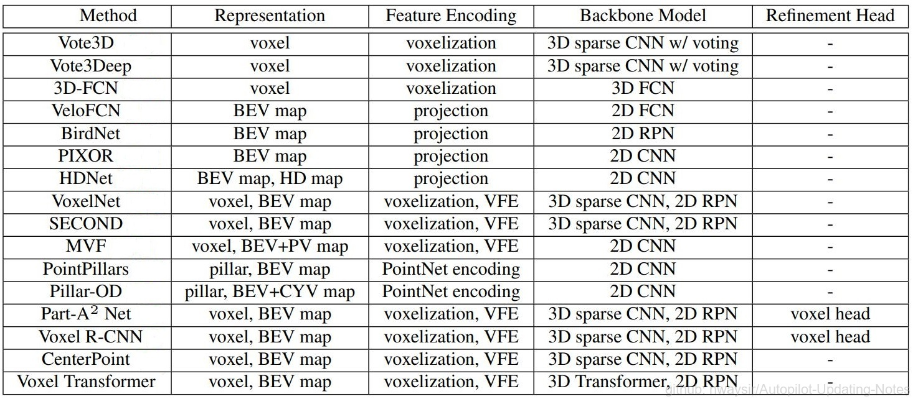
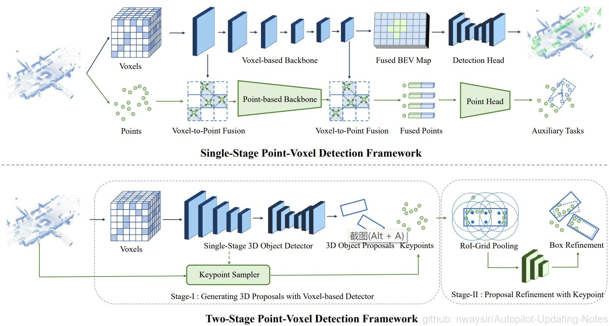
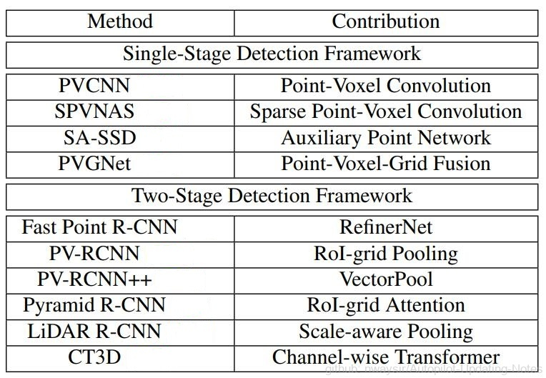
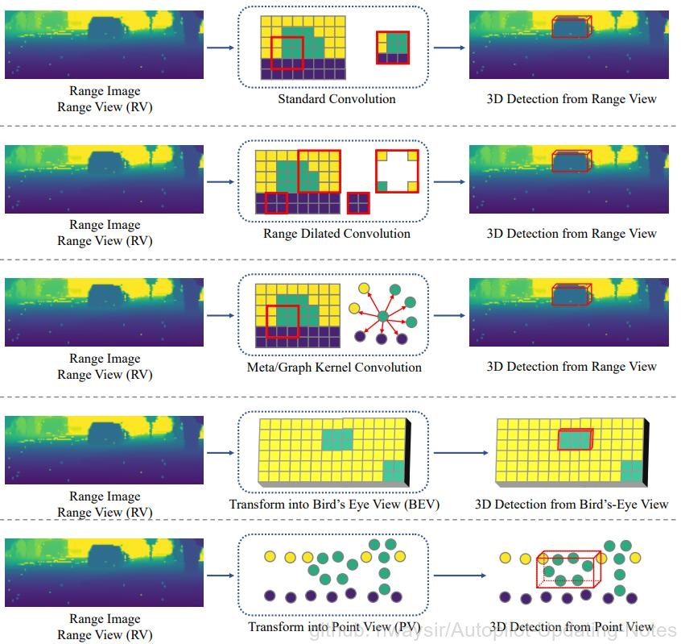
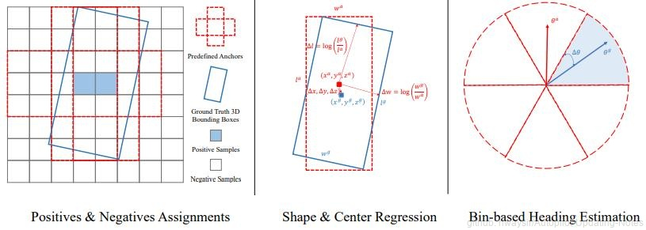
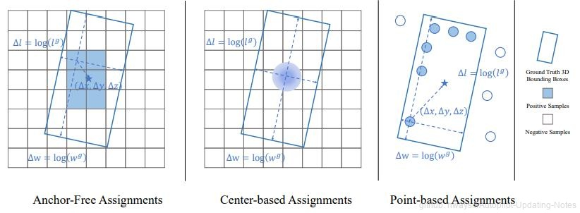
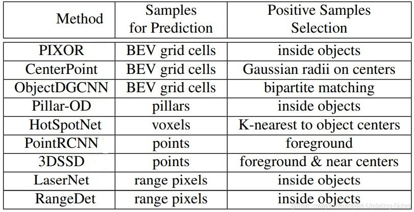

# 3.2.1 基于LiDAR的3D目标检测

在本节中，我们将介绍基于LiDAR点云数据、深度图的3D对象检测方法，包含数据表示和学习对象两方面。数据表示分为基于点、网格、体素、深度图的不同方法。检测器分为基于锚、无锚以及相关辅助的方法，以下时间轴将较为经典的算法做了个列举。

 图1. 3D目标检测进展时间轴 

## 3.2.1.1 3D目标检测的数据表示

点云数据和深度图数据与一般的图像不同。点云是稀疏、不规则的，需要设计特殊模型提取特征。而深度图是密集紧凑，深度像素存的是3D信息，而不是RGB值。这些都是需要打破原先的常规卷积网络的固有思维，而且自动驾驶需要检测目标的实时性，推理要快，如何设计一个在点云和深度图上推理更快的模型也是一个挑战。

### 一、基于点的3D目标检测

 图2. 基于点的3D目标检测架构< 

基于点的目标检测成功在点云上应用深度学习方法，提出了一系列框架，可以直接从原始点数据来预测3D目标。将点云通过基于点的主干网络，通过点云算子来提取点云特征，基于下采样的点和特征预测3D框。基于点的3D目标检测器主要组成部分为：点云采样和特征学习。整体流程示意图和代表性工作见上图2和下表1。

 表1. 基于点的3D目标检测方法 

#### （一）点云采样

>PointNet++[1]的FPS在基于点的检测器中被广泛采用，这种检测器从原始点集中依次选择最远处的点。PointRCNN[2]是一项开创性的工作，它采用FPS逐步下采样输入的点云，并从下采样点中生成3D候选。类似的设计范式在随后的许多工作中也被采用，并进行了分割引导滤波[3]、特征空间抽样[4]、随机抽样[5]等改进。

#### （二）特征学习

>上下文点首先用一个预定义的查询球半径进行选择，然后上下文点和特征经过多层感知机和Max-Pooling，得到新的特征。其它点云操作，包括图操作、注意力操作、Transformer等。

基于点的3D目标检测器受制于特征学习中采用的上下文点数量和上下文半径。增加上下文点数量可以获得更强的表达能力，但会增加内存，在球查询中，上下文半径太小，会造成上下文信息不足，半径太大，造成3D细粒度信息丢失。

对于大部分的基于点的3D目标检测器，推理时间上的瓶颈是点云采样。随机均匀采样因为可以并行，效率最高，但激光雷达扫描点分布不均匀，随机均匀采样会对点云密度高的地方过采样，而稀疏的地方欠采样。最远点采样及其变体通过从已有的点集中依次选择最远点获得更加均匀的采样结果，但其不能并行，耗时较大，较难做到实时。

### 二、基于网格的3D目标检测

 图3. 基于点的3D目标检测方法 

基于网格的3D目标检测器首先将点云栅格化为离散的网格表示，即体素、柱体和鸟瞰视图(BEV)特征图。然后应用传统的2D卷积神经网络或3D稀疏神经网络提取特征。最后，可以从BEV网格中检测出3D目标。上图3展示了基于网格的3D目标检测的示例，下表2给出了基于网格的检测器的分类。网格检测有两个基本组成部分:基于网格的表示和基于网格的神经网络。

 表2. 基于网格的3D目标检测方法 

基于网格的表示。目前有3种主要的网格表示类型:体素、柱体和BEV特征图。

#### （一）体素

>体素是3D立方体，体素细胞内包含点。点云可以很容易地通过体素化转化为体素。由于点云分布稀疏，3D空间中的大部分体素细胞都是空的，不包含点。在实际应用中，只有那些非空体素被存储并用于特征提取。VoxelNet[6]是一项利用稀疏体素网格的开创性工作，提出了一种新的体素特征编码(VFE)层，从体素细胞内的点提取特征。此外，还有两类方法试图改进用于3D目标检测的体素表示:

1. 多视图体素

    一些方法从不同的视角提出了一种动态体素化和融合方案，例如从鸟瞰图和透视图[7]，从圆柱形和球形视图[8]，从深度视图[9]等。

2. 多尺度体素

    一些论文生成不同尺度的体素[10]或使用可重构体素。

#### （二）柱体

>柱体可以被视为特殊的体素，其中体素的大小在垂直方向上是无限的。通过PointNet将点聚集成柱状特征[11]，再将其分散回去，构建二维BEV图像进行特征提取。PointPillars[12]是一个开创性的工作，介绍了柱体表示。

#### （三）BEV 特征图

>鸟瞰特征图是一种密集的二维表示，其中每个像素对应一个特定的区域，并对该区域内的点信息进行编码。BEV特征图可以由体素和柱体投影到鸟瞰图中获得，也可以通过汇总像素区域内的点统计数据，直接从原始点云中获得。常用的统计数据包括二进制占用率和局部点云高度和密度。

基于网格的神经网络。目前主要有两种基于网格的网络：用于BEV特征图和柱体的2D卷积神经网络，以及用于体素的3D稀疏神经网络。

与BEV特征图和柱体2D表示相比，体素包含更多结构化的3D信息。此外，可以通过3D稀疏网络学习深度体素特征。但是，3D神经网络会带来额外的时间和内存成本。BEV特征图是最有效的网格表示，它直接将点云投影到2D伪图像中，而无需专门的3D算子，如稀疏卷积或柱体编码。2D检测方法也可以在BEV特征图上无缝应用，无需太多修改。

基于BEV的检测方法通常可以获得高效率和实时推理速度。然而，简单地汇总像素区域内的点统计信息会丢失太多的3D信息，与基于体素的检测相比，这会导致检测结果不太准确。

基于柱体的检测方法利用PointNet对柱体单元内的3D点信息进行编码，然后将特征分散回2D伪图像中进行有效检测，从而平衡3D目标检测的效果和效率。

选择合适大小的网格单元是所有基于网格的方法都必须面对的关键问题。通过将连续点坐标转换为离散网格索引，网格表示本质上是点云的离散形式。在转换过程中不可避免地会丢失一些3D信息，其效果很大程度上取决于网格单元的大小：网格小，分辨率高，可以保持更细粒度的细节，对于准确检测3D目标至关重要。然而，减小网格单元又会导致2D网格表示（如BEV特征图或柱体）的内存消耗呈二次方增长。至于像体素这样的3D网格表示，问题可能会变得更加严重。因此，如何平衡更小网格尺寸带来的效果和内存增加影响效率，仍然是所有基于网格的3D目标检测方法的一个挑战。

### 三、基于Point-Voxel的3D目标检测方法

 图4. 基于点-体素的3D目标检测框架 

基于点-体素的方法采用了一种混合架构，利用点和体素进行3D目标检测。主要分为两类:单阶段检测框架和两阶段检测框架。上图4显示了这两个类别的示例，下表3给出了相应的分类方法：

 表3. 基于点-体素的3D目标检测方法

单阶段基于点-体素的3D目标检测器通过骨干网络中的点-体素和体素-点的变换来连接点和体素的特征。点包含细粒度的几何信息，体素计算效率高，在特征提取阶段将它们结合在一起更加有利。代表性工作包括：PVCNN、SPVNAS、SA-SSD、PVGNet等。

两阶段的基于点-体素的3D目标检测器，在第一阶段，使用基于体素的检测器来生成一组3D候选目标。在第二阶段，首先从输入点云中采样关键点，然后通过新的点算子对关键点进行进一步细化。代表工作包括：PV-RCNN、LiDAR R-CNN、Pyramid R-CNN、CT3D等等。

与纯体素检测方法相比，基于点-体素的3D目标检测方法在增加推理时间的同时，可以获得更好的检测精度。

### 四、基于深度图的3D目标检测

 图5. 基于深度图的3D目标检测框架

深度图是一种密集而紧凑的2D表示，其中每个像素包含3D深度信息，而不是RGB值。需要针对深度图设计模型和算子，并要选择合适的视图。

 表4. 基于深度图的3D目标检测方法

深度图是2D的，可以**借鉴**2D目标检测方法，比如LaserNet，还有一些借鉴了U-Net、RPN、R-CNN、FCN、FPN等。其像素包含的是距离信息，而非颜色值，因此传统的2D标准卷积算子无法完全适用，滑动窗口中的像素在3D空间中可能会相距很远。一些工作采用了新算子来有效地从深度像素中提取特征，包括深度扩张卷积[13]、图算子[14]和元核卷积[15]等。

深度图是从深度视图（Range View）中获取的，深度视图是点云的球面投影。对于许多基于深度的方法来说，直接从深度视图检测3D目标是很自然的。然而，从深度视图进行检测不可避免地会遇到球面投影所带来的遮挡和尺度变化问题。为了规避这些问题，许多方法尝试利用其他视图来预测3D目标，如：圆柱形视图(CYV)，深度视图和鸟瞰视图(BEV)、点视图(PV)的组合。

深度视图由于可以借鉴2D卷积的优点，做特征提取比较好，但由于遮挡和尺度问题，直接在上面做检测效果不好，需要结合BEV来做检测，所以现在一般是深度图做特征提取，BEV上做检测。

## 3.2.1.2 3D目标检测的学习对象

3D目标检测的学习目标主要是针对小目标（相比检测范围，目标太小），另一方面是由于点云的稀疏性，如何准确估计其目标的中心和尺寸也是一个长期挑战。

### 一、Anchor-based方法

Anchor是预定义的固定矩形体，可以放置在3D空间中，3D目标可以基于Anchor与GT的IoU最大的正样例进行预测。Anchor-based的3D目标检测方法一般是从鸟瞰图上检测3D目标，将3D Anchor放置在BEV特征图的每个网格单元上进行。3D Anchor通常对于每个类别都有一个固定的尺寸，因为同一类别的目标有相似的大小。

Anchor-based的损失函数包括了分类损失、回归损失、偏航角损失等。分类损失常用的是二值交叉熵、Focal loss，回归则是SmoothL1，航向角需要注意使用bin-based航向估计较好。除了这些单独的损失函数外，将整个3D目标作为整体去考虑，也有使用IoU loss的，再辅以Corner loss，让3D目标的检测更加稳定。

下面是anchor-based方法的示意图：

 图6. Anchor-based方法学习对象

### 二、Anchor-free方法

 图7. Anchor-free方法学习对象框架

Anchor-free方法去掉了复杂的anchor设计阶段，可灵活应用于BEV、点视图和深度视图等。没有了anchor，就需要找其它正负样本分配方法。比如基于一些网格（BEV网格单元、体素、柱体）进行分配正负样本，比如PIXOR、CenterPoint等。还有基于点的分配策略，大部分都是先将前景点分割出来，在3D目标内或附近的作为正样本，并学习这些前景点。基于深度的分配主要是将深度像素在3D目标内的作为正样本，并且回归的时候不是以整个3D坐标系统为基础，而是以目标为中心的回归坐标系。DETR提出了一种集合到集合的分配方式，利用匈牙利算法预测结果自动分配到对应的GT。

Anchor-free方法设计灵活，不引入其它先验，学习过程简化了很多，其中基于中心的方法对小目标检测有较大潜力可挖。虽然优点不少，但不可否认，anchor-free方法如何选择合适的正样本来生成预测结果是个问题，相比于anchor-based中使用高IoU正样本，anchor-free可能会选到一些不好的正样本，造成预测结果出现偏差。上图7显示了anchor-free框架，下表5列出此类方法。

 表5. Anchor-free方法学习对象方法

### 三、利用辅助任务的3D目标检测

利用辅助任务来增强3D目标的空间特征，并能对3D目标检测提供一些隐性的指导。常用的辅助任务包括：语义分割、IoU分支预测、目标形状补全、部件识别。

#### （一）语义分割

    前景分割可以提供目标的位置隐含信息；利用语义上下文知识可以增强空间特征；语义分割可以作为预处理方法，过滤背景样本，提升3D检测效率。

#### （二）IoU预测分支

    该分支可以辅助校正目标的置信度，比如预测置信度可以用分类置信度和IoU值的乘积来表示。经过IoU分支的校正，更容易选择高质量的3D目标作为最终预测结果。

#### （三）目标形状补全

    因为点云具有稀疏性，远处的目标只能接收几个点，因此从稀疏点云中补全目标形状可以为后面的检测提供帮助。

#### （四）识别目标内部的零部件

    有助于3D目标检测，部件可以揭示细粒度3D信息

除此之外，还有一些比如场景流估计可以识别静态和动态目标，可以在点云序列中跟踪同一个3D目标，可以得到该目标更准确的估计。

**参考文献**

[1] Qi C. R., Yi L., Su H., Guibas L. J. (2017) Pointnet++ deep hierarchical feature learning on point sets in a metric space. In: NeurIPS \
[2] Shi S., Wang X., Li H. (2019) Pointrcnn: 3d object proposal generation and detection from point cloud. In: CVPR \
[3] Yang Z., Sun Y., Liu S., Shen X., Jia J. (2018) Ipod: Intensive point-based object
detector for point cloud. arXiv preprint arXiv:181205276 \
[4] Yang Z., Sun Y., Liu S., Jia J. (2020) 3dssd: Point-based 3d single stage object detector. In: CVPR \
[5] Ngiam J., Caine B., Han W., Yang B., Chai Y., Sun P., Zhou Y., Yi X., Alsharif O.,
Nguyen P., et al. (2019) Starnet: Targeted computation for object detection in point
clouds. arXiv preprint arXiv:190811069 \
[6] Zhou Y., Tuzel O. (2018) Voxelnet: End-to-end learning for point cloud based 3d
object detection. In: CVPR \
[7] Zhou Y., Sun P., Zhang Y., Anguelov D., Gao J., Ouyang T., Guo J., Ngiam J., Vasudevan V. (2020) End-to-end multi-view fusion for 3d object detection in lidar point
clouds. In: CoRL \
[8] Chen Q., Sun L., Cheung E., Yuille A. L. (2020) Every view counts: Cross-view
consistency in 3d object detection with hybrid-cylindrical-spherical voxelization.
NeurIPS \
[9] Deng S., Liang Z., Sun L., Jia K. (2022) Vista: Boosting 3d object detection via dual
cross-view spatial attention. In: CVPR \
[10] Ye M., Xu S., Cao T. (2020) Hvnet: Hybrid voxel network for lidar based 3d object
detection. In: CVPR \
[11] Qi C. R., Su H., Mo K., Guibas L. J. (2017) Pointnet: Deep learning on point sets for
3d classification and segmentation. In: CVPR \
[12] Lang A. H., Vora S., Caesar H., Zhou L., Yang J., Beijbom O. (2019) Pointpillars: Fast
encoders for object detection from point clouds. In: CVPR \
[13] ewley A., Sun P., Mensink T., Anguelov D., Sminchisescu C. (2020) Range conditioned dilated convolutions for scale invariant 3d object detection. arXiv preprint
arXiv:200509927 \
[14] Chai Y., Sun P., Ngiam J., Wang W., Caine B., Vasudevan V., Zhang X., Anguelov
D. (2021) To the point: Efficient 3d object detection in the range image with graph
convolution kernels. In: CVPR \
[15] Fan L., Xiong X., Wang F., Wang N., Zhang Z. (2021) Rangedet: In defense of range
view for lidar-based 3d object detection. In: ICCV \

