# 3.2.2 基于摄像头的3D目标检测

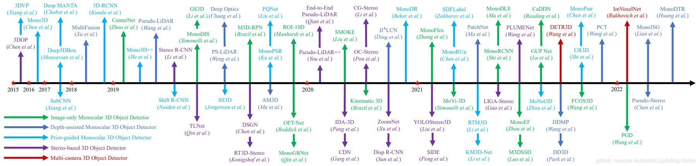

 图1. 基于相机的3D对象检测进展时间轴 

在本节中，将介绍基于相机的3D对象检测方法。回顾并分析了单目3D物体检测方法，分为仅图像、深度辅助和先验引导方法。进一步研究了基于立体图像和多个相机的3D物体检测方法。基于相机的3D对象检测方法的时序概述如上图1所示。

## 3.2.2.1 基于单目数据的3D检测

本身从单目图像中检测3D空间的目标是一个病态问题，因为单目无法提供足够的3D信息，很难预测3D目标准确的位置信息。很多方法利用几何约束和形状先验从图像中推断深度信息，也是一种优化单目3D目标定位问题的思路。但是和激光雷达比，还是相差较远。

### 一、Deep3DBox[1]

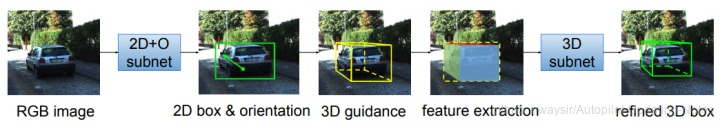

 图2. Deep3DBox 

Deep3DBox是论文3D Bounding Box Estimation Using Deep Learning and Geometry中的方法，被CVPR2017收录，首先使用网络回归出相对稳定的3D目标的特性，再利用估计出来的3D特征和由2D bounding box转换为3D bounding box时的几何约束来产生最终的结果。文章先回归方向和尺寸，再结合几何约束产生3D位姿。Deep3DBox能从单目中恢复3D距离尺寸信息，但是它需要学习全连接层的参数，与使用附加信息的方法相比，需要更多的训练数据。GS3D是CVPR2019上的一篇paper，论文发现3D的大致的位置其实是可以从2D检测以及一些先验知识中进行恢复的，(这些先验知识包含了3D-2D的投影矩阵)，因此作者设计了有效的算法，通过2D的检测去获取一个基本的长方体，而这个长方体可以引导我们去确定3D物体的尺寸，称为Guidance。除此之外，基本的3D信息可以被使用（通过使用3D bbox投影之后在2D图像上的surface等细节）。基于上述的观察，作者认为更进一步的分类以及回归的网络对bbox进行refinement对于减少FP以及回归的精度是非常必要的。论文使用CNN预测目标物的2D BBox，观察角，并根据先验知识（物体的长宽高、3D框底面中心在2D下边框中心偏上）和相机内参矩阵求得物体在相机坐标系下的3D坐标，根据3D坐标位置和观察角得到物体可视面，并将其投影至2D特征平面提取特征进一步优化3D预测框结果，如下图所示！

### 二、SMOKE[2]

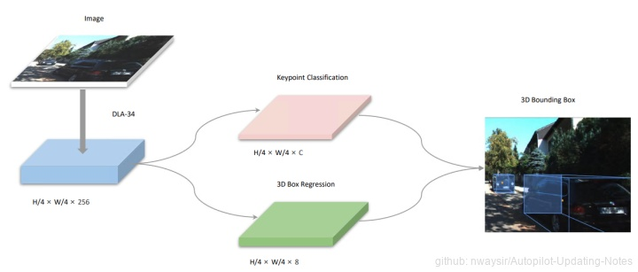

 图3. SMOKE 

SMOKE是纵目科技在2020年提出的单目3D检测新方法，论文展示了一种新的3D目标检测方法，该方法通过将单个关键点估计与回归3D变量相结合来预测每个检测到的目标3D bounding box。SMOKE延续了centernet的key-point做法，认为2d检测模块是多余的，只保留了3d检测模块，预测投影下来的3dbox中心点和其他属性变量得到3dbox。整体来说SMOKE框架简洁，性能当年还算不错，推理速度快，部署起来方便！
    
### 三、FCOS3D[3]

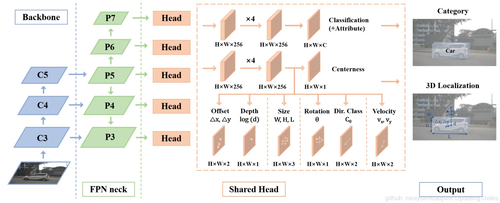

 图4. FCOS3D 

FCOS3D是基于 FCOS 改进的 3d 目标检测方案，在 NeurIPS 2020 中的nuScenes 3d 检测比赛上取得了第一名成绩，论文将 7-DoF 3D 目标解耦为 2D 和 3D 的属性，考虑到目标的二维比例，将目标分布到不同的特征级别，并仅根据训练过程的投影三维中心进行分配，除此之外，centerness 根据三维中心重新定义为二维高斯分布，以适应三维目标公式，网络结构如下所示：
    
### 四、FCOS3D++（PGD）[4]

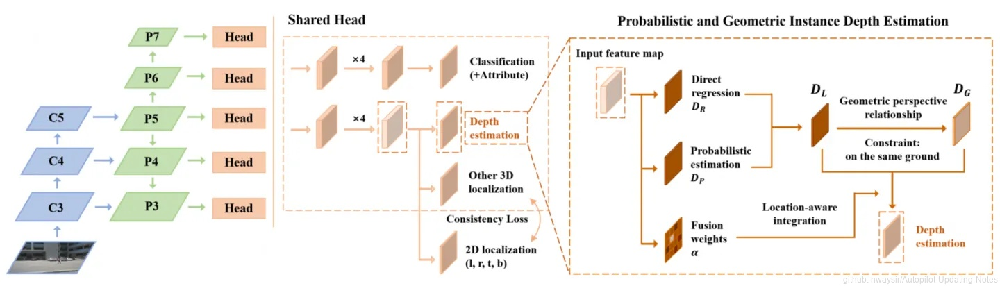

 图5. FCOS3D++（PGD） 

FCOS3D++，又称PGD，是CoRL 2021的单目三维目标检测算法，继承FCOS3D思路，论文提出单目三维目标检测可以简化为实例深度估计问题。不精确的实例深度估计阻碍了所有其他三维特性预测，限制了整体检测性能提高。前面的工作直接基于孤立的实例或者像素估计深度，忽略了不同目标之间的几何关系。因此，FCOS3D++构建了预测的目标之间的几何关系图，促进深度预测。FCOS3D++结合概率表示来捕获深度估计的不确定性，首先将深度值划分为一系列离散的区间，然后通过分布的期望来计算深度值，从分布中得到的top-k的置信度的平均值视作深度的不确定性。为了建模几何关系，构建了一个深度传播图来利用上下文信息促进深度估计。每个实例深度的不确定性为实例深度传播提供了有效指引。利用这一整体机制，可以很容易地利用高置信度确定预测。更重要的是，利用基于图的协同机制可以更精确地预测深度。论文提出的方法在KITTI和nuScenes基准上单目第一！

### 五、MonoFlex[5]

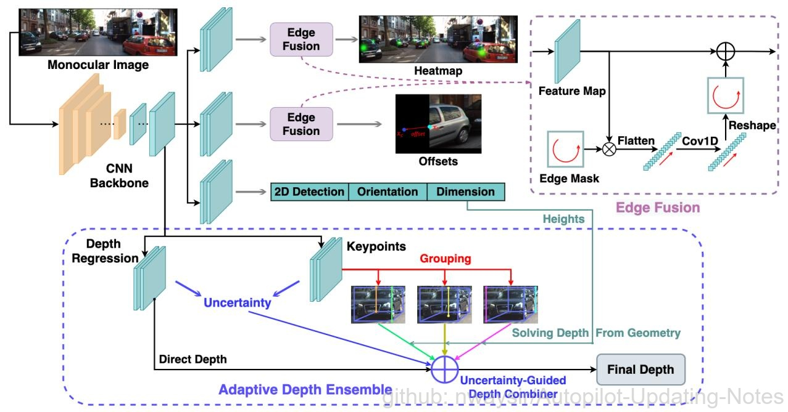

 图6. MonoFlex 

MonoFlex作者考虑到了目标的截断属性，提出了一种灵活的单目3D目标检测框架，使用边缘特征解耦了截断目标和正常目标，分开处理，在比较重要的深度估计方面，作者使用了直接预测法、基于关键点的几何计算法，同时结合不确定性，使深度估计的更准确。也是引入深度估计来提升单目3D检测性能！KITTI上SOTA！

### 六、CaDDN[6]

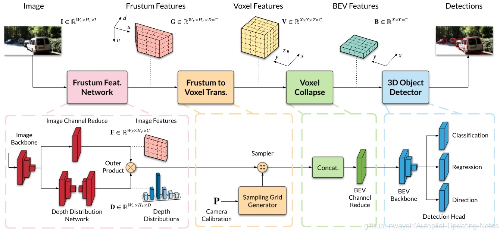

 图7. CaDDN 

单目3D检测通常会生成中间的特征表示形式，主要可以划分为以下三类：
- 直接法（Direct Methods）: 结合2D图像平面和3D空间的几何关系从图像中估计出3D检测框。直接法的缺点也比较明显，由于检测框直接从2D图像中获取，没有明确的深度信息，因此定位能力相对较差。
- 基于深度的方法（Depth-Based Methods）: 利用深度估计网络估计出图像的中每个像素对应的深度图，再将深度图直接作为输入or与原图结合or转换成3D点云数据（伪激光雷达Pseudo-LiDAR）用于3D目标检测任务。该方法的缺点是其深度和目标检测分离训练的结构，导致其可能会丢失一些隐含的信息。
- 基于网格的方法（Grid-Based Methods） : 通过预测出BEV网格表示替代通过深度估计作为3D检测输入的方法，通常转化步骤是通过利用体素网格把体素投影到图像平面上然后采样图像特征将其转换成BEV的形式。这种方法可能会导致大量体素和特征的重叠从而降低检测的准确性。
CaDDN 网络尝试结合以上方法的长处，整体网络同时训练深度预测和3D检测以期待其能够解决基于深度的方法中的问题，同时利用也将图像平面转换成了BEV的形式来提高检测的准确性。
    
### 七、MonoRCNN[7]

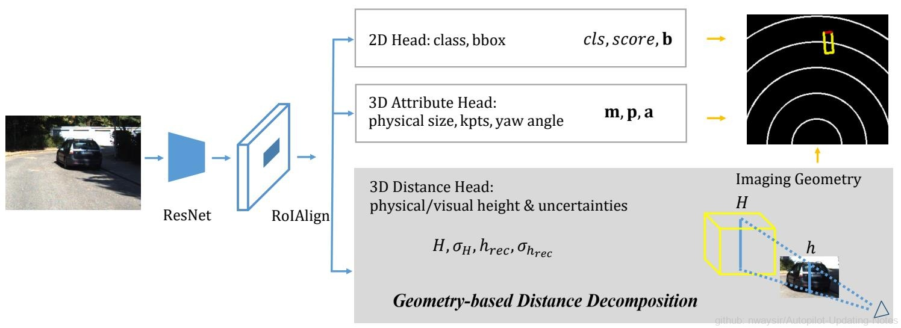

 图8. MonoRCNN 

单目3D目标检测的核心难点是估计目标的距离，MonoRCNN提出了一个基于几何的距离分解方法，将目标距离分解为与目标的物理高度(physical height)和图像平面上的投影高度(visual height)相关的量，使得距离的估计具有可解释性，精度和鲁棒性也更高；除此之外，论文还对导致距离估计不确定性的原因进行了理论和实验分析。

论文所提出来的基于分解的目标距离估计方案，本质上还是在自动驾驶中的一些前提假设(如目标只有yaw angle的变化)下，选取一些受未知参数影响较小的量作为网络学习的预测值，从而计算距离，这种学习方法与先前的一些工作选择预测目标尺寸一脉相承，但是论文中把距离的预测与目标的高度关联起来，还是很有创新的，这个思路应该还可以继续挖掘。另外论文中选择将不确定性引入进来做多任务优化提升性能，也是以往工作在单目3D目标检测领域的体现。

## 3.2.2.2 基于伪激光雷达数据的3D检测

主要有Pseudo-LiDAR、Pseudo-LiDAR++、E2E Pseudo-LiDAR，伪激光雷达方法本质是还是通过深度图生成伪激光雷达数据，辅助3D检测模型训练！

### 一、Pseudo-LiDAR[8]

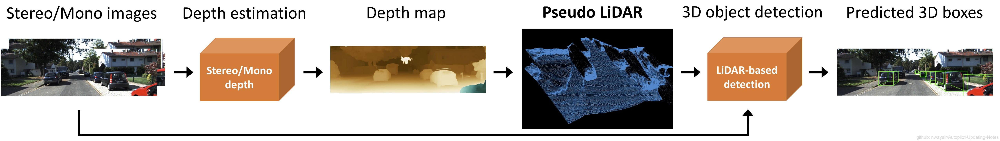

 图9. Pseudo-LiDAR 

康奈尔大学提出的Pseudo-LiDAR，探讨了为什么Image-based 3D Perception与LiDAR-based 3D Perception之间存在较大的gap，并且提出了bridge this gap的解决方案。论文首先利用DRON或PSMNET从单目 (Monocular)或双目 (Stereo)图像获取对应的深度图像(depth map)，然后将原图像结合深度信息得到伪雷达点云 (pseudo-LiDAR)，最后用pseudo-LiDAR代替原始雷达点云，以3D point cloud和bird's eye view的形式，分别在LiDAR-based的F-PointNet以及AVOD上与图像的front view表示进行了比较，并对比了Image-based的Mono3D, 3DOP, MLF这三类方案。论文验证了将图像转换为pseudo-LiDAR表示后，确实是bridged the gap between Image-based 3D Perception and LiDAR-based 3D Perception！！！论文指出目前的Image-based 3D Perception方案较差的性能主要是由于front view这种2D图形表示，而不是之前一直纠结的不准确的depth map。使用相同方法估计的depth map, 以BEV形式 (pseudo-Lidar投影得到)的3D Perception要远优于FV+depth map的形式。

### 二、Pseudo-LiDAR++[9]

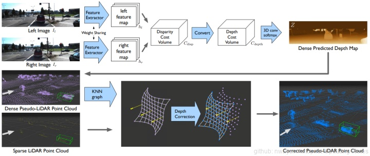

 图10. Pseudo-LiDAR++ 

Pseudo-LiDAR++通过改进立体深度估计，为伪激光雷达框架提供了实质性进展。论文调整了立体网络结构和损耗函数，使其与远距离目标的精确深度估计更加一致，这是目前伪激光雷达的主要弱点。此外还探索了利用更便宜但极为稀疏的激光雷达传感器来消除深度估计偏差的想法，这些传感器单独为3D检测提供的信息不足。最后提出了一种深度传播算法，在初始深度估计的指导下，在整个深度图上扩散这几个精确的测量值。相比于Pseudo-LiDAR，效果提升了27%。在某些指标上，可以和64线的激光雷达媲美（4线的激光雷达比64线的激光雷达价格要低两个数量级，这一套设备比之前64线的解决方案，成本降低95%）。

### 三、E2E Pseudo-LiDAR[10]

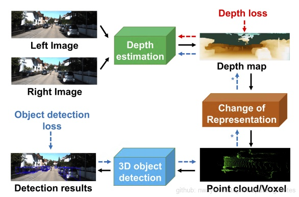

 图11. E2E Pseudo-LiDAR 

    
E2E Pseudo-LiDAR是发表在CVPR2020的单目目标检测模型，主要创新点：端到端！！！伪激光雷达（PL）的引入导致基于激光雷达传感器的方法与基于廉价立体相机的方法之间的精度差距大幅缩小，PL通过将2D深度图输出转换为3D点云输入，将用于3D深度估计的深度神经网络与用于3D目标检测的深度网络相结合。然而，到目前为止，这两个网络必须分别进行训练。E2E Pseudo-LiDAR介绍了一种基于可微表示变化（CoR）模块的新框架，该框架允许对整个PL管道进行端到端的训练。生成的框架与这两项任务的SOTA网络兼容，并与PointRCNN结合，在所有基准上均优于PL，KITTI 3D目标检测。

## 参考文献

[1] A. Mousavian, D. Anguelov, J. Flynn, and J. Kosecka. 3d bounding box estimation using deep learning and geometry. In CVPR, 2017.

[2] Liu Z ,  Wu Z , R Tóth. SMOKE: Single-Stage Monocular 3D Object Detection via Keypoint Estimation[C]// 2020 IEEE/CVF Conference on Computer Vision and Pattern Recognition Workshops (CVPRW). IEEE, 2020.

[3] T. Wang, X. Zhu, J. Pang, and D. Lin. FCOS3D: Fully convolutional one-stage monocular 3d object detection. arXiv preprint arXiv:2104.10956, 2021.

[4] T. Wang, X. Zhu, J. Pang, and D. Lin. Probabilistic and Geometric Depth: Detecting Objects in Perspective. In Conference on Robot Learning, 2021.

[5] Y. Zhang, J. Lu, and J. Zhou. Objects are Different: Flexible Monocular 3D Object Detection. In IEEE Conference on Computer Vision and Pattern Recognition, 2021. 

[6] C. Reading, A. Harakeh, J. Chae, and S. L. Waslander. Categorical Depth Distribution Network for Monocular 3D Object Detection. In IEEE Conference on Computer Vision and Pattern Recognition, 2021.

[7] Xuepeng Shi, Qi Ye, Xiaozhi Chen, Chuangrong Chen, Zhixiang Chen. Geometry-based Distance Decomposition for Monocular 3D Object Detection, Tae-Kyun Kim International Conference on Computer Vision (ICCV), 2021.

[8] Wang Y ,  Chao W L ,  Garg D , et al. Pseudo-LiDAR From Visual Depth Estimation: Bridging the Gap in 3D Object Detection for Autonomous Driving[C]// 2019 IEEE/CVF Conference on Computer Vision and Pattern Recognition (CVPR). 

[9] You Y ,  Wang Y ,  Chao W L , et al. Pseudo-LiDAR++: Accurate Depth for 3D Object Detection in Autonomous Driving[C]// International Conference on Learning Representations. 2020.

[10] Hariharan B ,  Garg D ,  Weinberger K Q , et al. End-to-End Pseudo-LiDAR for Image-Based 3D Object Detection: IEEE, 10.1109/CVPR42600.2020.00592[P]. 2020.
