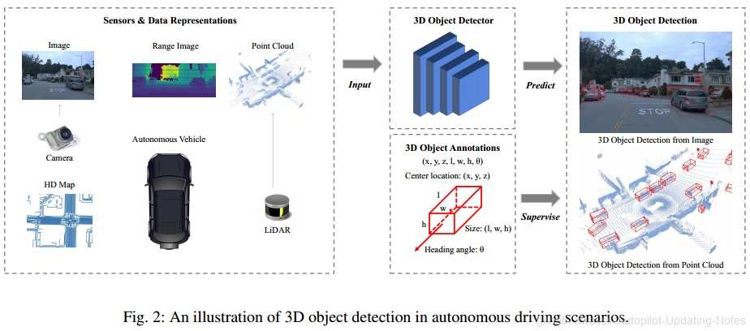
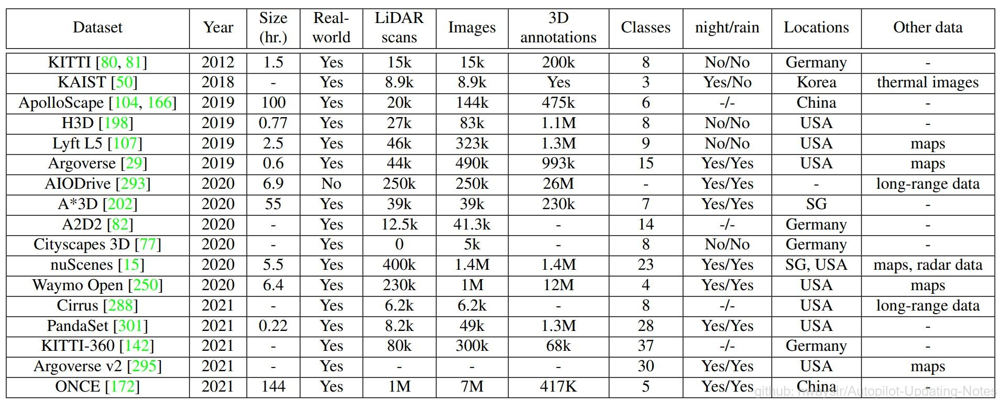

# 3.2 3D目标检测

## 一、定义

3D目标检测是通过输入传感器数据，预测3D目标的属性信息的任务。如何表示3D目标的属性信息是关键，因为后续的预测和规划需要这些信息。大部分情况下，3D目标被定义为一个立方体，(x,y,z)是立方体的中心坐标，l,w,h是长宽高，delta是航向角，比如立方体在地平面的偏航角，class是3D目标的类别。vx、vy描述3D目标在地面上沿x轴和y轴方向的速度。在工业应用中，一个3D目标的参数可以进一步简化为鸟瞰图上一个长方体的4个角位置。

在感知任务中，3D目标检测是车辆感知系统中最不可或缺的任务之一。3D目标检测旨在预测3D空间中关键目标的位置、大小和类别，例如机动车、行人、骑自行车的人等。与仅在图像上生成2D边界框并忽略目标与本车的实际距离信息的2D目标检测相比，3D目标检测侧重于对真实世界3D坐标系中目标的定位和识别。3D目标检测在现实世界坐标中预测的几何信息可以直接用于测量本车与关键目标之间的距离，并进一步帮助规划行驶路线和避免碰撞。

## 二、传感器输入

许多类型的传感器都可以为3D目标检测提供原始数据，相机和激光雷达（LiDAR）是两种最常采用的传感器类型。相机价格便宜且易于使用，并且可以从某个角度捕捉场景信息。相机产生图像$I_{cam}\in{R^{W×H×3}}$用于3D目标检测，其中W和H是一幅图像的宽高，每个像素有3个RGB通道。尽管价格便宜，但相机在用于3D目标检测方面存在内在限制。首先，相机只捕捉外观信息，不能直接获取场景的3D结构信息。另一方面，3D目标检测通常需要在3D空间中进行准确定位，而从图像估计的3D信息（如深度信息）通常具有较大的误差。此外，基于图像的检测很容易受到极端天气和时间条件的影响。在夜间或雾天目标检测相比于晴天检测要困难得多，这样的自动驾驶系统无法保证鲁棒性。

作为替代解决方案，LiDAR可以通过发射一束激光束，然后测量其反射信息来获得场景的细粒度3D结构信息。一个LiDAR传感器在一个扫描周期内发射光束并进行多次测量可以产生一个深度图像，每个深度图的像素有3个通道，分别为球坐标系中的深度$\gamma$、方位角$\alpha$和倾角$\phi$。深度图像是激光雷达传感器获取的原始数据格式，可以通过将球坐标转换为笛卡尔坐标进一步转换为点云。一个点云可以表示为N×3，其中N表示一个场景中的点数，每个点有3个xyz坐标通道。附加功能，例如反射强度，可以附加到每个点或深度图像素。深度图像和点云都包含由LiDAR传感器直接获取的准确3D信息。因此，与相机相比，LiDAR传感器更适合检测3D空间中的目标，并且LiDAR传感器也更不易受时间和天气变化的影响。然而，LiDAR传感器比摄像头贵得多，这限制了在驾驶场景中的大规模应用。3D目标检测图解，见下图：

 图1. 3D目标检测范例 

## 三、与2D目标检测的比较

2D目标检测是计算机视觉中的一个基本问题，而3D目标检测方法借鉴了2D目标检测方法的许多设计范式，如 RPN、Anchors、NMS等。然而，从多方面来看，3D目标检测方法并不是2D目标检测方法对3D空间的简单适配。

### （1）3D目标检测方法必须处理多样化的数据

点云检测需要新的算子和网络来处理不规则的点数据，而点云和图像的检测需要特殊的融合机制。

### （2）3D目标检测方法通常利用不同的投影视图来生成目标预测结果

与从透视图检测目标的2D目标检测方法相反，3D方法必须考虑不同的视图来检测3D目标，例如鸟瞰图、点视图、柱面视图等。

### （3）3D目标检测对目标在3D空间的准确定位有很高的要求

分米级的定位误差可能导致对行人和骑自行车的人等小目标的检测失败，而在2D目标检测中，几个像素的定位误差可能仍然保持较高的IoU指标（预测值和真值的IoU）。因此，不论是利用点云还是图像进行3D目标检测，准确的3D几何信息都是必不可少的。

## 四、与室内3D目标检测对比

室内3D目标检测也是3D目标检测的一个分支，室内数据集比如SUN RGB-D，利用RGB-D和3D标注信息重建房间结构，包括门、窗、床、椅子等。室内场景中的3D目标检测也是基于点云或图像。然而，与室内3D目标检测相比，驾驶场景中存在独特的挑战。

### （1）自动驾驶场景的检测范围远大于室内场景

驾驶场景中的3D目标检测通常需要预测很大范围内的3D目标，如 Waymo中为150m×150m×6m，而室内3D目标检测通常以房间为单位，而其中大多数单人房间小于10m×10m×3m。那些在室内场景中工作的时间复杂度高的方法在驾驶场景中可能无法表现出好的适应能力。

### （2）LiDAR和RGB-D传感器的点云分布不同

在室内场景中，点在扫描表面上分布相对均匀，大多数3D目标在其表面上可以接收到足够数量的点。而在驾驶场景中，大多数点落在LiDAR传感器附近，而那些远离传感器的3D目标仅接收到少量点。因此，驾驶场景中的方法特别需要处理3D目标的各种点云密度，并准确检测那些遥远和稀疏的目标。

### （3）驾驶场景中的检测对推理延迟有特殊要求

驾驶场景中的感知必须是实时的，以避免事故。因此，这些方法需要及时高效，否则它们将无法落地。

## 五、数据集

自动驾驶3D目标检测相关数据集较多，具体见下表。主要的数据集建立需要继续干以下四件事：

### （1）增大数据规模

### （2）增加数据多样性，不只有白天夜晚，还要包括阴天、雨天、雪天、雾天等

### （3）增加标注类别，除了常用的机动车、行人、非机动车等，还应包括动物，路上的障碍物等

### （4）增加多模态数据，不只有点云和图像数据，还有高精地图、雷达数据、远程激光雷达、热成像数据等

未来的数据集应该包括感知、预测、规划、建图等一整套数据，这样可以为端到端的自动驾驶系统服务，而不仅仅是考虑一个3D目标检测任务。

 图2. 3D目标检测范例 

## 六、评价标准

针对3D目标检测的评价，一种是将2D任务的AP指标扩展到3D，比如KITTI就包括 $AP_{3D}$、$AP_{BEV}$指标，分别用到预测值与真值的3D-IoU、BEV-IoU来衡量。还有基于中心距离的匹配，或者匈牙利匹配等评测指标。另一种则通过下游任务来衡量，只有对下游任务（运动规划）有帮助的检测方法，才能在实际应用中确保驾驶安全。包括基于预测未来状态和真值KL散度的$PKL^{[1]}$以及物体边界与本车的最小距离误差的$SDE^{[2]}$等工作。

不同评价指标的利弊。基于AP的评价指标自然继承了2D检测的优势。然而，这些指标忽略了检测对驾驶安全的影响，而这在现实应用中至关重要。例如，在AP计算中，本车附近的目标漏检和本车远一点的目标漏检可能都只是一个漏检，但在实际应用中，近处的目标漏检实质上比远处的目标漏检更危险。

因此，从安全驾驶的角度来看，基于AP的指标可能不是最优选择。PKL和SDE通过考虑下游任务中检测的影响，部分解决了这个问题，但在对这些影响建模时将引入额外的挑战。PKL需要一个预先训练的运动规划器来评估检测性能，但预先训练的规划器也有固有误差，可能会使评估过程不准确。SDE需要重构目标边界，这通常是复杂和具有挑战性的。

**参考文献**

[1] Philion J., Kar A., Fidler S. (2020) Learning to evaluate perception models using
planner-centric metrics. In: CVPR \
[2] Deng B., Qi C. R., Najibi M., Funkhouser T., Zhou Y., Anguelov D. (2021) Revisiting
3d object detection from an egocentric perspective. NeurIPS \

