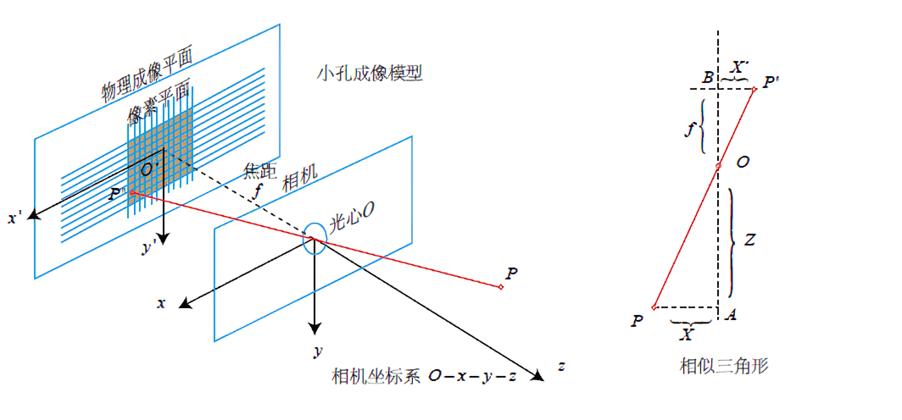
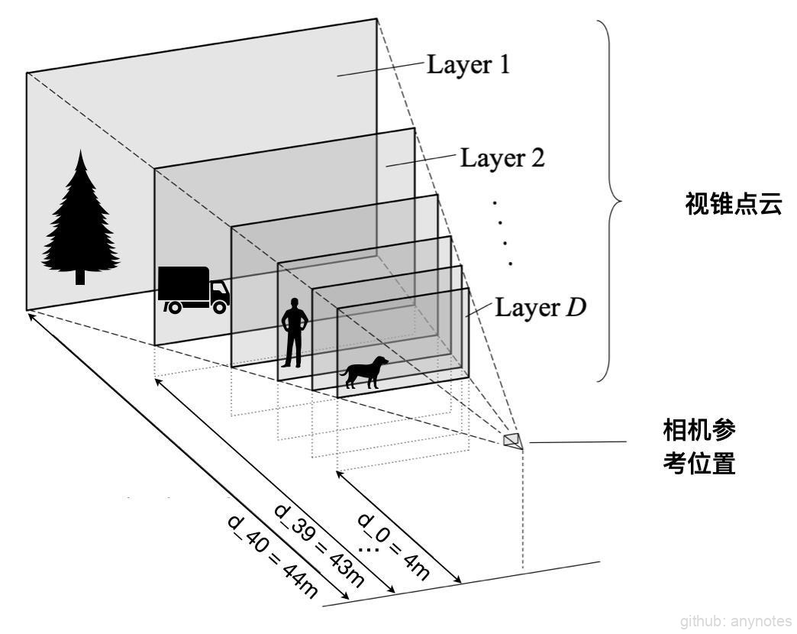
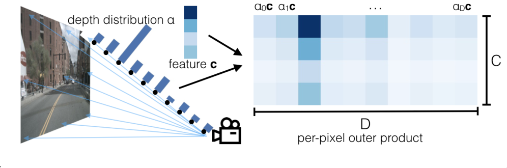
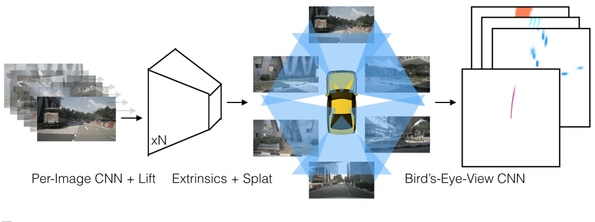
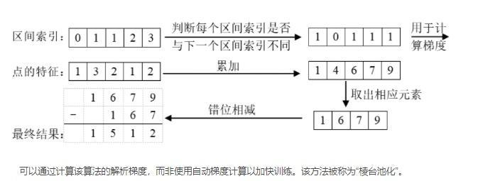

# LSS

## 一、简介

当前 BEV 的研究大都基于深度学习的方法，从组织 BEV 特征信息的方式来看，主流方法分属两类：**自底向上**方法和**自顶向下**方法。

### （一）自底向上
   
该方法比较早的代表工作是 LSS，后来 BEVDet、BEVDepth[2](#refer-anchor) 等也是基于 LSS 的框架来进行优化。自底向上方法核心是：

1. Lift：对各相机的图像显性地估计像平面下采样后特征点的深度分布，得到包含图像特征的视锥（点云）；
   
2. Splat：结合相机内外参把所有相机的视锥（点云）分配到 BEV 网格中，对每个栅格中的多个视锥点进行 sum-pooling 计算，形成 BEV 特征图；
   
3. Shoot：用 task head 处理 BEV 特征图，输出感知结果。本文就是通过解读 LSS 和 BEVDepth[2](#refer-anchor) 两篇论文，来深度剖析自底向上构建 BEV 方法。

### （二）自顶向下
   
该方法的典型代表是 Tesla 用 Transformer 构建 BEV，2020年10月发布的 FSD Beta 软件视觉感知模块已开始应用此方法，在2021年 Tesla AI Day 上 Andrej Karparthy 披露了更多技术思想，核心是: 先预定义待生成的 BEV 特征图，利用 Transformer 全局感知能力在多个视角图像的特征中多次查询相应信息，并把信息融合更新到 BEV 特征图中。上海 AILab 团队做了类似的技术实现，并以 BEVFormer 公布了相关工作。

## 二、基础知识

为便于一以贯之地理解针作者整理的多篇 BEV 论文系列解读文章，这里预先明确两个 BEV 相关的概念：

### （一）BEV 网格

在自车周围俯视平面 $x-y$ 方向划分 $n$ 个网格，每个网格表示特定物理距离 $d$ 米。如 $200\times{200}$ 的 BEV 网格，每格代表 0.5 米，这个网格就表示 $100\times{100}$ 米的平面范围。如果恰好自车中心（自动驾驶的的车辆中心一般指后轴中心）在网格中心位置，那么网格就表示自车前、后和左、右各 50 米的范围。注意这里强调用网格划分平面空间，并不涉及网格内放什么内容。

图1. BEV 网格

### （二）BEV 特征图

在 BEV 网格的所有格子中都填充 $C$ 个通道的特征值作为内容（contex），就组成了 BEV 特征图。注意，为了让 BEV 特征图保留 BEV 网格 $x-y$ 方向距离的意义，这里每个格子中 $C$ 通道特征值都要来自格子所对应空间的特征信息，而不是胡乱地填充其它地方的特征信息。

形象地解释，假如某个格子所对应空间有个锥桶，那么这个格子里填充的一定是用来描述这个锥桶的特征值，而不是远方天空或红绿灯的特征值。

无论是自顶向下还是自底向上方法，核心目标是：为 BEV 网格中每个格子组织并填充合适的特征信息，得到 BEV 特征图。

本文解读 BEV 自底向上方法的两篇重要论文：LSS 和 BEVDepth。LSS 提出了一整套自底向上构建 BEV Representation 的框架（ECCV2020），为后续很多相关工作奠定了系统性基础。BEVDepth 在保持 LSS 框架的基础上，重点围绕如何获取更准确的深度估计进行优化，另外还提出了高效计算 Voxel Pooling 过程的方法，引入了多帧融合，这些工作使 BEVDepth 取得了不错的提升效果。

## 三、原理

### （一）自底向上方法框架 - LSS
   
[Lift, Splat, Shoot: Encoding Images from Arbitrary Camera Rigs by Implicitly Unprojecting to 3D](https://link.zhihu.com/?target=https%3A//www.ecva.net/papers/eccv_2020/papers_ECCV/papers/123590188.pdf)

[代码](https://github.com/nv-tlabs/lift-splat-shoot)

**1. 视锥点云和 Lift 操作**

用单目相机进行距离、尺寸类的感知，关键是如何恢复图像中的深度信息。

2D 图像中每个像素点可以理解成世界空间中某点到相机中心的一条射线，仅利用图像不能确定此像素具体来自射线上哪个位置 (也就是不知道该像素的深度值)，如下 图2 中的 $P$，投影到 $P^{'}$，丢失了深度信息 $Z$。

图2. 相机成像模型

LSS 的第一步操作 Lift 就是为了恢复图像的深度信息。采用的方法包括两个小步骤：

* Lift1: 为每个像素生成具有**所有可能深度**的一系列点；

* Lift2: 给每个点生成特征值（contex）。

实际上并不是用原图像素进行 Lift1 操作，而是用经过 backbone 提取特征且下采样的特征点（其中，backbone 的输入是原图 resize、crop 预处理后的图像）。论文中为了让读者容易想象，形象地把它称为像素，下文中我们试图更严谨一些，把它们称作**图像特征点**。沿着这个定义名词的思路，那就把特征点所在的下采样后平面称作**图像特征平面**。

相比于给特征点赋予单一深度值，采用**所有可能深度**的好处在于可以提高鲁棒性，在一些深度值具有歧义性的像素点上表现更好。

下面先介绍 Lift1（为每个像素生成具有**所有可能深度**的一系列点）的具体实现：为每个图像特征点分配 $D$ 个点 $\{(h,w,d)∈R^3 | d∈D \}$ ，其中 $D$ 是一系列的离散深度。这样就为图像特征平面 $（H\times{W}）$ 生成了一个巨大的点云（含 $H\times{W}\times{D}$ 个点）。实际上这个点云所表示的 $3D$ 物理空间是一个以相机为顶点的视锥体，如下图3 所示，下文中把它们称作**视锥点云**。

*(1) 视锥点云的空间位置*

官方代码中生成视锥点云的实现方式是：如下图3 所示，定义距离图像特征平面 $4m$ 到 $44m$、间隔 $1m$ 的多个平面，这样每个图像特征点有 $D=41$ 个可能的离散深度值。每个点相对相机的描述的位置是 $[h, w, d]$ ，利用相机内、外参，可以把这个位置转换成用车辆坐标系下的空间位置来表示，其维度也是 $H\times{W}\times{D}\times{3}$ ，即 $H\times{W}\times{D}$ 个 $[x, y, z]$ 。

图3. 视锥点空间位置

有了视锥点云，以及每个点所对应的空间位置，那么如何获得每个点的有效特征信息呢？这就由 Lift2 （给每个点生成特征值[contex]）来实现。

*(2) 视锥点云的特征(Context)*

Lift 完整操作过程如图4 所示，模型对每个图像特征点预测 $C$ 维语义特征 $c$ 以及 $D$ 维深度分布概率 $α$（41 个深度的分布概率），然后将 $α$ 与 $c$ 做外积，得到 $H\times{W}\times{D}\times{C}$ 维的特征图，可以理解为 $H\times{W}\times{D}$ 个视锥点的 $C$ 维语义特征，它编码了自适应深度下的逐个图像特征点的语义信息。图中第三个深度，即深度为 $α_2$ 的视锥点的深度分布概率比较高，那么在图中右侧，相比于此图像特征点的其它视锥点，$α_2c$ 的语义特征最 “显著”，也可以理解为这个图像特征点的信息更多地被编码到了视锥点 $α_2$ 。

图4. 视锥点云特征

**2. BEV Pillar 和 Splat 操作**

有了视锥点云（包含空间位置和特征），就可以根据视锥点的空间位置把每个视锥点的特征（contex）放到 BEV 网格中的合适位置，组成 BEV 特征图。

BEV 网格由 $200\times{200}$ 个格子（BEV Pillar）组成，每个格子对应物理尺寸为 $0.5\times{0.5}$ 米。即 BEV 网格对应车辆前、后和左、右各 $50m$，且高度不限的 3 维空间。

上面通过相机的内外参，已经把视锥点云转换到车辆坐标系下的空间位置。排除掉 BEV 网格所表示空间范围 (以自车为中心 $100m\times{100m}$ 范围) 以外的点，就可以把剩余有效的视锥点云分配到每个 BEV Pillar 里。

注意，这里存在同一个 BEV Pillar 可能分配多个视锥点的情况，这是由两个原因引起:

(1) 单张 2D 图像不同的像素点可能投影在俯视图中的同一个位置，例如垂直于地面的电线杆，它成像的多个像素点可能投到同一个 BEV Pillar。

(2) 相邻两相机有部分成像区域重叠，相机图像中的不同像素点投影在同一个 BEV Pillar。例如不同相机画面中的同一个目标。

对于一个 BEV Pillar 分配多个视锥点，作者使用了 sum-pooling 的方法，把视锥点的特征相加，最后得到了 $200\times{200}\times{C}$ 的 BEV 特征图，源码中 $C$ 取 $64$。

图5. Sum-Pooling 

**3. Shoot: Motion Planning**

Lift-Splat 已经输出了由 N 个相机图像编码的 BEV features，接下来就是再接上 Head 来实现特定的任务，这部分由 Shoot 来实现。

LSS 的关键是可以仅使用图像就可以实现端到端的运动规划。在测试时，用推理输出 $costmap$ 进行规划的实现方法是： $Shoot$ 输出多种轨迹，并对各个轨迹的 $cost$ 进行评分，然后根据最低 $cost$ 轨迹来控制车辆运动。这部分的核心思想来自《End-to-end Interpretable Neural Motion Planner》[1](#refer-anchor)。

## 四 、pipeline

论文中对方法实现描述不清楚，参考代码中的 [model.py](https://link.zhihu.com/?target=https%3A//github.com/nv-tlabs/lift-splat-shoot/blob/master/src/models.py)，把方法实现的 pipeline 整理到如下几个部分:

1. CreateFrustum()：根据配置参数构建单个相机的视锥（Frustum）

   >在每个图像特征点位置（高 $H$、宽 $W$ ）扩展 $D$ 个深度，最终输出是 $D\times{H}\times{W}\times{3}$ ，其中 $3$ 表示特征点和深度坐标 $[h, w, d]$，这里只是初步对单个相机视角的感知空间进行划分，形成视锥点云。后续会扩展到 $N$ 个相机，并把视锥点云放到 $ego$ 周围的空间，也会基于空间范围对点云进行筛选。

2. GetGeometry()：利用内外参，对 $N$ 个相机 Frustum 进行坐标变换，输出视锥点云在自车周围物理空间的位置索引

   >对 $N$ 个相机的 frustum 进行坐标变换，简单来说就是内参外参以及六个视角的变换，输出结果是 $B\times{N}\times{D}\times{H}\times{W}\times{3}$ ，其中 $3$ 是 $ego$ 坐标系下的空间位置 $[x,y,z]$，$B$ 是 $batch$，$N$ 是相机个数，$D$ 是深度分布数。这样就等同于把 $ego$ 周围空间划分为 $D\times{H}\times{W}$ 块。

3. CamEncode()：对原始图像进行逐个图像特征点地进行深度和语义的预测，输出视锥点云特征

   (1) 首先对原始图像过 EfficientNet 学习特征
   
   (2) 然后一层卷积直接出 D+C 的维度，D 属于深度分布，C 是语义特征
   
   (3) 对 D 维深度做 softmax 归一化
   
   (4) 将 D 与 C 做外积
   
   (5) 最终输出的是 $H\times{W}\times{D}\times{C}$
   
   (6) $B\times{N}$ 张图像，对应的输出就是 $B\times{N}\times{H}\times{W}\times{D}\times{C}$ 

4. VoxelPooling()：将上述 GetGeometry() 和 CamEncode() 的输出作为输入，根据视锥点云在 $ego$ 周围空间的位置索引，把点云特征分配到 BEV pillar 中，然后对同一个 pillar 中的点云特征进行 sum-pooling 处理，输出 $B\times{C}\times{X}\times{Y}$ 的 BEV 特征。

   (1) 首先将点云特征 reshape 成 $M\times{C}$，其中 $M=B\times{N}\times{D}\times{H}\times{W}$

   (2) 然后将 GetGeometry() 输出的空间点云转换到体素坐标下，得到对应的体素坐标。并通过范围参数过滤掉无用的点。

   (3) 将体素坐标展平，reshape 成一维的向量，然后对体素坐标中 B、X、Y、Z 的位置索引编码，然后对位置进行 argsort，这样就把属于相同 BEV pillar 的体素放在相邻位置，得到点云在体素中的索引。

   (4) 然后是一个神奇的操作，对每个体素中的点云特征进行 sumpooling，代码中使用了 [cumsum_trick](#1-cumsum_trick-池化累积求和技巧)，巧妙地运用前缀和以及上述 argsort 的索引。输出是去重之后的 Voxel 特征 $B\times{C}\times{Z}\times{X}\times{Y}$ 。

   (5) 最后使用 unbind 将 Z 维度切片，然后 cat 到 C 的维度上。代码中 Z 维度为 1，实际效果就是去掉了 Z 维度，输出为 $B\times{C}\times{X}\times{Y}$ 的 BEV 特征图。

5. BEVEncode()：用类似 UNet 的结构对 BEV 特征进一步实施特征提取，得到模型输出结果，即 shooting 输出的 BEV 特征图（维度是 $\times{B}\times{1}\times{X}\times{Y}$ ）。

## 注解：

### 1. cumsum_trick(): 池化累积求和技巧

模型中使用 Pillar 累积求和池化，"累积求和" 是通过 bin id 对所有点进行排序，对所有特征执行累积求和，然后减去 bin 部分边界处的累积求和值来执行求和池化。无需依赖 autograd 通过所有三个步骤进行反向传播，而是可以导出整个模块的分析梯度，从而将训练速度提高 2 倍。 该层被称为 "Frustum Pooling" ，因为它将 n 个图像产生的截锥体转换为与摄像机数量 n 无关的固定维度 CxHxW 张量。

计算原理的过程示意图：

图6. 池化累积求和 

## 参考文献

[1] ZENG W, LUO W, SUO S, et al. End-To-End Interpretable Neural Motion Planner[C/OL]//2019 IEEE/CVF Conference on Computer Vision and Pattern Recognition (CVPR), Long Beach, CA, USA. 2019. 

[2] LI Y, GE Z, YU G, et al. BEVDepth: Acquisition of Reliable Depth for Multi-view 3D Object Detection[J].