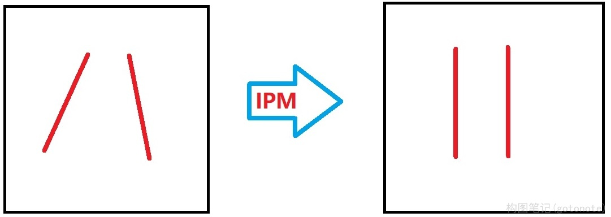
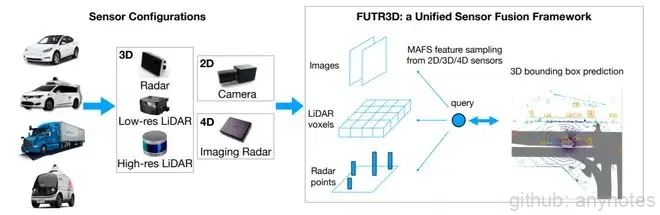

# BEV 鸟瞰图

BEV是鸟瞰图（Bird's Eye View）的简称，也被称为上帝视角，是一种用于描述感知世界的视角或坐标系（3D），BEV也用于代指在计算机视觉领域内的一种端到端的、由神经网络将视觉信息，从图像空间转换到BEV空间的技术。

## 一、基于传统方法的 BEV 空间转换

传统方法的BEV空间转换方法，一般是先在图像空间对图像进行特征提取，生成分割结果，然后通过IPM（Inverse Perspective Mapping，逆透视变换）函数转换到BEV空间。

在前视摄像头拍摄的图像中，由于透视效应现象（想象从一个点去看世界，透视效应会呈现出近大远小的观察结果）的存在，本来平行的事物（比如车道线），在图像中却不平行。IPM就是利用相机成像过程中的坐标系转化关系，对其原理进行抽象和简化，得到真实世界坐标系和图像坐标系之间坐标的对应关系，并进行公式化描述，从而消除这种透视效应，所以叫做逆透视变换。

图1. 车道线的逆透视变换（IPM）

IPM是一种连接图像空间和BEV空间的简单直接的方法，只需要知道相机内外参数就可以。相机内参数，指的是与相机自身特性相关的参数，比如焦距、像素大小等，而相机外参数则是相机在真实世界坐标系中的参数，比如相机的安装位置、旋转方向等。

需要注意的是，IPM依赖一些预先的假设，比如地面平直性假设（地面要是平的），且相机和地面之间没有相对运动（车辆的俯仰角不变）。

很多时候这个假设太严苛了，很难满足，比如在颠簸道路上，或者在车辆加速或减速产生俯仰时，系统对目标物的感知结果波动非常大，会产生“忽近忽远”的跳变，平行的车道线，这时也会变成“内八”或者“外八”。

于是就有了改进方案，那就是将相机的实时位姿考虑进来，加上俯仰角的修正补偿后，再进行空间转换。改进后虽然效果有所改善，但是实时位姿也很难准确得到，所以效果并不理想。
    
## 二、基于深度学习的 BEV 空间转换

这两年，深度学习也开始被应用于BEV空间转换，且逐渐成为主流方案。

相比于依赖人为规则，使用神经网络从2D空间进行BEV空间转换，能够取得更好的感知效果。

具体的流程是，先通过一个共享的主干网络（Backbone）来提取每个相机的特征（feature），然后再通过Transformer等将多摄像头数据，完成从图像空间到BEV空间的转换。在BEV空间内，由于坐标系相同，可以很方便地将图像数据和其他传感器数据（如Lidar、Radar等）进行融合，还可以进行时序融合形成4D空间，这也是当下BEV技术的大趋势。

图2. 基于BEV时空融合的3D目标检测 

        