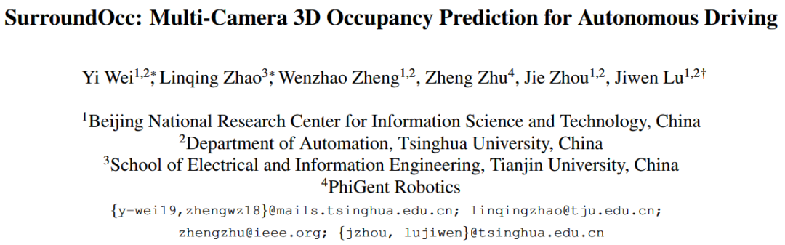
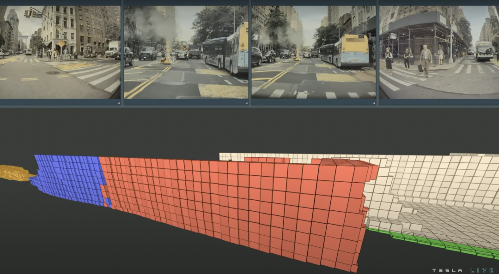
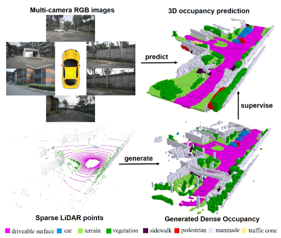
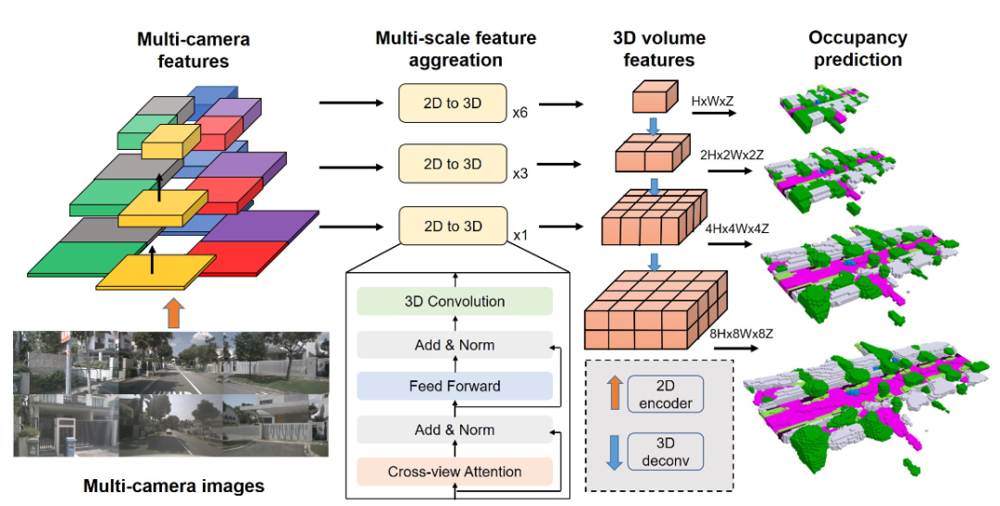
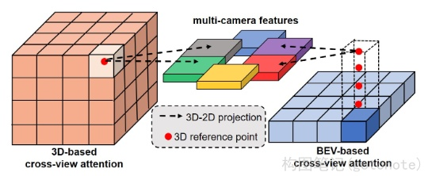
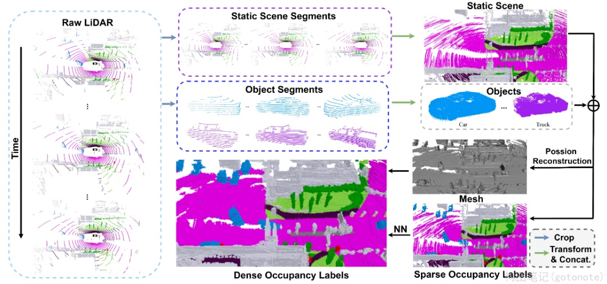
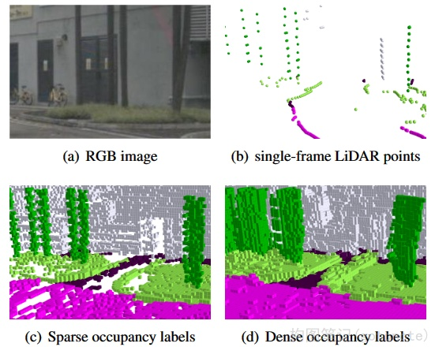
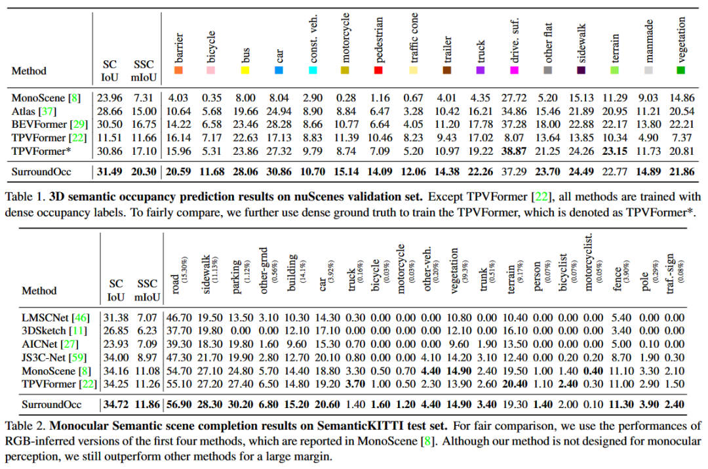
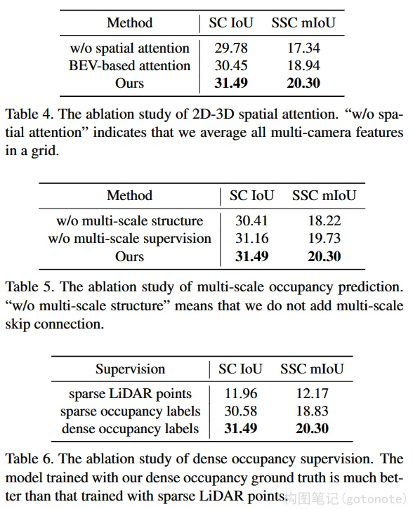
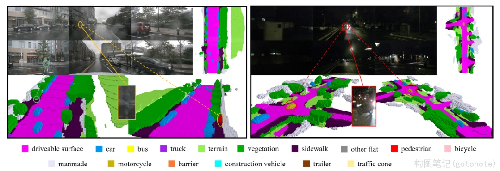

# SurroundOcc

> **Title**: SurroundOcc: Multi-Camera 3D Occupancy Prediction for Autonomous Driving  
> **Paper**: https://arxiv.org/pdf/2303.09551.pdf  
> **Code**: https://github.com/weiyithu/SurroundOcc

## 一、导读

传统的 `3D` 场景理解方法大多数都集中在 3D 目标检测上，难以描述任意形状和无限类别的真实世界物体。本文提出的 `SurroundOcc` 方法**可以更全面地感知 3D 场景**。首先对每个图像提取多尺度特征，并采用空间 `2D-3D` 注意力将其提升到 3D 体积空间。然后，采用 3D 卷积逐步上采样体积特征，并在多个级别上施加监督。

此外，为了获得密集的**占据** (`occupancy`) 预测，本文设计了一个流程来生成密集的占据标签，能够节省大量的人力和时间成本。具体来说，本文分别融合动态物体和静态场景的多帧 `LiDAR` 扫描，然后采用 `Poisson` 重建方法填补空洞，并将网格数据体素化来获取密集的占据标签。本文方法在 `nuScenes` 和 `Semantic KITTI` 数据集上进行了大量实验，并证明了有效性。

### （一）占据网络 (Occupancy networks)

 SurroundOcc 概述 

**当我们想要建立一个自动驾驶系统时，了解周围环境的三维几何结构是首要步骤。** 虽然 LiDAR 技术是捕获几何信息的直接且有效的方法，但成本高和扫描点稀疏这两大问题，限制了其进一步的应用。近年来，以多相机图像为输入的纯视觉自动驾驶技术，在各种 3D 感知任务中都表现出了具有竞争力的性能，包括深度估计、三维物体检测和语义地图构建等，引起了科研界和工业界的广泛关注。

**一直以来，多相机 3D 目标检测在 3D 感知任务中扮演着重要角色，但面对长尾问题时，很多时候都束手无策，难以识别现实世界中所有类别的物体。** 与 3D 目标检测相辅相成，重建周围的 3D 场景可以更好地帮助下游的感知任务。最近有许多工作通过结合多个视角的信息，预测周围的深度图。然而，深度图仅预测每个光线中最近的占据点，没有办法恢复 3D 场景中被遮挡的部分。

与基于深度的方法不同，另一种方法是直接预测场景的 3D 占据情况，即通过为 3D 空间中的每个体素分配一个占据概率来描述 3D 场景。然而，目前该类工作仅是简单地利用多相机结果进行后处理融合，或是通过稀疏点云监督无法生成密集的占据预测，这都限制了性能发挥。

### （一）基于体素的场景表示

* MonoScene、TPV-Former

将三维空间离散化成体素，并用向量特征描述每个体素，被广泛应用于激光雷达分割和三维场景完成等任务。对于 3D 占据预测任务，体素表示更适合模拟 3D 场景的占用情况。

### （二）3D 场景重建

* SurfaceNet、Atlas、NeuralRecon

通过深度估计为每个像素预测深度值。深度估计方法需要完整的深度注释来监督深度估计模型，后来的研究更关注自监督深度估计。

### （三）基于视觉的三维感知

* 显式深度方法、隐式深度方法

由于缺乏直接的几何输入，基于视觉的三维感知需要利用语义线索来推断 3D 场景几何。显式深度方法会明确预测图像输入的深度图以提取场景的 3D 几何信息，然后将其投影到 3D 空间中。隐式深度方法则隐式地学习 3D 特征而不产生显式深度图。

**为了解决上述问题，本文提出了 SurroundOcc 方法，旨在使用多相机图像输入来预测密集和准确的三维占据情况。** 首先，使用 2D 神经网络从每个图像提取多尺度特征图。然后，使用 2D-3D 空间注意机制将多相机图像信息提升到 3D 体积特征代替 BEV 特征。接下来，采用 3D 卷积网络逐步上采样低分辨率体积特征，并将其与高分辨率特征融合以获得细粒度的 3D 表示。在每个级别上，使用衰减加权损失对网络进行监督。

**此外，为了避免昂贵的占据注释，本文还提出了一套生成密集占据标签的方法，通过现有的 3D 目标检测和 3D 语义分割标签生成密集的占据标签。** 具体而言，首先分别结合动态物体和静态场景的多帧点云。然后利用 Poisson 重建算法进一步填补空洞。最后，使用 最近邻算法 (Nearest Neighbor, NN) 和体素化来获得密集 3D 占据标签。

## 三、方法

### （一）概述

 本文方法的 pipeline 

如上图所示，本文方法包含多个阶段的 pipeline。首先，使用 `ResNet-101` 等骨干网络提取多个摄像机和多个级别的多尺度特征。然后，在每个级别上，使用 `transformer` 来融合多个摄像机特征，并使用空间交叉注意力来提高精度。2D-3D 空间注意力层的输出是 3D 卷积网络的输入。最后，多尺度体积特征通过 3D 卷积网络上采样和组合，并通过递减的损失权重来监督每个级别的占据预测。

### （二）2D-3D 空间注意力

 基于 3D 和基于 BEV 的跨视角注意力对比 

**传统的方法通常将多个视图的 2D 特征整合到 3D 空间中，但是这种方法假设不同视角对 3D 空间的贡献是相等的，这在实际场景下并不总是成立，尤其是当某些视图被遮挡或模糊的时候。**

为了解决这个问题，本文利用交叉视图注意力机制来融合多个相机的特征。通过将 3D 参考点投影到 2D 视图中，并使用可变形注意力机制对这些点进行查询和信息聚合。与传统方法不同，该方法建立了 3D 体积查询，进一步保留了 3D 空间信息。通过对这些查询点进行投影，可以在对应的视图中采样 2D 特征，并使用可变形注意力机制对它们进行加权聚合。最终，使用 3D 卷积来交互相邻的 3D 体素特征，从而提高了三维场景重建的准确性。

### （三）多尺度占据预测

通过将 `2D-3D` 空间注意力机制扩展到多尺度来提高 3D 场景重建的效果。具体地，本文采用了 `2D-3D U-Net` 架构，将多尺度的 2D 特征输入到不同数量的 2D-3D 空间注意力层中，提取多尺度的 3D 体积特征。然后，通过 3D 反卷积层上采样前一级的 3D 体积特征，并将其与当前尺度的特征进行融合，生成当前尺度的 3D 体积特征。网络在每个尺度上都会输出一个占据预测结果。为了得到丰富的多层次 3D 特征，网络在每个尺度上都有监督信号。

此外，本文使用交叉熵损失和场景类别亲和力损失作为监督信号，并在不同尺度上对网络进行监督。对于 3D 语义占据预测，作者采用多类别交叉熵损失，对于 3D 场景重建，将其改为二分类形式。为了强调高分辨率的预测结果，本文使用衰减损失权重 α 进行不同尺度上的监督。

## 四、密集占据标签

 密集占据标签生成 

通过稀疏的 LiDAR 点云作为监督信号的网络无法预测足够密集的占据情况，因此需要生成密集的占据标签。但是，标注数百万个体素的密集占据情况是一个复杂的任务，需要大量人力。

为了解决这个问题，本文提出了一套流程来生成密集占据标签，该流程利用现有的 3D 检测和语义分割标签代替人工标注。具体来说，本文提出了将动态物体和静态场景的多帧 LiDAR 点云分别拼接起来的方法，并使用 Poisson 重建算法来填补空洞并将获得的网格体素化以获得密集的占据情况。

### （一）多帧点云拼接

本文提出了一种 `two-stream pipeline`，可以将静态场景和可移动物体分别拼接，然后在体素化之前将它们合并成完整的场景。

具体地，对于每一帧，首先根据 3D 边界框标签剪切出 LiDAR 点云中的可移动物体，以便获得静态场景和可移动物体的 3D 点云。然后，遍历场景中所有的帧后，将收集到的静态场景片段和物体片段分别集成到一个集合中。为了将多帧片段合并，通过已知的校准矩阵和自我姿态将它们的坐标转换为世界坐标系。最后，根据当前帧的物体位置和自我姿态，通过合并静态场景和物体的 3D 点云获得当前帧的 3D 点云。通过这种方式，当前帧的占据标签利用了序列中所有帧的 LiDAR 点云信息。

### （二）Poisson 重建密集化

首先根据局部邻域中的空间分布计算法向量，然后使用 Poisson 曲面重建算法将点云重建成三角形网格，进而填补点云中的空洞，得到均匀分布的顶点，最终将网格转换成密集的体素。通过这种方法可以增加点云密度，并填补点云中的空隙。

### （三）使用 NN 算法进行语义标注

 不同的占据标签对比 

本文提出利用 NN 算法将语义标签分配给每个体素，以便将密集的点云转换为密集的体素。首先对具有语义信息的点云进行体素化得到稀疏的占据标签，然后使用 NN 算法搜索每个体素最近的稀疏体素，并将其语义标签分配给该体素。这一过程可以通过 GPU 进行并行计算以提高速度。最终得到的密集体素提供了更加真实的占据标签和清晰的语义边界。

## 五、实验

> 在 nuScenes 和 SemanticKITTI 两个主流数据集上与其他 SOTA 方法对比，**本文方法均获得了最优精度**。

> **通过逐步增加不同的组件，模型性能都获得了进一步的提升**。

> 在雨天或是夜晚场景下，尽管 RGB 质量下降，但本文方法依然能够预测出**细腻的占据情况**。

## 六、总结

本文提出了一种多摄像头 `3D` 占据预测方法 `SurroundOcc`。该方法利用 `2D-3D` 空间注意力以多尺度方式**将 2D 特征集成到 3D 体积中，进而通过 3D 反卷积层进行上采样和融合**。此外，本文还设计了一套 `pipeline` 来生成密集的占据标签，**通过将动态物体和静态场景的多帧 LiDAR 点云拼接起来，并利用 Poisson 重建算法填充空洞**。在 `nuScenes` 和 `Semantic KITTI` 数据集上，**本文方法的先进性得到了充分验证**。