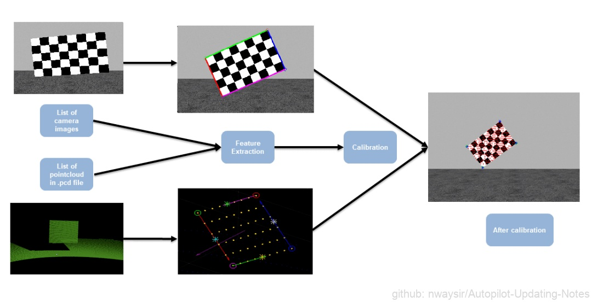
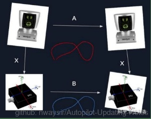

# 3.5.2.1 离线标定

## 一、传感器与车身的外参标定

### (一) 相机与车身的标定

在以相机为主的自动驾驶传感器配置方案中，车上一般会安装多个相机。相机与车身的外参标定可以通过引入房间坐标系实现：标定间墙面上贴若干标记物，我们称之为靶标。如下图所示:

 

图1. 房间坐标系 

相机通过检测靶标建立与房间坐标系的关系，即可求解相机与房间的外参。在标定阶段保证车身停在房间的固定位置，即得到车身与房间的外参。通过坐标转换即可完成相机与车身的外参标定。这种方法依赖于靶标的角点精度，因此对环境有一定要求，且靶标数量越多，精度越高。

在产线上，方案设计既要考虑传感器标定精度，又要兼顾车辆标定效率和产线环境，考虑到产线环境中，车辆传感器工装位置与车辆停靠位置可以较大程度保证精度。因此，可以减少靶标数量，运用同样的标定原理，实现相机与车身的标定。

### (二) 激光雷达与车身的标定

在以激光雷达为主的自动驾驶传感器配置方案中，需要标定激光雷达与车身的外参，类似于相机与车身的标定原理，激光雷达与车身的标定也可借助标定板进行。标定过程中，将多个标定板置于激光雷达可扫描到的区域，通过已知的车身位姿、标定板位姿和激光雷达工装等先验信息，可解算出激光雷达与车身的外参。

## 二、多传感器联合标定

多传感器联合标定是多传感器融合的必要前提。单一传感器往往会存在覆盖范围不足和观测信息受限等局限与挑战，多传感器融合方案可以做到不同传感器间的取长补短。根据传感器特性与算法原理的不同，多传感器标定可分为基于共视特征信息的标定和基于运动轨迹的标定。

### （一）基于共视特征信息的标定

#### 1、多激光雷达之间的标定

激光雷达可以直接测量周围环境的距离信息，因此多激光雷达间的标定方案较为成熟。对于有共视区域的激光雷达，可以通过场景的特征信息，运用 NDT 或 ICP 等配准方法实现点云特征匹配，从而完成多个激光雷达之间的外参标定。

 

图2. 多个激光雷达外参标定 

#### 2、相机与激光雷达的外参标定

相机与激光雷达的观测信息表达方式是不一致的，那么如何进行二者之间的标定呢？目前业界比较成熟的方案是通过引入统一观测源建立约束。对于有共视区域的相机与激光雷达，可在共视区域内布置靶标作为统一观测源, 分别获取靶标在相机坐标系下和激光雷达坐标系下的特征。通过两种特征匹配，完成相机与激光雷达之间的外参标定。下图便是通过棋盘格靶标作为统一观测源的相机与激光雷达标定流程图。

 

图3. 相机与激光雷达外参标定 

### （二）基于运动轨迹的标定

对于 IMU 这种直接估计位姿变化的传感器，常见的方案是基于车辆运动轨迹的标定。以激光雷达与 IMU、相机与 IMU 之间的标定为例，可采用最经典的手眼标定方式，基于给定的 IMU 与激光雷达/相机之间的外参初值，通过激光雷达/相机的轨迹与 IMU 的轨迹进行外参优化，从而完成最终的激光雷达/相机和 IMU 的外参标定。下图是激光雷达与 IMU 外参标定的示意图。

 

图4. 激光雷达与IMU外参标定 
