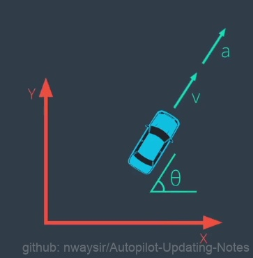
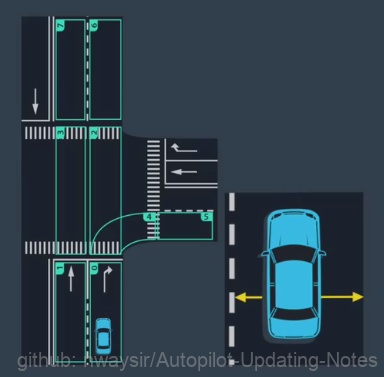
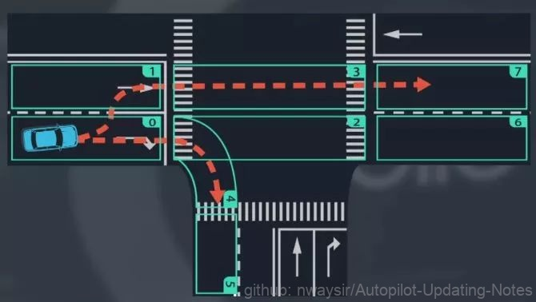
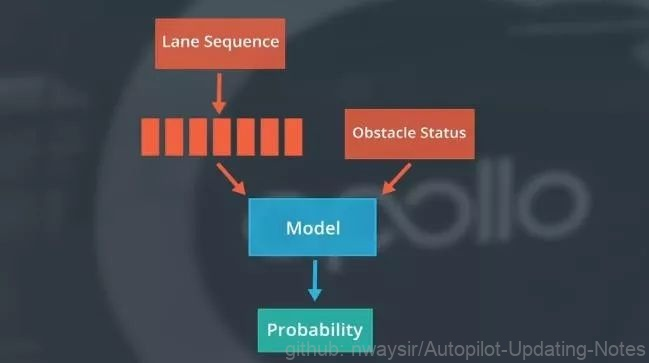
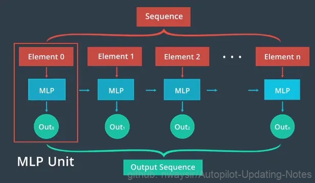
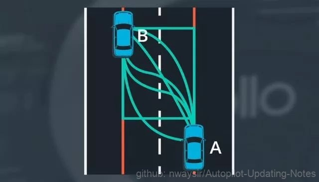

# 4.1.1 基于车道序列的预测

## 4.1.1.1 建立车道线序列

为了建立车道序列，首先将道路分成多个部分，每一部分都覆盖了一个易于描述车辆运动的区域。比如如图是一个部分区域的十字路口。为了预测，我们更关心车辆如何在这些区域内转换，而不是在某个区域内的具体行为。可以将车辆的行为划分为一组有限的模式组合并将这些模式组合描述为车道序列，例如直行汽车的运动可以描述为车道序列是 0-1-3-7。

 

图1. 建立车道线序列 

## 4.1.1.2 目标车辆状态

### 一、目标车辆行驶状态：

为了预测目标车辆的运动需要知道物体的状态，如：朝向、位置、速度、加速度等。

 

图2. 目标车辆行驶状态 

### 二、所处车道段内位置：

例如预测模块会考虑从物体到车道线段边界的纵向和横向距离，还包含之前时间间隔的状态信息以便做出更准确的预测。

 

图3. 所处车道段内位置 

## 4.1.1.3 预测目标车道

使用车道序列框架的目标是为道路上的物体生成轨迹。先从一个稍微简单的问题开始，会预测车道线段之间的过渡。假设在车道段0中检测到一辆车，并且会预测在接下来的几个时间段中它将如何行驶，它可能停留在车道段0然后向右转或者可能转向车道段1然后直行，我们已经将预测问题简化为选择问题。

 

图4. 预测目标车道 

现在所要做的就是选择车辆最有可能采取的车道顺序，可以通过计算每个车道序列的概率来进行选择。将车辆状态和车道段作为输入，该模型用于提供车辆可能采用每个车道序列的概率，希望模型能够学习新的行为因此应该使用观测数据对模型进行经验性训练，在训练中将真实的车辆行为提供给模型，不仅包括车道段和对象的状态，还包括对象最终选择哪条车道序列。随着记录随着时间的增加，模型可以自我迭代更新，精确度不断提升。每个记录将由观察对象跟随的车道段序列和对象的相关状态组成，在每个时间点，对象占用一段并具有特定的状态，整个记录由一系列车道段和对象的相关状态组成。

 

图5. 基于模型概率 

## 4.1.1.4 递归神经网络在目标车道预测的应用

为相关对象状态提供另一个RNN模型。连接这两个RNN的输出并将它们馈送到另一个神经网络，该神经网络会估计每个车道序列的概率，具有最高概率的车道序列是我们预测目标车辆将遵循的序列。为了训练这个网络，使用现有的记录，每条记录都包含一个车道序列、相关的对象状态、一个标签，用于指示对象是否遵循此特定车道序列。在训练中，比较网络输出和真值标记并使用反向传播来训练网络。

 

图6. 基于递归神经网络 

## 4.1.1.5 轨迹生成

轨迹生成是预测的最后一步，一旦我们预测到物体的车道序列，就可以预测物体的轨迹。在任何两点A和B之间，物体的行进轨迹有无限的可能。

 

图7. 轨迹生成 

如何预测最有可能的轨迹？可以先通过设置约束条件来去除大部分候选轨迹，首先假定汽车将与目标车道的中心对齐，继续去除车辆无法实际执行的轨迹。通过考虑车辆当前的速度和加速度从剩余的轨迹中进行选择，实际上我们并没有实际列出所有可能的轨迹并逐一去除它们。

相反只是在数学理论上来应用这一想法，注意车辆在两点的位置和方位，这两个姿势表示运动模型的初始状态和最终状态，可以使用这两个条件来拟合一个多项式模型，在大多数情况下这种多项式足以进行预测。
