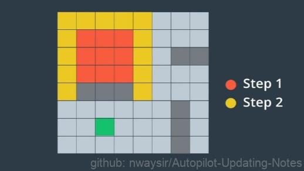
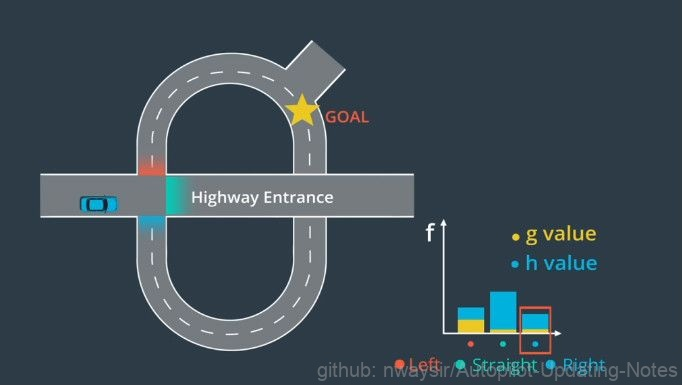
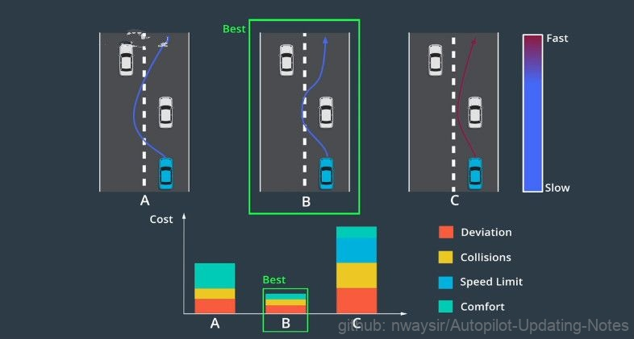

# 4.2 路线规划

## 4.2.1 原理

当人们试图在地图上找到从A到B的路线时，通常会沿着道路追踪路径，以查看是否存在通往目的地的任何路径，这被称为搜索。在进行智能搜索算法以前，我们需要将地图数据重新格式化为“图形”的数据结构。

该图形由“节点”(node)和“边缘”(edge)组成。节点代表路段，边缘代表这些路段之间的连接。例如：在交叉路口，汽车可从节点1移动到节点2、节点3或节点4，反之亦然。

 

图1. 地图转图形 

我们可以对一个节点移动到另一个节点所需的成本进行建模。例如在现实生活中，拐过一个交叉路口比直行更费劲，所以从节点1到节点4的成本高于从节点1到节点3的成本。 将地图转换为图形的好处在于，在计算机科学领域中，人们已发现许多用于在图形中查找路径的快速算法（下一节中会详细介绍）。一旦我们在图形中找到了一条好路径，就可以轻松地将图形中的路径重新转换为地图上的路径。

## 4.2.2 路径查找算法 A*

A* 是经典的路径查找处理算法。在本节中，我们将演示A* 如何通过网格进行工作。我们把网格中的每个单元格当作一个节点。并且规定能够从任何一个节点移动到与其相邻的任意节点。这个特殊网格还包含一些阻挡潜在路径的墙壁（下图中的灰色部分）。

 

图2. 障碍设置 

对人类来说，通过查看图形便可以轻易找出最佳路径。但对于计算机而言，这并不明显。计算机必须确认是否存在通往目的地的路径，并竭尽所能地尝试所有可能的路径来从其中选出最优路径。但是，这需要耗费大量的时间，尤其是在地图非常大的时候。从任何给定的节点来看，最多有8个用于下一步的选项，因为存在8个相邻的单元格。对于8个中的每一个选项，下一步又有另外8个选项。如果我们展开所有节点，搜索量将暴增至即使最快的计算机也无法处理的程度。

 

图3. 路径查找 

下面我们将展示A*算法的详细过程（如下图）：从初始节点开始，我们需要确定8个相邻节点中，哪个是最有希望的候选节点。对于每个候选节点，我们考虑两件事情。首先，我们计算从开始节点到候选节点的成本。然后，我们估计从候选节点前往目的地的成本。计算前往候选节点的成本很容易，因为它已经与我们相邻。计算从候选节点到目的地的成本很困难。但是，通过简单计算从候选节点到目的地的距离，我们通常可以做出很好的估计。

我们用变量g和h表示每个成本。g值为开始节点前往候选节点的成本，h值为候选节点前往目的地的估计成本或启发式成本。根据我们的具体情况，我们可以自定义成本估算方式。例如，交通堵塞会增加前往目的地的成本，所以交通繁忙的路径具有更高的成本。对于每个候选节点，我们通过添加g值和h值来计算总和，即f值。最佳候选节点是f值最小的节点。每当我们抵达新节点时，我们通过重复此过程来选择下一个候选节点，而且总是选择我们尚未访问过且具有最小f值的节点。这就是A* 算法，它建立了一条稳定前往目的地的路径。

 

图4. 候选节点 

现在我们来考虑一下现实世界中的地图。

 

图5. 十字路口 

假设我们到达了一个交叉路口，我们可以沿着公路直走、左转或右转。首先，我们将把这张地图转换为具有三个候选节点（left,straight,right）的图形。接下来，我们将对选项进行评估。在实践中，拐过交叉路口很费劲，所以我们为left节点分配了更高的g值（g值表示从起始点到候选节点的成本）。在查看公路选项之后，我们意识到必须走很长的路，才能离开公路并返回我们的目标，所以我们为straight选项分配了更高的h值（h值表示从候选节点到目的地的估计成本）。最后，我们通过将g值和h值相加来计算每个节点的f值。我们看到最低f值实际对应右边的候选节点。所以，这是我们接下来要前往的节点。

## 4.2.3 轨迹生成

高等级地图路线只是规划过程中的一部分，我们仍需要构建沿这条路线前进的低等级轨迹。这意味着要处理一些不属于地图的物体：如其他车辆、自行车或行人。例如，我们可能需要与试图在我们前面掉头的汽车互动，或者我们可能希望超过一辆在公路上行驶的慢车。这些场景需要更低级别、更高精确度的规划。我们将这一级别的规划称为轨迹生成。

 

图6. 轨迹生成 

轨迹生成的目标是生成一系列路径点所定义的轨迹。我们为每个路径点分配了一个时间戳和速度。由于移动的障碍物可能会暂时阻挡部分路段，轨迹中的每个路径点都有时间戳。我们可以将时间戳与预测模块的输出相结合，以确保我们计划通过时，轨迹上的每个路径点均未被占用。这些时间戳和空间上的两个维度（2D position）共同创建了一个三维轨迹（3D  Trajectory）。我们还为每个路径点指定了一个速度，用于确保车辆按时到达每个路径点。

 

图7. 路径点 

现实世界中的规划面临多种约束。首先轨迹应能免于碰撞，这意味着必须没有障碍物。其次，要让乘客感到舒适，所以路径点之间的过渡以及速度的任何变化都必须平滑。再者，路径点对车辆应实际可行，例如高速行驶的汽车不能立即做180度转弯。我们不能构建包含这种不可行机动的轨迹。最后，轨迹应合法。我们需要了解每个路径点的交通法律，并确保轨迹遵守这些法律法规。

在道路的任何两点，可能会有多个不会发生碰撞、行驶舒适、可行且合法的轨迹。我们如何选择最佳轨迹呢？答案是使用“成本函数”。成本函数为每个轨迹分配了一个“成本”，我们选择成本最低的轨迹。轨迹“成本”由各种犯规处罚组成，例如：偏离道路中心，有可能产生碰撞，速度限制，轨迹的曲率和加速度让乘客感到不舒服等。

 

图8. 轨迹决策 

轨迹成本将所有这些缺陷聚合为单个数字，这使我们能对不同的轨迹按数字大小进行排名。车辆甚至可能在不同的环境中使用不同的成本函数。例如，高速路的成本函数可能与停车场的不同。
