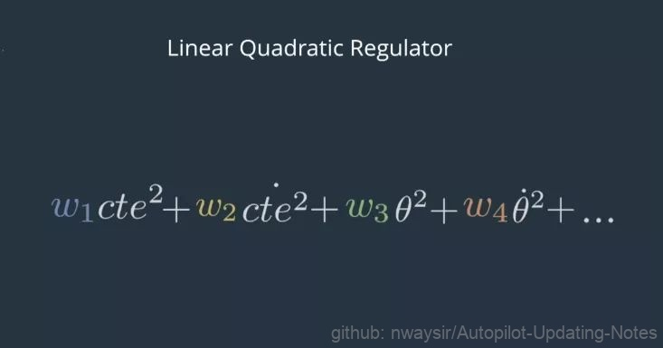
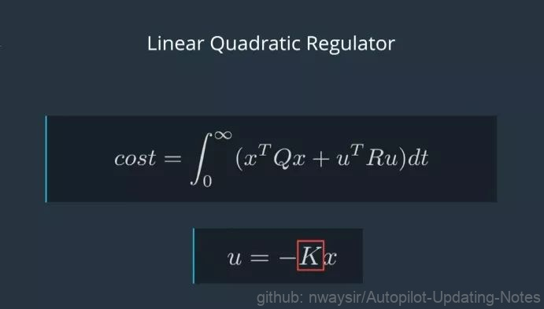

# 5.2 线性二次调节器(LQR)

## 5.2.1 原理

线性二次调节器（Linear Quadratic Regulator 或LQR）是基于模型的控制器，它使用车辆的状态来使误差最小化。Apollo使用LQR进行横向控制。横向控制包含四个组件：横向误差、横向误差的变化率、朝向误差和朝向误差的变化率。变化率与导数相同，我们用变量名上面的一个点来代表。我们称这四个组件的集合为X，这个集合X捕获车辆的状态。除了状态之外，该车有三个控制输入：转向、加速和制动。我们将这个控制输入集合称为U。

 

图1. 原理 

LQR处理线性控制，这种类型的模型可以用等式来表示（详见下图）。x（上方带点）=Ax+Bu，x（上方带点）向量是导数，或X向量的变化率。所以x点的每个分量只是x对应分量的导数。等式x点=Ax+Bu，该等式捕捉状态里的变化，即x点是如何受当前状态 x 和控制输入 u 的影响的。

 

图2. 等式表示 

这个等式是线性的，因为我们用∆x来改变x时，并用∆u来改变u。x点的变化也会让这个等式成立（见下图等式）。现在我们了解了LQR中的L。

 

图3. 等式拆分 

接下来我们学习LQR中的Q。这里的目标是为了让误差最小化，但我们也希望尽可能少地使用控制输入。由于使用这些会有成本，例如：耗费气体或电力。为了尽量减少这些因素，我们可以保持误差的运行总和和控制输入的运行总和。当车往右转的特别厉害之际，添加到误差总和中。当控制输入将汽车往左侧转时，从控制输入总和中减去一点。然而，这种方法会导致问题。因为右侧的正误差只需将左侧的负误差消除即可。对控制输入来说也是如此。相反，我们可以让x和u与自身相乘，这样负值也会产生正平方，我们称这些为二次项。我们为这些项分配权重，并将它们加在一起。

 

图4. 二次项表示 

最优的u应该最小化二次项的和随时间的积分。在数学中我们将这个积分值称为成本函数（形式见下图）。我们经常以紧凑的矩阵形式表示加权二次项的总和。

 

图5. 成本函数 

这里的Q和R代表x和u的权重集合。xT和uT是转置矩阵，这意味着它们几乎与x和u相同，只是重新排列以便矩阵相乘。x乘以xT，u乘以uT，实质上是将每个矩阵乘以它自己。最小化成本函数是一个复杂的过程，但通常我们可以依靠数值计算器为我们找到解决方案。Apollo就提供了一个这样的求解方案。在LQR中，控制方法被描述为u=-Kx。其中，K代表一个复杂的skeme，代表如何从x计算出u。所以找到一个最优的u就是找到一个最优的K。许多工具都可以轻松地用来解决K，尤其当你提供了模拟车辆物理特征的A、B，以及x和u的权重Q、R。