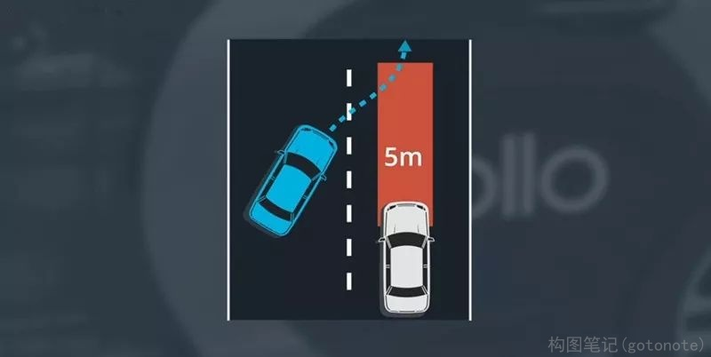
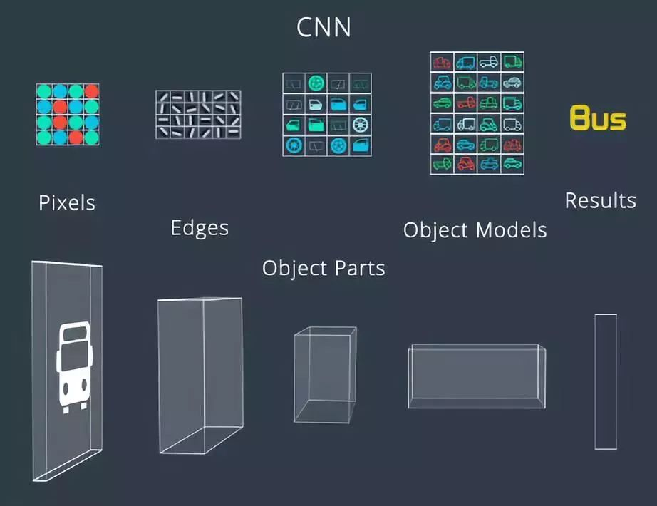

# 4.1 预测

无人车是在许多物体间穿梭行驶，其中许多物体本身就是一直在移动的，比如像其他汽车、自行车、行人。无人车需要预测这些物体的行为，这样才能确保做出最佳决策。在环境中为所有其他的物体做出预测，这些共同形成了在一段时间内的预测路径，在每一个时间段内会为每一辆汽车重新计算预测他们新生成的路径，这些预测路径为无人车在规划阶段做出决策提供了必要信息。

预测路径有实时性的要求，实时性是指算法的延迟越短越好，一辆车如果是60千米/小时速度，那么它在每0.25秒会行驶5米，所以需要确保无人车在行驶之前，前方5米没有任何障碍物并且可以安全地穿行。

下一个目标是准确性。如果预测出相邻多车道的汽车想并入我们的车道，我们需要减速。而另一种情况是如果预测它会保持在自己的车道上行驶，我们需要做出的预测尽可能保持准确，这样才能帮助我们无人车做出很好的决策。

预测模块也应该能够学习新的行为，当路上有很多车辆，情况将变得复杂。开发出每种场景的静态模型是不可能完成的任务，所以预测模块能够学习新的行为，用这种方式可以使用多源的数据进行训练，使算法随着时间的推移而提升预测能力。

CNN根据其任务查找真正需要的特征，任务可能是图像检测、分类、分割、其他类型的目标。
