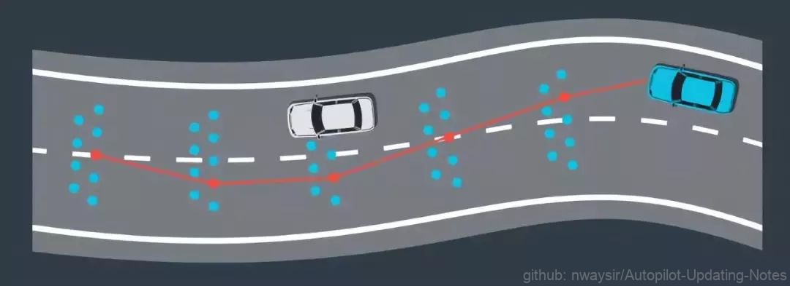
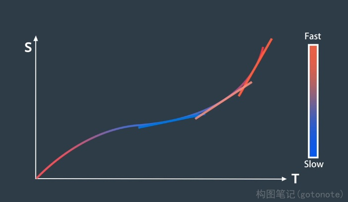
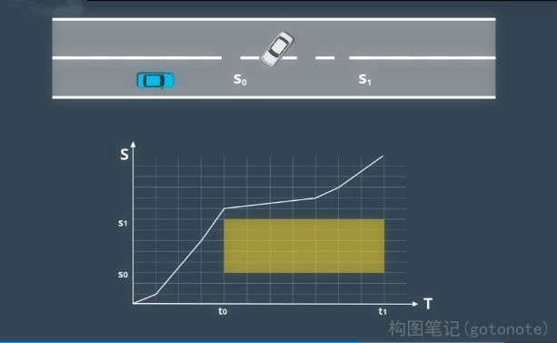
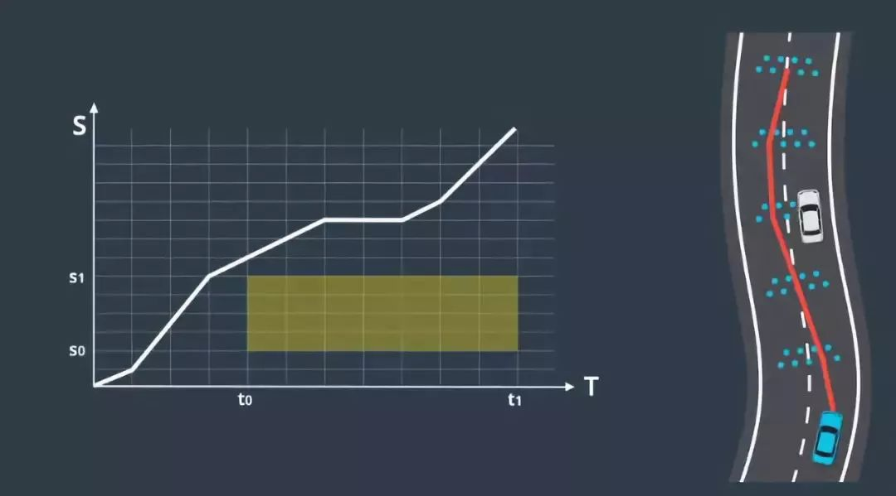
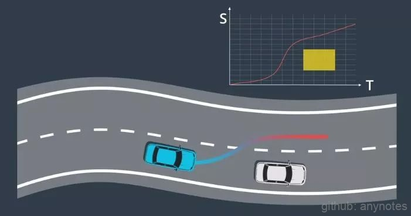

# 笛卡尔坐标下的规划

## 一、路径-速度解耦规划

路径-速度解耦规划将轨迹规划分为两步：路径规划、速度规划。首先在路径规划步骤中生成候选曲线，这是车辆可行驶的路径。使用成本函数对每条路径进行评估，该函数包含平滑度、安全性、与车道中心的偏离以及开发者想要考虑的其他任何因素。然后按成本对路径进行排名并选择成本最低的路径。

下一步是确定沿这条路线行进的速度。我们可能希望改变在该路径上的速度，所以真正需要选择的是与路径点相关的一系列速度，而不是单个速度。我们将该序列称作“速度曲线”。我们可以使用优化功能为路径选择受到各种限制的良好速度曲线。通过将路径和速度曲线相结合可构建车辆行驶轨迹。

## 二、路径生成与选择

为了在路径-速度解耦规划中生成候选路径，首先将路段分割成单元格。然后对这些单元格中的点进行随机采样。通过从每个单元格中取一个点并将点连接，我们创建了候选路径。通过重复此过程可以构建多个候选路径。使用成本函数对这些路径进行评估并选择成本最低的路径，成本函数可能考虑以下因素：与车道中心的偏离、与障碍物的距离、速度和曲率的变化、对车辆的压力、或希望列入的任何其他因素。

 

图1. 路径生成与选择 

## 三、ST图

选择路径后的下一步是选择与该路径关联的速度曲线，一个被称为“ST 图”的工具可以帮助设计和选择速度曲线。在ST图中，“s”表示车辆的纵向位移、“t”表示时间。ST 图上的曲线是对车辆运动的描述，因为它说明了车辆在不同时间的位置。由于速度是位置变化的速率，所以可以通过查看曲线的斜率从 ST 图上推断速度。斜坡越陡则表示在更短的时间段内有更大的移动，对应更快的速度。

 

图2. ST图 

## 四、速度规划

为构建最佳速度曲线需要将 ST 图离散为多个单元格。单元格之间的速度有所变化，但在每个单元格内速度保持不变，该方法可简化速度曲线的构建并维持曲线的近似度。在 ST 图中可以将障碍物绘制为在特定时间段内阻挡道路的某些部分的矩形。例如，假设预测模块预测车辆将在 t0 到 t1 的时间段内驶入的车道。由于该车将在此期间占据位置 s0 到 s1，因此在 ST 图上绘制了一个矩形，它将在时间段 t0 到 t1 期间阻挡位置 s0 到 s1。为避免碰撞，速度曲线不得与此矩形相交。既然有了一张各种单元格被阻挡的 ST 图，便可以使用优化引擎为该图选择最佳的速度曲线。优化算法通过复杂的数学运算来搜索受到各种限制的低成本解决方案。这些限制可能包括：法律限制，如速度限制；距离限制，如与障碍物的距离；汽车的物理限制，如加速度限制。

 

图3. 速度规划 

## 五、优化

路径-速度解耦规划在很大程度上取决于离散化。路径选择涉及将道路划分为单元格，速度曲线构建涉及将 ST 图划分为单元格。尽管离散化使这些问题更容易解决，但该解决方案生成的轨迹并不平滑。

 

图4. 优化 

为了将离散解决方案转换为平滑轨迹，可使用“二次规划”技术（Quadratic Programming)。二次规划将平滑的非线性曲线与这些分段式线性段拟合。尽管二次规划背后的数学运算很复杂，但对于我们的目的而言，细节并不是必需的。我们只需简单使用几种不同的优化包中的一种，包括一种由 Apollo 推出的运行方案来生成平滑的轨迹，一旦路径和速度曲线就绪，便可以用其构建三维轨迹。

## 六、路径-速度规划的轨迹生成

回顾一下端到端路径-速度解耦规划。假设我们正在路上行驶，感知系统观察到一辆缓慢行驶的车辆离我们越来越近。首先，在这辆车的周围生成多条候选路线，使用成本函数对这些候选路径进行评估并选择成本最低的路径。然后使用 ST 图来进行速度规划，根据其他车辆随时间变化的位置阻挡了 ST 图的部分区域。优化引擎可帮助确定该图的最佳速度曲线，该曲线受制于约束和成本函数。我们可以使用二次规划让路径和速度曲线变平滑。最后，将路径和速度曲线合并构建轨迹。这里的轨迹在速度较快时为红色，在速度较慢时为蓝色。我们使用该轨迹来安全地绕开其他车辆并继续我们的旅程。

 

图5. 轨迹生成 
