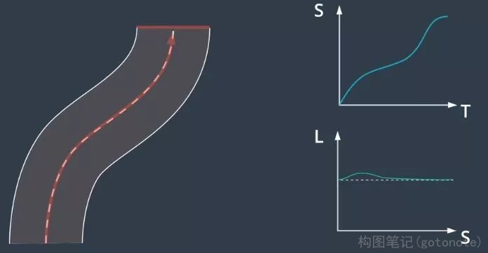
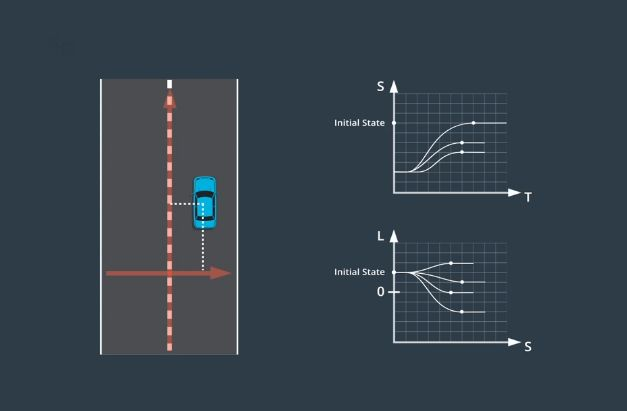
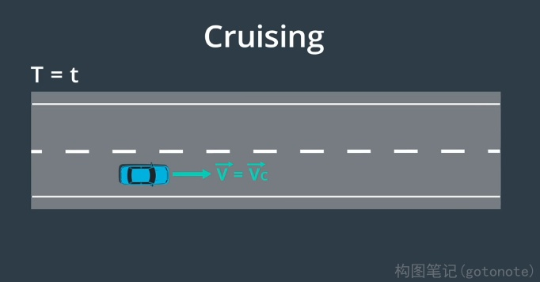
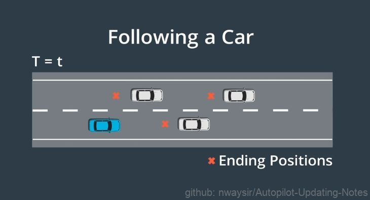
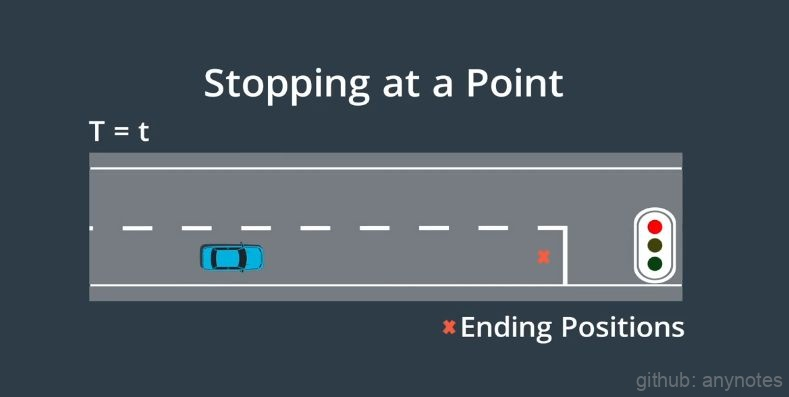
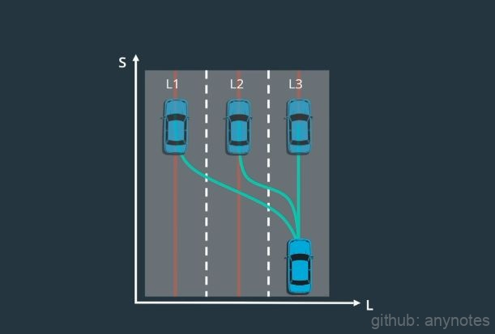
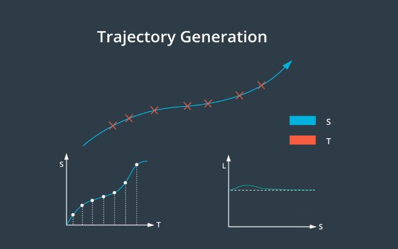

# Lattice规划

## 一、基本原理

Lattice 规划通过使用Frenet坐标可以将环境投射到纵轴和横轴上，目标是生成三维轨迹：纵向维度、横向维度、时间维度。

可以将三维问题分解成两个单独的二维问题，这是通过分离轨迹的纵向和横向分量来解决的。其中一个二维轨迹是具有时间戳的纵向轨迹称之为ST轨迹，另一个二维轨迹是相对于纵向轨迹的横向偏移称之为SL轨迹。

 

图1. 分离轨迹 

Lattice 规划具有两个步骤即先分别建立ST和SL轨迹，然后将它们合并为生成纵向和横向二维轨迹。先将初始车辆状态投射到ST坐标系和SL坐标系中，通过对预选模式中的多个候选最终状态进行采样。来选择最终车辆状态。对于每个候选最终状态构建了一组轨迹将车辆从其初始状态转换为最终状态，使用成本函数对这些轨迹进行评估并选择成本最低的轨迹。

 

图2. 分别优化ST、Sl轨迹 

## 二、ST轨迹的终止状态

根据情况可以将状态分成3组：巡航、跟随、停止。巡航意味着车辆将在完成规划步骤后定速行驶，实际上在对图上的点进行采样，在图中横轴代表时间，纵轴代表速度。对于该图上的点，这意味着汽车将进入巡航状态，在时间t以s点的速度巡航，对于这种模式，所有最终状态的加速度均为零。

 

图3. 巡航状态 

下一个要考虑的模式为跟随车辆，在这种情况下要对位置和时间状态进行采样，并尝试在时间t出现在某辆车后面，在跟随车辆时，需要与前方的车保持安全距离，这时速度和加速度将取决于要跟随的车辆，这意味着在这种模式下，速度和加速度都会进行修正。

 

图4. 跟随状态 

最后一种模式是停止，对于这种模式只需对汽车何时何地停止进行抽样，这里速度和加速度会被修正为 0 。

 

图5. 停止状态 

## 三、SL轨迹的终止状态

根据这样一个假设来进行SL 规划，即无论车辆进入怎样的终止状态，车辆都应该稳定地与车道中心线对齐。这意味着只需要在一个小区域内，对横向终止位置进行采样。具体来说采样的是道路上相邻车道中心线周围的位置。为了确保稳定性，汽车驶向的终止状态应该与车道中心一致。当用横向位置与纵向位置作图时，想要的候选轨迹应该以车辆与车道对齐并直线行驶而结束。为了达到这种终止状态，车的朝向和位置的一阶和二阶导数都应该为零。这意味着车辆既不是横向移动的，那是一阶导数；也不是横向加速，那是二阶导数。这意味着车辆正沿着车道直行。

 

图6. SL轨迹的终止状态 

## 四、Lattice规划的轨迹生成

一旦同时拥有了 ST 和 SL 轨迹，就需要将它们重新转换为笛卡尔坐标系。然后可以将它们相结合构建由二维路径点和一维时间戳组成的三维轨迹。ST轨迹是随时间变化的纵向位移，SL轨迹是纵向轨迹上每个点的横向偏移。由于两个轨迹都有纵坐标S，所以可以通过将其 S 值进行匹配来合并轨迹。

 

图7. 轨迹合并 
