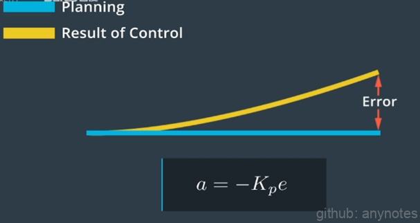
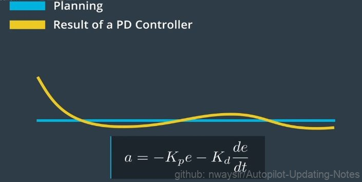
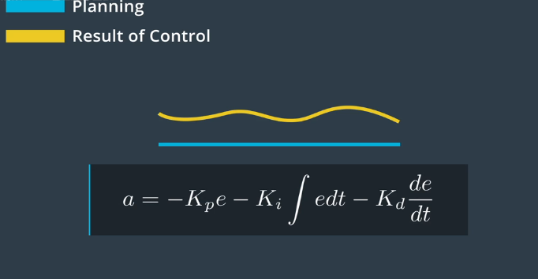

# PID控制

## 一、原理
首先介绍的算法为PID控制，这个控制器的优点在于它非常简单，只需要知道与目标轨迹有多大的偏离。PID的第一组件为P代表“比例”(Proportional)。设想一辆车正试图遵循目标轨迹，P控制器在车辆开始偏离时立即将其拉回目标轨迹。比例控制意味着，车辆偏离越远，控制器越难将其拉回目标轨迹。

 

图1. P分量 

在实践中P控制器的一个问题在于，它很容易超出参考轨迹。当车辆越来越接近目标轨迹时，我们需要控制器更加稳定。PID控制器中的D项致力于使运动处于稳定状态，D代表“微分”（Derivative）。PD控制器类似于P控制器，它增加了一个阻尼项，可最大限度地减少控制器输出的变化速度。

 

图2. D分量 

PID控制器中的最后一项I代表积分（Integral），该项负责纠正车辆的任何系统性偏差。例如，转向可能失准，这可能造成恒定的转向偏移。在这种情况下，我们需要稍微向一侧转向以保持直行。为解决这一问题，控制器会对系统的累积误差进行惩罚。我们可以将P、I和D组件结合构成PID控制器。

 

图3. I分量 

## 二、 PID优劣对比

PID控制器很简单，但它在很多情况下的效果很好。对于PID控制器，你只需要知道你的车辆与目标轨迹之间的偏差。但是PID控制器只是一种线性算法，对于非常复杂的系统而言，这是不够的。例如，为控制具有多个关节的四轴飞行器或机器人，我们需要建立机器人的物理模型。对无人驾驶而言，我们需要应用不同的PID控制器来控制转向和加速，这意味着很难将横向和纵向控制结合起来。另一个问题在于PID控制器依赖于实时误差测量，这意味着受到测量延迟限制时可能会失效。