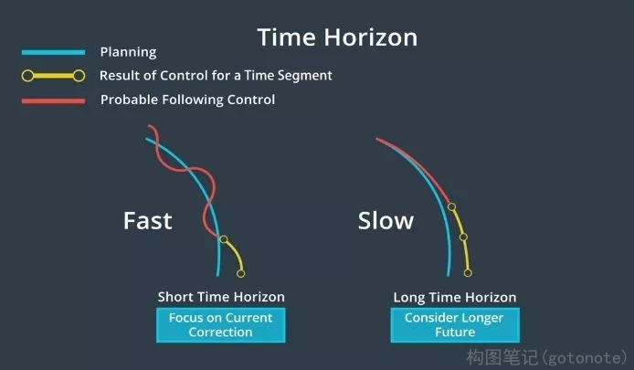
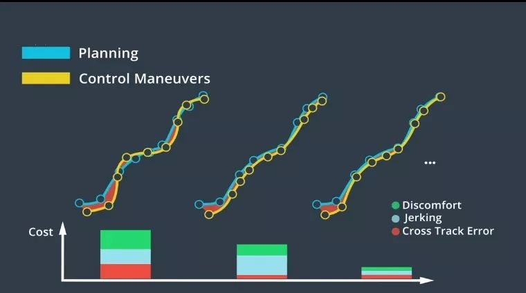

# 模型控制预测(MPC)

## 一、原理

模型预测控制（或MPC）是一种更复杂的控制器，它非常依赖于数学优化，但基本上可以将MPC归结为三个步骤：1、建立车辆模型。2、使用优化引擎计算有限时间范围内的控制输入。3、执行第一组控制输入。MPC是一个重复过程，它着眼未来，计算一系列控制输入，并优化该序列。但控制器实际上只实现了序列中的第一组控制输入，然后控制器再次重复该循环。为什么我们不执行整个控制输入序列呢？那是因为我们只采用了近似测量与计算。如果实现了整个控制输入序列，实际产生的车辆状态与我们的模型有很大差异，最好在每个时间步不断地重新评估控制输入的最优序列。

MPC的第一步为定义车辆模型，该模型近似于汽车的物理特性，该模型估计了假如将一组控制输入应用于车辆时会发生什么。接下来，我们决定MPC预测未来的能力。预测越深入，控制器就越精确，不过需要的时间也越长。所以，我们需要在准确度与快速获取结果之间做出取舍。获取结果的速度越快，越能快速地将控制输入应用到实际车辆中。

 

下一步是将模型发送到搜索最佳控制输入的优化引擎。该优化引擎的工作原理是通过搜索密集数学空间来寻求最佳解决方案。为缩小搜索范围，优化引擎依赖于车辆模型的约束条件。

优化引擎可间接评估控制输入，它通过使用以下方法对车辆轨迹进行建模：通过成本函数对轨迹进行评估。成本函数主要基于与目标轨迹的偏差；其次，基于其他因素，如加速度和提升旅客舒适度的措施。

 

为使乘客感觉更舒适，对控制输入的调整应该很小。因为动作变化幅度过大会让乘客感到不舒服。根据具体情况，我们可能需要为其考虑进一步的成本，并设计成本函数。模型、约束和成本函数合并在一起，并作为优化问题加以解决。我们可以在不同的优化引擎中，选择一种来寻找最佳解决方案。