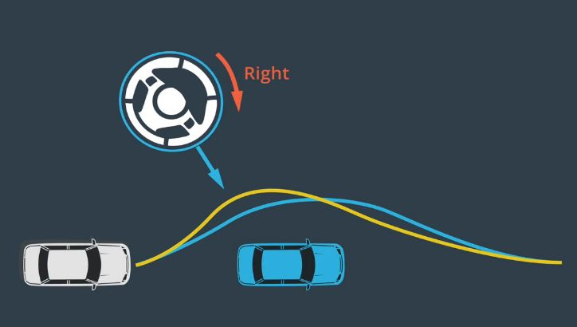

# 控制

## 一、简介

控制是驱使车辆前行的策略。对于汽车而言，最基本的控制输入为转向、加速和制动。通常，控制器使用一系列路径点来接收轨迹。控制器的任务是使用控制输入让车辆通过这些路径点。

首先，控制器必须准确，这意味着它应避免偏离目标轨迹。这对于安全来说，尤为重要。即使路面潮湿或者道路比较陡峭，控制器任需要准确地执行轨迹。其次，控制策略对汽车应该具备可行性。例如，如果你的汽车向北行驶，而你希望它立即向东转。你可以在游戏中做到这一点，但在现实中无法实现。最后，需要考虑的是平稳度。舒适的驾驶非常重要。如果车辆行驶得不规律，那乘客永远不会想再次乘坐它了。要使控制顺利进行，驱动必须是连续的。这意味着你应避免突然转向、加速或制动。

总之，我们的目标是使用可行的控制输入，最大限度地降低与目标轨迹的偏差、最大限度地提供乘客的舒适度。有三种可用于实现这些目标的控制策略：比例积分微分控制（或PID）、线性二次调节器（或LQR）、模型预测控制（或MPC）。

## 二、控制流程
控制器预计有两种输入：目标轨迹与车辆状态。目标轨迹来自规划模块，在每个轨迹点，规划模块指定一个位置和参考速度。在每个时间戳都对轨迹进行更新。我们还需要了解车辆状态，车辆状态包括：通过本地化模块来计算的车辆位置、从车辆内部传感器获取的数据（如速度、转向和加速度）。我们使用这两个输入来计算目标轨迹与实际行进轨迹之间的偏差。

控制器的输出是控制输入（转向、加速和制动）的值。当偏离目标轨迹时，我们希望采取行动来纠正这种偏差。对于普通汽车，我们使用方向盘控制行驶方向（即转向）、使用油门加速、使用刹车减速（即制动）。这也是无人驾驶汽车所做的。一旦将这三个值传递给车辆，汽车实际上已经开始无人驾驶了。之后将介绍不同的控制算法，如何计算这三个输出-转向、加速和制动。

 

图1. 控制流程 

控制实际上是无人驾驶汽车实现自动移动的方式。在控制中，我们使用转向、加速和制动来运行我们的目标轨迹。我们研究了几种不同类型的控制器。PID控制是一种简单而强大的控制算法，线性二次调节器和模型预测控制是另外两种类型的控制器，它们更复杂，但也更强大、更准确。