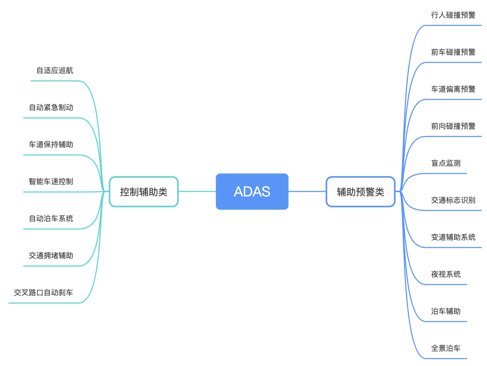

# ADAS

 

图1. ADAS 功能分类 

 

图2. ADAS 功能详细列表 

---

## 📖 目录

### 7.1.1 [ADAS 厂商方案对比](./7.1.1%20ADAS厂商方案对比.md)

> 主流 ADAS 智驾方案对比分析，包括华为 ADS、小鹏 XNGP、蔚来 NAD、理想 AD Max 等厂商方案

- 华为 ADS 技术架构与量产车型
- 小鹏 XNGP 算力与传感器配置
- 蔚来 NAD 超高算力方案
- 理想 AD Max 家庭用车定位
- 2025-2026 技术趋势分析

### 7.1.2 [智驾芯片专题](./7.1.2%20智驾芯片专题.md)

> 智能驾驶芯片深度解析，包括 NVIDIA Orin 系列、华为 MDC 系列、地平线征程系列

- NVIDIA Orin X/Y/Thor 详解
- 华为 MDC 610/810 对比
- 地平线征程5/6系列分析
- 芯片成本与国产化趋势
- 舱驾一体技术演进

---

## 🔧 相关资源

- [特斯拉 AI Day](./ch09_厂商方案/9.1%20特斯拉%20AI%20Day2022/)
- [百度 Apollo](./ch09_厂商方案/9.2%20百度阿波罗apollo/)
- [硬件传感器](./ch02_硬件/2.1%20传感器/)
- [BEV 感知](./ch03_感知/3.3%20BEV/)

---

*最后更新: 2026-02-20*
