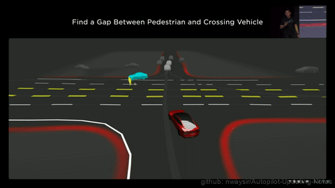

### 9.1.1 路径以及运动规划算法
有关路径规划介绍请参考[这里](../../ch04_%E7%AD%96%E7%95%A5%E8%A7%84%E5%88%92/)，简单来说，场景越复杂，路径以及运动规划更难，当前很多智能驾驶的使用场景基本都在高速环路等半封闭的场景。

此次特斯拉AI DAY分享了自动驾驶最难的场景之一，也是最考验路径规划的场景---拥堵十字路口，前方道路有行人横穿和行车占道通行的情况下，路径以及运动规划如何进行安全舒适的无保护左转，场景如下图所示：

图1. FSD2022 更新解析 

一般遇到这种场景，自动驾驶的车辆可能的行为有：
坚持自己的路径，让其他车辆，行人等交通参与者让自己。
在行人和汽车等交通参与者中间找到空隙行驶。
礼让汽车和行人，等他们走了，再走。这是当前大部分国内智能驾驶的选择。
那么一般自动驾驶软件判断运算的步骤如下：
对当前场景下所有交通参与者进行运动轨迹预测。
基于各个轨迹的成本以及约束进行计算。
让本车以及其他交通参与者的运动轨迹进行交互，特斯拉表示这个运算过程大概耗时10ms，一般一个拥堵的十字路口左转场景，会有超过20个交互相关的交通参与者，有超过100种交互相关组合，那么目标路径规划时间大概是50ms