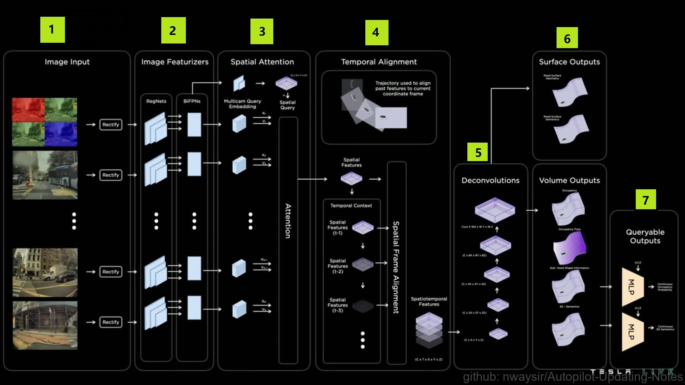
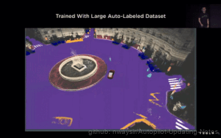
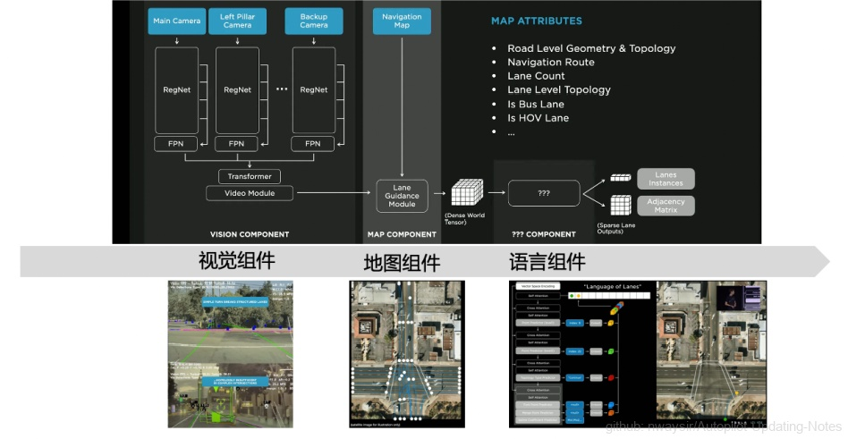

### 8.1.2 环境感知算法
有关感知的介绍请参考[这里](./../../ch03_感知/), 环境感知是智能驾驶获得外部信息的源头，与大多数厂商不同的是特斯拉环境感知主要依赖视觉，而视觉存在天生缺少深度信息问题。特斯拉本次介绍了其Occupancy Networks 算法用来探索可运动3D空间, 本文接下来将对其提出的Occupancy Networks 算法进行研究分析。

#### 8.1.2.1 Occupancy Network 

**一、算法介绍**

Occupancy Network 算法是特斯拉近几年一直在开发的算法，主要是通过特斯拉外部的8个摄像头视频流，去构建基于几何体积块的环绕汽车的3D空间，并持续去识别全貌即使短时间内有遮挡物，能够识别标注Occupancy的物体，例如马路牙子、汽车、行人等。此外算法还能识别物理的流动，来预测一些偶然的流体运动，如长巴士（拖挂车）的甩尾，Occupancy Network 算法可以高效识别感兴趣的点。特斯拉表示其Occupancy Network算法在算力和内存之间取得很好的效率，大概10ms就可建模完成，目前此算法已经运行在所有FSD的特斯拉上，如下图1所示。

图1. 构建环绕汽车的3D空间 

**二、算法架构**

图2. Occupancy Network算法架构 

如上图2所示，Occupancy Network算法工作流大概分以下七个步骤：

（1）Image Input
    
>8个摄像头依据摄像头标定矫正后直接输入给算法，视觉输入不使用ISP（以人为本的图像处理）; 由于摄像头的原始数据是4 位颜色16倍的动态范围给到算法，可以减少输入的延迟。

- 注: ISP模块会将Sensor采集到的数据进行插值和特效处理，例如：如果一个感光点感应的颜色是R，那么，ISP模块就会根据这个感光点周围的G、B感光点的数值来计算出此点的G、B值，那么，这一点的RGB值就被还原了，然后在编码成601或656的格式传送给Host。经过彩色插值就变成RGB。RGB 每个像素都有三种颜色，每一个的值在0~255之间, 即8位颜色。

（2） Image Featurizers
   
>使用预训练的深度神经网络模型对图像进行提取特征, 输入给下一步。特斯拉采用RegNet和BiFPNs算法来提取特征，特征化基本就是识别物体了。

（3）Spatial Attention

>是卷积神经网络中用于空间注意的模块。它利用特征的空间关系生成空间注意力图，也就是构建空间信息。将 Mlticam Qurey Emdedding（多摄像头查询）和 Spatial Query（空间查询）的输出，输入入注意力Attention模块来构建空间。
   
（4）Temporal Alignment

>分为两个部分，一个部分是自己车辆的轨迹对齐，另外一个将各个识别特征物对齐，初步形成了时空特征。

（5）Deconvolutions

>去卷积也就是把浓缩的特征反向成物体。路面地理信息（如上下坡度）一直普通视觉算法的难点，特斯拉表示其算法能够识别路面的地理特征。

（6）Volume Outputs

>去卷积之后的反向物体，将从空间上能代表物体大小，被放置在时空中，而且此类空间占据还根据路面的情况自动匹配,这里特斯拉讲到一个算法NeRF state，能够表示具有复杂遮挡的详细场景几何，这样可以让时空更加真实。

（7）Queryable Outputs

>去卷积之后的反向物体有些可能不能完全代表真实的物体的大小，所以特斯拉算法采用查询法去数据库中查询真实世界的结果，进行位置和大小的矫正再进行空间放置。

Occupancy Networks 算法可以通过摄像头获取数据，然后利用NeRFs算法构建真实世界的精准映射，即虚拟世界。当然特斯拉当前的虚拟构建并未把摄像头色彩完全投影进来，特斯拉目前主要任务是通过车辆获取数据来构建可支持自动驾驶所需关键信息的虚拟3D世界。

图3. 虚拟3D世界 

特斯拉表示其Occupancy Networks 算法都是自动标注算法训练而成的，与 BEV（Bird's-eye view 鸟瞰图）相比，Occupancy Networks 算法可以让自动驾驶对可行驶空间有了进一步的理解，对后续决策更加友好。

#### 8.1.2.2 新车道识别算法

图4. 基于2D的车道识别 

特斯拉老版本车道识别算法是基于2D平面的RegNet分割算法，在高速以及清晰高度结构化的场景应用的比较好，目前基本上国内车型应该都采用此类算法，当然国内的道路结构化都比较好，但在国外那种路面国内车型都是挑战，毕竟国外的设施都没有国内新。

当然车道清晰等也不是特斯拉老算法的主要问题，特斯拉在国外训练的算法对于清晰度应该也不是问题，问题是城市应用场景中，简单转弯分隔的结构化车道，繁忙交通中交汇口前车遮挡等无法采集到足够的数据的时候，此类问题是经典车道识别算法无法解决。

当然国内依赖高精地图的智能驾驶方案，此类问题基本可以解决，这就是为什么现在的城市领航辅助迟迟没上。高精地图，一需要测绘，二需要有关部门批准。所以不使用高精地图仅仅依靠视觉算法的特斯拉给出的答案是：用神经元算法预测，生成全套车道实例及其相互连接。

**二、FSD新车道算法三个组件**

图5. FSD新车道算法三个组件 

（1）视觉组件

>车辆上八个摄像头的视频流输入卷积层、注意层和其他神经网络层进行编码，或许丰富的环境信息，然后生成带有粗略路线图的表示。

（2）地图组件

>额外的神经网络层编码的道路级地图数据，特斯拉称之为车道引导，这张地图不是高清地图，但它提供了许多关于交叉口的有用提示，车道内的拓扑结构，交叉路口的车道数，以及一组其他属性。

- 这里的前两个组成部分产生了一个密集张量世界，可以对世界进行编码，但特斯拉真正想做的是转换这个稠密的张量为智能驾驶车道的连通集合。

（3）语言组件

图6. FSD新车道算法语言组件 

   
>特斯拉将这个任务看成一个图像转字幕的语言任务，这个任务的输入是这个稠密的张量，输出的特殊的文本语音用来预测车道连通。用这种车道语言单词和符号对车道进行编码，这些单词和符号就是3D中的车道位置，在单词符号中引入修饰语，对连接词进行编码通过将任务建模为语言问题，我们可以利用语言人工智能算法的最新技术来处理道路的多重连通集合。

>用最先进的语言建模和机器学习算法来解决计算机视觉问题，语言算法应该在人工智能算法中属于比较先进发展较快的一个分支，主要原因应该是语言数据更易得和数据量小，便于学习训练，此次特斯拉发布的车道线识别算法的亮点就是这个。

