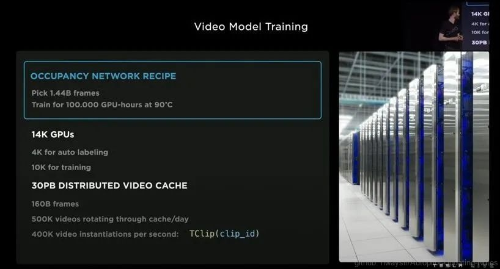
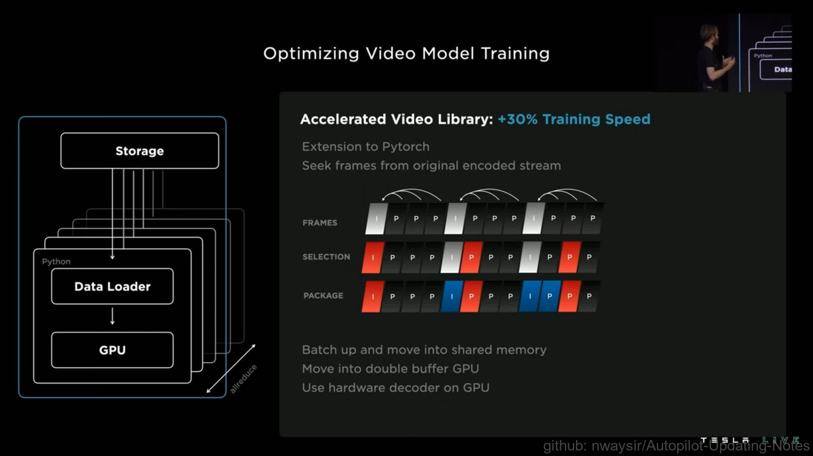

### 8.1.3 训练算法、设施、软件

图1. 特斯拉算力

#### 8.1.3.1 算力及数据

一、算力

>特斯拉目前有3个超算中心，采用了1.4万个GPU，其中4000个用于自动标注数据，其中10000个用于训练算法。

二、数据

- 图像数据：
>特斯拉表示需要训练Occupancy Networks算法，特斯拉目前已经从采集视频中提取出14.4亿张图片；训练这些数据，需要GPU温度达到90度高温的情况下，10万个GPU满负荷计算一小时。

- 视频数据：
>目前有30PB分布式视频缓存，1PB=1048576GB你想想30PB多大。其中抽取了1600亿张图片。而且这些数据不是静态的，是动态流转的，每天50万个视频轮流缓存更替，每秒40万个视频转化。

所以显然，特斯拉当前这数据中心按照正常的方法肯定行不通，同时可想而知特斯拉对于GPU超算的饥渴程度，另外特斯拉还想加速他的计算能力，这样决定了特斯拉必须自己搞芯片。

#### 8.1.3.2 数据流优化

特斯拉从数据的存储，到数据的加载，最后处理，形成一个倒漏洞的形状，最大限度的压榨计算资源。

图2. 数据流优化

要实现这些，必须考虑数据量的分配，数据流的带宽，CPU，内容，机器学习的框架，而多台GPU同步运算你要考虑延迟，考虑GPU之间的带宽是非常复杂的。

首先视频是动态和复杂的，不是简单的图片机器学习，特斯拉的视频到图片再到学习处理过程是动态，所以第一步加速视频库可以增加30%的训练速度。

图3. 视频压缩

特斯拉采用Pytorch进行视频压缩类的工作，加速视频库，如上图3，图中I 帧（帧内编码图片）是完整的图像，例如JPG或BMP图像文件。P帧（预测图片）仅保存图像与前一帧相比的变化。例如，在汽车穿过静止背景的场景中，只需要对汽车的运动进行编码。编码器不需要在 P 帧中存储不变的背景像素，从而节省空间。P 帧也称为增量帧。

图4. 数据优化指标

如上图4所示，通过这种方式特斯拉实现了2.3倍的训练速度增加，现在特斯拉用1024块GPU可以实现几天内从头开始聚合这些数据。

#### 8.1.3.3 算法编译器以及推理优化

上一节讲了对数据链路进行了优化，训练速度提升明显，接下来的优化点放在芯片级上，具体提到算法编译器compiler以及reference推理。

图5. 算法编译器以及推理优化

算法编译器compiler，将AI算法模型映射到高效的指令集和数据流。执行复杂的优化，例如层融合、指令调度和尽可能重用片上内存。特斯拉的人工智能算法代码运行会并行，重复以及回滚，那么特斯拉想要解决的问题是，如何高效的让代码运行在芯片上面，例如不重复计算，计算之间编排紧凑不空闲不堵塞，这样可以减少延迟，降低功耗。为此，特斯拉设计了一个Arc Max 以及一个中央操作来将稀疏（例如车道的空间位置）编码到首页，然后选择学习算法过程链接到首页。然后在静态内存SRAM中构建一个查询表格，把重复算法存入缓存，这样就不需要重复计算，只需要查询调用。

特斯拉表示在FSD车道识别算法中，这项编码提升了其算法9.6ms的延迟，能耗大概只有8w。这种编码的思维贯穿到整个特斯拉FSD算法中，特斯拉构建了一个新的算法编译器用来编译超过1000多个算法信号。通过编译器和推理的优化，确保优算力，低功耗，低延迟的AI计算，即“不拼算力，拼算法软件”。

