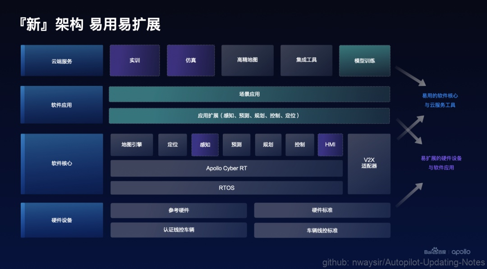
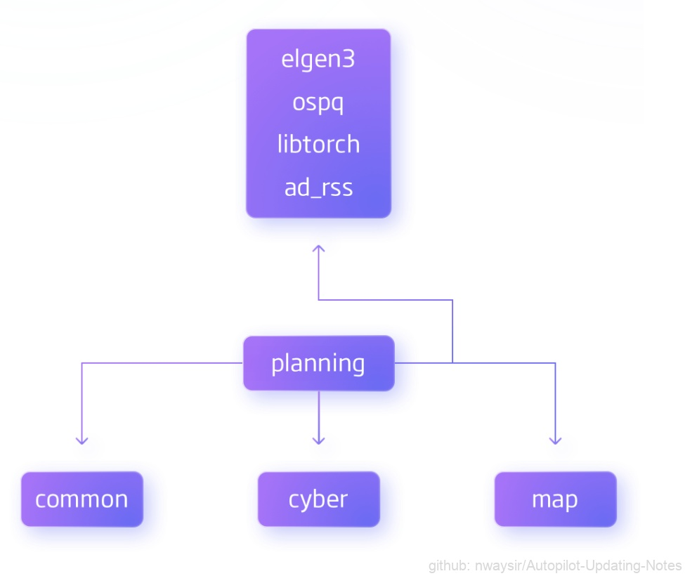
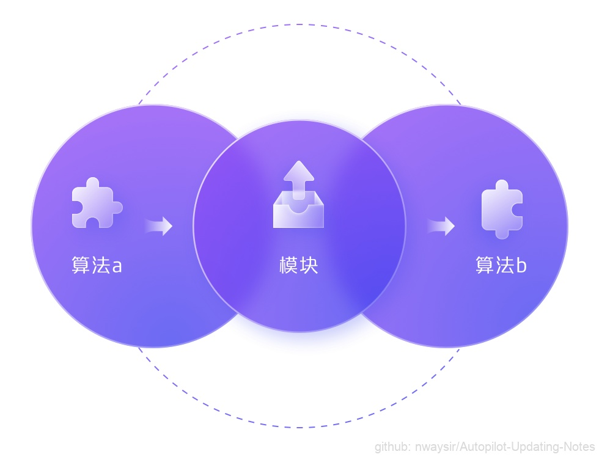
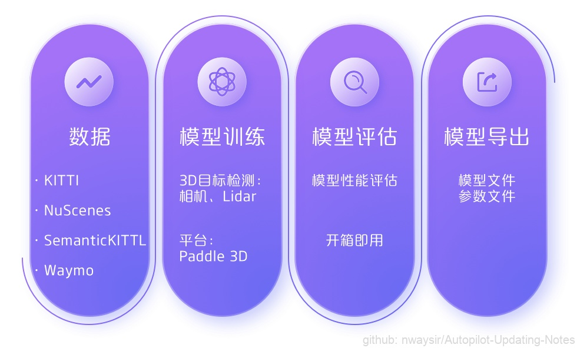
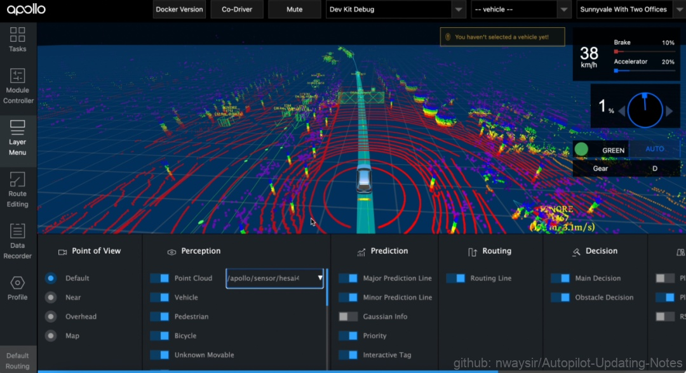
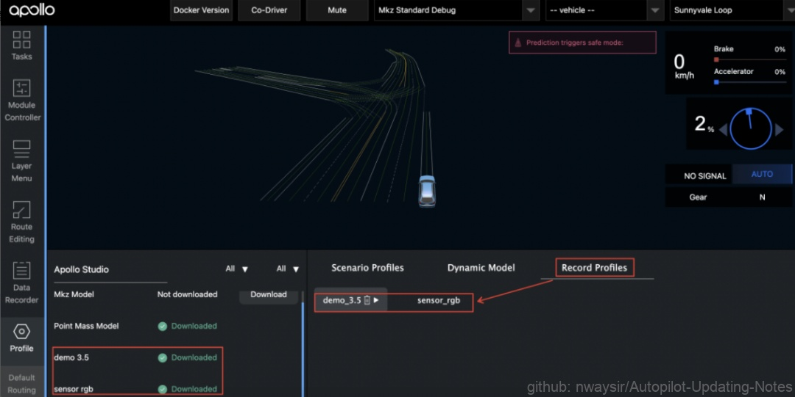

# 8.2.1 Apollo 8.0 技术新特性解读

12月28日，Apollo开放平台面向所有开发者，正式推出了Apollo自动驾驶开放平台的全新升级版本——Apollo 8.0，进一步夯实了平台的易用性，让开发者操作更简单易上手。

图1. Apollo 8.0 架构 

**Apollo 8.0版本在以下几个功能点做出升级：**

## 8.2.1.1 软件包管理

在最新的8.0版本中，重新整理了模块之间的依赖并引入了软件包的概念来管理和发布各个模块，优化了下载安装中出现的下载量大、无法按需使用、编译时间过长等问题，并在这个基础上更新发布了基于应用场景的扩展方案让更多开发者更好更快的使用Apollo。
（*关于【软件包管理】：包管理既将Apollo的编译产出按照“模块化”粒度进行规范化组织。一方面支持直接使用产出包的方式直接使用组件；另一方面规范组件的依赖关系以及组件的粒度，从而降低组件的使用/复用难度，提升自动驾驶系统的研发效率。详细规范介绍可以参考文档 Introduce to Package of Apollo。）

### 一、更清晰的模块结构，降低学习门槛

相较于以往Apollo里各个模块间的依赖关系错综复杂，开发者要想了解和学习Apollo往往容易陷入代码阅读的困难中。在Apollo 8.0中，将Apollo各个模块进行重新梳理，去掉了不合理的依赖关系，整合了通用的模块，使Apollo整体结构更清晰简洁。此外，将各个模块依赖关系的明确声明放在包的描述文件（cyberfile.xml）中，方便开发者统一查看。同时，也提供了快速查看工具，方便开发者了解学习相关代码，整体降低开发者的学习门槛。

图2. 模块结构 

### 二、更快速的部署方式，提升编译效率

以往开发者安装Apollo都需要下载源码再全量编译才能完成整个部署，这个过程环节多耗时长，往往需要天级别的时间，且失败率高，成为开发者使用Apollo的第一道门槛。为了提升开发者编译效率，在Apollo 8.0引入了包管理的概念，在模块化的基础上对Apollo各个模块作了预编译和发布，并提供更细粒度的包以方便开发者按需获取和使用。无论开发者是想快速体验或是快速使用Apollo，都可以直接通过提供的工具快速安装部署，整个过程耗时缩短至30分钟内即可完成，大大减少了下载和编译的时间。

### 三、更便捷的扩展方案，方便二次扩展、验证及实践

以扩展修改Planning模块为例（ Demo 工程的代码可参考 https://github.com/ApolloAuto/application-demo ），只需创建如下示例声明文件（Planning以源码形式安装），再执行编译指令即可将Planning源码安装到工作空间当中，同时也会将Planning调试相关必要模块以二进制包的形式安装。然后便可以直接修改工作空间下的Planning源码、编译、调试，从而构建出适用于所需场景的Planning模块。而构建一个完整的端到端自动驾驶软件系统，也只需要在上述基础上再添加相应的模块即可，如Perception、Prediction、Control等。

## 8.2.1.2 感知框架

为了帮助开发者更好的提升感知模块的开发效率，在Apollo 8.0版本中，提供了一套完整的端到端自动驾驶感知开发流程，在数据、模型、框架和验证4个主要环节都做了提升，同时迭代优化了任务流程和工具，帮助开发者快速实现自动驾驶感知的开发、部署和验证，提高感知开发效率。

图3. 感知框架 

### 一、清晰的任务流水线，多样的算法插件

在8.0感知框架中，开发者可以根据不同的感知任务类型来创建对应的流水线，并通过配置文件来定义流水线任务。相比以前，每个任务的运行流程更加清晰，同时还方便进行扩展。此外，开发者还可以根据需要选择不同的算法插件，比如Apollo感知模块提供4种检测器，开发者可以根据配置文件，选择不同的检测器，来验证检测效果，通过算法插件，算法工程师更加专注于算法本身，而不需要过多关注框架的实现。

图4. 感知流水线 

### 二、全新的模型训练，易用的深度学习模型

此次Apollo 8.0中，Apollo联合Paddle3D提供了端到端的自动驾驶模型开发解决方案，覆盖了从自动驾驶数据集到模型训练、模型评估和模型导出的算法开发全流程。
对自动驾驶驾驶中，开发者比较关心的3D目标检测任务和分割任务，Apollo提供了最新SOTA的算法模型实现，包括单目相机检测，激光雷达点云目标检测和多模态的目标检测模型，开发者开箱即用，不需要再苦于自己复现模型。同时，还提供模型的Benchmark，包括速度、精度等指标以及预训练好的模型。开发者可以实时跟踪最新的3D目标检测和分割模型实现，保持自动驾驶感知算法上的先进性。

图5. 感知易用 

**Apollo 8.0感知模型中，已引入了3个深度学习模型：**

（1）PETR：目前自动驾驶方向中视觉BEV领域中的代表性模型，模型创新性地将3D坐标信息与图像特征相融合，借助Transfomer的结构进行端到端的3D目标检测，实现了基于视觉的360°障碍物感知，模型整体架构设计简洁，在速度和精度之间取得了很好的tradeoff，在nuScenes上精度达到了43.52 NDS, 38.35mAP。

（2）CenterPoint：点云检测方向的前沿模型，该模型是Anchor-Free的三维物体检测器，基于关键点检测的方式回归物体的尺寸、方向和速度。相比于Anchor-Based的三维物体检测器，CenterPoint不需要人为设定Anchor尺寸，面向物体尺寸多样不一的场景时其精度表现更高。模型的结构设计简单而高效，在nuScenes上精度达到了61.30 NDS，50.97mAP。

（3）CaDDN：基于单目3D检测的前沿模型，针对于单张图像预测3D物体的病态问题，CaDDN创新性地提出了使用每个像素的预测分类深度分布，将丰富的上下文特征信息投射到3D空间中适当深度区间的解决方案，并使用计算效率高的鸟瞰投影和单级检测器来生成最终的输出包围框，将单目3D的模型指标提到了一个新的高度，在KITTI数据中达到了较高的精度指标（Car类别3D AP 21.45 14.36 12.57）。

### 三、高效的模型管理，便捷的模型验证

为了更方便快捷的将训练好的模型部署到Apollo系统中，在此次Apollo 8.0中引入了模型Meta和模型管理。其中模型Meta中包含了模型的基本信息，如名称、任务类型、传感器类型、框架和训练所需的数据集，同时还包含了模型的标准输入、输入、前后处理、模型文件存放的路径等。同时，Apollo还提供模型管理工具，开发者可以通过该工具下载安装模型仓库中的模型，展示系统中已经安装的模型和模型的详细信息。通过对模型进行标准化和模型管理工具，开发者可以非常方便的安装部署训练好的模型，并且管理这些模型，实现模型部署效率提升。

图6. 模型管理工具 

此外，在感知模型验证中，提供了基于数据集的数据包(record文件)，方便开发者直接基于数据集的数据来在线验证模型的检测效果，保证训练和部署是同一套基线，快速测试模型性能。除了提供测试数据包之外，Apollo 8.0还提供了可视化工具链，通过可视化的图形界面，展示传感器的原始数据和目标检测结果，方便开发者查看模型检测效果，调试感知模型。

图7. 模型性能工具 

## 8.2.1.3 工具链

为进一步满足自动驾驶开发流程需求，提升开发者研发效率，在Apollo 8.0版本中，结合开发者的痛点和诉求，提供了更全面、更易用的工具链，加速开发者研发进程，更好更快的上手Apollo。

### 一、全新完善的PnC工具链

（1）支持本地PnC仿真：Apollo 8.0提供了PnC仿真测试的本地调试功能，开发者在本地通过Dreamview的仿真器便可模拟车辆行驶以及再现各种场景。

图8. 仿真系统 

（2）支持云端场景创建和管理：Apollo Studio提供了云端仿真场景管理的功能，开发者可以自由创建符合自己测试仿真需求的场景及障碍物，并针对场景可以进行分类和管理；

（3）支持一键下载：在Apollo 8.0中，Dreamview中引入了Studio插件，通过插件开发者可以将Studio中的场景和动力学模型下载本地，PnC调试效率提升一倍以上。

图9. Studio插件 

### 二、便捷的感知结果可视化工具

Apollo 8.0为感知模块提供了感知结果可视化工具，支持了将Lidar、Camera检测结果的原始数据和Boundingbox同时进行可视化显示，方便开发者及时在本地查看调试模型检测效果。

图10. 视化工具 

### 三、Dreamview 配置中心

作为常用资源，为了方便开发者的使用和触达，在Apollo 8.0中我们将数据包、场景集、动力学模型集成到Dreamview 配置中心，开发者可以通过配置中心下载数据包、场景集和动力学模型，无需在本地终端wget拉取，大大降低新手开发者的上手成本。
在8.0中，我们提供2个典型数据包demo_3.5和sensor_rgb，包含了较全面的channel消息，方便开发者查看感知效果和PnC效果。

图12. Dreamview 配置中心 

