# TensorRT加速原理

## 一、加速的必要性

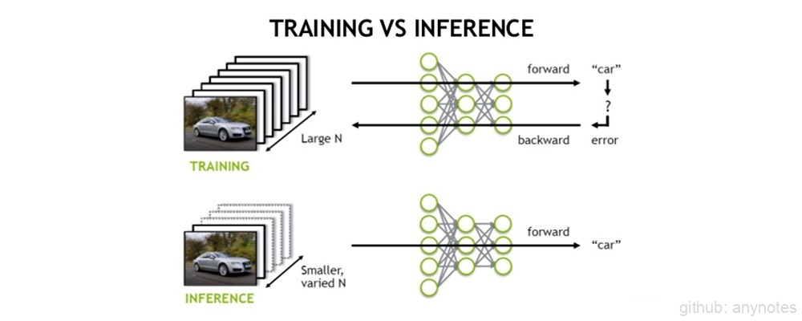 

图1. Training VS Inference 

如上图所示，训练（training）是双向运算，而推理（inference）为单向运算。为了提高训练速度，会使用多GPU分布式训练；而部署推理时，为了降低成本，往往使用单个GPU机器或嵌入式平台（比如 NVIDIA Jetson）进行部署；在实际项目中，一个项目可能会使用多个模型，而模型使用的框架也不能确保统一化。

**使用TensorRT加速最直接的效果如下：**

- 加快推理速度，降低延迟。
- 推理框架统一化，方便部署。

## 二、优化原理

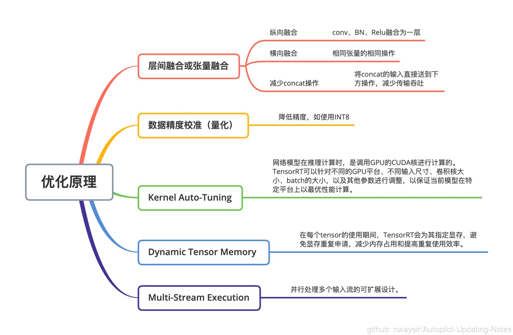 

图2. 优化原理 

TensorRT优化方法主要有以上5种方法，接下来重点介绍前两种：

### （一）层间融合或张量融合（Layer & Tensor Fusion）

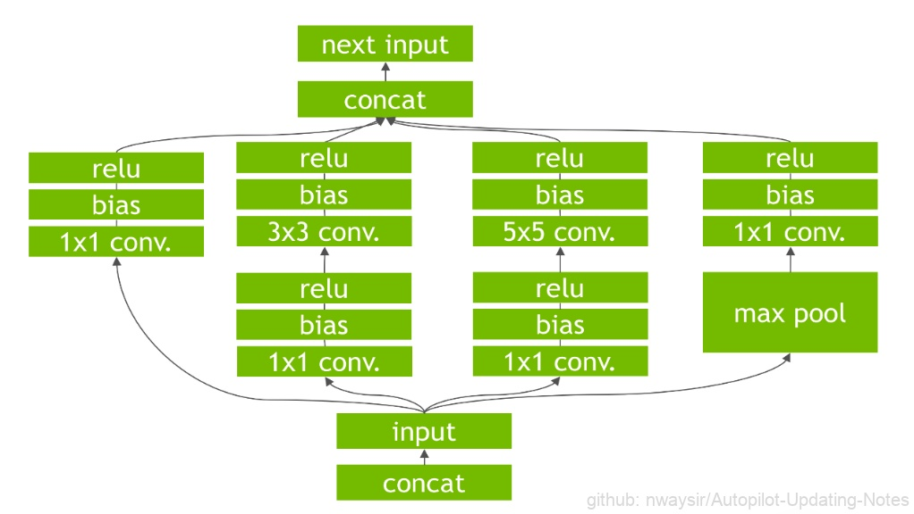 

图3. GoogLeNetInception 

上图是GoogLeNetInception模块的计算图，首先input后会有多个卷积，卷积完后有Bias和ReLU，结束后将结果concat（连接拼接）到一起，得到下一个input。

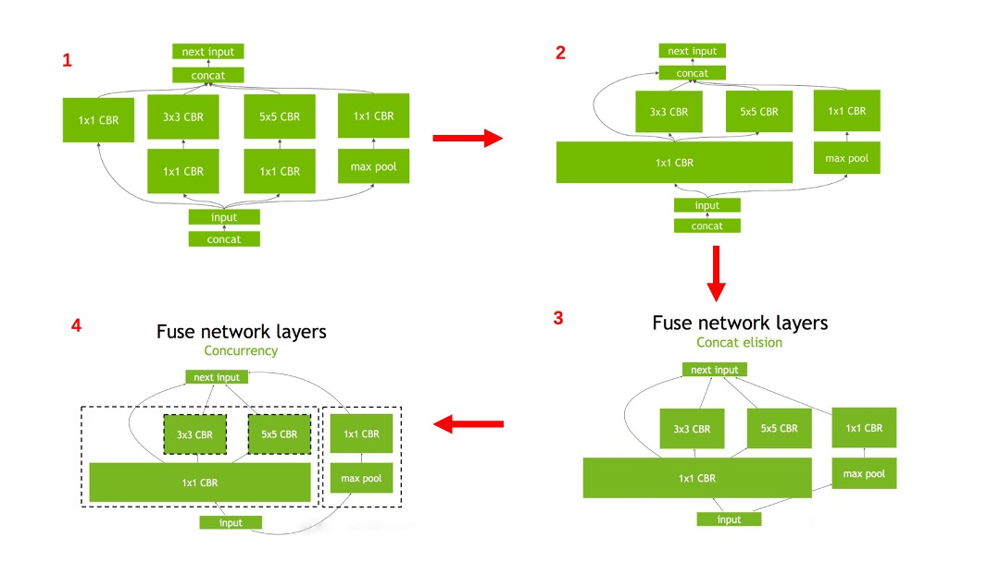 

图4. 层间融合 

**优化内容：**

- 纵向合并：首先是convolution, Bias和ReLU这三个操作可以合并成CBR，只占用一个CUDA核心，依次合并得到图1，其中包含四个1×1的CBR，一个3×3的CBR和一个5×5的CBR。
- 横向合并：合并三个相连的1×1的CBR为一个大的1×1的CBR，也只占用一个CUDA核心，得到图2。
- 消除concat层：直接连接到下一层的next input，减少传输吞吐，得到图3。
- 并发（Concurrency：如下图左半部分（max pool和1×1 CBR）与右半部分（大的1×1 CBR，3×3 CBR和5×5 CBR）彼此之间是相互独立的两条路径，本质上是不相关的，可以在GPU上通过并发来做，来达到的优化的目标。

### （二）数据精度校准（Weight &Activation Precision Calibration）

PyTorch、TensorFlow 、MxNet等现有的深度学习框架，训练时多采用 Float 32（简称 FP32）的精度来表示权值、偏置、激活值等；由于部署推理不需要反向传播，可以适当降低数据精度，如降为FP16或INT8的精度， 以此来减少计算量以及提升推理速度，同时压缩模型体积。

由于INT8只有256个不同的数值，使用INT8来表示 FP32精度的数值会丢失信息，造成性能下降。为此，TensorRT提供自动化校准（Calibration ），以最好的匹配性能将FP32精度的数据降低为INT8精度，最小化性能损失。具体流程如下：

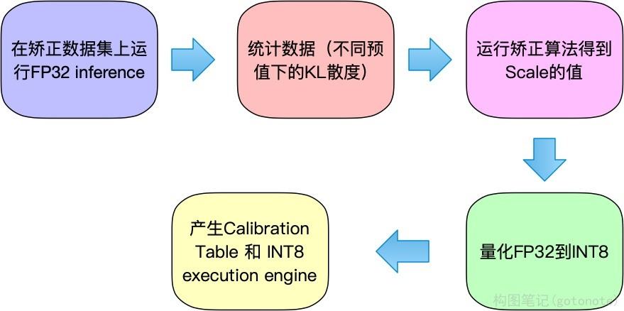 

图5. 数据精度校准步骤 

**下表为不同精度的动态范围：**

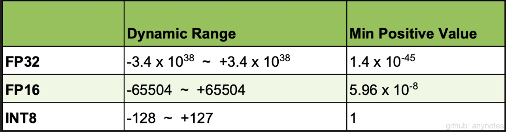 

图6. 动态范围 

由上图对比可以看出，INT8 和 FP32 表示范围相差很大。需要最小化该转换过程的信息损失，TensorRT 采用是简单有效的线性量化的转换方式，表示为：

**Tensor Values = FP32 scale factor * int8 array + FP32 bias**

Nvidia 研究证明偏置项可以去掉，即：

**Tensor Values = FP32 scale factor * int8 array**

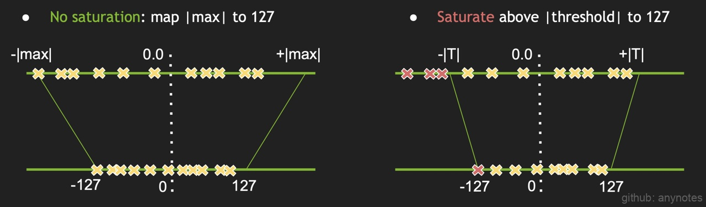 

图7. 偏置项截断 

如何确定**scale factor**的值 ？

最简单的方式如上图左，将**FP32 tensor**值中的 **–|max|** 和 **|max|**映射为 **INT8** 对应的**-127 和 127**，中间值按照线性关系进行映射，该方法也被称为**不饱和（No saturation）映射**。但实验表明，该方法精度损失很大。

因此，产生了**饱和 (saturate) 映射**的方式（上图右）：

相对于非饱和映射，不直接将两端的 ±|max|值映射到±127，而是选取一个阈值|T|, 将 ±|T| 映射为±127，其中 |T| < |max|。在  [ -|T|, |T| ] 区间外的值直接映射为 ±127，如上图右直接将三个红色 x 点映射为 -127， 而在 [ -|T|, |T| ] 区间内的按照线性映射的方式。

**TensorRT 开发者通过实验表明，权重 ( weights ) 采用非饱和映射，激活值采用饱和映射的方式相对全使用饱和映射效果会更好。**

**Why？Why？**

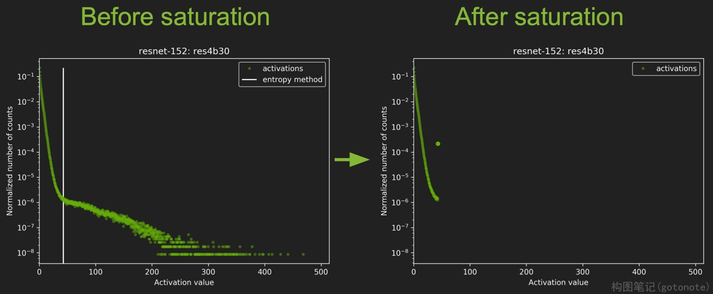 

图8. resnet-152 网络模型中间层的激活值统计 

首先来看上图左，该图是 resnet-152 网络模型中间层的激活值统计，横坐标是激活值，纵坐标是统计数量的归一化表示。

可以看到，白线左边的激活值分布比较集中，白线（该线对应的就是阈值 T 线）右边的激活值比较分散，这部分激活值在整个层中所占的比例比较少，因此这部分可以不考虑到映射关系中。非饱和映射使有效值硬合并，降低了表达效果。

T 值需要满足 FP32 到 INT8 转换信息损失最小化，即 KL 散度（也叫做相对熵）最小化：

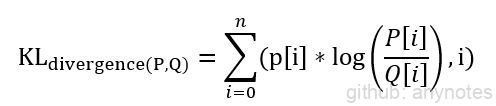 

图9. KL 散度 

其中 P，Q 分别表示 FP32 和 INT8 模式下的分布，每一层 tensor 对应的 T 值都是不同的，而确定 T 值的过程被称为校准（Calibration）。

## 三、计算过程

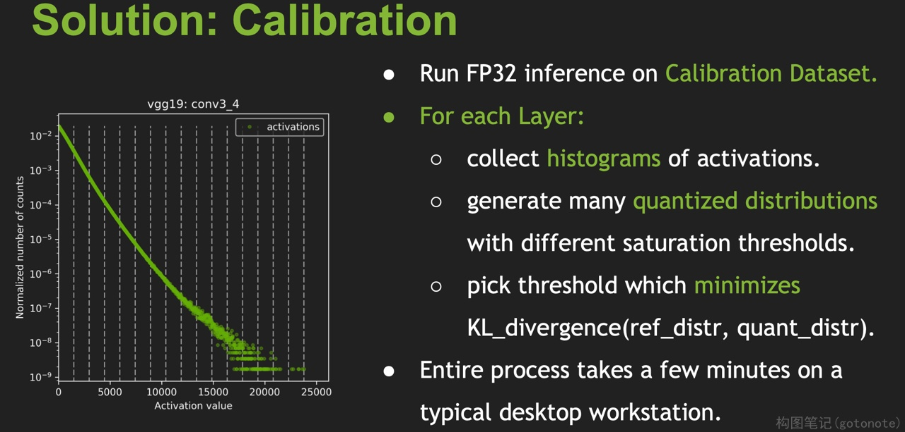 

如上图所示：

1. 校准数据集（Calibration Dataset）做 FP32 推理

2. 获取每一层激活值的直方图，并用不同的量化阈值生成相应的量化分布（虚线为量化阈值，即T值）；此过程结束后，会将校准得到的 T 值保存下来，以后可以方便直接读取，跳过此过程。

**校准数据集（Calibration Dataset）会直接的影响到激活值的分布，进而影响到 T 值的选择，所以，校准数据集要具有代表性、多样性。**

### 8.3.2.4 性能和精度

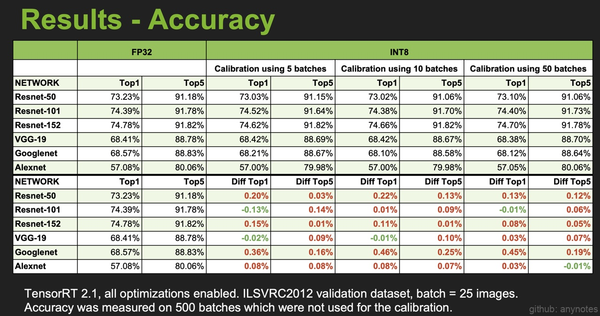 

图11. 准确率 

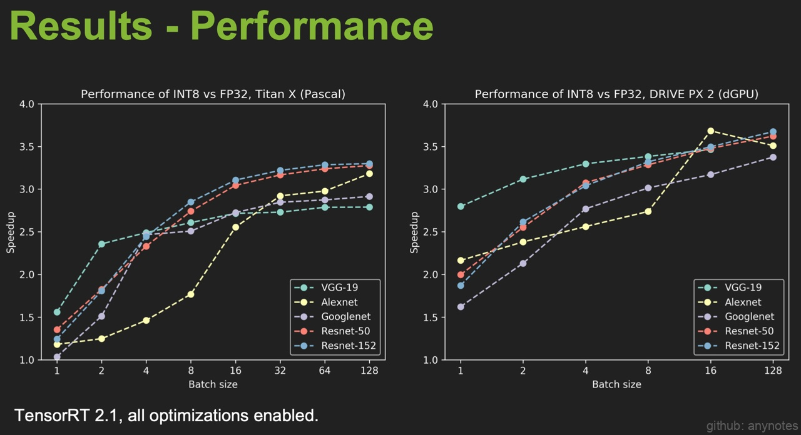 

图12. 速度 

如上图Accuracy所示，经过校准的 INT8 推理相对于 FP32 推理，准确率（Accuracy）有略微的损失，部分情况下INT8 推理相比 FP32 推理准确率有略微提升（图中绿色所示）。Performance表明，一定范围内，Batch Size 越大，加速效果越好。

