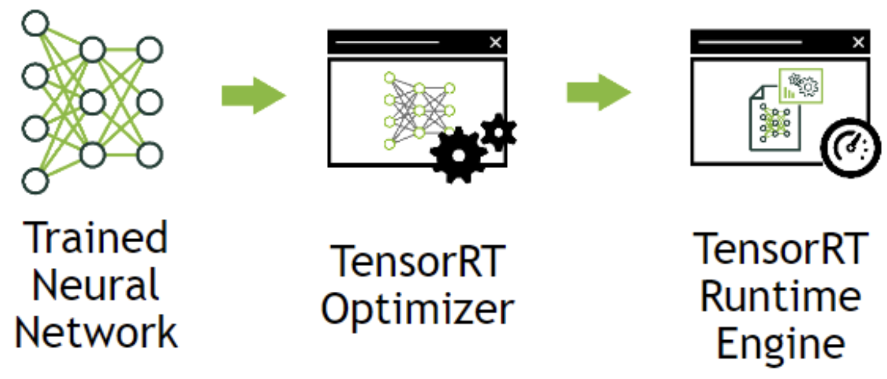
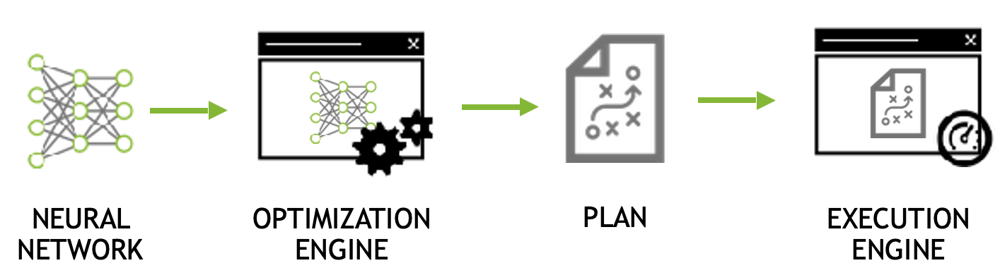
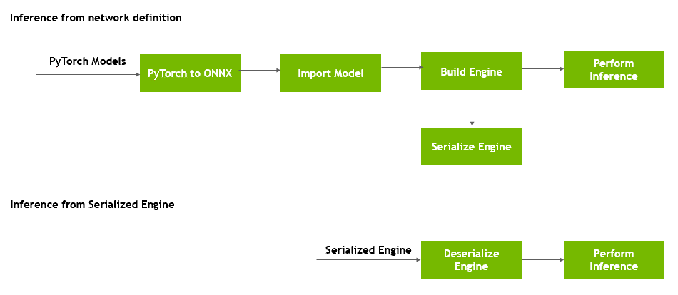

# TensorRT源码分析

## 一、前言

<div align=center>
 
</div>
<div align=center>图1. 加速流程 </div>

NVIDIA TensorRT是一种高性能神经网络推理(Inference)引擎，用于在生产环境中部署深度学习应用程序，应用有图像分类、分割和目标检测等，可提供最大的推理吞吐量和效率。TensorRT是第一款可编程推理加速器，能加速现有和未来的网络架构。提供了包括神经网络模型计算图优化、INT8量化、FP16低精度运算等神经网络前向推理优化的方法。目前TensorRT提供了C++与Python的API接口，本文中主要使用C++接口为例说明TensorRT框架的一般使用流程。

## 二、TensorRT 库构成

以编译后源码压缩包**TensorRT-7.0.0.11.Ubuntu-18.04.x86_64-gnu.cuda-10.0.cudnn7.6.tar**的安装方式进行安装的TensorRT库主要有以下文件夹

```bash
├── data
├── doc
├── include  # 所有头文件，可以查看所有函数的接口和说明
│   ├── NvCaffeParser.h
│   ├── NvInfer.h
│   ├── NvInferPlugin.h
│   ├── NvInferPluginUtils.h
│   ├── NvInferRuntimeCommon.h
│   ├── NvInferRuntime.h
│   ├── NvInferVersion.h
│   ├── NvOnnxConfig.h
│   ├── NvOnnxParser.h
│   ├── NvOnnxParserRuntime.h
│   ├── NvUffParser.h
│   └── NvUtils.h
├── lib      # 所有动态链接库.so文件
├── python   # python API 例子
└── samples  # c++ 例子
```

- `NvInferRuntimeCommon.h` ：定义了 TRT 运行时所需的基础数据结构（如`Dims`，`PluginField`）和大部分基类（`class ILogger`， `class IPluginV2`）

- `NvInferRuntime.h`: 继承`NvInferRuntimeCommon.h`中的基类，定义了runtime时的拓展功能子类

- `NvInfer.h`：继承`NvInferRuntime.h`中的基类，定义了大部分可以直接加入的神经网络层（如`class IConvolutionLayer`，`class IPoolingLayer`，`class IPoolingLayer`）

- `NvInferPluginUtils.h`：定义`plugin layer`所需的基础数据结构

- `NvInferPlugin.h`：初始化注册所有结构包含`plugin layer`

- 其他的从文件名即可看出时分别Caffe，ONNX，UFF 的解析器parser，分别对应训练后的Caffe，Pytorch，TensorFlow网络

## 三、 TensorRT推理过程

TensorRT的使用包括两个阶段：build and deployment：

- **build**

<div align=center>
 
</div>
<div align=center>图2. Build </div>

​该阶段主要完成模型转换（从pytorch/caffe/TensorFlow到TensorRT），如上图所示，在模型转换时会完成前述优化过程中的层间融合、精度校准。这一步的输出是一个针对特定GPU平台和网络模型的优化过的TensorRT模型，这个TensorRT模型可以序列化存储到磁盘或内存中。存储到磁盘中的文件称之为 planfile。

- **deployment**

<div align=center>
 
</div>
<div align=center>图3. Deployment </div>

该阶段主要完成推理过程，如上图所示。将上一个步骤中的plan文件首先反序列化，并创建一个 runtime engine，然后就可以输入数据（比如测试集或数据集之外的图片），然后输出分类向量结果或检测结果。

## 四、 pytorch转TensorRT

<div align=center>
 
</div>
<div align=center>图4. pytorch转TensorRT </div>

如上图，本文采用的流程为：Pytorch -> Onnx -> TensorRT。即首先将Pytorch模型转换为Onnx模型，然后通过TensorRT解析Onnx模型，创建TensorRT引擎及进行前向推理。

### （一）ONNX环境安装

```text
>> sudo apt-get install libprotobuf-dev protobuf-compiler # protobuf is a prerequisite library
>> git clone --recursive https://github.com/onnx/onnx.git # Pull the ONNX repository from GitHub 
>> cd onnx
>> mkdir build && cd build 
>> cmake .. # Compile and install ONNX
>> make # Use the ‘-j’ option for parallel jobs, for example, ‘make -j $(nproc)’ 
>> make install
```

### （二）Python模型转Onnx

* 输入数据预处理Nvidia官方提供的一个基于unet模型的大脑MRI图像分割的例子：

  ```bash
  >> wget https://developer.download.nvidia.com/devblogs/speeding-up-unet.7z // Get the ONNX model and test the data
  >> tar xvf speeding-up-unet.7z # Unpack the model data into the unet folder
  >> cd unet
  >> python create_network.py #Inside the unet folder, it creates the unet.onnx file
  ```

​这里create_network.py 脚本就是将pytorch模型转换为onnx模型（转换后的onnx模型，可利用 [Netron](https://github.com/lutzroeder/Netron) 工具进行可视化），脚本的具体代码如下：

```python3
# create_network.py
import torch
from torch.autograd import Variable
import torch.onnx as torch_onnx
import onnx
def main():
    input_shape = (3, 256, 256)
    model_onnx_path = "unet.onnx"
    dummy_input = Variable(torch.randn(1, *input_shape))
    model = torch.hub.load('mateuszbuda/brain-segmentation-pytorch', 'unet',
      in_channels=3, out_channels=1, init_features=32, pretrained=True)
    model.train(False)
    
    inputs = ['input.1']
    outputs = ['186']
    dynamic_axes = {'input.1': {0: 'batch'}, '186':{0:'batch'}}
    out = torch.onnx.export(model, dummy_input, model_onnx_path, input_names=inputs, output_names=outputs, dynamic_axes=dynamic_axes)

if __name__=='__main__':
    main() 
```

### （三）处理输入数据

在 [Kaggle](https://www.kaggle.com/mateuszbuda/lgg-mri-segmentation)中下载所有的图片，或者[百度网盘](https://pan.baidu.com/s/1GefETXFeXfn6fRuS4wiKEg)提取码：v3xf 。

任意选择所下载图片中的3张图片（图片名中没有_mask的），然后使用下面 **prepareData.py** 脚本将图片进行预处理以及序列化并保存：

```python
#  prepareData.py
import torch 
import argparse
import numpy as np
from torchvision import transforms                    
from skimage.io import imread
from onnx import numpy_helper
from skimage.exposure import rescale_intensity

def normalize_volume(volume):
    p10 = np.percentile(volume, 10)
    p99 = np.percentile(volume, 99)
    volume = rescale_intensity(volume, in_range=(p10, p99))
    m = np.mean(volume, axis=(0, 1, 2))
    s = np.std(volume, axis=(0, 1, 2))
    volume = (volume - m) / s
    return volume

def main(args):
    model = torch.hub.load('mateuszbuda/brain-segmentation-pytorch', 'unet',
      in_channels=3, out_channels=1, init_features=32, pretrained=True)
    model.train(False)
    
    filename = args.input_image
    input_image = imread(filename)
    input_image = normalize_volume(input_image)
    input_image = np.asarray(input_image, dtype='float32')
    
    preprocess = transforms.Compose([
      transforms.ToTensor(),
    ])
    input_tensor = preprocess(input_image)
    input_batch = input_tensor.unsqueeze(0)
    
    tensor1 = numpy_helper.from_array(input_batch.numpy())
    with open(args.input_tensor, 'wb') as f:
        f.write(tensor1.SerializeToString())
    if torch.cuda.is_available():
        input_batch = input_batch.to('cuda')
        model = model.to('cuda')
    with torch.no_grad():
        output = model(input_batch)
    
    tensor = numpy_helper.from_array(output[0].cpu().numpy())
    with open(args.output_tensor, 'wb') as f:
        f.write(tensor.SerializeToString())
if __name__=='__main__':
    parser = argparse.ArgumentParser()
    parser.add_argument('--input_image', type=str)
    parser.add_argument('--input_tensor', type=str, default='input_0.pb')
    parser.add_argument('--output_tensor', type=str, default='output_0.pb')
    args=parser.parse_args()
    main(args) 
```

```bash
>> pip install medpy #dependency for utils.py file
>> mkdir test_data_set_0
>> mkdir test_data_set_1
>> mkdir test_data_set_2
>> python prepareData.py --input_image your_image1 --input_tensor test_data_set_0/input_0.pb --output_tensor test_data_set_0/output_0.pb   # This creates input_0.pb and output_0.pb
>> python prepareData.py --input_image your_image2 --input_tensor test_data_set_1/input_0.pb --output_tensor test_data_set_1/output_0.pb   # This creates input_0.pb and output_0.pb
>> python prepareData.py --input_image your_image3 --input_tensor test_data_set_2/input_0.pb --output_tensor test_data_set_2/output_0.pb   # This creates input_0.pb and output_0.pb
```

这样，我们完成了pytorch模型转onnx模型，以及输入数据预处理的步骤，下一步就是用TensorRT接口调用模型、创建引擎、并进行推理。

### （四）示例代码下载

首先下载官方提供的上述unet模型对应的TensorRT示例，并进行编译：

```bash
>> git clone https://github.com/parallel-forall/code-samples.git
>> cd code-samples/posts/TensorRT-introduction
>> make clean && make # Compile the TensorRT C++ code
```

在编译示例代码的时候，可能会遇到 NvInfer.h 文件或者其他TensorRT文件找不到的情况，此时可以在 code-samples/posts/TensorRT-introduction/Makefile 中加入TensorRT的路径：

```bash
将：
CXXFLAGS=-std=c++11 -DONNX_ML=1 -Wall -I$(CUDA_INSTALL_DIR)/include
LDFLAGS=-L$(CUDA_INSTALL_DIR)/lib64 -L$(CUDA_INSTALL_DIR)/lib64/stubs -L/usr/local/lib
改为：
CXXFLAGS=-std=c++11 -DONNX_ML=1 -Wall -I$(CUDA_INSTALL_DIR)/include -I/<xxxDir>/TensorRT-7.0.0.11/include
LDFLAGS=-L$(CUDA_INSTALL_DIR)/lib64 -L$(CUDA_INSTALL_DIR)/lib64/stubs -L/usr/local/lib -L/<xxxDir>/TensorRT-7.0.0.11/targets/x86_64-linux-gnu/lib
修改<xxxDir>对应为你的路径
```

然后直接运行代码即可：

```bash
>> cd to code-samples/posts/TensorRT-introduction
>> ./simpleOnnx_1 path/to/unet/unet.onnx path/to/unet/test_data_set_0/input_0.pb # The sample application expects output reference values in path/to/unet/test_data_set_0/output_0.pb
```

运行成功之后，会在源目录下生成output.pgm文件，即为模型的输出。

### （五）主要代码分析

TensorRT提供了两种方式进行网络的部署：1. 各种parser对网络模型进行解析与转换；2. 利用TensorRT的api，Layer By Layer的方式进行模型的构建和转换。第1种方式简便快捷，这里以第1种为例。

* 创建 CUDA Engine:

  ```cpp
  // Declare the CUDA engine
  unique_ptr<ICudaEngine, Destroy<ICudaEngine>> engine{nullptr};
  ...
  // Create the CUDA engine
  engine.reset(createCudaEngine(onnxModelPath));
  ```

其中，创建 Engine 的函数为 createCudaEngine， 流程图如下：

<div align=center>
 
</div>
<div align=center>图5. Engine构建流程 </div>

具体代码如下：

```cpp
nvinfer1::ICudaEngine* createCudaEngine(string const& onnxModelPath, int batchSize){
    unique_ptr<nvinfer1::IBuilder, Destroy<nvinfer1::IBuilder>> builder{nvinfer1::createInferBuilder(gLogger)};
    const auto explicitBatch = 1U << static_cast<uint32_t>(nvinfer1::NetworkDefinitionCreationFlag::kEXPLICIT_BATCH);
    unique_ptr<nvinfer1::INetworkDefinition, Destroy<nvinfer1::INetworkDefinition>> network{builder->createNetworkV2(explicitBatch)};
    unique_ptr<nvonnxparser::IParser, Destroy<nvonnxparser::IParser>> parser{nvonnxparser::createParser(*network, gLogger)};
    unique_ptr<nvinfer1::IBuilderConfig,Destroy<nvinfer1::IBuilderConfig>> config{builder->createBuilderConfig()};
 
    if (!parser->parseFromFile(onnxModelPath.c_str(), static_cast<int>(ILogger::Severity::kINFO)))
    {
            cout << "ERROR: could not parse input engine." << endl;
            return nullptr;
    }
    builder->setMaxBatchSize(batchSize);
    config->setMaxWorkspaceSize((1 << 30));
  
  	//这里可以设置网络推理使用精度，如果平台支持半精度，还可以指定为半精度
  	if (mTrtParams.FP16){
        if(!builder->platformHasFastFp16()){
            gLogWarning << "Platform has not fast Fp16! It will still using Fp32!"<< std::endl;
        }else{
            config -> setFlag(nvinfer1::BuilderFlag::kFP16);
        }
    } 
  
    auto profile = builder->createOptimizationProfile();
    profile->setDimensions(network->getInput(0)->getName(), OptProfileSelector::kMIN, Dims4{1, 3, 256 , 256});
    profile->setDimensions(network->getInput(0)->getName(), OptProfileSelector::kOPT, Dims4{1, 3, 256 , 256});
    profile->setDimensions(network->getInput(0)->getName(), OptProfileSelector::kMAX, Dims4{32, 3, 256 , 256});    
    config->addOptimizationProfile(profile);
    return builder->buildEngineWithConfig(*network, *config);
} 
```

* 创建 execution context:

context 的功能是存储模型推理过程中的中间层激活值，创建的代码如下：

```cpp
// Declare the execution context
unique_ptr<IExecutionContext, Destroy<IExecutionContext>> context{nullptr};
...
// Create the execution context
context.reset(engine->createExecutionContext()); 
```

* 执行前向推理:

前向推理的代码如下所示，推理的过程为：

1）将存储在CPU端的输入数据copy到GPU上；

2）context->enqueueV2(bindings, stream, nullptr) 执行GPU端推理；

3）将GPU端的输出copy回CPU端。

```cpp
void launchInference(IExecutionContext* context, cudaStream_t stream, vector<float> const& inputTensor, vector<float>& outputTensor, void** bindings, int batchSize)
{
    int inputId = getBindingInputIndex(context);

    cudaMemcpyAsync(bindings[inputId], inputTensor.data(), inputTensor.size() * sizeof(float), cudaMemcpyHostToDevice, stream);
    context->enqueueV2(bindings, stream, nullptr);
    cudaMemcpyAsync(outputTensor.data(), bindings[1 - inputId], outputTensor.size() * sizeof(float), cudaMemcpyDeviceToHost, stream);
} 
```

在执行完 launchInference 之后，调用cudaStreamSynchronize 函数进行同步，以确保结果被访问之前GPU端已经完成了计算。

* 具体main执行如下：

```cpp
int main(int argc, char* argv[])
{
    // Declaring cuda engine.
    unique_ptr<ICudaEngine, Destroy<ICudaEngine>> engine{nullptr};
    // Declaring execution context.
    unique_ptr<IExecutionContext, Destroy<IExecutionContext>> context{nullptr};
    vector<float> inputTensor;
    vector<float> outputTensor;
    vector<float> referenceTensor;
    void* bindings[2]{0};
    vector<string> inputFiles;
    CudaStream stream;

    if (argc != 3)
    {
        cout << "usage: " << argv[0] << " <path_to_model.onnx> <path_to_input.pb>" << endl;
        return 1;
    }

    string onnxModelPath(argv[1]);
    inputFiles.push_back(string{argv[2]}); //输入图片路径
    int batchSize = inputFiles.size();

    // Create Cuda Engine.
    engine.reset(createCudaEngine(onnxModelPath, batchSize));  
    if (!engine)
        return 1;

    // Assume networks takes exactly 1 input tensor and outputs 1 tensor.
    assert(engine->getNbBindings() == 2);
    assert(engine->bindingIsInput(0) ^ engine->bindingIsInput(1));

    for (int i = 0; i < engine->getNbBindings(); ++i)
    {
        Dims dims{engine->getBindingDimensions(i)};
        size_t size = accumulate(dims.d+1, dims.d + dims.nbDims, batchSize, multiplies<size_t>());
        // Create CUDA buffer for Tensor.
        cudaMalloc(&bindings[i], batchSize * size * sizeof(float));

        // Resize CPU buffers to fit Tensor.
        if (engine->bindingIsInput(i)){
            inputTensor.resize(size);
        }
        else
            outputTensor.resize(size);
    }

    // Read input tensor from ONNX file.
    if (readTensor(inputFiles, inputTensor) != inputTensor.size())
    {
        cout << "Couldn't read input Tensor" << endl;
        return 1;
    }
    

    // Create Execution Context.
    context.reset(engine->createExecutionContext());
    
    Dims dims_i{engine->getBindingDimensions(0)};
    Dims4 inputDims{batchSize, dims_i.d[1], dims_i.d[2], dims_i.d[3]};
    context->setBindingDimensions(0, inputDims);

    launchInference(context.get(), stream, inputTensor, outputTensor, bindings, batchSize);

    Dims dims{engine->getBindingDimensions(1)};
    saveImageAsPGM(outputTensor, dims.d[2], dims.d[3]);
    // Wait until the work is finished.
    cudaStreamSynchronize(stream);

    vector<string> referenceFiles;
    for (string path : inputFiles)
        referenceFiles.push_back(path.replace(path.rfind("input"), 5, "output"));
    // Try to read and compare against reference tensor from protobuf file.


    referenceTensor.resize(outputTensor.size());
    if (readTensor(referenceFiles, referenceTensor) != referenceTensor.size())
    {
        cout << "Couldn't read reference Tensor" << endl;
        return 1;
    }

    Dims dims_o{engine->getBindingDimensions(1)};
    int size = batchSize * dims_o.d[2] * dims_o.d[3];
    verifyOutput(outputTensor, referenceTensor, size);  //验证输出
    
    for (void* ptr : bindings)
        cudaFree(ptr);   //不要忘记释放申请的显存
    return 0;
}

```

更多细节，请查阅NVIDIA代码库[simpleOnnx_1.cpp](https://github.com/NVIDIA-developer-blog/code-samples/blob/master/posts/TensorRT-introduction/simpleOnnx_1.cpp)。